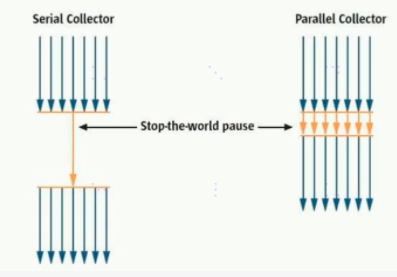
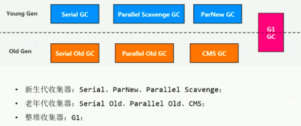
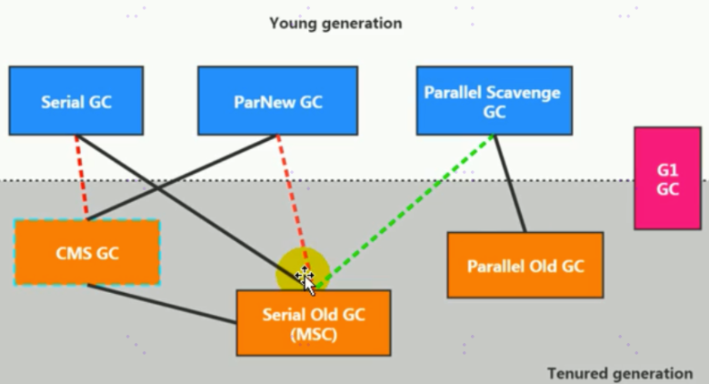

[TOC]

## 概述

### 什么是垃圾

垃圾是指运行程序中没有任何指针指向的对象，这个对象就是需要被回收的垃圾

### 为什么需要 GC

### Java 中垃圾回收的重点区域

### 早期的 GC

## 垃圾回收算法

### 垃圾判别阶段算法

#### 引用计数算法

对每个对象保存一个整型的引用计数器属性，用于记录被对象引用的情况，被对象引用了就+1，引用失效就-1,0表示不可能再被使用，可进行回收

优点：实现简单，垃圾便于辨识，判断效率高，回收没有延迟性

缺点

- 需要单独的字段存储计数器，增加了存储空间的开销
- 每次赋值需要更新计数器，伴随加减法操作，增加了时间开销
- 无法处理循环引用的情况，致命缺陷，导致JAVA的垃圾回收器中没有使用这类算法

引用计数算法，是很多语言的资源回收选择，例如python，它更是同时支持引用计数和垃圾回收机制

> Python如何解决循环引用：手动解除；使用弱引用，weakref，python提供的标准库，旨在解决循环引用

#### 可达性分析算法

是以根对象（GCRoots）为起始点，按照从上到下的方式搜索被根对象集合所连接的目标对象是否可达，使用可达性分析算法后，内存中存活的对象都被被根对象集合直接或间接连接着，搜索所走过的路径称为引用链。如果目标对象没有任何引用链相连，则是不可达的，意味着该对象已经死亡，可以标记为垃圾对象。

在可达性分析算法中，只有能够被根对象集合直接或者间接连接的对象才是存活的对象。

如果需要使用可达性分析算法来判断内存是否可回收，那么分析工作必须在一个能保障一致性的快照中进行。这点不满足的话，分析结果的准确性就无法保证。这也是GC进行时必须STW的一个重要原因，即使是号称几乎不会发生停顿的CMS收集器中，枚举根节点也是必须要停顿的。

#### GC Root

- 虚拟机栈中引用的对象(比如各个线程被调用的方法中使用到的参数、局部变量)
- 本地方法栈内JNI,引用的对象
- 方法区中静态属性引用的对象(比如：java类的引用类型静态变量)
- 方法区中常量引用的对象(比如字符串常量池里的引用)
- 所有被同步锁synchronized持有的对象
- Java虚拟机内部的引用(基本数据类型对应的class对象，一些常驻的异常对象，如nullpointerException，OOMerror，系统类加载器)
- 反映java虚拟机内部情况的JMXBean,JVMTI中注册的回调，本地代码缓存等
- 除了固定的GC Roots集合之外，根据用户选择的垃圾收集器以及当前回收的内存区域不同，还可以有其他对象临时性的加入，共同构成完整GCRoots集合，比如分代收集和局部回收(如果只针对Java堆中某一块内存区域进行垃圾回收，必须要考虑这个区域的对象可能被其他区域对象所引用，这是需要一并将关联的区域对象加入GC Roots集合中去考虑，才能保证可达性分析的准确性。)

小技巧：由于Root采用栈方式存放变量和指针，所以如果一个指针，它保存了堆内存里面的对象，但是自己又不存放在堆内存里面，那么它就是一个Root。

### 垃圾清除阶段算法

#### 标记-清除算法

标记：从引用根节点开始遍历，标记所有被引用的对象，一般是在对象Header中记录为可达对象（注意标记引用对象，不是垃圾对象）。清除：对堆内存从头到尾进行线性的遍历，如果发现某个对象在其Header中没有标记为可达对象，则将其回收

缺点

- 效率不算高
- 在GC的时候，，需要停止整个应用程序，导致用户体验差。
- 这种方式清理出来的空闲内存不连续，产生内存碎片，需要维护一个空闲列表

> 何为清除？：所谓的清除并不是真的置空，而是把需要清除的对象地址保存在空闲的地址列表里，下次有新对象需要加载时，判断垃圾的位置空间是否够，如果够就存放。

#### 复制算法

将或者的内存空间分为两块，每次使用其中一块。在垃圾回收时，将正在使用的内存中的存活的对象复制到未被使用的内存块中，之后清除正在使用的内存块中的所有的对象，交换两个内存的角色，最后完成垃圾回收

优点

- 没有标记和清除的过程，实现简单高效
- 复制过去以后的保证空间的连续性，不会出现碎片的问题

缺点

- 需要两倍的内存空间
- 对于G1这种拆分为大量region的GC，复制而不是移动，意味着GC需要维护region之间的引用关系，不管是内存占用或者时间开销也不小。
- 如果系统中的垃圾对象很多，需要复制的存活对象数量并不会太大，或者非常低才行

#### 标记-压缩算法

也叫标记整理算法。第一个阶段和标记清除算法一样，从根节点开始标记所有被引用的对象，第二阶段将所有的存货对象压缩在内存的一端，按照顺序排放，之后清理边界外所有的空间，最终效果等同于标记清除算法执行完成后，再进行一次内存碎片整理。

与标记清除算法本质区别，标记清除算法是非移动式的算法，标记压缩是移动式的。是否移动回收后的存活对象时一项优缺点并存的风险决策。

优点

- 消除了标记清除算法内存区域分散的缺点，
- 消除了复制算法中，内存减半代价

缺点

- 从效率上来讲，标记整理算法要低于复制算法
- 移动对象的同时，如果对象被其他对象引用，则还需要调整引用的地址
- 移动的过程中，需要全程暂停用户应用程序，即STW

#### 小结

--

#### 分代收集算法

不同生命周期的对象可以采取不同额收集方式，以便提高回收效率，几乎所有的GC都采用分代收集算法执行垃圾回收的。HotSpot中：年轻代，生命周期短，存活率低，回收频繁；老年代，区域较大，生命周期长，存活率高，回收不及年轻代频繁

#### 增量收集算法思想

每次垃圾收集线程只收集一小片区域的内存空间，接着切换到应用程序线程，依次反复，直到垃圾收集完成，通过对线程间冲突的妥善管理，允许垃圾收集线程以分阶段的方式完成标记、清理或复制工作。

缺点：线程和上下文切换导致系统吞吐量的下降。

#### 分区算法

分代算法是将对象按照生命周期长短划分为两个部分，分区算法是将整个堆划分为连续的不同的小区间，每一个小区间都独立使用，独立回收，这种算法的好处是可以控制一次回收多少个小区间。

## 相关概念

### System.gc()

System.gc或Runtime.getRuntime().gc()的调用，会显示触发FullGC，同时会对老年代和新生代进行回收，尝试释放被丢对象占用的内存。然后System.gc调用无法保证对垃圾收集器的调用。一些特殊情况下，比如编写性能基准，我们可以在运行之间调用System.gc

### finalize() 方法详解

Java语言提供了对象终止finaliztion机制来允许开发人员提供对象被销毁之前的自定义处理逻辑，当垃圾回收器发现没有引用指向一个对象，即垃圾回收此对象之前，总会先调用这个对象的finalize（）方法。

finalize（）方法允许在子类中被重写，用于在对象被回收时进行资源释放，通常在这个方法中进行一些资源释放和清理的工作，比如关闭文件，套接字和数据库链接等。

#### 定义虚拟机的对象可能的三种状态

- 可触及的：从根节点开始，可以到达这个对象
- 可复活的：对象的所有引用都被释放了，但是对象有可能在finalize（）中复活
- 不可触及的：对象的finalize（）被调用，并且没有复活，那么就会进入不可触及状态。不可触及的对象不可能被复活，因为finalize（）只会被调用一次

只有对象再不可触及时才可以被回收。

#### 具体过程

判断一个对象ObjA是否可以被回收，至少需要经历两次标记过程：

1. 如果对象到GCRoots没有引用链，则进行第一次标记

2. 进行筛选，判断此对象是否有必要执行finalize（）方法

   如果对象A没有重写finalize方法，或者finalize方法已经被虚拟机调用过，则虚拟机视为没有必要执行，对象A被判定为不可触及的。如果对象A重写finalize（）方法，且还未执行过，那么A会被插入到F-queue队列中，有一个虚拟机自动创建的，低优先级的Finalizer线程触发其finalize（）方法执行。finalize方法是对象逃脱死亡的最后机会，稍后GC会对F-queue队列中的对象进行第二次标记，如果A在finalize方法中与引用链上的任何一个对象建立了联系，那么在第二次标记时，A会被移除即将回收集合。之后，对象会再次出现没有引用存在的情况下，finalize方法不会再被调用，对象直接变为不可触及状态

### 内存泄漏与内存溢出

#### OOM

java 虚拟机的堆内存设置不够，代码创建大量大对象，并且长时间不能被垃圾收集器收集（存在被引用）

#### 内存泄漏

只有对象不再被程序用到了，但是GC又不能回收他们的情况，才叫内存泄露。实际情况有一些疏忽导致对象的生命周期变的很长甚至OOM，宽泛意义上的内存泄露。

举例：单例的生命周期和程序是一样长，如果单例程序中，持有对外部对象的引用的话，那么这个外部对象是不能被回收的，导致内存泄露；一些提供close的资源未关闭导致内存泄露，如数据库链接，网络链接，和IO。

### STW

### 垃圾回收的并行与并发

#### 并发

同一时间段内，几个程序都在同一个处理器上运行，也就是CPU切换。并发：多个任务之间抢占资源

#### 并行

一个CPU执行一个进程时，另一个CPU可以执行另一个进程，两个进程互相不抢占资源，可以同时进行，我们称之为并行。并行因素取决于CPU的核心数量。并行：多个任务之间不互相抢占资源

### 安全点与安全区域

#### 安全点

程序执行并非在所有地方都能停顿下来开始GC，只有特定的位置才能停顿下来开始GC，这些位置称为安全点。

如果太少，导致GC等待时间长，如果太多导致运行时性能问题，大部分指令执行都比较短，通常会根据是否具有让程序长时间执行的特征为标准选择一些执行时间较长的指令作为安全点，比如方法调用，循环跳转和异常跳转等。

抢先式中断：中断所有线程，如果还有线程不在安全点，就恢复线程，让线程跑到安全点。没有虚拟机采用

主动式中断：设置一个中断标志，各个线程运行到安全点的时候，主动轮询这个标志，如果标志为真，则将自己进行中断挂起

#### 安全区域

如果线程处于sleep或者blocked状态，这时候线程无法响应jvm中断请求，走到安全点去中断挂起。对于这种情况，就需要安全区域来解决。安全区域是指在一段代码片段中，对象的引用关系不会发生变化，在这个区域中任何位置开始GC都是安全的。

当线程运行到安全区域代码时，首先标志已经进入了安全区域，如果GC，JVM会忽略标识为安全区域状态的线程，当线程即将离开安全区域时，会检查JVM是否已经完成GC，如果完成了，则继续运行。否则线程必须等待直到收到可以安全离开安全区域的信号为止

### 五种引用

#### 强引用

最传统的引用定义，程序代码中普遍存在的引用赋值，类似new Object这种引用关系，无论任何情况下，强引用存在，垃圾收集器永远不会回收掉被引用的对象。强引用是造成java内存泄露的主要原因之一。强引用可以直接访问目标对象

#### 软引用

系统将要发生内存溢出之前，会将这些对象列入回收范围之中进行第二次回收，如果这些回收后还没有足够内存，才会抛出内存溢出异常。软引用通常用来实现内存敏感的缓存，高速缓存就有用到软引用。垃圾回收器在某个时间决定回收软可达的对象的时候，会清理软引用，并可选的把引用存放到一个引用队列。

#### 弱引用

只被弱引用关联的对象只能够生生存到下一次垃圾收集器之前，当垃圾收集器工作时，无论内存空间是否足够，都会回收掉被弱引用关联的对象

#### 虚引用

一个对象是否有虚引用存在，完全不会对其生存时间构成影响。唯一目的就是在这个对象被收集器回收时收到一个系统通知。他不能单独使用，也无法通过虚引用获取被引用的对象。

#### 终结期引用

用以实现对象的finalize方法，所以被称为终结器引用。无需手动编码，其内部配合引用队列使用。GC时，终结器引用入队，由finalize线程通过终结器引用找到被引用对象并调用 他的finalize方法，第二次GC时才能回收被引用对象。

## 垃圾回收器

### GC 分类

按垃圾回收线程数分类，可以分为串行垃圾回收器和并行垃圾回收器

#### 串行垃圾回收器

串行回收指同一个时间段内，只允许一个CPU用于执行垃圾回收操作，此时工作线程被暂停，直到垃圾收集工作结束。在单CPU处理器或者较小应用内存等硬件平台不是特别优越的场合，串行回收器的性能表现可以超过并行回收器和并发回收器。所以串行回收默认被应用在客户端的client模式下的JVM中。在并发能力比较强的CPU上，并行回收器产生的停顿时间要短于串行回收器。

#### 并行垃圾回收器

和串行相反，并行收集可以运用在多个CPU同时执行垃圾回收，因此提升了应用的吞吐量，不过并行回收仍然与串行回收一样，采用独占式，使用了STW机制

按照工作模式分并发式和独占式

#### 并发式

垃圾回收器与应用程序交替工作，以尽可能减少应用程序的停顿时间

#### 独占式

一旦运行，就停止应用程序中所有的用户线程，直到垃圾回收过程完全结束

### GC评估指标

- 吞吐量：运行用户代码的时间占总运行时间的比例。总运行时间：程序的运行时间+内存回收的时间。吞吐量优先，意味着单位时间内，STW的时间最短。
- 暂停时间：执行垃圾收集时，程序的工作线程被暂停的时间。暂停时间优先，意味着单次STW的时间最短，但是频率可能增加。
- 内存占用：Java堆区所占的内存大小。
- 垃圾收集开销：吞吐量的补数，垃圾收集所占用的时间与总运行时间的比例。
- 收集频率：相对于应用程序的执行，收集操作发生的频率。
- 快速：一个对象从诞生到被回收经历的时间

不可能三角：简单来说抓住两点，吞吐量和暂停时间。

高吞吐量与低暂停时间，是一对互相竞争的。因为如果高吞吐量优先，必然需要降低内存回收的执行频率，导致GC需要更长的暂停时间来执行内存回收。如果选择低延迟优先为原则，也只能频繁的执行内存回收，引起程序吞吐量的下降。现在的标准，在最大吞吐量优先的情况下，降低停顿时间。

### 垃圾回收器都有哪些

#### 垃圾回收器的发展迭代史

1. Serial GC：1999年jdk1.3.1（第一款GC）
2. ParNew：是SerialGC收集器的多线程版本
3. Parallel GC和Concurrent Mark SweepGC：jdk1.4.2，2002年2月26日。ParallelGC在JDK1.6之后称为HotSpot默认GC
4. G1：2012年，jdk1.7u4。2017年JDK9中G1变成默认的垃圾收集器，以替代CMS。2018年3月，JDK10中G1垃圾回收器的并行完整垃圾回收，实现并行性改善最坏情况下的延迟。
5. Epsilon 垃圾回收器、ZGC，可伸缩低延迟垃圾回收器：2018年9月JDK11
6. Shenandoah GC：低停顿时间的GC，实验版：2019年3月JDK12
7. 增强ZGC：2019年9月JDK13
8. 删除CMS垃圾回收器，扩展ZGC在macOS和Windows上的应用：2020年3月JDK14

#### 7款经典垃圾收集器和垃圾分代之间的关系

#### 垃圾收集器的组合关系

jdk8之前，可以用虚线参考关系，CMS下面的实线，是CMS回收失败的后备方案，JDK8中取消了红线的组合，标记为废弃的。如果要用也可以用。JDK9中将红线做了remove，jdk14中弃用了绿线组合，jdk14中删除了CMSGC，JDK9默认G1，JDK8默认Parallel Scavenge 和Parallel old Gc，新生代用了Parallel Scavenge 则老年代自动触发用Parallel old，Parallel底层与ParNew底层不同，所以不能和CMS组合。

#### 如何查看默认的垃圾收集器

jinfo -flag 相关垃圾回收器参数 进程ID

### 各 GC 使用场景

### 如何选择

### GC新发展

## 分析 GC 日志

### GC 日志参数

### GC日志格式

### 案例演示

### GC 日志分析工具