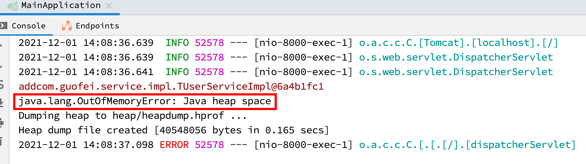
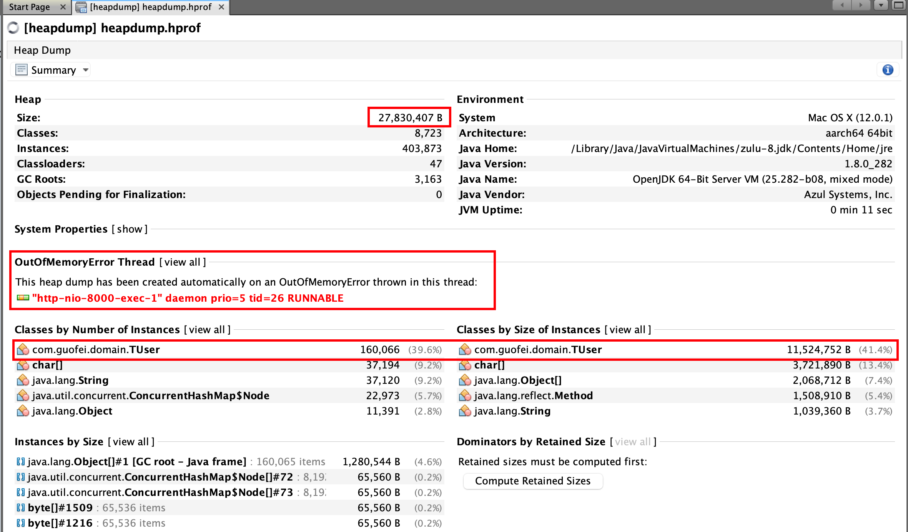
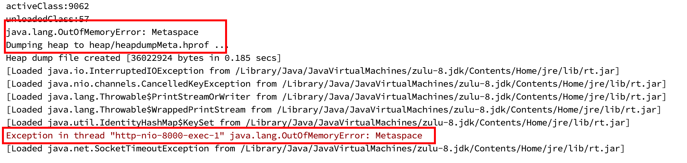
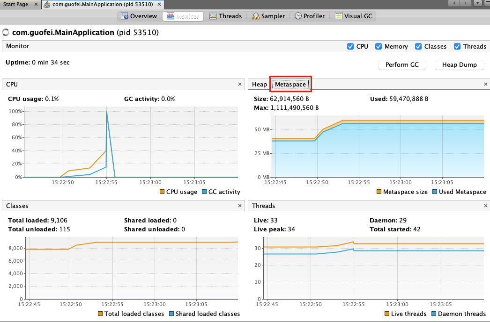
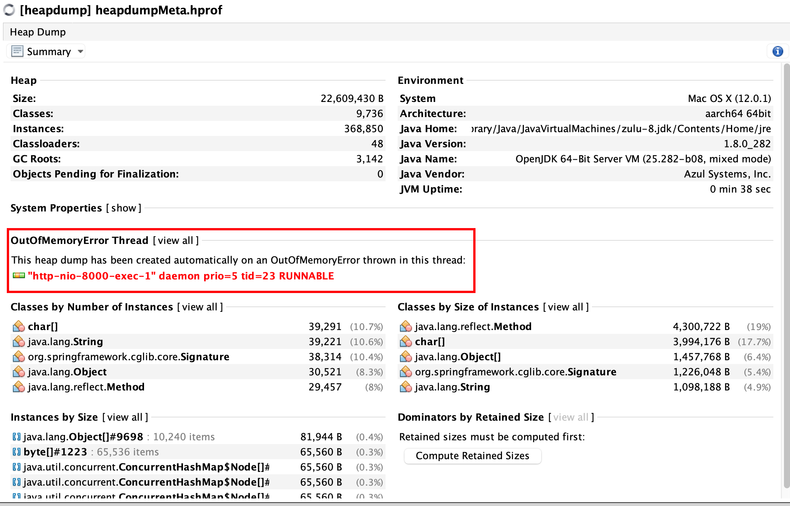
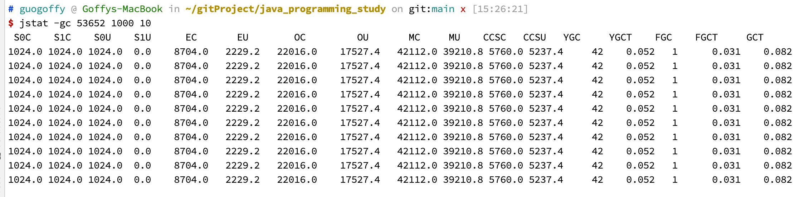

## 生产环境中的问题


## 调优基本问题


## 调优监控的依据


## 性能优化的步骤


## 性能评价/测试指标

- 吞吐量：运行用户代码的时间占总运行时间（运行用户代码时间+运行垃圾收集时间）的比例。

  总运行时间：程序的运行时间+内存回收的时间。

  吞吐量优先，意味着单位时间内，STW的时间最短。

- 暂停时间：执行垃圾收集时，程序的工作线程被暂停的时间。暂停时间优先，意味着单次STW的时间最短，但是频率可能增加。

- 内存占用：Java堆区所占的内存大小。

- 垃圾收集开销：吞吐量的补数，垃圾收集所占用的时间与总运行时间的比例。

- 收集频率：相对于应用程序的执行，收集操作发生的频率。

- 快速：一个对象从诞生到被回收经历的时间

不可能三角：简单来说抓住两点，吞吐量和暂停时间。

高吞吐量与低暂停时间，是一对互相竞争的。因为如果高吞吐量优先，必然需要降低内存回收的执行频率，导致GC需要更长的暂停时间来执行内存回收。如果选择低延迟优先为原则，也只能频繁的执行内存回收，引起程序吞吐量的下降。现在的标准，在最大吞吐量优先的情况下，降低停顿时间。

## OOM案例

### 堆溢出

#### 报错信息

java.lang.OutOfMemoryError: Java heap space

#### 案例模拟

```java
/**
     * 案例1 模拟线上环境 OOM
     * -XX:+PrintGCDetails 打印GC
     * -XX:MetaspaceSize=64m 设置元空间大小
     * -XX:+HeapDumpOnOutOfMemoryError 生成 dump 文件
     * -XX:HeapDumpPath=heap/heapdump.hprof 生成 dump 文件路径
     * -XX:+PrintGCDateStamps
     * -Xms200M 堆空间大小
     * -Xmx200M 堆空间大小
     * -Xloggc:log/gc.oomHeap.log gc日志
     * -XX:+PrintGCDetails -XX:MetaspaceSize=64m
     * -XX:+HeapDumpOnOutOfMemoryError -XX:HeapDumpPath=heap/heapdump.hprof
     * -XX:+PrintGCDateStamps -Xms200M -Xmx200M -Xloggc:log/gc.oomHeap.log
     */
    @RequestMapping("/add")
    public void addObjects(){
        System.err.println("add" + tUserService);
        ArrayList<TUser> objects = new ArrayList<>();
        while (true){
            objects.add(new TUser());
        }
    }
```

#### 运行结果



#### 原因及解决方案

原因：代码中可能存在大对象分配，可能存在内存泄漏，导致多次GC之后，还是无法找到一块足够大的内存容纳当前对象

解决方案：检查是否有大对象的分配，最有可能是大数组分配；通过jmap命令，把堆内存dump下来，使用MAT等工具分析一下，检查是否存在内存泄露；如果没有明显的内存泄漏，使用 -Xmx 加大堆内存。还有一点容易忽略，检查是否有大量自定义的 Finalizable 对象，也有可能时候框架内部提供的，考虑其存在的必要性。

#### dump文件分析



### 元空间溢出

#### 报错信息

java.lang.OutOfMemoryError: Metaspace

#### 案例模拟

```java
 /**
     * 案例2 元空间OOM
     * -XX:+PrintGCDetails -XX:MetaspaceSize=60m -XX:MaxMetaspaceSize=60m
     * -XSS512K -XX:+HeapDumpOnOutOfMemoryError
     * -XX:HeapDumpPath=heap/heapdumpMeta.hprof -XX:SurvivorRatio=8
     * -XX:+TraceClassLoading -XX:+TraceClassUnloading -XX:+PrintGCDateStamps
     * -Xms60M -Xmx60M -Xloggc:log/gc-oomMeta.log
     * -XX:MetaspaceSize=60m -XX:MaxMetaspaceSize=60m 设置元空间大小
     * -Xss512K 设置栈空间大小
     * -XX:SurvivorRatio=8 设置新生代（Eden比例）比例
     * -XX:+HeapDumpOnOutOfMemoryError -XX:HeapDumpPath=heap/heapdumpMeta.hprof 设置dump文件
     * -XX:+TraceClassLoading 加载的类的信息打印
     * -XX:+TraceClassUnloading 卸载的类的信息打印
     * -XX:+PrintGCDateStamps GC信息
     * -Xms60M -Xmx60M 设置堆空间大小
     * -Xloggc:log/gc-oomMeta.log log日志文件
     */
    @RequestMapping("/metaSpaceOom")
    public void metaSpaceOom(){
        ClassLoadingMXBean classLoadingMXBean = ManagementFactory.getClassLoadingMXBean();
        while (true){
            Enhancer enhancer = new Enhancer();
            enhancer.setSuperclass(TUser.class);
            enhancer.setUseCache(false);
            enhancer.setCallback((MethodInterceptor) (o, method, objects, methodProxy) -> {
                System.out.println("我是加强类，输出print之前的加强方法");
                return methodProxy.invokeSuper(o,objects);
            });
            TUser user = (TUser)enhancer.create();
            //people.print();
            System.out.println(user.getClass());
            System.out.println("totalClass:" + classLoadingMXBean.getTotalLoadedClassCount());
            System.out.println("activeClass:" + classLoadingMXBean.getLoadedClassCount());
            System.out.println("unloadedClass:" + classLoadingMXBean.getUnloadedClassCount());
        }
    }
```

#### 运行结果



#### 原因及解决方案

原因：运行期间生成了大量的代理类，导致方法区被撑爆，无法卸载；应用长时间运行，没有重启；元空间内存设置过小

解决方案：

- 检查是否永久代或者元空间设置过小
- 检查代码中是否存在大量的反射操作
- dump之后检查是否存在大量反射生成的代理类

当前进程查看



dump文件查看



命令监测：jstat -gc 1000 10 （1000s 10次），可以看出MU接近上限



解释：

- S0C/S0U：s0区总共/使用大小
- S1C/S1U：s1区总共/使用大小
- EC/EU：Eden总共/使用大小
- OC/OU：老年代总共/使用大小
- MC/MU：方法区（元空间）总共/使用大小
- CCSC/CCSU：压缩类的空间总共/使用大小（本质上属于方法区）
- YGC/YGCT：YGC次数/时间
- FGC/FGCT：FGC次数/时间
- GCT：GC总时间

### GC overhead limit exceeded

这个是JDK6新加的错误类型，一般是堆太小导致的，Sun 官方对此的定义是：超过98%的时间用来做GC并且回收了不到2%的堆内存时会抛出此异常，本质上是一个预判性的异常，抛出该异常时系统并没有真正的内存溢出。

解决方法

- 检查项目中是否有大量的死循环或使用大内存的代码，优化代码
- 添加参数 ‘-XX:-UseGCOverheadLimit’ 禁用这个价差，其实这个参数解决不了内存问题，只是把错误的信息延后，最后还是会出现java.lang.OutOfMemoryError: Java heap space
- dump内存，检查是否存在内存泄漏，如果没有，加大内存

### 线程溢出


## 性能测试工具：Jmeter

### 基本概述

### 使用流程


## 性能优化案例

### 调整堆大小提高服务的吞吐量

### JVM 优化之 JIT 优化

### 合理配置堆内存

### 特殊问题：新生代与老年代的比例

### CPU占用很高的排查办法

### G1并发执行的线程对性能的影响

### 调整垃圾回收器提高服务的吞吐量

### 日均百万级订单交易系统如何设置 JVM 参数

### 面试小结


