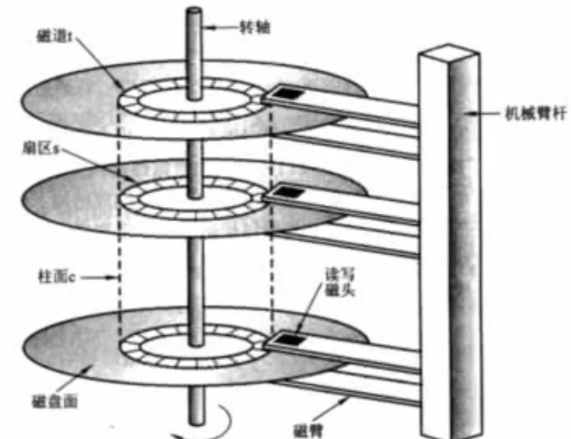
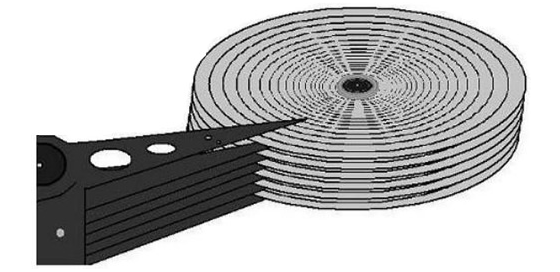
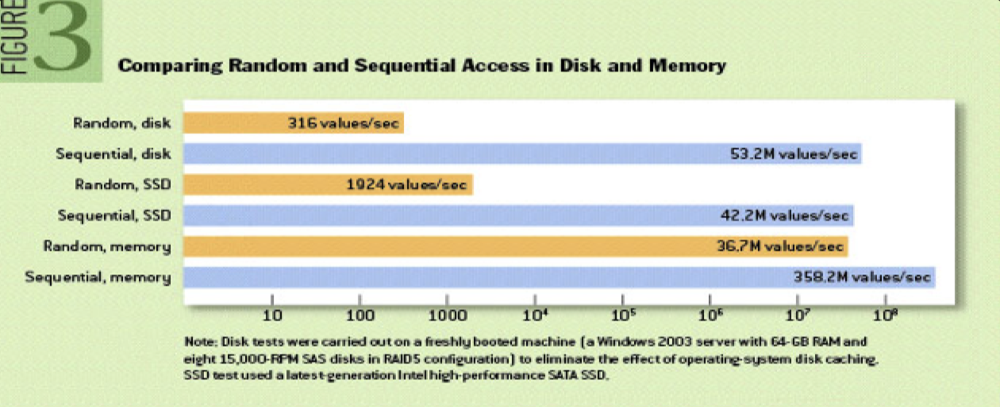
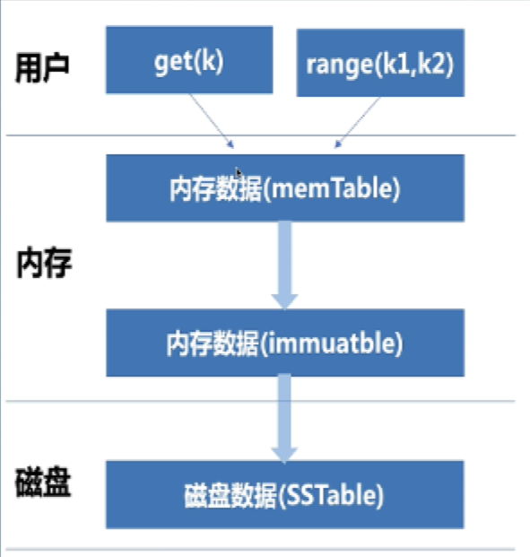
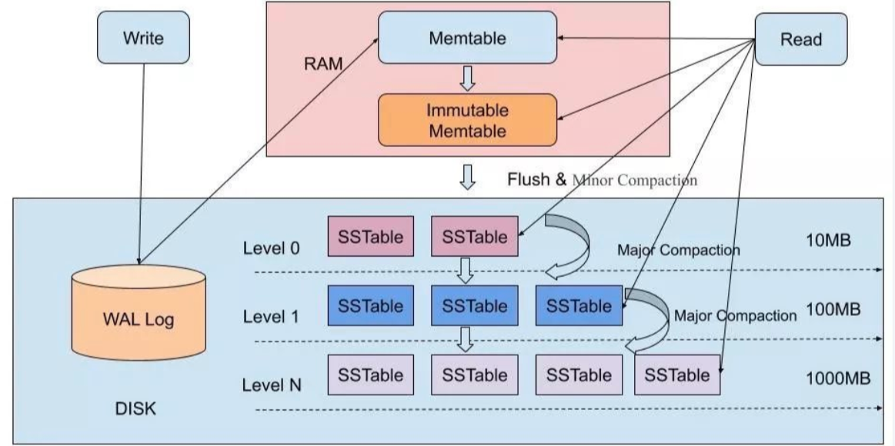

## 磁盘的结构

机械磁盘的拆解：

磁盘包含有多个盘片，一个盘片有两个盘面（正面和反面），每个盘面上都有两个磁头（上下各一个）负责读写数据（磁臂链接着）。

影响机械磁盘读取速度的因素：

- 寻道时间：磁头从开始移动到数据所在磁道所需要的时间，寻道时间越短，I/O操作越快，速度越快。目前磁盘的平均训道时间一般在3-15ms。
- 旋转延迟：盘片旋转将请求数据所在扇区移至磁头下方所需的时间，旋转延迟取决于磁盘转速。
- 数据传输时间：完成传输所请求的数据所需要的时间。

简单来说就是这样的：磁头会移到读取位置的磁道上方，这算时间就是寻道时间。再通过盘面的旋转转移到对应的扇区，这段时间成为旋转延迟时间。最后读写数据，即需要传输时间。所以，可以想象，顺序读写的效率多么的高。

## LSM数据模型

LSM-Tree，即Log-Structured Merge-Tree（日志结构合并树）。拥有这优异的写性能和不错的读性能。可以进行顺序写磁盘，从而大幅度提升写的性能（牺牲了一部分读性能来提高写性能）。

## 诞生背景

传统关系型数据库使用 Btree 或者 B+Tree 或一些变体作为存储结构，能高效进行查找。但保存在磁盘中时它也有一个明显的缺陷，那就是逻辑上相离很近但物理却可能相隔很远，这就可能造成大量的磁盘随机读写。随机读写比顺序读写慢很多。

为了提升IO性能，我们需要一种能将随机操作变为顺序操作的机制，于是便有了LSM树。

LSM树能让我们进行顺序写磁盘，从而大幅提升写操作，作为代价的是牺牲了一些读性能。

例如 BigTable、HBase、Cassandra、LevelDB、SQLite、Scylla、RocksDB 等。

## 组成结构

LSM-Tree是由两个或以上的存储结构组成的，由一个驻存在内存中的树结构和多个位于磁盘的树结构组成。我们一般把在内存中的树结构称为C0-Tree（小树），具体结构可以是任何方便键值查找的数据结构，例如红黑树，跳表等；在磁盘中的树一开始为C1-Tree（大树），以后由于合并递增会有C2-Tree，C3-Tree……Ck-Tree，树从小到大依次递增。

## lsm的思想

将修改后的数据保存在内存，达到一定数量后再将修改的数据批量写入磁盘，在写入的过程中与之前已经存在的数据做合并。

什么是WAL：

WAL(Write Ahead Log)预写日志，是数据库系统中常见的一种手段，用于保证数据操作的原子性和持久性。

## 硬盘I/O vs 内存I/O

磁盘随机I/O < 磁盘顺序I/O = 内存随机I/O < 内存顺序I/O

## 解决问题出发点

基于日志结构存储引擎是为了解决写多读少的特定场景而提出的解决方案

- 特定场景：日志系统、推荐系统、海量数据存储、数据分析
- 写多：数据大量写入，用于做统计、分析、线上检索、训练模型等
- 读少：少量读是和该系统的写入量来相对衡量的，大部分场景对读的性能实时性要求相对较低

怎么写：利用顺序IO，因为追加写磁盘是一种典型的顺序IO，所有可以简单的将用户所有的写操作（insert、update、delete）都采用追加写的方式记录在磁盘中。

磁盘 I/O vs 内存I/O：

结论：磁盘随机I/O < 磁盘顺序I/O = 内存随机I/O < 内存顺序I/O

优点：充分利用了顺序IO，写性能暂时提高

弊端：同一条数据占据多份空间，造成空间放大，浪费

改进：后台定时合并压缩数据、消除无效数

## 怎么写

LSM 树每次需要进行插入操作的时候，会先向日志文件中进行 append 操作，保证它的顺序写，速度非常的快，然后在内存中同样记录下该数据（WAL 预写日志，即把写操作顺序写到日志中，避免由于 os 分配内存去磁盘中去寻找要存放的位置，同时也是避免系统死机重启带来的数据丢失问题）

一开始数据会存放在C0-Tree中即内存中，当达到C0-Tree的阈值时会触发合并，将C0-Tree的数据合并写入到C1-Tree，过程类似于归并排序。C0-Tree和C1-Tree（old）会合并成为一个C1-Tree（new），C1-Tree（old）会被删除，用C1-Tree（new）代替。当C1-Tree达到一定大小，也会和下一层进行合并。

提升合并效率：

Q：怎么提升合并效率？

A：保证每个文件写入的数据有序，利用多路归并思路合并

Q：如何确保每个文件数据有序？

A：用户写操作的数据，现在内存中缓存一段时间，然后排好序（选择支持排序的数据结构，例如红黑树，跳表，B+Tree等），再写磁盘

Q：合并策略如果确定？

A：合并方式：分级合并、分层合并

  合并时机：定时合并，达到阈值合并等

Q：进程挂掉了数据丢了怎么办？

A：为保证数据的持久性，所有写操作写 redoLog，挂掉重启时根据日志恢复数据

## 怎么读

核心原则：按照倒叙读取数据，一旦读到数据，则停止读取逻辑

读优化方案：

- 每个SSTable中添加布隆过滤器，用来快速判断读取的数据是否存在，加速读效果
- 采用分区存储SSTable，除了 L0层外，每层之间的数据不重叠，层内数据有序存储
- 压缩优化，提升压缩效率，防止压缩过程堵塞读逻辑

## 三大问题

1. **读放大（ReadAmplification）**

   读操作需要从新值到旧值依次读取，在此过程中会设计不止一次I/O。特别是范围查找时，导致影响很明显

2. **写放大（ Write Amplification ）**

   在上述的过程中，为了减少读放大，通常采用后台合并数据的方式解决，但是该过程也引入了写放大，实际写入磁盘的数据大小和程序要求写入的大小不相等。正常情况下，压缩合并的过程中对一条数据会涉及多次写，所以称为写放大。

3. **空间放大（Space Amplification ）**

   所有的写都是通过append的方式来记录，因此会导致所有过期或者删除的数据不会立即清理掉，仍然会占据空间

## 总结

主流的数据库均已B/B+ Tree 作为其构建索引的数据结构，这是因为 B/B+Tree 提供了理论上最高的查询效率 O(logn)，对查询性能的追求也造成了 Btree相应的缺点，每次插入或者删除一条索引时，均需要更新索引，从而造成一次磁盘 I/O，这种特性决定了 Btree 只适于用频繁读、较少写的场景。

而LSM tree则避免了频繁写场景的磁盘 I/O 开销，尽管其查询效率无法达到理想的 O(logn)，但依然非常快，可以接受。所以从本质上讲，LSM Tree相当于牺牲了一部分查询性能，换去了可观的写入性能。这对于 k-v型或者日志型数据库是非常重要的。