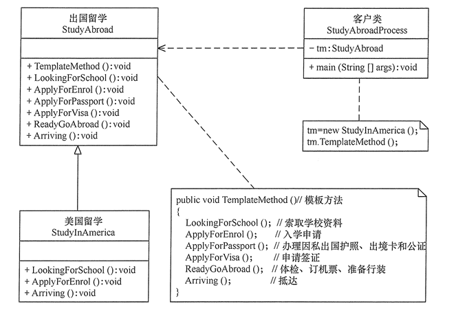

## 一、定义

定义一个操作中的算法骨架，而将算法的一些步骤延迟到子类中，使得子类可以不改变该算法结构的情况下重定义该算法的某些特定步骤。属于类行为型模式。

## 二、优点

- 封装了不变部分，扩展可变部分。它把认为是不变部分的算法封装到父类中实现，而把可变部分算法由子类继承实现，便于子类继续扩展。
- 它在父类中提取了公共的部分代码，便于代码复用。
- 部分方法是由子类实现的，因此子类可以通过扩展方式增加相应的功能，符合开闭原则。

## 三、缺点

- 对每一个不同的实现都需要定义一个子类，这会导致类的个数增加，系统更加庞大，设计也更加抽象，间接地增加了系统实现的复杂度。
- 父类中的抽象方法由子类实现，子类执行的结果会影响父类的结果，这导致一种反向的控制结构，加大了代码阅读的难度。
- 由于继承关系自身的缺点，如果父类添加新的抽象方法，则所有子类都要改一遍。

## 四、结构与实现

模版方法模式包含以下主要角色（抽象类/抽象模版、具体子类/具体实现）

### 4.1、抽象类/抽象模版

抽象模板类，负责给出一个算法的轮廓和骨架。它由一个模板方法和若干个基本方法构成。这些方法的定义如下

1. 模板方法：定义了算法的骨架，按某种顺序调用其包含的基本方法。
2. 基本方法：是整个算法中的一个步骤，包含以下几种类型。
   1. 抽象方法：在抽象类中声明，由具体子类实现
   2. 具体方法：在抽象类中已经实现，在具体子类中可以继承或重写它
   3. 钩子方法：在抽象类中已经实现，包括用于判断的逻辑方法和需要子类重写的空方法两种

### 4.2、具体子类/具体实现

具体实现类，实现抽象类中所定义的抽象方法和钩子方法，它们是一个顶级逻辑的一个组成步骤

## 五、实现

```java
public class TemplateMethodPattern {
    public static void main(String[] args) {
        AbstractClass tm = new ConcreteClass();
        tm.TemplateMethod();
    }
}

//抽象类
abstract class AbstractClass {
    //模板方法
    public void TemplateMethod() {
        SpecificMethod();
        abstractMethod1();
        abstractMethod2();
    }

    //具体方法
    public void SpecificMethod() {
        System.out.println("抽象类中的具体方法被调用...");
    }

    //抽象方法1
    public abstract void abstractMethod1();

    //抽象方法2
    public abstract void abstractMethod2();
}

//具体子类
class ConcreteClass extends AbstractClass {
    public void abstractMethod1() {
        System.out.println("抽象方法1的实现被调用...");
    }

    public void abstractMethod2() {
        System.out.println("抽象方法2的实现被调用...");
    }
}
```

程序运行的结果如下：

```shell
抽象类中的具体方法被调用...
抽象方法1的实现被调用...
抽象方法2的实现被调用...
```

## 六、应用场景

- 算法的整体步骤很固定，但由于个别部分易变时，这时候可以使用模版方法模式，将容易变的部分抽象出来，供子类实现。
- 当多个子类存在公共的行为时，可以将其提取出来并集中到一个公共父类中以避免代码重复。首先，要识别现有代码中的不同之处，并且将不同之处分离为新的操作。最后，用一个调用这些新的操作的模版方法来替代这些不同的代码。
- 当需要控制子类的扩展时，模版方法只在特定调用钩子操作，这样就只允许在这些点进行扩展。

## 七、应用实例

用模板方法模式实现出国留学手续设计程序

分析：出国留学手续一般经过以下流程：索取学校资料，提出入学申请，办理因私出国护照、出境卡和公证，申请签证，体检、订机票、准备行装，抵达目标学校等，其中有些业务对各个学校是一样的，但有些业务因学校不同而不同，所以比较适合用模板方法模式来实现。

在本实例中，我们先定义一个出国留学的抽象类 StudyAbroad，里面包含了一个模板方法 TemplateMethod()，该方法中包含了办理出国留学手续流程中的各个基本方法，其中有些方法的处理由于各国都一样，所以在抽象类中就可以实现，但有些方法的处理各国是不同的，必须在其具体子类（如美国留学类 StudyInAmerica）中实现。如果再增加一个国家，只要增加一个子类就可以了。



代码如下：

StudyAbroad：

```java
/**
 * Created with IntelliJ IDEA.
 *
 * @Author: GuoFei
 * @Date: 2021/12/26/13:12
 * @Description: 抽象类：出国留学
 */
public  abstract class StudyAbroad {

    /**
     * 模版方法
     */
    public void TemplateMethod(){
        // 获取学校资料
        LookingForSchool();
        // 入学申请
        ApplyForEnrol();
        // 办理出国护照、出境卡和公证
        ApplyForPassport();
        // 申请签证
        ApplyForVisa();
        // 体检、订机票、准备行装
        ReadyGoAbroad();
        // 抵达
        Arriving();
    }

    public void ReadyGoAbroad(){
        System.out.println("五.体检、订机票、准备行装：");
        System.out.println("  1）进行身体检查、免疫检查和接种传染病疫苗；");
        System.out.println("  2）确定机票时间、航班和转机地点。");
    };

    public void ApplyForPassport(){
        System.out.println("三.办理因私出国护照、出境卡和公证：");
        System.out.println("  1）持录取通知书、本人户口簿或身份证向户口所在地公安机关申请办理因私出国护照和出境卡。");
        System.out.println("  2）办理出生公证书，学历、学位和成绩公证，经历证书，亲属关系公证，经济担保公证。");
    };

    public void ApplyForVisa(){
        System.out.println("四.申请签证：");
        System.out.println("  1）准备申请国外境签证所需的各种资料，包括个人学历、成绩单、工作经历的证明；个人及家庭收入、资金和财产证明；家庭成员的关系证明等；");
        System.out.println("  2）向拟留学国家驻华使(领)馆申请入境签证。申请时需按要求填写有关表格，递交必需的证明材料，缴纳签证。有的国家(比如美国、英国、加拿大等)在申请签证时会要求申请人前往使(领)馆进行面试。");
    };

    protected abstract void ApplyForEnrol();

    protected abstract void LookingForSchool();

    protected abstract void Arriving();
}

```

StudyInAmerica：

```java
/**
 * Created with IntelliJ IDEA.
 *
 * @Author: GuoFei
 * @Date: 2021/12/26/13:19
 * @Description: 具体子类：美国留学
 */
public class StudyInAmerica extends  StudyAbroad{
    @Override
    protected void ApplyForEnrol() {
        System.out.println("二.入学申请：");
        System.out.println("  1）填写报名表；");
        System.out.println("  2）将报名表、个人学历证明、最近的学习成绩单、推荐信、个人简历、托福或雅思语言考试成绩单等资料寄往所申请的学校；");
        System.out.println("  3）为了给签证办理留有充裕的时间，建议越早申请越好，一般提前1年就比较从容。");
    }

    @Override
    protected void LookingForSchool() {
        System.out.println("一.索取学校以下资料：");
        System.out.println("  1）对留学意向国家的政治、经济、文化背景和教育体制、学术水平进行较为全面的了解；");
        System.out.println("  2）全面了解和掌握国外学校的情况，包括历史、学费、学制、专业、师资配备、教学设施、学术地位、学生人数等；");
        System.out.println("  3）了解该学校的住宿、交通、医疗保险情况如何；");
        System.out.println("  4）该学校在中国是否有授权代理招生的留学中介公司？");
        System.out.println("  5）掌握留学签证情况；");
        System.out.println("  6）该国政府是否允许留学生合法打工？");
        System.out.println("  8）毕业之后可否移民？");
        System.out.println("  9）文凭是否受到我国认可？");
    }

    @Override
    protected void Arriving() {
        System.out.println("六.抵达目标学校：");
        System.out.println("  1）安排住宿；");
        System.out.println("  2）了解校园及周边环境。");
    }
}
```

StudyAbroadProcess：

```java
/**
 * Created with IntelliJ IDEA.
 *
 * @Author: GuoFei
 * @Date: 2021/12/26/13:20
 * @Description:
 */
public class StudyAbroadProcess {
    public static void main(String[] args) {
        StudyAbroad tm = new StudyInAmerica();
        tm.TemplateMethod();
    }
}
```

输出如下：

```shell
一.索取学校以下资料：
  1）对留学意向国家的政治、经济、文化背景和教育体制、学术水平进行较为全面的了解；
  2）全面了解和掌握国外学校的情况，包括历史、学费、学制、专业、师资配备、教学设施、学术地位、学生人数等；
  3）了解该学校的住宿、交通、医疗保险情况如何；
  4）该学校在中国是否有授权代理招生的留学中介公司？
  5）掌握留学签证情况；
  6）该国政府是否允许留学生合法打工？
  8）毕业之后可否移民？
  9）文凭是否受到我国认可？
二.入学申请：
  1）填写报名表；
  2）将报名表、个人学历证明、最近的学习成绩单、推荐信、个人简历、托福或雅思语言考试成绩单等资料寄往所申请的学校；
  3）为了给签证办理留有充裕的时间，建议越早申请越好，一般提前1年就比较从容。
三.办理因私出国护照、出境卡和公证：
  1）持录取通知书、本人户口簿或身份证向户口所在地公安机关申请办理因私出国护照和出境卡。
  2）办理出生公证书，学历、学位和成绩公证，经历证书，亲属关系公证，经济担保公证。
四.申请签证：
  1）准备申请国外境签证所需的各种资料，包括个人学历、成绩单、工作经历的证明；个人及家庭收入、资金和财产证明；家庭成员的关系证明等；
  2）向拟留学国家驻华使(领)馆申请入境签证。申请时需按要求填写有关表格，递交必需的证明材料，缴纳签证。有的国家(比如美国、英国、加拿大等)在申请签证时会要求申请人前往使(领)馆进行面试。
五.体检、订机票、准备行装：
  1）进行身体检查、免疫检查和接种传染病疫苗；
  2）确定机票时间、航班和转机地点。
六.抵达目标学校：
  1）安排住宿；
  2）了解校园及周边环境。

```

