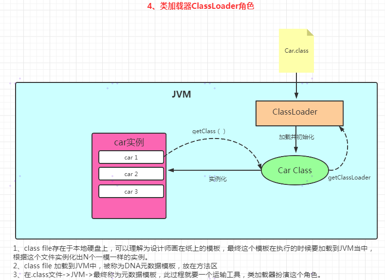
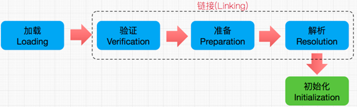
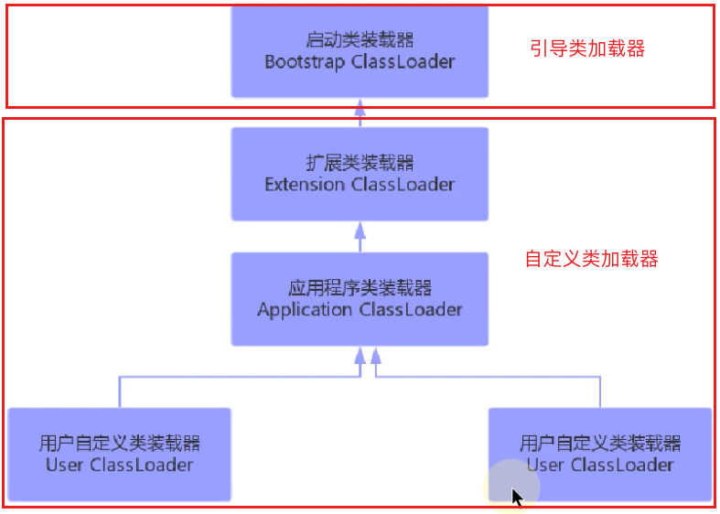
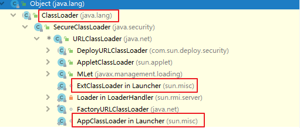
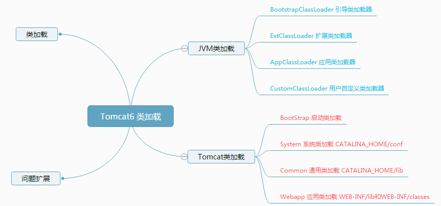
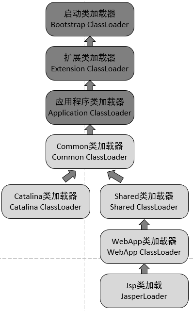

[TOC]


- [ ] ClassLoader源码剖析
- [ ] 总结

## 类加载子系统的作用

### 作用

负责从文件系统或者网络中加载Class文件，Class文件开头有特定标识，魔术，咖啡杯壁

Classloader只负责class文件的加载，至于是否可运行，则由执行引擎决定

加载的类信息存放于称为方法区的内存空间，除了类信息，方法区还会存放运行时常量池信息，还可能包括字符串字面量和数字常量

### 角色



## 类的加载过程

### 谁需要加载？

在Java中数据类型分为基本数据类型和引用数据类型、基本数据类型由虚拟机预先定义，**引用数据类型则需要进行类的加载**。

### 生命周期

Loading -> Linking -> Initialzation -> Using -> Unloading

### 加载过程

Loading -> Linking（Verification -> Preparation -> Resolution） -> Initialzation 



### Loading（加载）

加载刚好是加载过程的一个阶段，二者意思不能混淆

类的加载：简而言之就是讲Java类的字节码文件记载到机器内存中，并在内存中构建出Java类的原型--类模版对象。说白了就是**查找并加载类的二进制数据，生成class的实例。**

#### 类模版对象

其实就是Java类在JVM内存中的一个快照，JVM将从字节码文件中解析出来的常量池、类字段、类方法等信息存储到类模版中，这样JVM在运行期间便能通过类模版而获取Java类中的任意信息，能够对Java类的成员变量进行遍历，也能进行Java的调用。

反射的机制就是基于这个基础，如果JVM没有将Java类的声明信息存储起来，则JVM在运行期间也无法反射。

它的位置：存储在方法区（JDK1.8之前：永久带；JDK1.8之后，元空间）

#### 数组的加载有什么不同？

数组类本身并不是由类加载器负责创建的，它是由JVM在运行时根据需要而直接创建的，但数组的元素类型仍然需要依靠类加载器去创建。

### Linking（链接）

#### Verification（验证）

当类加载到系统后，就开始链接操作，验证是链接的第一步。它的目的是保证加载的字节码是合法、合理并符合规范的。

**检查内容**

- 格式检查：魔数检查、版本检查、长度检查
- 语义检查：是否继承 final、是否有父类、抽象方法是否有实现
- 字节码验证码：跳转指令是否指向正确位置、操作数类型是否合理
- 符号引用验证：符号引用的直接引用是否存在

如果在这个阶段无法用过检查，虚拟机也不会正确装载这个类。但是，如果通过了这个阶段的检查，也不会说明这个类是完全没有问题的。

#### Preparation（准备）

这个环节是最重要的，简而言之，就是为类的静态变量分配内存，并将其初始化为默认值。

Java虚拟机为各类型变量默认的初始值如表所示：

|   类型    | 默认初始值 |
| :-------: | :--------: |
|   byte    |  (byte)0   |
|   short   |  (short)0  |
|    int    |     0      |
|   long    |     0L     |
|   float   |    0.0f    |
|  double   |    0.0     |
|   char    |   \u0000   |
|  boolean  |   false    |
| reference |    null    |

注意：Java并不支持boolean类型，对于boolean类型，内部实现是int，由于int的默认值是0，故对应的，boolean的默认值就是false。

- 在这个阶段不包含基本数据类型的字段用 `static final` 修饰的情况，因为final在编译的时候就分配了，准备阶段会显式赋值。
- 这个阶段也不会为实例变量分配初始化，实例变量是随着对象一起分配到Java堆中。
- 这个阶段并不会想初始化阶段中那会会有初始化或者代码被执行。

#### Resolution（解析）

 这个环节是最难的。

简言之，就是将类、接口、字段和方法的符号引用转为直接引用。

符号引用：就是一组符号来描述引用的目标。符号引用的字面量形式明确定义在Java虚拟机规范的Class文件格式中

直接引用：就是直接指向目标的指针，相对偏移量或一个间接定位到目标的句柄

所谓解析就是将符号引用转为直接引用，也就是得到类、字段、方法在内存中的指针或者偏移量。因此，可以说，如果直接引用存在，那么可以肯定的是系统中存在该类、方法或者字段。但只存在符号引用，不能确定系统中一定存在改结构。

注意：Java虚拟机规范并没有明确要求解析阶段一定要按照顺序执行。在HotSpot VM中，加载、验证、准备和初始化会按照顺序有条不紊的执行，但链接阶段中的解析操作往往会伴随着JVM在执行完初始化之后在执行。

### Initialzation（初始化）

这个阶段非常重要并且很难理解。

简言之，就是为类的静态变量赋予正确的初始值。

具体描述：类的初始化是类装载的最后一个阶段。如果前面的步骤都没有问题，那么表示类可以顺利装载到系统中，此时，类才会开始Java代码。（到了初始化阶段，才真正开始执行类中定义的Java程序代码）

初始化阶段的重要工作是执行类的初始化方法：`<clinit>（）`方法，也就是执行类构造器方法`<clinit>()`

- 该方法仅能由Java编译器生成并由JVM调用，程序开发者无法自定义一个同名的方法，更无法直接在Java程序中调用该方法，虽然该方法也是由字节码指令组成。
- 它是由静态成员的赋值语句以及`static`语句块合并产生。

> `<init>（）`方法，这个一定会出现在class的method中
>
> `<clinit>（）`方法，只有在给类中的`static`的变量显式赋值或者静态代码块中赋值了，才会生成此方法

类的初始化情况

Java虚拟机规定，一个类或接口在初次使用前，必须要进行初始化。这里指的“使用”是指主动使用

主动使用只有下列几种情况：（即：如果出现以下的情况，则会对此类进行初始化操作。而初始化操作之前的加载、验证、准备已经完成）

- 主动使用的情况
  - 当创建一个类的实例时，比如使用new关键字，或者通过反射、克隆、反序列化
  - 当调用类的静态方法时，即当使用了字节码invokestatic指令。
  - 当使用类、接口的静态字段时 (final修饰特殊考虑)，比如，使用getstatic或者
    putstatic指令。
  - 当使用java. lang.reflect包中的方法反射类的方法时。比如：Class . forName ("com.atguigu. java. Test")
  - 当初始化子类时，如果发现其父类还没有进行过初始化，则需要先触发其父类的初始化
  - 如果一个接口定义了default方法，那么直接实现或者间接实现该接口的类的初始化，该接口要在其之前被初始化。
  - 当虚拟机启动时，用户需要指定一个要执行的主类（包含main(）方法的那个类），虚拟机会先初始化这个主类

- 被动使用的情况

  被动使用不会引起类的初始化。也就是说，并不是在代码中出现的类，就一定会被加载或初始化。如果不符合主动使用的条件，类就不会被初始化。

  - 当访问一个静态字段时，只有真正声明这个字段的类才会被初始化（当通过子类引用父类的静态变量，不会导致子类初始化）
  - 通过数组定义类引用，不会触发此类的初始化
  - 引用常量不会触发此类或接口的初始化。因为常量在链接阶段就己经被显式赋值了
  - 调用ClassLoader类的1oadClass（）方法加载一个类，并不是对类的主动使用，不会导致类的初始化

  被动的使用，意味着不需要执行初始化环节，意味着没有`<clinit>（）`的调用。

### 补充说明

- 加载、验证、准备、初始化和卸载这五个阶段的顺序是确定的。
- 解析阶段不一定，在某些情况下可以在初始化阶段之后再开始，为了支持Java语言的运行时绑定特性（也称为动态绑定或晚期绑定）

## 类的加载器 

### 作用

类加载器是JVM执行类加载机制的前提

### ClassLoader的作用

ClassLoader是Java的核心组件，所有的c lass都是由ClassLoader进行加载的，ClassLoader负责通过各种方式将class信息的二进制数据流读入JVM内部，转换为一个目标类对应的java.lang.Class对象实例。然后交给Java虚拟机进行链接，初始化等操作。

因此，ClassLoader在整个加载（loading）阶段，只能影响到类的加载。而无法通过ClassLoader去改变类的链接和初始化行为，至于它是否可以运行，则是由 Execution Engine决定的。

### 加载的类是唯一的吗

#### 何为类的唯一性？

对于任意一个类，都需要由加载它的类加载器和这个类本身一同确认其在Java虚拟机中的唯一性。每一个类加载器，都拥有一个独立的类名称空间：比较两个类是否相等，只有在这两个类是由同一个类加载器加载的前提下才有意义。否则，即使这两个类源自同一个Class文件，被同一个虚拟机加载，只有加载它们的类加载器不同，那这两个类就必定不相等。

#### 命名空间

- 每个类加载器都有自己的命名空间，命名空间由该类加载器及所有的父加载器所加载的类组成
- 在同一命名空间下，不会出现类的完整名字（包括类的包名）相同的两个类
- 在不同的命名空间下，有可能出现类的完整名字（包括类的包名）相同的两个类

在大型应用中，往往借助这一特性，来运行同一个类的不同版本。

## 类的加载器分类与测试

### 类加载器的分类说明

 JVM支持两种类型的类加载器，分别是引导类加载器（Bootstrap ClassLoader）和自定义类加载器（User-Defined ClassLoader）

从概念上来讲，自定义类加载器一般指的是程序中由开发人员自定义的一类加载器，但是Java虚拟机规范中并没有这个定义，而是讲所有派生于抽象类 ClassLoader的类加载器都划分为自定义类加载器。



### 具体类的加载器介绍

#### 引导类加载器

- 这个类加载使用C/C++语言实现的，嵌套在JVM内部
- 它用来加载Java的核心库（JAVA_HOME/jre/lib/rt.jar或sun.boot.class.path路径下的内容），用于提供JVM自身需要的类
- 并不继承自java.lang.ClassLoader，没有父加载器
- 处于安全考虑，Bootstrap启动类只加载包名为java、javax、sun等开头的类
- 加载扩展类和应用程序类加载器，并指为它们的父类加载器。

#### 扩展类加载器

- Java语言编写，由sun.misc,Launcher$ExtClassLoader实现
- 继承于ClassLoader类
- 父类加载器为启动类加载器
- 从java.ext.dirs系统属性所指定的目录中加载类库，或从JDK的安装目录的jre/lib/ext子目录下加载类库。如果用户创建的JAR放在此目录下，也会自动由扩展类加载器加载



#### 系统类加载器

- java语言编写，由sun.misc. Launcher$AppclassLoader实现
- 继承于ClassLoader类
- 父类加载器为扩展类加载器
- 它负责加载环境变量c1asspath或系统属性 iava.class.path指定路径下的类库
- **应用程序中的类加载器默认是系统类加载器**
- 它是用户自定义类加载器的默认父加载器
- 通过ClassLoader的`getSystemClassLoader()`可以获取到该类加载器

#### 用户自定义类加载器

##### 简要描述

- 在Java的日常应用程序开发中，类的加载几乎是由上述3种类加载器相互配合执行的。在必要时，我们还可以自定义类加载器，来定制类的加载方式
- 体现Java语言强大生命力和巨大魅力的关键因素之一便是，Java开发者可以自定义类加载器来实现类库的动态加载，加载源可以是本地的JAR包，也可以是网络上的远程资源
- 通过类加载器可以实现非常绝妙的插件机制，这方面的实际应用案例举不胜举。例如，著名的OSGT组件框菜，再如Eclipse的插件机制。类加载器为应用程序提供了一种动态增加新功能的机制，这种机制无须重新打包发布应用程序就能实现
- 同时，自定义加载器能够实现应用隔离，例如 Tomcat, Spring等中间件和组件框架都在内部实现了自定义的加载器，并通过自定义加载器隔离不同的组件模块。这种机制比C/C++程序要好太多，想不修改C/C++程序就能为其新增功能，几乎是不可能的，仅仅一个兼容性便能阻挡住所有美好的设想
- 所有用户自定义类加载器通常需要继承于抽象类java.1ang.ClassLoader

##### 为什么要自定义类的加载器

- 隔离加载类

  在某些框架内进行中间件与应用的模块隔离，把类加载到不同的环境。比如：阿里内某容器框架通过自定义类加载器确保应用中依赖的 jar包不会影响到中间件运行时使用的jar包。再比如：Tomcat这类web应用服务器，内部自定义了好几种类加载器，用于隔离同一个Web应用服务器上的不同应用程序。（类的仲裁-->类冲突）

- 修改类加载的方式

  类的加载模型并非强制，除Bootstrap外，其他的加载并非一定要引入，或者根据实际情况在某个时间点进行按需进行动态加载

- 扩展加载源

  比如从数据库、网络、甚至是电视机机顶盒进行加载

- 防止源码泄漏

  Java代码容易被编译和篡改，可以进行编译加密。那么类加载也需要自定义，还原加密的宇节码

### 测试不同的类加载器

每个Class对象都会包含一个定义它的ClassLoader的一个引用

获取ClassLoader的途径：

```java
// 获得当前类的ClassLoader
clazz.getClassLoader()
// 获得当前线程上下文的ClassLoader
Thread. current Thread() .getContextClassLoader()
// 获得系统的ClassLoader
ClassLoader .getsystemClassLoader()
```

说明：站在程序的角度看，引1导类加教器与另外两种类加裁器（系统类加裁器和扩展类加裁器）并不是同一个层次意义上的加载器，引导类加载器是使用C++语言编写而成的，而另外两种类加载器则是使用Java语言编写而成的。由于引导类加载器压根儿就不是一个Java类，因此在Java程序中只能打印出空值。

## ClassLoader源码剖析


## 相关机制

### 双亲委派机制

#### 优势和劣势

##### 优势

- 避免类的重复加载，确保一个类的全局唯一性（Java类随着它的类加载器一起具备了一种带有优先级的层次关系，通过这种层级关系可以避免类的重复加载，当父亲己经加载了该类时，就没有必要子ClassLoader再加载一次）
- 保护程序安全，防止核心API被随意篡改

##### 劣势

检查类是否加载的委托过程是单向的，这个方式虽然从结构上说比较清晰，使各个ClassLoader的职责非常明确，但是同时会带来一个问题，即顶层的CIassLoader无法访问底层的ClassLoader所加载的类。

通常情况下，启动类加载器中的类为系统核心类，包括一些重要的系统接口，而在应用类加载器中，为应用类。按照这种模式，应用类访问系统类自然是没有问题，但是系统类访问应用类就会出现问题。比如在系统类中提供了一个接口，该接口需要在应用类中得以实现，该接口还绑定一个工厂方法，用于创建该接口的实例，而接口和工厂方法都在启动类加载器中。这时，就会出现该工厂方法无法创建由应用类加载器加载的应用实例的问题。

#### 结论

 由于Java虚拟机规范并没有明确要求类加载器的加载机制一定要使用双亲委派模型，只是建议采用这种方式而己。

比如在Tomcat中，类加载器所采用的加载机制就和传统的双亲委派模型有一定区别，当缺省的类加载器接收到一个类的加载任务时，首先会由它自行加载，当它加载失败时，才会将类的加载任务委派给它的超类加载器去执行，这同时也是Servlet规范推荐的一种做法。

#### 破坏双亲委派机制

1. 发生在双亲委派模型出现之前——即JDK 1.2面世以前的“远古”时代。  

   类加载器的概念和抽象类java.lang.ClassLoader则在Java的第一个版本中就已经存在，面对已经存在的用户自定义类加载器的代码，Java设计者们引入双亲委派模型时不得不做出一些妥协，为了兼容这些已有代码， **无法再以技术手段避免loadClass()被子类覆盖的可能性，只能在JDK 1.2之后的java.lang.ClassLoader中添加一个新的protected方法findClass()，并引导用户编写的类加载逻辑时尽可能去重写这个方法，而不是在loadClass()中编写代码**

2. “  被破坏  ”  是由这个模型自身的缺陷导致的，双亲委派很好地解决了各个类加载器协作时基础类型的一致性问题（ **越基础的类由越上层的加载器进行加载**  ），基础类型之所以被称为  “  基础  ”  ，是因为它们总是作为被用户代码继承、调用的  API  存在，但 **如果有基础类型又要调用回用户的代码，那该怎么办呢？**

   典型的例子便是JNDI服务，JNDI现在己经是Java的标准服务，它的代码由启动类加载器来完成加载（在JDK 1.3时加入到rt.jar的），肯定属于Java中很基础的类型了。但JNDI存在的目的就是对资源进行查找和集中管理，它需要调用由其他厂商实现并部署在应用程序的ClassPath下的JNDI服务提供者接口 (Serviceprovider Interface, SFI）的代码，现在问题来了，启动类加载器是绝不可能认识、加载
   这些代码的，那该怎么办？（SPT：在Java平台中，通常把核心类rt.jar中提供外部服务、可由应用层自行实现的接口称为SPI)

   为了解决这个困境，Java的设计团队只好引入了一个不太优雅的设计：线程上下文类加载器(Thread Context ClassLoader)。这个类加载器可以通过java.1ang.Thread类的setContextClassLoader(方法进行设置，如果创建线程时还未设置，它将会从父线程中继承一个，如果在应用程序的全局范围内都没有设置过的话，那这个类加载器默认就是应用程序类加载器。

3. 双亲委派模型的第三次“被破坏”是由于用户对程序动态性的追求而导致的  。如：  **代码热替换（Hot Swap）、模块热部署（Hot Deployment）**  等

   IBM公司主导的JSR-291（即OSGi R4.2）实现模块化热部署的关键是它自定义的类加载器机制的实现，每一个程序模块（OSGi中称为Bundle）都有一个自己的类加载器，当需要更换一个Bundle时，就把Bundle连同类加载器一起换掉以实现代码的热替换。在OSGi环境下，类加载器不再双亲委派模型推荐的树状结构，而是进一步发展为更加复杂的  网状结构。

#### Tomcat 类加载机制

##### 抛出问题



既然 Tomcat 不遵循双亲委派机制，那么如果我自己定义一个恶意的HashMap，会不会有风险呢？

显然不会有风险，如果有，Tomcat都运行这么多年了，那群Tomcat大神能不改进吗？ tomcat不遵循双亲委派机制，只是自定义的ClassLoader顺序不同，但顶层还是相同的，还是要去顶层请求Classloader。

思考一下：Tomcat是个web容器， 那么它要解决什么问题： 

1. 一个web容器可能需要部署两个应用程序，不同的应用程序可能会依赖同一个第三方类库的不同版本，不能要求同一个类库在同一个服务器只有一份，因此要保证每个应用程序的类库都是独立的，保证相互隔离。 
2. 部署在同一个web容器中相同的类库相同的版本可以共享。否则，如果服务器有10个应用程序，那么要有10份相同的类库加载进虚拟机，这是扯淡的。 
3.  web容器也有自己依赖的类库，不能于应用程序的类库混淆。基于安全考虑，应该让容器的类库和程序的类库隔离开来。 
4.  web容器要支持jsp的修改，我们知道，jsp 文件最终也是要编译成class文件才能在虚拟机中运行，但程序运行后修改jsp已经是司空见惯的事情，否则要你何用？ 所以，web容器需要支持 jsp 修改后不用重启。

Tomcat 如果使用默认的类加载机制行不行？ 
答案是不行的。为什么？我们看，第一个问题，如果使用默认的类加载器机制，那么是无法加载两个相同类库的不同版本的，默认的类加载器是不管你是什么版本的，只在乎你的全限定类名，并且只有一份。第二个问题，默认的类加载器是能够实现的，因为他的职责就是保证唯一性。第三个问题和第一个问题一样。我们再看第四个问题，我们想我们要怎么实现jsp文件的热修改（楼主起的名字），jsp 文件其实也就是class文件，那么如果修改了，但类名还是一样，类加载器会直接取方法区中已经存在的，修改后的jsp是不会重新加载的。那么怎么办呢？我们可以直接卸载掉这jsp文件的类加载器，所以你应该想到了，每个jsp文件对应一个唯一的类加载器，当一个jsp文件修改了，就直接卸载这个jsp类加载器。重新创建类加载器，重新加载jsp文件。

##### Tomcat 如何实现自己独特的类加载机制



前面3个类加载和默认的一致，CommonClassLoader、CatalinaClassLoader、SharedClassLoader和WebappClassLoader则是Tomcat自己定义的类加载器，它们分别加载`/common/*`、`/server/*`、`/shared/*`（在tomcat 6之后已经合并到根目录下的lib目录下）和`/WebApp/WEB-INF/*`中的Java类库。其中WebApp类加载器和Jsp类加载器通常会存在多个实例，每一个Web应用程序对应一个WebApp类加载器，每一个JSP文件对应一个Jsp类加载器。

- commonLoader：Tomcat最基本的类加载器，加载路径中的class可以被Tomcat容器本身以及各个Webapp（web应用）访问；
- catalinaLoader：Tomcat容器私有的类加载器，加载路径中的class对于Webapp不可见；
- sharedLoader：各个Webapp共享的类加载器，加载路径中的class对于所有Webapp可见，但是对于Tomcat容器不可见；
- WebappClassLoader：各个Webapp私有的类加载器，加载路径中的class只对当前Webapp可见；

从图中的委派关系中可以看出：

CommonClassLoader能加载的类都可以被Catalina ClassLoader和SharedClassLoader使用，从而实现了公有类库的共用，而CatalinaClassLoader和Shared ClassLoader自己能加载的类则与对方相互隔离。

WebAppClassLoader可以使用SharedClassLoader加载到的类，但各个WebAppClassLoader实例之间相互隔离。

而JasperLoader的加载范围仅仅是这个JSP文件所编译出来的那一个.Class文件，它出现的目的就是为了被丢弃：当Web容器检测到JSP文件被修改时，会替换掉目前的JasperLoader的实例，并通过再建立一个新的Jsp类加载器来实现JSP文件的HotSwap功能。

至此，我们已经知道了tomcat为什么要这么设计，以及是如何设计的，那么，tomcat 违背了java 推荐的双亲委派模型了吗？答案是：违背了。 前面说过：

双亲委派模型要求除了顶层的启动类加载器之外，其余的类加载器都应当由自己的父类加载器加载。

很显然，tomcat 不是这样实现，tomcat 为了实现隔离性，没有遵守这个约定，每个webappClassLoader加载自己的目录下的class文件，不会传递给父类加载器。

##### 扩展问题

###### 如果tomcat 的 Common ClassLoader 想加载 WebApp ClassLoader 中的类，该怎么办

可以使用线程上下文类加载器实现，使用线程上下文加载器，可以让父类加载器请求子类加载器去完成类加载的动作。

### 沙箱安全机制

Java安全模型的核心就是Java沙箱（sandbox），什么是沙箱？沙箱是一个限制程序运行的环境。沙箱机制就是将Java代码限定在虚拟机（JVM）特定的运行范围中，并且严格限制代码对本地系统资源访问，通过这样的措施来保证对代码的有限隔离，防止对本地系统造成破坏。 **沙箱主要限制系统资源访问**  ，那系统资源包括什么？CPU、内存、文件系统、网络。不同级别的沙箱对这些资源访问的限制也可以不一样

## 总结

