[TOC]

## 前言

#### 总览

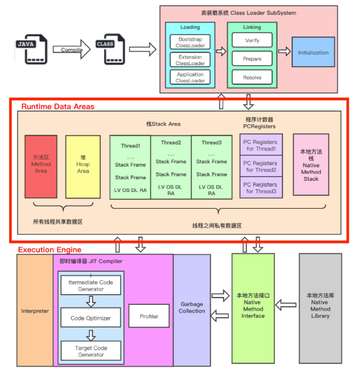

## 程序计数器

### 为什么需要它？

1. 为了保证程序（在操作系统中理解为进程）能够连续地执行下去，CPU必须具有某些手段来确定下一条指令的地址。而程序计数器正是起到这种作用，所以通常又称为指令计数器。
2. 在程序开始执行前，必须将它的起始地址，即程序的一条指令所在的内存单元地址送入PC，因此程序计数器（PC）的内容即是从内存提取的第一条指令的地址。当执行指令时，CPU将自动修改PC的内容，即每执行一条指令PC增加一个量，这个量等于指令所含的字节数，以便使其保持的总是将要执行的下一条指令的地址。
3. 由于大多数指令都是按顺序来执行的，所以修改的过程通常只是简单的对PC加1。
4. 当程序转移时，转移指令执行的最終结果就是要改交PC的值，此PC值就是转去的地址，以此实现转移。有些机器中也称PC为指令指针IP (Instruction Pointer)。

结论：它是程序控制流的指示器，分支、循坏、跳转、异常处理、线程恢复等基础功能都需要依赖这个计数器来完成。PC寄存器用来存储指向下一条指令的地址，也即将要执行的指令代码。执行引擎的宇节码解释器工作时就是通过改变这个计数器的值来选取下一条需要执行的字节码指令。

如果正在执行的是本地方法，这个计数器值则应为空。（undefined），因为native本地方法大多是通过C实现，并且编译成需要执行的字节码指令，所有在计数器中当然为空（undefined）。

### 基本特征

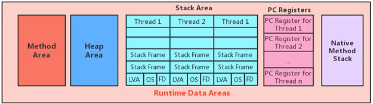

- 它是一块很小的内存，几乎可以忽略不计，也是运行速度最快的存储区域。不会随着程序的运行需要更大的空间。
- 在JVM规范中，每个线程都有它自己的程序计数器，是线程私有的，生命周期与线程的生命周期报纸一致。
- 它是唯一一个在Java虚拟机规范中没有规定任何 OutOfMemoryError情况的区域。没有垃圾回收。

## 虚拟机栈

### 内存中栈与堆

栈是运行时的单位，而堆是存储的单位，栈解决程序如何执行，如何处理数据。堆解决的是数据存储问题，即数据怎么放，放在哪里。

### 基本内容

Java虚拟机栈，早起也叫Java栈，每个线程创建时都会创建一个虚拟机栈，内部保存一个个栈帧，对应着一次次的Java方法调用，生命周期与线程的一致。

主管Java程序的运行，保存方法的局部变量（8种基本数据类型，对象的引用地址），部分结果，并参与方法的调用和返回。

### 特性

- 快速有效的存储方式，访问速度仅次于程序计数器
- JVM直接对JAVA栈的操作只有两个
  - 每个方法执行，伴随着进栈（入栈，压栈）
  - 执行结束的出栈
- 栈不存在垃圾回收，但是存在 OOM
  - Java栈大小是动态或者固定不变的。如果是动态扩展，无法申请到足够内存OOM，如果是固定，线程请求的栈容量超过固定值，则StackOverflowError
  - 局部数据过大，当函数内部的数组过大时，有可能导致堆栈溢出
  - 递归调用层次太多。递归函数在运行时会执行压栈操作，当压栈的次数太多时，也会导致堆栈溢出
- 使用-Xss，设置线程的最大栈空间
- JDK5.0之前，默认是256K。JDK5.0之后，默认是1024K

### 栈的单位：栈帧（Stack Frame）

#### 内部结构：

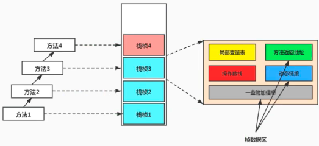

  

### 局部变量表

- 局部变量表也被称之为局部变量数组或本地变量表
- 定义为一个数字数组，主要用于存储方法参数和定义在方法体内的局部变量，这此数据类型包括各类基本数据类型(8种）、对象引用(reference）（数组、对象、接口），以及returnAddress类型。
- 局部交量表所两的容量大小是在编译器确定下来的。并保存在方法的code属性的maximum local variables数据项中。在方法运行期间是不会改交局部变量表的大小的。
- 方法嵌套调用的次数由栈的大小决定。一般来说，栈越大，方法嵌套调用次数越多。对一个函数而言，它的参数和局部变量越多，使得局部变量表膨胀，它的栈帧就越大，以满足方法调用所需传递的信息增大的需求。进而函数调用就会占用更多的栈空间，导致其嵌套调用次数就会滅少。
- 局部变量表中的变量只在当前方法调用中有效。在方法执行时，虚拟机通过使用局部变量表完成参数值到参数变量列表的传递过程。当方法调用结束后，随着方法栈帧的销毁，局部变量表也会随之销毁。

#### 关于slot的理解

- JVM虚拟机会为局部变量表中的每个Slot都分配一个访问索引，通过这个索引即可成功访问到局部变量表中指定的局部变量值（long和double占两个）
- 如果当前帧是由构造方法或者实例方法创建的，那么该对象引用this，会存放在index为0的slot处，其余的参数表顺序继续排列
- 栈帧中的局部变量表中的槽位是可以重复的，如果一个局部变量过了其作用域，那么其作用域之后申明的新的局部变量就有可能会复用过期局部变量的槽位，从而达到节省资源的目的

#### 静态变量与局部变量的对比

- 参数分配完毕之后，再根据方法体内定义的变量的顺序和作用域分配
- 类变量有两次初始化的机会，第一次是在“准备阶段”，执行系统初始化，对类变量设置零值，另一次则是在“初始化”阶段，赋予程序员在代码中定义的初始值。
- 和类变量不同的是，局部变量表不存在系统初始化的过程，这意味着一旦定义了局部变量表则必须人为的初始化，否则无法使用。

#### 与GC Roots的关系

局部变量表中的变量也是重要的垃圾回收跟节点，只要被局部变量表中直接或间接引用的对象都不会回收。

### 操作数栈

#### 描述

- 我们说Java虛拟机的解释引擎是基于栈的执行引擎，其中的栈指的就是操作数栈

- 每一个独立的栈帧中除了包含局部变量表以外，还包含一个后进先出（Last-In-First-out）的操作数栈，也可以称之为表达式栈 (ExpressionStack)

- 操作数栈就是JVM执行引擎的一个工作区，当一个方法刚开始执行的时候，一个新的栈帧也会随之被创建出来，这个方法的操作数栈是空的。

- 每一个操作数栈都会拥有一个明确的栈深度用于存储数值，其所需的最大深度在编译期就定义好了，保存在方法的code凤性中，为max_stack的值。

- 栈中的任何一个元素都是可以任意的Java数据类型
  - 32bit的类型占用一个栈单位深度
  - 64bit的类型占用两个栈单位深度（long和short都是64位（8个字节））
  
  > 1byte = 1字节 = 8bit（位）
  
- 操作数栈，在方法执行过程中，根据字节码指令，并非采用访问索引的方式来进行数据访问的，而是只能通过标准的入栈（push）和出栈（pop）操作，往栈中写入数据或提取数据来完成一次数据访间。
  - 某些字节码指令将值压入操作数栈，其余的字节码指令将操作数取出栈。使用它们后再把结果压入栈。比如：执行复制、交换、求和等操作
  
- 如果被调用的方法带有返回值的话，其返回值将会被压入当前栈帧的操作数栈中，并更新程序计数器中下一条需要执行的字节码指令

- 主要用于保存计算过程的中间结果，同时作为计算过程中变量临时的存储空间

#### 栈顶缓存技术

由于操作数是存储在内存中，频繁的进行内存读写操作影响执行速度，将栈顶元素全部缓存到物理CPU的寄存器中，依此降低对内存的读写次数，提升执行引擎的执行效率。

### 动态链接

#### 指向常量池的方法引用

- 每一个栈帧内部都包含一个指向运行时常量池中，该帧所属方法的引用
- 目的是为了支持当前方法的代码能够实现动态链接，比如invokedynamic指令
- 在java源文件被编译成字节码文件中时，所有的变量、方法引用都作为符号引用，保存在class文件的常量池中。
- 描述一个方法调用了另外的其他方法时，就是通过常量池中指向方法的符号引用来表示的。
- 动态链接的作用就是为了将这些符号引用转换为调用方法的直接引用

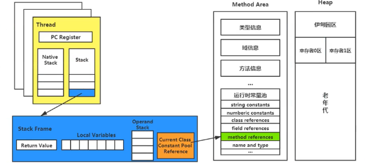

#### 常量池、运行时常量池

- 常量池在字节码文件中
- 运行时常量池，在运行时的方法区中

### 方法返回地址

存放调用该方法的pc寄存器的值

方法的结束有两个：

1. 正常执行完成
2. 出现未处理异常，非正常退出

无论哪种方式退出，方法退出后，都会返回该方法被调用的位置。方法正常退出时，调用者的PC计数器的值作为返回地址，即调用该方法的指令的下一条指令的地址。异常退出的，返回地址是通过异常表来确定，栈帧中一般不会保存这部分信息。

正常完成出口和异常完成出口的区别在于：通过异常完成出口退出的不会给他的上层调用者产生任何的返回值

执行引擎遇到任意一个方法返回的字节码指令（return）,会有返回值传递给上层的方法调用者，简称正常完成出口，返回指令包括：

- ireturn：返回值是boolean，byte，char，short，和int类型时使用
- lreturn
- dreturn
- areturn：引用类型
- 还有一个return只供声明为 void的方法、实例初始化方法、类和接口的初始化方法使用

本质上，方法的退出就是当前栈帧出栈的过程。此时需要恢复上层方法的局部变量表，操作数栈，将返回值压入调用者栈帧的操作数栈，设置PC寄存器值等，让调用者方法继续执行下去。

### 一些附加信息

允许携带与Java虚拟机实现相关的一些附加信息，例如对程序调试提供支持的信息。不确定有，可选情况。

### 面试问题

#### 问题一：栈溢出的情况？

栈溢出：stackoverflowError;
举个简单的例子：在main方法中调用main方法，就会不断压栈执行，直到栈溢出；
栈的大小可以是固定定大小的，也可以是动态变化（动态扩展）的。

- 如果是固定的，可以通过-xss设置栈的大小
- 如果是动态变化的，当栈大小到达了整个内存空问不足了，就是拋出OutofMemory异常(java. lang .outofMemoryError)

#### 问题二：调整栈大小，就能保证不出现溢出吗？

不能。因为调整栈大小，只会減少出现溢出的可能，栈大小不是可以无限扩大的，所以不能傺证不出現溢出

#### 问题三：分配的栈内存越大越好吗？

不是。因为增加栈大小，会造成每个线程的栈都变的很大，使得一定的栈空间下，能创建的线程数量会变小

#### 问题四：垃圾回收是否会涉及到虚拟机栈？

不会。垃圾回收只会沙及到方法区和推中，方法区和推堆也会存在溢出的可能；
程序计数器，只记录运行下一行的地址，不存在溢出和垃圾回收；
虚拟机栈和本地方法栈，都是只涉及压栈和出栈，可能存在栈溢出，不存在垃圾回收。

#### 问题五：方法中定义的局部变量是否线程安全？

栈帧是线程安全的，一个线程就只有一个栈帧，但是栈帧里面定义的局部变量就不一定了，如果是引用变量，指向堆里面的一个对象，如果这个对象被其它方法引用，就会不安全。

## 本地方法接口与本地方法栈

### 本地方法接口

简单讲，就是一个Java调用非Java代码的接口。

为什么使用native method？与Java环境外交互（例如与操作系统底层或硬件交换信息时的情况、例如启动一个线程）

### 本地方法栈

- Java虚拟机栈管理Java方法的调用，而本地方法栈用于管理本地方法的调用。本地方法栈，也是线程私有的。
- 允许被实现成固定或者是可动态扩展的内存大小。内存溢出情况和Java虚拟机栈相同
- 使用C语言实现
- 具体做法是Native Method Stack 中登记native方法，在Execution Engine执行时加载到本地方法库
- 当某个线程调用一个本地方法时，就会进入一个全新，不受虚拟机限制的世界，它和虚拟机拥有同样的权限。
- 并不是所有的JVM都支持本地方法，因为Java虚拟机规范并没有明确要求本地方法栈的使用语言，具体实现方式，数据结构等
- Hotspot JVM中，直接将本地方法栈和虚拟机栈合二为一

## 堆

### 核心概述

- 一个JVM实例只存在一个堆内存，堆也是Java内存管理的核心区域
- Java堆区在JVM启动的时候即被创建，其空间大小也就确认了。堆内存的大小是可调节的
- Java虚拟机规范规定，堆可以处于物理上不连续的内存空间中，但在逻辑上它应该被视为连续的。
- 所有的线程共享Java堆，在这里还可以划分线程私有的缓冲区（TLAB）
- “几乎”所有的对象实例都在这里分配内存
- 数组和对象可能永远不会存储在栈上，因为栈帧中保存引用，引用指向对象或者数组在堆中的位置
- 方法结束后，堆中的对象不会马上被移除，仅仅在垃圾收集的时候才会被移除。
- 堆是GC执行垃圾回收的重点区域

### 堆的内部结构

##### Java7及以前

- 新生区
  - Eden区
  - Survivor区
    - form
    - to（谁空谁是to）
- 养老区
- 永久区

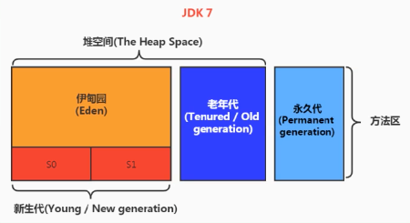

##### Java8及以后

- 新生区
  - Eden区
  - Survivor区
    - form
    - to（谁空谁是to）
- 养老区
- 元空间

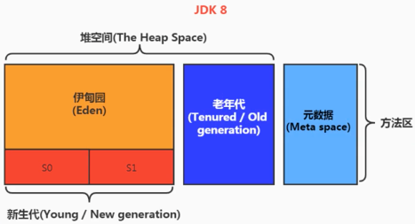

##### 约定

- 新生区 == 新生代 == 年轻代
- 养老区 == 老年区 == 老年代
- 永久区 == 永久代（元空间）

### 如何设置堆内存大小

- -Xms ：表示堆空间的起始内存。
- -Xmx：表示堆空间的最大内存（超过最大内存将抛出OOM）

通常将-Xms和-Xmx两个参数配置相同的值，其目的是为了能够在java垃圾会后清理完堆区后，不需要重新分隔计算堆区的大小，从而提高性能

默认情况下：

- 初始内存大小：物理电脑内存大小/64
- 最大内存大小：物理电脑内存/4

### 如何设置新生代和老年代比例

- 配置新生代与老年代在堆结构的占比
  - 默认-XX:NewRation=2，表示新生代占1，老年代占2。新生代占整个堆的1/3
- 可以使用选项“-Xmn”设置新生代最大内存大小（这个参数一般使用默认就可以了）

### 如何设置 Eden、幸存者区比例

- 在HotSpot中，Eden空间和另外两个Survivor空间的缺省所占的比例是8:1:1
- 开发人员可以通过配置选项“-XX：SurvivorRation”调整比例

### 对象分配过程

1. new的对象先放在Eden区，此区有大小限制

2. 当伊甸园的空间填满时，程序又需要创建对象，JVM的坟圾回收器将对伊甸园区进行坟圾回收(Minor GC/YGC)，将伊向园区中的不再被其他对系所引用的对象进行销毁。再加载新的对象放到伊甸园区

3. 然后将伊甸园中的剩佘对象移动到幸存者日区

4. 如果再次触发垃圾回收，此时上次幸存下来的放到幸存者0区的，如果没有回收，就会放到幸存者1区

5. 如果再次经历垃圾回收，此时会重新放回幸存者0区，接者再去幸存者1区

6. 可以设置一个次数，默认是15（四个bit）次，超过15次，则会将幸存者区幸存下来的转去老年区-XX:MaxTenuringThreshold=N进行设置

6. 在养老区，相对悠闲。当养老区内存不足时，再次触发GC：Major GC，进行养老区的内存清理

6. 若养老区执行了Major GC之后发现依然无法进行对象的保存，就会产生OOM异常 java.lang. OutOfMemoryError: Java heap space

   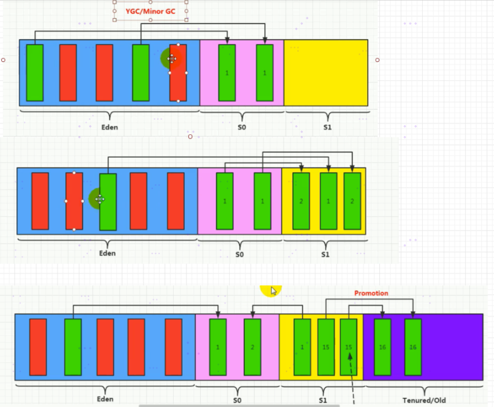

总结

- 针对幸存者s0，s1区的总结：复制之后有交换，谁空谁是to
- 频繁在新生区收集，很少在养老区收集，几乎不在永久区/元空间搜集

图解：

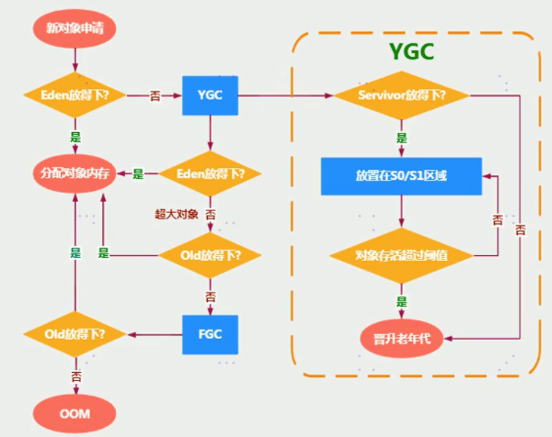

触发YGC，幸存者区就会进行回收，不会主动进行回收；超大对象eden放不下，就要看Old区大小是否可以放下；old区也放不下，需要FullGC（MajorGC），这两GC概念还是有区别的。下面详解。

### 对象分配策略

如果对象再Eden出生并经过第一次MinorGC后仍然存活，并且能被Survivor区容纳，则被移动到Survivor空间中，并将对象年龄设置为1，对象再Survivor区每熬过一次MinorGC，年龄就+1，当年龄增加到一定程度（默认为15，不同Jvm，GC都所有不同）时，就会被晋升到老年代中

特殊情况：

- 优先分配到Eden
- 大对象直接分配到老年代（尽量避免程序中出现过多的大对象）
- 长期存活的对象分配到老年代
- 动态对象年龄分配（如果Survivor区中相同年龄的所有对象大小的总和大于Survivor空间的一半，年龄大于或等于该年龄的对象可以直接进入老年代，无需等到MaxTenuringThreshold中要求的年龄）

### 解释 MinorGC、MajorGC、FullGC

针对HotSpotVM的实现，GC按照内存回收区域分为：

- 部分收集
  - 新生代收集（MinorGC （YoungGC））
  - 老年代收集（MajorGC/oldGC）：目前只有CMS GC会单独收集老年代的行为，很多时候MajorGC与FullGC混淆使用，具体分辨是老年代回收还是整堆回收
  - 混合收集：收集整个新生代以及部分老年代的垃圾收集，目前只有G1 GC会有这种行为
- 整堆收集（FullGC）：收集整个Java堆和方法区的垃圾收集

#### MinorGC的触发条件：

- 当年轻代空间不足时，就会触发MinorGC，这里的年轻代指的是Eden代满，Survivor满不会触发GC。每次MinorGC会清理年轻代的内存
- 因为Java对象大多朝生夕灭，所以MinorGC非常频繁（Minor翻译，较小的，未成年的）
- MinorGC会引发STW（后面详解）

#### 老年代GC（MajorGC/FullGC）触发条件：

- 指发生在老年代的GC，对象从老年代消失，我们说“MajorGC”“FullGC”发生了
- 出现了MajorGC，经常会伴随至少一次MinorGC（非绝对，在Parallel Scavenge收集器的收集策略里就直接进行MajorGC的策略选择过程，也就是老年代空间不足，会先尝试触发MinorGC，如果之后空间还不足，则触发MajorGC）
- MajorGC的速度比MinorGC慢10倍以上，STW的时间更长
- 如果MajorGC后，内存还不足，就报OOM了

#### FullGC的触发机制：

- 调用System.gc()时，系统建议执行FullGC，但是不必然执行
- 老年代空间不足
- 方法区空间不足
- 通过MinorGC后进入老年代的平均大小大于老年代的可用内存
- 由Eden区，Survivor 0区向Survivor 1区复制时，对象的大小大于ToSpace可用内存，则把改对象转存到老年代，且老年代的可用内存小于该对象的大小
- FullGC是开发或调优中尽量要避免的，这样暂停时间会短一些（*）

### 堆空间分代思想

其实不分代也可以，分代的理由是优化GC性能。

- 存储在JVM中的Java对象可以被划分为两类：

  - 一类是生命周期较短的瞬时对象，这类对象的创建和消亡都非常迅速
  - 另外一类对象的生命周期却非常长，在某些极端的情况下还能够与JVM的生命周期保持一致

  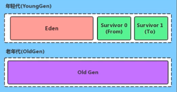

### 为对象分配内存 TLAB

- 堆区是线程共享区域，任何线程都可以访问到堆区的共享数据
- 由于对象实例的创建在JVM中非常频繁，因此在并发环境下从堆区中划分内存空间是线程不安全的。
- 为避免多个线程操作同一地址，需要使用加锁等机制，进而影响分配速度

TLAB（Thread Local Allocation Buffer）：

- 从内存模型而不是垃圾收集的角度，对Eden区域进行划分，JVM为每个线程分配了一个私有缓存区域，包含在Eden空间中
- 多线程同时分配内存时，使用TLAB可以避免一系列的非线程安全问题，同时还能够提升内存分配的吞吐量，因此我们将这种内存分配方式成为快速分配策略

openjdk衍生出来的JVM都提供了TLAB的设计

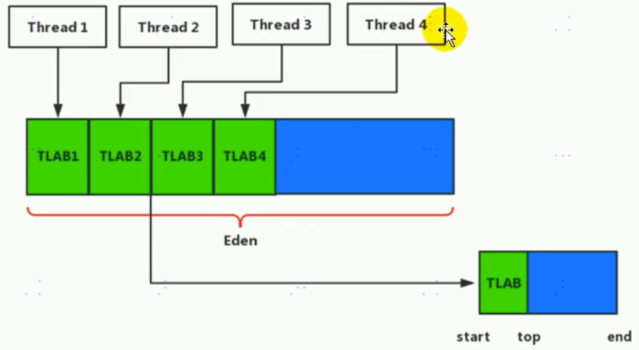

补充：

- 尽管不是所有的对象实例都能够在TLAB中成功分配内存，但是JVM确实是将TLAB作为内存分配的首选
- 开发人员通过-XX:UseTLAB设置是否开启TLAB空间
- 默认情况下，TLAB空间内存非常小，仅占有整个Eden空间的1%，通过-XX:TLABWasteTargetPercent设置TLAB空间所占用Eden空间的百分比大小
- 一旦对象在TLAB空间分配内存失败，JVM就会尝试通过使用加锁机制确保数据操作的原子性，从而直接在Eden空间中分配内存

### 什么叫空间分配担保策略

在发生Minor GC之前，虚拟机会检查老年代最大可用的连续空间是否大于新生代所有对象的总空间

- 如果大于，则此次Minor GC是安全的
- 如果小于，则虚拟机会查看-xx:HandlepromotionFailure设置值是否允许担保失败
- 如果HandlePromotionFailure=true，那么会继续检查老年代最大可用连续空间是否大于历次晋升到老年代的对象的平均大小，如果大于，则尝试进行一次Minor GC。但这次Minor GC依然是有风险的：如果小于或者HandlePromotionFailure=false，则改为讲行一次Full GC。

在JDK 6 Update 24之后，HandlePromotionFailure参数不会再影响到虚拟机的空间分配担保策略，观察OpenJDK中的源码变化，虽然源码中还定义了HandlePromotionFailure参数，但是在代码中己经不会再使用它。

JDK 6 Update 24之后的规则变为只要老年代的连续空间大于新生代对象总大小或者历次普升的平均大小就会进行Minor GC，否则将进行FullGC。

### 堆是对象分配的唯一选择吗？

#### 说明

随着JIT编译器的发展与逃逸分析技术逐渐成熟，栈上分配、标量替换优化技术，将会导致一些微秒变化，所有对象分配到堆上渐渐变得不那么绝对了。有一种特殊情况，如果经过逃逸分析后发现，一个对象并没有逃逸出方法的话，那么就可能被优化成栈上分配，这样无需堆上分配，也不需要垃圾回收了，也是最常见的堆外存储技术。

TaoBaoVM，其中创新的GCIH（GC invisible heap）技术实现了off-heap,实现了将生命周期较长的Java对象从heap中移动heap外，并且GC不能管理GCIH内部的Java对象，以此达到降低GC的回收频率和提升GC的回收效率的目的。

#### 逃逸分析概述

逃逸分析的基本行为就是分析对象动态作用域：

- 当一个对象在方法中定义后，对象只在方法内部使用，则认为没有发生逃逸
- 当一个对象在方法中被定义后，它被外部方法引用，则认为发生逃逸，例如作为调用参数传递到其他地方中

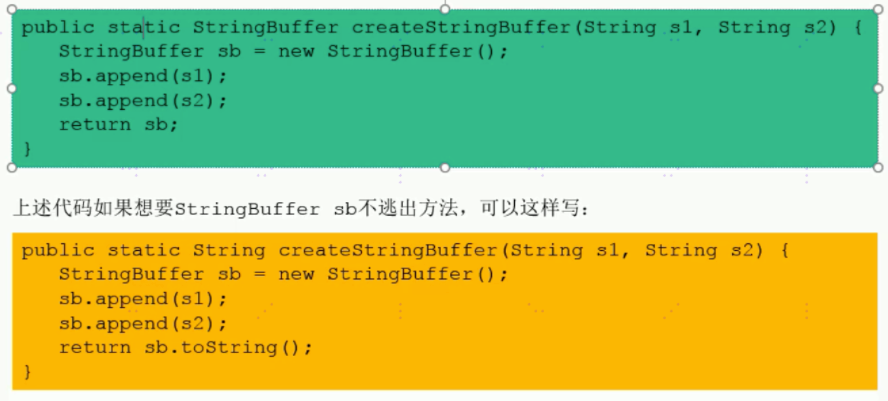

栈上分配：将堆分配转为栈分配，如果一个对象在子程序中被分配，要使指向该对象的指针永远不会逃逸，对象可能是栈分配的候选，而不是堆分配

同步策略：如果一个对象被发现只能从一个线程被访问到，对于这个对象的操作可以不考虑同步。JIT编译器可以借助逃逸分析来判断同步块所使用的的锁对象，是否只能够被一个线程访问，而没有被发布到其他线程。如果没有，那么JIT编译器在编译这个同步块的时候，就会取消对这部分代码的同步。这样就大大提高并发性和性能，这个取消同步的过程就叫同步省略，也叫锁消除。

#### 分离对象或标量替换

有的对象可能不需要作为一个连续的内存结构存在，也可以被访问到，那么对象的部分（或全部）可以不存储在内存。而是存储在CPU寄存器中，标量是指一个无法再分解的更小的数据的数据。Java中原始数据类型就是标量。

可以分解的数据叫聚合量，Java中的对象就是聚合量，因为他可以分解成其他聚合量和标量

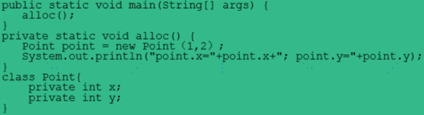

以上代码经过标量替换后，就会变成：

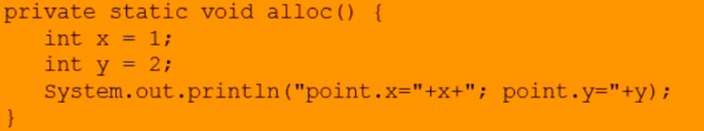

标量替换参数：-XX:EliminateAllocations，默认打开

## 方法区

### 栈、堆、方法区的关系

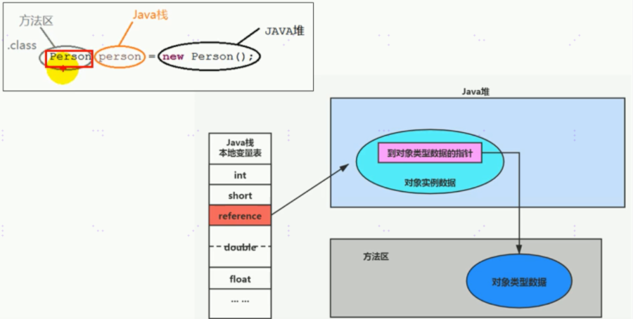

### 方法区在哪里

### 方法区的理解

- Java虚拟机规范中明确说明：尽管所有的方法区在逻辑上是属于堆的一部分，但是一些简单的实现，可能不会选择去进行垃圾收集或者进行压缩。对于HotSpot而言，方法区还有一个别名叫Non-Heap（非堆），目的就是要和堆分开
- 所以方法区看作是一块独立于Java堆的内存空间
- 方法区和Java堆一样，是各个线程共享的内存区域
- 方法区在JVM启动的时候被创建，并且它的实际的物理内存空间和Java堆区一样，都是可以不连续的
- 方法区的大小和堆空间一样，可以选择固定大小或者可扩展
- 方法区的大小决定了系统可以保存多少个类，如果定义太多类，加载大量的第三方的Jar包，Tomcat部署过多工程，导致方法区溢出，虚拟机同样会抛出内存溢出OOM：PermGen space或者Metaspace 
- 关闭JVM就会释放这个区域的内存

### HotSpot中方法区的演进

在jdk7及以前，习惯上把方法区，称为永久代，jdk8开始，使用元空间取代了永久代。本质上，方法区和永久代并不等价，仅是对HostSpot而言的。Java虚拟机规范，对如何实现方法区，不做统一要求，例如BEA JRockit/IBM J9中不存在永久代的概念，现在来看，当年使用永久代，不是好的点子，导致Java程序更容易OOM。

### 方法区常用参数有哪些？

方法区大小不是固定的，jvm可以根据应用动态调整

#### JDK7以前

- 通过-XX:PermSize 来设置永久代初始分配空间，默认值是20.75M
- -XX:MaxPermSize来设定永久代最大可分配空间。（32位机器默认是64M；64位机器默认是82M）
- 如果JVM加载的类信息容量超过了这个值，会报OOM:PermGenspace

#### JDK8以后

- -XX:MetaspaceSize，-XX:MaxMetaspaceSize
- 默认值依赖平台：windows下初始为21M，最大是-1即没有限制
- 如果不指定大小，虚拟机耗用所有可用系统内存，元数据区发生溢出，一样OOM:Metaspace
- 对于一个64位服务端JVM来说，默认的初始元数据区空间为21M，这就是初始的高水位线。一旦触及这个水位线，FULLGC会触发并卸载没有用的类，然后高水位线会被重置。新的高水位线的值取决于GC后释放了多少元空间。如果释放空间不足，在不超过最大设定值时，适当提高该值。如果释放空间过多，则适当降低该值。
- 如果初始化的高水位线设置过低，上述高水位线调整情况会发生很多次，fullGC多次调用。为了避免频繁FullGC，建议将-XX:MetaspaceSize设置为一个相对较高的值

### 方法区都存了什么？

它用于存储已被虚拟机加载的类型信息，常量，静态变量，即时编译器编译后的代码缓存

#### 类型信息

- 对于每个加载的类型（类Class，接口Interface，枚举Enum，注解annotation）
- JVM必须在方法区中存储以下类型信息
- 这个类的完整有效名称（全名=包名.类名）
- 这个类型直接父类的完整有效名，对于interface或Object没有父类
- 这个类型的修饰符，public,abstract，final
- 这个类型直接接口的一个有序列表

#### 域信息

- JVM必须在方法区中保存类型的所有域的相关信息，以及域的声明顺序
- 域的相关信息包括：域名称、域类型、域修饰符（public,private,protected,static,final,volatile,transient的某个子集）

#### 方法信息

- JVM必须保存所有方法的以下信息，同域信息一样包括声明顺序
- 方法名称
- 方法的返回类型（或void）
- 方法参数的数量和类型（按顺序）
- 方法的修饰符（public，private，protected，static，final，synchronized，native，abstract的一个子集）
- 方法的字节码bytecodes,操作数栈，局部变量表及大小
- 异常表（abstract和native方法除外），每个异常处理的开始位置，结束位置，代码处理在程序计数器中的偏移地址，被捕获的异常类的常量池索引。

#### Non-final 的类变量

- 静态变量和类关联在一起，随着类的加载而加载，他们成为类数据在逻辑上的一部分
- 类变量被类的所有实例共享，即使没有类实例时，你也可以访问他

#### 全局变量

static final，被声明为final的类变量的处理方法则不同，每个全局常量在编译的时候就会被分配了。

#### 常量池

- 方法区，内部包含了运行时常量池

- 字节码文件，内部包含了常量池（运行时将常量池加载到方法区，就是运行时常量池）

- 要弄清楚方法区，需要理解清楚ClassFile，因为加载类的信息都在方法区

- 一个有效的字节码文件中除了包含的类的版本信息、字段、方法以及接口等描述信息外，还包含一项信息那就是常量池表（Constant Pool Table），包括各种字面量和对类型、域和方法的符号引用

- 为什么要用常量池？

  一个java源文件中的类、接口、编译后产生一个字节码文件。而Java中的字节码需要数据支持，通常这种数据会很大，以至于不能直接存到字节码里。换一种方式，可以存到常量池，这个字节码包含了指向常量池的引用。在动态链接会用到运行时常量池。

- 常量池有什么？

  - 数量值
  - 字符串值
  - 类引用
  - 字段引用
  - 方法引用

- 常量池，可以看做是一张表，虚拟机指令根据这张常量表找到要执行的类名、方法名、参数类型、字面量等类型

#### 运行时常量池

- 运行时常量池是方法区的一部分
- 常量池表是class文件的一部分，用于存放编译期生成的各种字面量和符号引用，这部分内容将在类加载后存放到方法区的运行时常量池中。
- 在加载类和接口到虚拟机后，就会创建对应的运行时常量池
- JVM为每个已加载的类型都维护一个常量池，池中的数据像数组项一样，通过索引访问
- 运行时常量池包含多种不同的常量，包括编译期就已经明确的数值字面量，也包括到运行期解析后，才能够获得的方法或者字段引用。此时不再是常量池中的符号地址了，这里转换为真实地址。
- 运行时常量池，相对于class文件常量池的另一个重要特征是：具备动态性（例如：String.intern可以将字符串也放入运行时常量池）
- 当创建类或接口的运行时常量池，如果构造运行时常量池所需的内存空间超过了方法区所能提供的最大值。则JVM会抛出OOM异常
- 这里注意，常量池数量为N，则索引为1到N-1

### 方法区是否存在GC？回收什么

有些人认为方法区是没有垃圾收集行为的，其实不然。Java虚拟机规范对方法区的约束非常宽松，提到过可以不要求虚拟机在方法区实现垃圾收集。事实上，也确实有未实现或未能完整实现方法区类型卸载的收集器，如JDK11 ZGc。

#### 方法区的垃圾收集主要回收两部分内容

##### 常量池中废弃的常量

- HotSpot对常量池的回收策略很明确，只要常量池中的常量没有被任何地方引用，就可以被回收
- 回收废弃常量与回收Java堆中对象非常类似

##### 不再使用的类型

- 需要同时满足三个条件
  - 该类所有的实例已经被回收（java堆中不存在该类及其任何派生子类的实例）
  - 加载该类的类加载器已经被回收
  - 该类对应的java.lang.Class对象没有在任何地方被引用，无法在任何地方通过反射访问改类的方法
- 满足以上三个条件后，并不是和对象一样立即被回收，仅仅是允许。
- HotSpot虚拟机提供了-Xnoclassgc参数进行控制

在大量使用反射，动态代理，CGLib等字节码框架，动态生成JSP以及OSGI这类频繁自定义类加载器的场景中，通常都需要Java虚拟机具备类型卸载的能力，以保证不会对方法区造成过大的内存压力。

方法区内常量池中主要存放的两大类常量：

- 字面量（比较接近Java语言层次的常量概念，如文本字符串，被声明为final的常量值等）
- 符号引用（属于编译原理方面的概念）
  - 类和接口的全限定名
  - 字段的方法和描述符
  - 方法的名称和描述符

讲解元空间很好的文章 https://www.javadoop.com/post/metaspace

### 内存结构小结

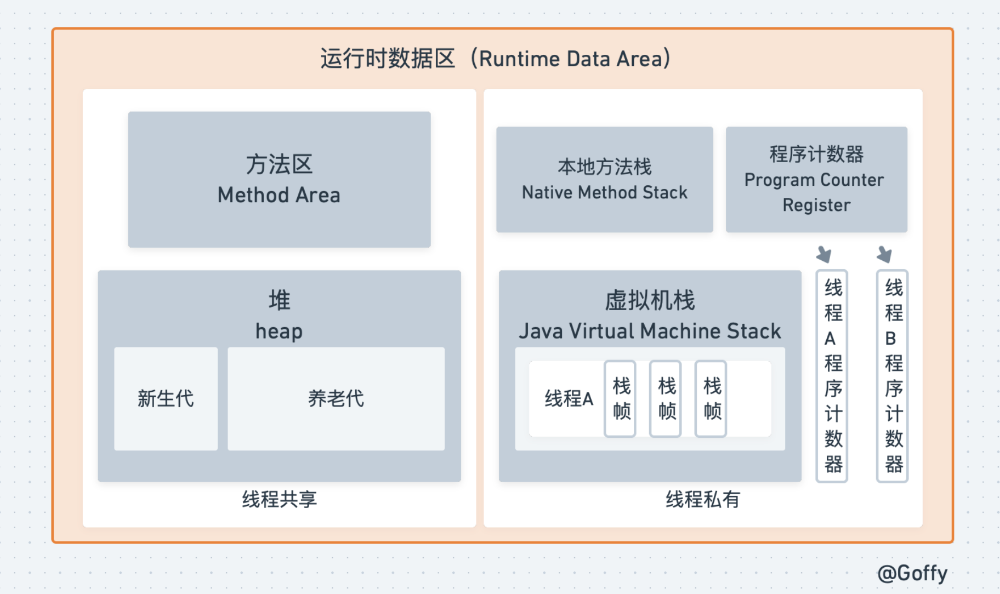

## 直接内存

### 概述

不是虚拟机运行时数据区的一部分，也不是Java虚拟机规范中定义的内存区域，直接内存是在java堆外的，直接向系统申请的内存区间，来源于NIO，通过存在堆中的DirectByteBuffer操作Native内存。

通常，访问直接内存的速度会优于Java堆，即读写性能高：

- 因此出于性能考虑，读写频繁的场合可能会考虑使用直接内存
- Java的NIO库允许Java程序使用直接内存，用于数据缓冲区

也可能导致OOM异常：直接内存在堆外，所以大小不受限于-Xmx指定的最大堆大小，但是系统内存是有限的，Java堆和直接内存的总和依然受限于操作系统能给出的最大内存。

缺点：分配回收成本较高，不受JVM内存回收管理

直接内存大小可以通过MaxDirectMemorySize设置，如果不指定，默认与堆的最大值-Xmx参数值一致

## StringTable

### String 的不可变形

### String 的内存分配

### String的基本操作

### 字符串拼接操作

### new String() 问题

### Intern() 方法

### G1 的 String 去重操作

## 面试题

