## 生产环境中的问题

生产环境发生了内存泄漏该如何处理？

生产环境应该给服务器分配多少内存合适？

如何对垃圾回收器的性能进行调优？

生产环境CPU负载飙高如何处理？

生产环境应该给应用分配多少线程合适？

不加log，如何确定请求是否执行了某一行代码？

不加log，如何实时查看某个方法的入参与返回值？

## 调优基本问题

为什么要调优：事前准备、事中解决、事后复盘

### 调优的大方方向

- 合理的编写代码
- 充分合理的使用硬件资源
- 合理的进行JMV调优

### 不同阶段的考虑

- 上线前
- 项目运行阶段
- 线上出现OOM

### 两句话

- 调优：从业务场景开始，没有业务场景的调优都是耍流氓
- 无监控、不调优

## 调优监控的依据

- 运行日志
- 异常堆栈
- GC日志
- 线程快照
- 堆转储快照

## 性能优化的步骤

1. 熟悉业务场景
2. 发现问题（性能监控）
   1. GC频繁
   2. CPU LOAD过高
   3. OOM
   4. 内存泄漏
   5. 死锁
   6. 程序响应时间较长
3. 排查问题（性能分析）
   - 打印GC日志、通过GCviewer或者 [gceasy](gceasy.io) 来分析日志信息
   - 灵活运行命令行工具（jps、jstack、jmap、jinfo）等
   - dump 出堆文件，使用内存分析工具分析文件
   - 使用阿里 Arthas，或jconsole，jVisual VM来实时分析
   - jstack查看堆栈信息
4. 解决问题（性能调优）
   - 适当增加内存、根据业务场景选择垃圾回收器
   - 优化代码、控制内存使用
   - 增加机器、分散节点压力
   - 合理设置线程池线程数量
   - 使用中间件提高程序效率，比如缓存、消息队列等
   - 其他。。。

## 性能评价/测试指标

- 吞吐量：运行用户代码的时间占总运行时间（运行用户代码时间+运行垃圾收集时间）的比例。

  总运行时间：程序的运行时间+内存回收的时间。

  吞吐量优先，意味着单位时间内，STW的时间最短。

- 暂停时间：执行垃圾收集时，程序的工作线程被暂停的时间。暂停时间优先，意味着单次STW的时间最短，但是频率可能增加。

- 内存占用：Java堆区所占的内存大小。

- 垃圾收集开销：吞吐量的补数，垃圾收集所占用的时间与总运行时间的比例。

- 收集频率：相对于应用程序的执行，收集操作发生的频率。

- 快速：一个对象从诞生到被回收经历的时间

不可能三角：简单来说抓住两点，吞吐量和暂停时间。

高吞吐量与低暂停时间，是一对互相竞争的。因为如果高吞吐量优先，必然需要降低内存回收的执行频率，导致GC需要更长的暂停时间来执行内存回收。如果选择低延迟优先为原则，也只能频繁的执行内存回收，引起程序吞吐量的下降。现在的标准，在最大吞吐量优先的情况下，降低停顿时间。

## OOM案例

### 堆溢出

#### 报错信息

java.lang.OutOfMemoryError: Java heap space

#### 案例模拟

```java
/**
     * 案例1 模拟线上环境 OOM
     * -XX:+PrintGCDetails 打印GC
     * -XX:MetaspaceSize=64m 设置元空间大小
     * -XX:+HeapDumpOnOutOfMemoryError 生成 dump 文件
     * -XX:HeapDumpPath=heap/heapdump.hprof 生成 dump 文件路径
     * -XX:+PrintGCDateStamps
     * -Xms200M 堆空间大小
     * -Xmx200M 堆空间大小
     * -Xloggc:log/gc.oomHeap.log gc日志
     * -XX:+PrintGCDetails -XX:MetaspaceSize=64m
     * -XX:+HeapDumpOnOutOfMemoryError -XX:HeapDumpPath=heap/heapdump.hprof
     * -XX:+PrintGCDateStamps -Xms200M -Xmx200M -Xloggc:log/gc.oomHeap.log
     */
    @RequestMapping("/add")
    public void addObjects(){
        System.err.println("add" + tUserService);
        ArrayList<TUser> objects = new ArrayList<>();
        while (true){
            objects.add(new TUser());
        }
    }
```

#### 运行结果

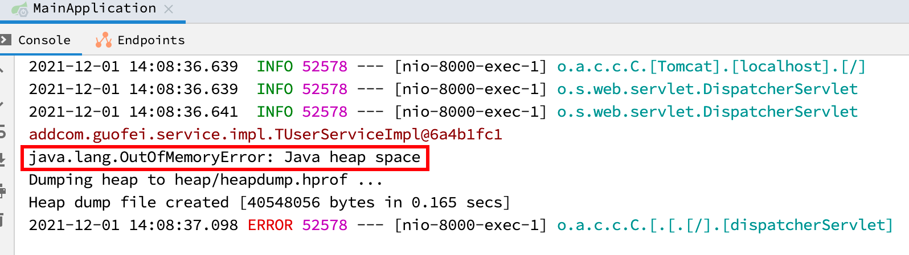

#### 原因及解决方案

原因：代码中可能存在大对象分配，可能存在内存泄漏，导致多次GC之后，还是无法找到一块足够大的内存容纳当前对象

解决方案：检查是否有大对象的分配，最有可能是大数组分配；通过jmap命令，把堆内存dump下来，使用MAT等工具分析一下，检查是否存在内存泄露；如果没有明显的内存泄漏，使用 -Xmx 加大堆内存。还有一点容易忽略，检查是否有大量自定义的 Finalizable 对象，也有可能时候框架内部提供的，考虑其存在的必要性。

#### dump文件分析

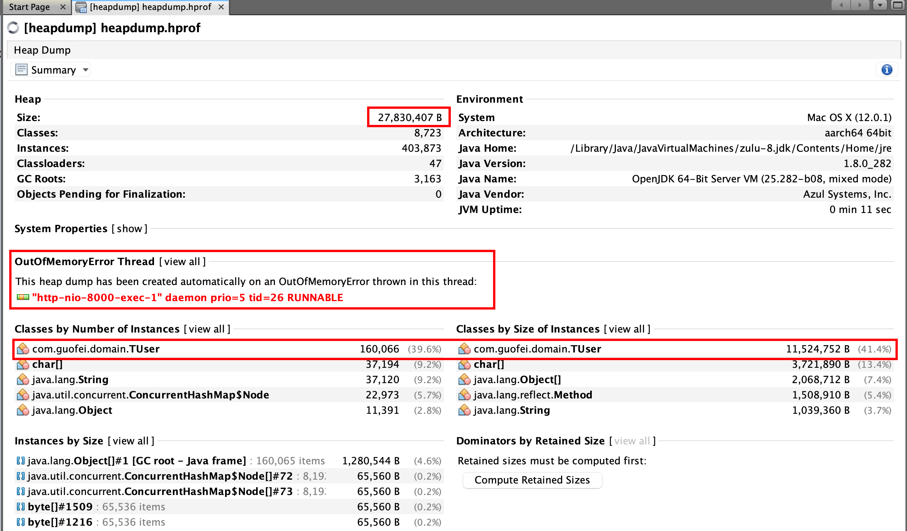

### 元空间溢出

#### 报错信息

java.lang.OutOfMemoryError: Metaspace

#### 案例模拟

```java
 /**
     * 案例2 元空间OOM
     * -XX:+PrintGCDetails -XX:MetaspaceSize=60m -XX:MaxMetaspaceSize=60m
     * -XSS512K -XX:+HeapDumpOnOutOfMemoryError
     * -XX:HeapDumpPath=heap/heapdumpMeta.hprof -XX:SurvivorRatio=8
     * -XX:+TraceClassLoading -XX:+TraceClassUnloading -XX:+PrintGCDateStamps
     * -Xms60M -Xmx60M -Xloggc:log/gc-oomMeta.log
     * -XX:MetaspaceSize=60m -XX:MaxMetaspaceSize=60m 设置元空间大小
     * -Xss512K 设置栈空间大小
     * -XX:SurvivorRatio=8 设置新生代（Eden比例）比例
     * -XX:+HeapDumpOnOutOfMemoryError -XX:HeapDumpPath=heap/heapdumpMeta.hprof 设置dump文件
     * -XX:+TraceClassLoading 加载的类的信息打印
     * -XX:+TraceClassUnloading 卸载的类的信息打印
     * -XX:+PrintGCDateStamps GC信息
     * -Xms60M -Xmx60M 设置堆空间大小
     * -Xloggc:log/gc-oomMeta.log log日志文件
     */
    @RequestMapping("/metaSpaceOom")
    public void metaSpaceOom(){
        ClassLoadingMXBean classLoadingMXBean = ManagementFactory.getClassLoadingMXBean();
        while (true){
            Enhancer enhancer = new Enhancer();
            enhancer.setSuperclass(TUser.class);
            enhancer.setUseCache(false);
            enhancer.setCallback((MethodInterceptor) (o, method, objects, methodProxy) -> {
                System.out.println("我是加强类，输出print之前的加强方法");
                return methodProxy.invokeSuper(o,objects);
            });
            TUser user = (TUser)enhancer.create();
            //people.print();
            System.out.println(user.getClass());
            System.out.println("totalClass:" + classLoadingMXBean.getTotalLoadedClassCount());
            System.out.println("activeClass:" + classLoadingMXBean.getLoadedClassCount());
            System.out.println("unloadedClass:" + classLoadingMXBean.getUnloadedClassCount());
        }
    }
```

#### 运行结果

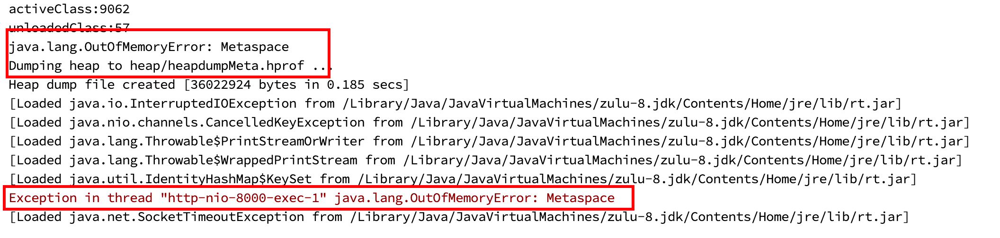

#### 原因及解决方案

原因：运行期间生成了大量的代理类，导致方法区被撑爆，无法卸载；应用长时间运行，没有重启；元空间内存设置过小

解决方案：

- 检查是否永久代或者元空间设置过小
- 检查代码中是否存在大量的反射操作
- dump之后检查是否存在大量反射生成的代理类

当前进程查看

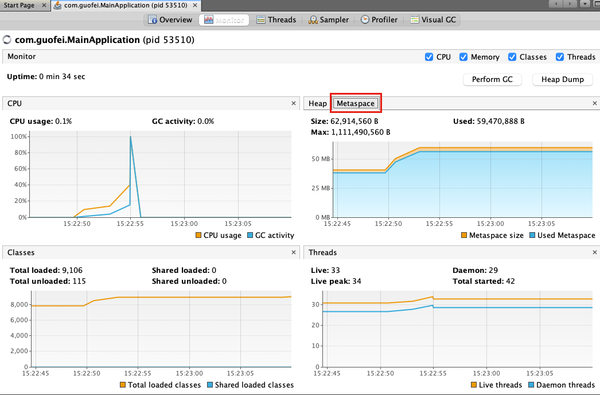

dump文件查看

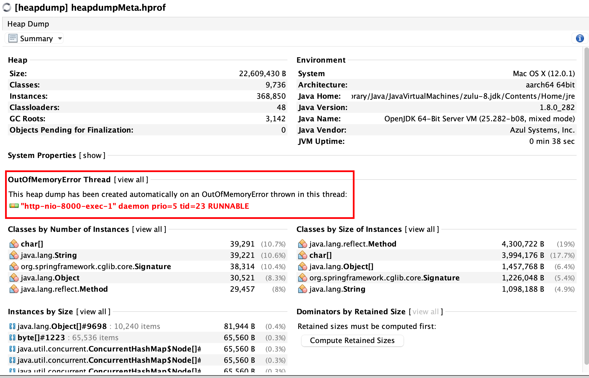

命令监测：jstat -gc 1000 10 （1000s 10次），可以看出MU接近上限

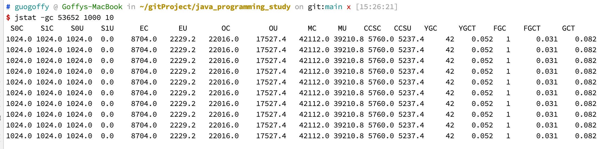

解释：

- S0C/S0U：s0区总共/使用大小
- S1C/S1U：s1区总共/使用大小
- EC/EU：Eden总共/使用大小
- OC/OU：老年代总共/使用大小
- MC/MU：方法区（元空间）总共/使用大小
- CCSC/CCSU：压缩类的空间总共/使用大小（本质上属于方法区）
- YGC/YGCT：YGC次数/时间
- FGC/FGCT：FGC次数/时间
- GCT：GC总时间

### GC overhead limit exceeded

这个是JDK6新加的错误类型，一般是堆太小导致的，Sun 官方对此的定义是：超过98%的时间用来做GC并且回收了不到2%的堆内存时会抛出此异常，本质上是一个预判性的异常，抛出该异常时系统并没有真正的内存溢出。

解决方法

- 检查项目中是否有大量的死循环或使用大内存的代码，优化代码
- 添加参数 ‘-XX:-UseGCOverheadLimit’ 禁用这个价差，其实这个参数解决不了内存问题，只是把错误的信息延后，最后还是会出现java.lang.OutOfMemoryError: Java heap space
- dump内存，检查是否存在内存泄漏，如果没有，加大内存

### 线程溢出


## 性能测试工具：Jmeter

### 基本概述

### 使用流程


## 性能优化案例

### 调整堆大小提高服务的吞吐量

### JVM 优化之 JIT 优化

抛出问题：堆，是分配对象的唯一选择吗？

随着JIT编译期的发展与逃逸技术逐渐成熟，栈上分配、标量替换技术将会导致一些微妙的变化，所有的对象都分配到堆上也渐渐变得不那么“绝对”了。

编译的开销：时间开销、空间开销

即使编译器对代码的优化

逃逸分析

一个对象并没有逃逸出方法的话，那么就可能被优化成栈上分配，这样就无需在堆上分配内存，也就无需进行垃圾回收了。这也是最常见的堆外存储技术。

> 基于OpenJDK深度定制的TaoBaoVM，其中创新的GCIH（GC invisible heap）技术实现 off-heap，将生命周期较长的Java对象从heap中移至 heap 外，并且GC能管理GCIH内部的Java对象，以此达到降低GC的回收效率和提升GC的回收效率的目的。

- 栈上分配

  ```java
  public class EscapeAnalysisDemo {
      public EscapeAnalysisDemo obj;
  
  
      /**
       * 方法返回 escapeAnalysisDemo 对象，发生逃逸
       * @return
       */
      public EscapeAnalysisDemo getInstance(){
          return obj == null ? new EscapeAnalysisDemo() :obj;
      }
  
      /**
       * 为成员属性赋值，发生逃逸
       * 思考：如果当前的 obj 引用声明为 static 的，会发生逃逸吗？
       * 会，生命周期更长
       */
      public void setObj(){
          this.obj = new EscapeAnalysisDemo();
      }
  
      /**
       * 对象的作用域仅在当前方法中有效，没有发生逃逸
       */
      public void useEscapeAnalysisDemo(){
          EscapeAnalysisDemo escapeAnalysisDemo = new EscapeAnalysisDemo();
      }
  
      /**
       * 引用 getInstance，发生逃逸
       */
      public void useEscapeAnalysisDemo1(){
          EscapeAnalysisDemo instance = getInstance();
      }
    
    /**
       * 引用对象传递，发生逃逸
       * @param demo
       */
      public void operation(EscapeAnalysisDemo demo){
          // demo
      }
  }
  ```

  经过逃逸分析后可以发现对象不在堆中存储

- 同步省略（消除）

  如果一个对象被发现只能从一个线程被访问到，那么对于这个对象的操作可以不考虑同步

  线程同步的代价是非常大的，同步的后果是降低并发性和性能

  在动态编译同步块的时候，JIT编译器可以借助逃逸分析来判断同步块所使用的锁对象是否只能够被一个线程访问而没有被其他发布到其他线程，如果没有，那么JIT编译器在编译这个同步块的以后就会取消对这部分代码的同步。这样就能大大提高并发性和性能。这个取消同步的过程就叫做同步省略，也叫锁消除。

  ```java
  public class SynchronizedTest {
  
      /**
       * 代码中对 0 这个对象进行枷锁，但是 0 对象的生命周期只在 f() 中
       * 并不会被其他线程所访问到，所以在 JIT 编译阶段就会被又划掉
       */
      public void f(){
          Object o = new Object();
          synchronized (o){
              System.out.println(o);
          }
      }
  }
  ```

- 标量替换

  只一个无法再分解成更小的数据的数据。Java总的原始数据类型就是标量（Scalar）。

  相对的，那些还可以被分解的数据叫做聚合量（Aggregate），Java中的对象就是聚合量，因为他可以分解成其他聚合量和标量。

  在JIT阶段，如果经过逃逸分析，发现一个对象不会被外界访问的话，那么经过JIT优化，就会把这个对象拆解成若干了其中包含的若干个成员变量来代替，这个过程就是标量替换。

  ```java
  public class ScalarReplaceTest {
      public static class User{
          public int id;
          public String name;
      }
  
      public static void alloc(){
          User user = new User();
          user.id = 5;
          user.name = "Guo";
      }
  
      public static void main(String[] args) {
          long start = System.currentTimeMillis();
          for (int i = 0; i < 10000000; i++) {
              alloc();
          }
          long end = System.currentTimeMillis();
          System.out.println("花费的时间为：" + (end - start) + "ms");
      }
  }
  ```

  开启标量替换的参数（-XX:+DoEscapeAnalysis）默认开启

小结：技术并不成熟，（JDK1.6才实现的），根本原因是无法保证非逃逸分析的性能消耗一定高于它的消耗。虽然不成熟，但它是一个重要的手段。

### 合理配置堆内存

#### 配置推荐

官方提供了一个参考

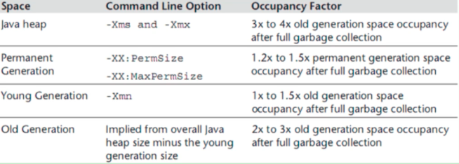

Java整个堆大小设置，Xmx 和 Xms 设置为老年代存活对象的3-4倍，即FullGC之后的老年代内存占用的3-4倍。

方法区（永久代 Permsize和MaxPermSize 或 元空间 Metaspacesize 和MaxMetaspaceSize）设置为老年代存活对象的1.2-1.5倍。

新生代 xmn 的设置为老年代存活对象的1-1.5倍。

老年代的内存大小设置为老年代存活对象的2-3倍。

#### 如何计算老年代的存活对象

JVM参数添加GC日志，GC日志中会记录每次FullGC之后各代的内存大小，观察老年代GC之后的空间大小，可观察一段时间内（比如48小时）的FullGC之后的内存情况，根据多次的FullGC之后的老年代的空间大小数据来预估FullGC之后老年代的存活对象大小（可根据多次Full GC之后的内存大小取平均值）

#### 参数配置

```shell
-XX:+PrintGCDetails -XX:MetaspaceSize=64m -Xss512K
-XX:+HeapDumpOnOutOfMemoryError
-xx:HeapDumpPath=heap/heapdump3.hprof -xx:SurvivorRatio=8
-XX:+PrintGCDateStamps -Xms1024M -Xmx1024M
-Xloggc:log/gc-oom122.log
```

启动Jmeter压测

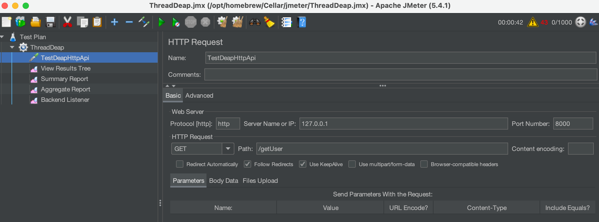

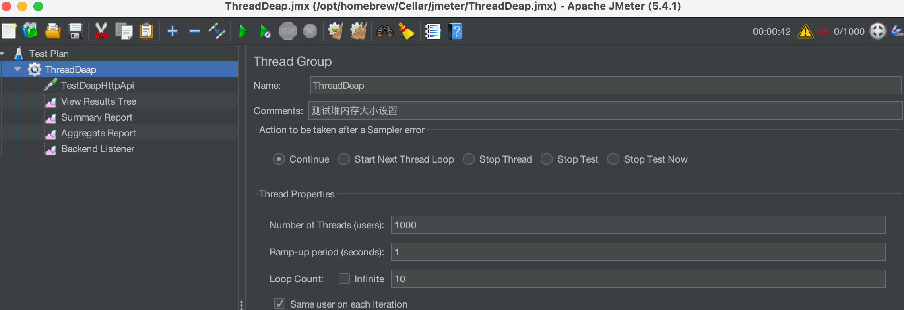

1000 个线程没个线程请求 10 次 一共请求10000次，观察GC，YGC出现了5次，没有出现FGC，减少对内存大小，再测。

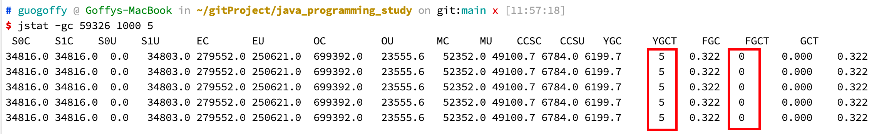

减少对大小之后，发现已经经过了一次FullGC。

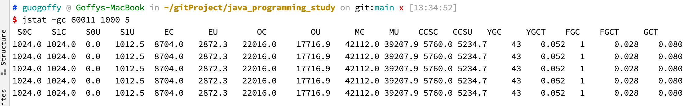

再去压测，可以看到YGC和FGC均增加（YGC增加更多）

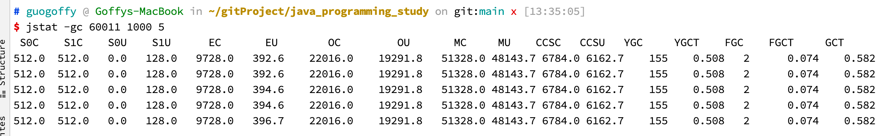

此命令可触发一次FullGC，打印每个class的实例数目，内存占用，类全名信息，live加上之后，只统计存活的对象数量。


```shell
# guogoffy @ Goffys-MacBook in ~/gitProject/java_programming_study on git:main x [13:39:50] 
$ jmap -histo:live 60011
```

### 特殊问题：新生代与老年代的比例

使用ParallelGC的情况下，无论是否开启 参数，默认Eden和Survivor的比例都是6:1:1，需要显式设置 -XX:SurvivorRatio=8。

1. 在JDK 1.8中，如果使用 CMS，无论 UseAdaptivesizePolicy 如何设置，都会将UseAdaptivesizePolicy 设置为 false：不过不同版本的JDK存在差异；
2. useAdaptivesizePolicy不要和SurvivorRatio参数显示设置搭配使用，一起使用会导致参数失效；
3. 由于UseAdaptivesizePolicy会动态调整 Eden、Survivor的大小，有些情况存在Survivor 被自动调为很小，比如十几MB其至几MB的可能，这个时候VGC回收掉 Eden区后，还存活的对象进入Survivor 装不下，就会直接晋升到老年代，导致老年代占用空间逐渐增加。从而触发FULL GC，如果一次FULL GC的耗时很长（比如到达几百毫秒），那么在要求高响应的系统就是不可取的。

附：对于面向外部的大流量、低延迟系统，不建这启用此参数，建议关闭该参数。

### CPU占用很高的排查办法

利用死锁案例来学习

```java
public class JstackDeadLockDemo {
    /**
     * 必须有两个可以被加锁的对象才能产生死锁，只有一个不会产生死锁问题
     */
    private final Object obj1 = new Object();
    private final Object obj2 = new Object();

    public static void main(String[] args) {
        new JstackDeadLockDemo().testDeadlock();
    }

    private void testDeadlock() {
        Thread t1 = new Thread(() -> calLock_Obj1_First());
        Thread t2 = new Thread(() -> calLock_Obj2_First());
        t1.start();
        t2.start();
    }

    /**
     * 先synchronized  obj1，再synchronized  obj2
     */
    private void calLock_Obj1_First() {
        synchronized (obj1) {
            sleep();
            System.out.println("已经拿到obj1的对象锁，接下来等待obj2的对象锁");
            synchronized (obj2) {
                sleep();
            }
        }
    }

    /**
     * 先synchronized  obj2，再synchronized  obj1
     */
    private void calLock_Obj2_First() {
        synchronized (obj2) {
            sleep();
            System.out.println("已经拿到obj2的对象锁，接下来等待obj1的对象锁");
            synchronized (obj1) {
                sleep();
            }
        }
    }

    /**
     * 为了便于让两个线程分别锁住其中一个对象，
     * 一个线程锁住obj1，然后一直等待obj2，
     * 另一个线程锁住obj2，然后一直等待obj1，
     * 然后就是一直等待，死锁产生
     */
    private void sleep() {
        try {
            Thread.sleep(100);
        } catch (InterruptedException e) {
            e.printStackTrace();
        }
    }
}
```

将这段代码放在Linux上去执行

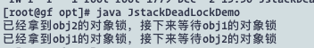

产生死锁，输出top -Hp 进程ID查看CPU占有率，发现2773571这条进程占据30CPU使用率

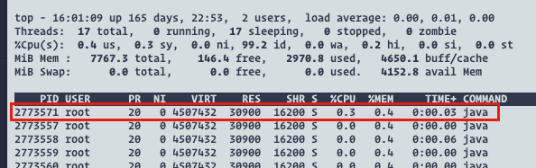

然后使用 jstack 2773557 > jstack.log 命令输出日志，在日志中查看具体问题（此时需要将十进制的PID转化为十六进制nid），可以发现发生了死锁。此时解决问题即可。

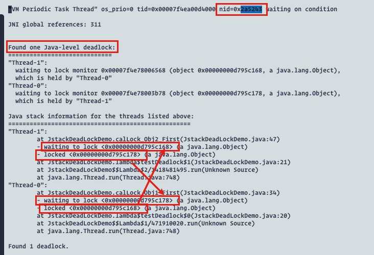

排查问题基本步骤：

1. ps aux | grep java， 查看当前Java进程使用CPU、内存、磁盘的使用情况获取使用量异常的进程
2. Top -Hp PID，检查当前使用异常线程的PID
3. 把线程PID变为16进制（2773571->2a5243）
4. Jstack PID ｜ grep  -A20  2a5243 查看对应出问题的代码即可（-A20：after 20 代码）

### G1并发执行的线程对性能的影响

### 调整垃圾回收器提高服务的吞吐量

### 日均百万级订单交易系统如何设置 JVM 参数


### 面试小结


