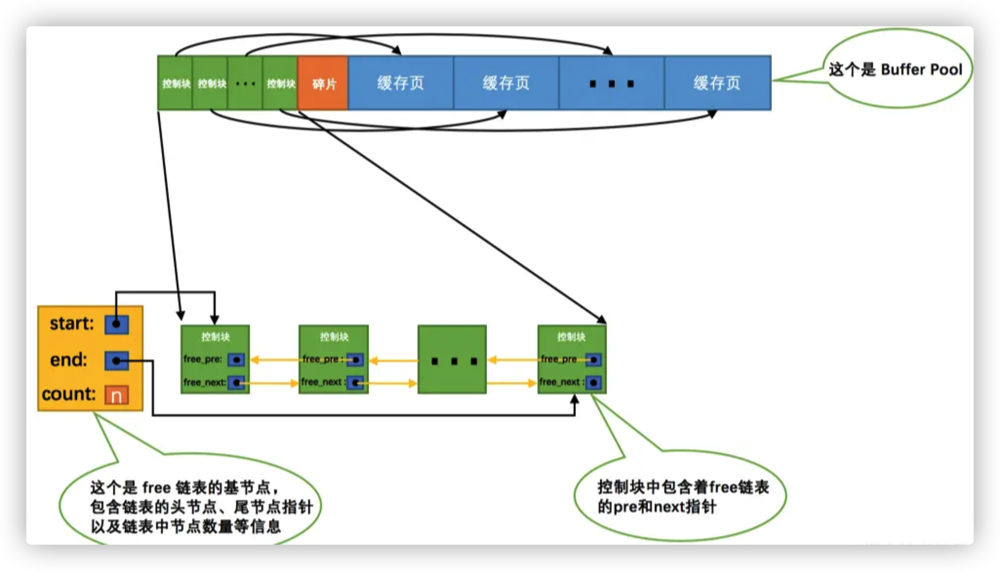
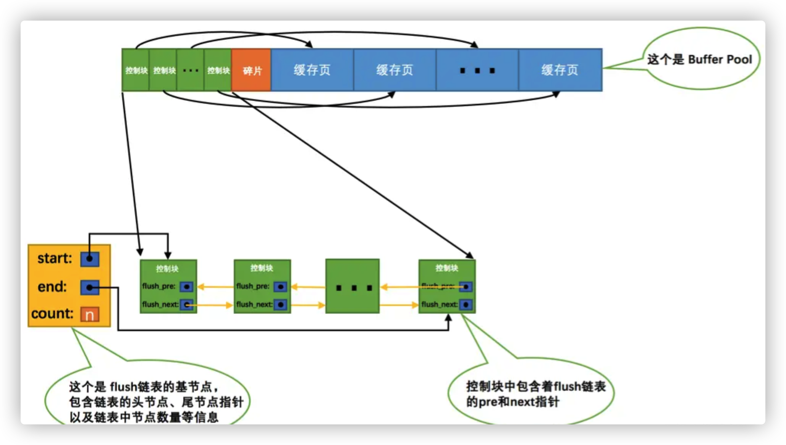
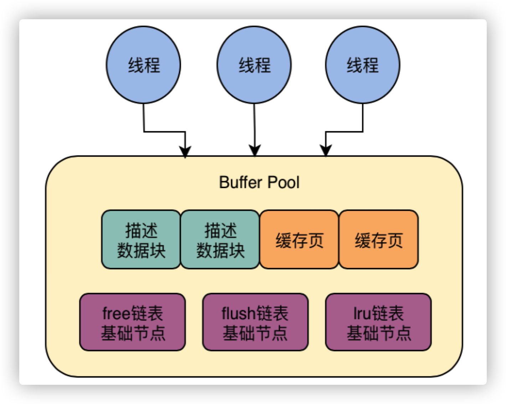
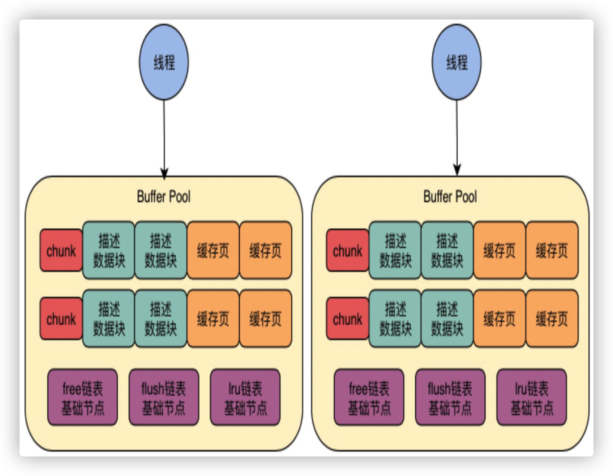

## 前言

mysql 里面，无论是用户记录、还是存储用户记录的索引，还是系统数据。都是以`页`的形式存在于表空间的，而表空间是一个抽象的逻辑逻辑概念，所以数据具体说就是存放在物理可见的磁盘上，但是磁盘非常慢，所以需要借助CPU。

`InnoDB`存储引擎在处理客户端的请求时，当需要访问某个页的数据时，就会把完整的页的数据全部加载到内存中，也就是说即使只需要访问一个页的一条记录，那也需要先把整个页的数据加载到内存中。将整个页加载到内存中后就可以进行读写访问了，在进行完读写访问之后并不着急把该页对应的内存空间释放掉，而是将其`缓存`起来，这样将来有请求再次访问该页面时，就可以省去磁盘`IO`的开销了。

缓存的地方就是mysql设计的Buffer Pool里面了。

## 啥是 Buffer Pool?

mysql在启动的时候，会向操作系统申请一片连续的内存，这个内存就是Buffer Pool（缓冲池）。这个大小是可以配置的，具体看机器的大小，一般是分配给机器大小的50%~60%(这个数据是别人经过检检验的来的)，也就是说如果机器是32G，那缓冲池的大小分配20G左右就差不多。

需要说明的是，默认情况下`Buffer Pool`只有`128M`大小，`Buffer Pool`也不能太小，最小值为`5M`(当小于该值时会自动设置成`5M`)

## Buffer Pool 的内部组成


上面这幅图可以大概说出Buffer Pool的内部组成，为了更好的管理缓冲池，mysql设计的时候将为每一个缓冲池（其实就是一个缓存页，大小和数据页一样也是16KB）创建了一些控制信息，这些信息包括该页所属的表空间编号、页号、缓存页在`Buffer Pool`中的地址、链表节点信息、一些锁信息以及`LSN`信息。

每个缓存页对应的控制信息占用的内存大小是相同的，每个页对应的控制信息占用的一块内存称为一个`控制块`，控制块和缓存页是一一对应的，它们都被存放到 Buffer Pool 中，其中控制块被存放到 Buffer Pool 的前边，缓存页被存放到 Buffer Pool 后边，就是这幅图表示的这样。

碎片是什么：

每一个控制块都对应着一个缓冲页，分配完控制块和缓冲页之后总会有剩余的空间，这个用不到的空间就是碎片。除非Buffer Pool的大小设置刚好合适，才不会产生碎片。

> 每个控制块大约占用缓存页大小的5%，在MySQL5.7.21这个版本中，每个控制块占用的大小是808字节。而我们设置的innodb_buffer_pool_size并不包含这部分控制块占用的内存空间大小，也就是说InnoDB在为Buffer Pool向操作系统申请连续的内存空间时，这片连续的内存空间一般会比innodb_buffer_pool_size的值大5%左右
>

## free 链表的管理

数据库运行起来之后，需要从磁盘加载数据到缓冲池，那加载到哪个缓冲池里面去，所以必须知道那一个缓冲池是空闲的，好加载数据，所以就有一个free链表来确定哪些缓冲页是空闲的。

free链表是一个双向链表，每个节点就是一个空闲的缓冲页的描述数据块的地址，也就是说，只要有一个缓冲页是空闲的，那么他的数据块就会放入这个链表中。刚刚完成初始化的`Buffer Pool`中所有的缓存页都是空闲的，所以每一个缓存页对应的控制块都会被加入到`free链表`中，假设该`Buffer Pool`中可容纳的缓存页数量为`n`，那增加了`free链表`的效果图就是这样的：



从图中可以看出，为了管理好这个`free链表`，特意为这个链表定义了一个`基节点`，里边儿包含着链表的头节点地址，尾节点地址，以及当前链表中节点的数量等信息。这里需要注意的是，链表的基节点占用的内存空间并不包含在为`Buffer Pool`申请的一大片连续内存空间之内，而是单独申请的一块内存空间。

> 链表基节点占用的内存空间并不大，在MySQL5.7.21这个版本里，每个基节点只占用40字节大小。后边我们即将介绍许多不同的链表，它们的基节点和free链表的基节点的内存分配方式是一样一样的，都是单独申请的一块40字节大小的内存空间，并不包含在为Buffer Pool申请的一大片连续内存空间之内。

有了这个`free链表`之后事儿就好办了，每当需要从磁盘中加载一个页到`Buffer Pool`中时，就从`free链表`中取一个空闲的缓存页，并且把该缓存页对应的`控制块`的信息填上（就是该页所在的表空间、页号之类的信息），然后把该缓存页对应的`free链表`节点从链表中移除，表示该缓存页已经被使用了。

其实还有个问题就是如何才能知道该页是不是在缓冲池里面呢，总不能遍历吧，一个缓冲池里面有那么的缓冲页，遍历肯定不可取。

其实定位一个页的时候是根据空空间好+页号来定义的，也就相当于`表空间号 + 页号`是一个`key`，`缓存页`就是对应的`value`，怎么通过一个`key`来快速找着一个`value`呢？就是哈希。

可以用`表空间号 + 页号`作为`key`，`缓存页`作为`value`创建一个哈希表，在需要访问某个页的数据时，先从哈希表中根据`表空间号 + 页号`看看有没有对应的缓存页，如果有，直接使用该缓存页就好，如果没有，那就从`free链表`中选一个空闲的缓存页，然后把磁盘中对应的页加载到该缓存页的位置。

这个会有一个问题就是写SQL的时候，都知道表+行的概念，但是上面说了，mysql内部操作的时候，是表空间+数据页的概念，这两者有什么区别呢？

## flush 链表的管理

接着继续往下走，如果修改了`Buffer Pool`中某个缓存页的数据，那它就和磁盘上的页不一致了，这样的缓存页也被称为`脏页`（英文名：`dirty page`）。当然，最简单的做法就是每发生一次修改就立即同步到磁盘上对应的页上，但是频繁的往磁盘中写数据会严重的影响程序的性能（毕竟磁盘慢的像乌龟一样）。所以每次修改缓存页后，其实并不着急立即把修改同步到磁盘上，而是在未来的某个时间点进行同步（这个时间点后面会说到）。

这个时候就会有一个大问题，如果不立即同步到磁盘的话，那之后再同步的时候我们怎么知道`Buffer Pool`中哪些页是`脏页`，哪些页从来没被修改过呢？总不能把所有的缓存页都同步到磁盘上吧，假如`Buffer Pool`被设置的很大，比方说`300G`，那一次性同步这么多数据岂不是要慢死。所以引出flush链表。

凡是修改过的数据都会被加入到这个链表中，因为它们都属于脏页，后续都要被刷回到磁盘的。flush链表的构造和`free链表`差不多，假设某个时间点`Buffer Pool`中的脏页数量为`n`，那么对应的`flush链表`就长这样：



## LRU 链表的管理

- **缓存不够**

  很简单，Buffer Pool也是有大小的，不可能无限存储，所以肯定需要移除，也就是淘汰。这个时候就用到LRU淘汰算法了，在很多缓存机制里面其实都用到了LRU，比如Redis、LRUHashMap、guava cache、caffeine等等。

  简单解释下这个算法：LRU(Least Recently Used)最近最少使用。设立`Buffer Pool`的初衷，就是减少和磁盘的`IO`交互，最好每次在访问某个页的时候它都已经被缓存到`Buffer Pool`中了。假设一共访问了`n`次页，那么被访问的页已经在缓存中的次数除以`n`就是所谓的`缓存命中率`，期望就是让`缓存命中率`越高越好～ 从这个角度出发，回想一下微信聊天列表，排在前边的都是最近很频繁使用的，排在后边的自然就是最近很少使用的。就是这个道理。

- **简单的LRU**

  如何才能知道Buffer Pool里面的哪些数据需要淘汰呢？其实就是新建一个LRU链表。由于这个链表是为了`按照最近最少使用`的原则去淘汰缓存页的，当访问某个页时，可以这样处理`LRU链表`：

  - 如果该页不在`Buffer Pool`中，在把该页从磁盘加载到`Buffer Pool`中的缓存页时，就把该缓存页对应的`控制块`作为节点塞到链表的头部
  - 如果该页已经缓存在`Buffer Pool`中，则直接把该页对应的`控制块`移动到`LRU链表`的头部

  也就是说：只要使用到某个缓存页，就把该缓存页调整到`LRU链表`的头部，这样`LRU链表`尾部就是最近最少使用的缓存页了，所以当`Buffer Pool`中的空闲缓存页使用完时，到`LRU链表`的尾部找些缓存页淘汰就OK了。

- **划分区域的LRU**

  上面说的方案还存在两种问题：

  - 问题一：`InnoDB`提供了一个看起来比较贴心的服务——`预读`（英文名：`read ahead`）。所谓`预读`，就是`InnoDB`认为执行当前的请求可能之后会读取某些页面，就预先把它们加载到`Buffer Pool`中。根据触发方式的不同，`预读`又可以细分为下边两种：

    - 线性预读

      `InnoDB`引擎有一个系统变量`innodb_read_ahead_threshold`，如果顺序访问了某个区（`extent`）的页面超过这个系统变量的值，就会触发一次`异步`读取下一个区中全部的页面到`Buffer Pool`的请求，注意`异步`读取意味着从磁盘中加载这些被预读的页面并不会影响到当前工作线程的正常执行。这个`innodb_read_ahead_threshold`系统变量的值默认是`56`，可以在服务器启动时通过启动参数或者服务器运行过程中直接调整该系统变量的值，不过它是一个全局变量，需要使用`SET GLOBAL`命令来修改。其实说白了只需要明白异步读取并不会影响到当前工作线程的正常执行就好了。

    - 随机预读

      如果`Buffer Pool`中已经缓存了某个区的13个连续的页面，不论这些页面是不是顺序读取的，都会触发一次`异步`读取本区中所有其的页面到`Buffer Pool`的请求。`InnoDB`引擎页提供了`innodb_random_read_ahead`系统变量，它的默认值为`OFF`，也就意味着`InnoDB`并不会默认开启随机预读的功能，如果要开启该功能，可以通过修改启动参数或者直接使用`SET GLOBAL`命令把该变量的值设置为`ON`。

    `预读`本来是个好事儿，如果预读到`Buffer Pool`中的页成功的被使用到，那就可以极大的提高语句执行的效率。可是如果用不到呢？这些预读的页都会放到`LRU`链表的头部，但是如果此时`Buffer Pool`的容量不太大而且很多预读的页面都没有用到的话，这就会导致处在`LRU链表`尾部的一些缓存页会很快的被淘汰掉，也就是所谓的`劣币驱逐良币`，会大大降低缓存命中率。

  - 问题二：因为全表到扫描（比如没有建立合适的索引或者压根儿没有WHERE子句的查询）引起的问题

    扫描全表意味着什么？意味着将访问到该表所在的所有页！假设这个表中记录非常多的话，那该表会占用特别多的`页`，当需要访问这些页时，会把它们统统都加载到`Buffer Pool`中，这也就意味着吧唧一下，`Buffer Pool`中的所有页都被换了一次血，其他查询语句在执行时又得执行一次从磁盘加载到`Buffer Pool`的操作。而这种全表扫描的语句执行的频率也不高，每次执行都要把`Buffer Pool`中的缓存页换一次血，这严重的影响到其他查询对 `Buffer Pool`的使用，从而大大降低了缓存命中率。

  总结（降低Buffer Pool的两种情况）：

  - 加载到`Buffer Pool`中的页不一定被用到
  - 如果非常多的使用频率偏低的页被同时加载到`Buffer Pool`时，可能会把那些使用频率非常高的页从`Buffer Pool`中淘汰掉

  因为有这两种情况存在，所以LRU又被设计成划分区域的LRU，用来优化这两种情况。其实就是按照一定比例把LRU链表截成两截，分别是：

  - 一部分存储使用频率非常高的缓存页，所以这一部分链表也叫做`热数据`，或者称`young区域`
  - 另一部分存储使用频率不是很高的缓存页，所以这一部分链表也叫做`冷数据`，或者称`old区域`

  大概就是这个样子：


  需要特别注意的一点就是：按照某个比例将LRU链表分成两半的，不是某些节点固定是young区域的，某些节点固定是old区域的，随着程序的运行，某个节点所属的区域也可能发生变化。可以通过查看系统变量`innodb_old_blocks_pct`的值来确定old区域在LRU链表中所占的比例：

  ```mysql
  mysql> SHOW VARIABLES LIKE 'innodb_old_blocks_pct';
  +-----------------------+-------+
  | Variable_name         | Value |
  +-----------------------+-------+
  | innodb_old_blocks_pct | 37    |
  +-----------------------+-------+
  1 row in set (0.01 sec)
  ```

  可以看出来，默认情况下，`old`区域在`LRU链表`中所占的比例是`37%`，也就是说`old`区域大约占`LRU链表`的`3/8`。这个比例是可以设置的，在启动时修改`innodb_old_blocks_pct`参数来控制`old`区域在`LRU链表`中所占的比例，比方说这样修改配置文件：

  ```mysql
  [server]
  innodb_old_blocks_pct = 40
  ```

  这样在启动服务之后，`old`区域占`LRU链表`的比例就是`40%`。如果在服务器运行期间，也可以修改这个系统变量的值，不过需要注意的是，这个系统变量属于`全局变量`，一经修改，会对所有客户端生效，所以只能这样修改：

  ```mysql
  SET GLOBAL innodb_old_blocks_pct = 40;
  ```

  有了上面说的这个方法后，就可以对那两种（情况降低缓存命中率）进行处理优化了：

  - 针对预读的页面可能不进行后续访问情况的优化

    磁盘上的某个页面在初次加载到Buffer Pool中的某个缓存页时，该缓存页对应的控制块会被放到old区域的头部。这样针对预读到`Buffer Pool`却不进行后续访问的页面就会被逐渐从`old`区域逐出，而不会影响`young`区域中被使用比较频繁的缓存页

  - 针对全表扫描时，短时间内访问大量使用频率非常低的页面情况的优化

    在进行全表扫描时，虽然首次被加载到`Buffer Pool`的页被放到了`old`区域的头部，但是后续会被马上访问到，每次进行访问的时候又会把该页放到`young`区域的头部，这样仍然会把那些使用频率比较高的页面给顶下去。所以可不可以在第一次访问该页面时不将其从`old`区域移动到`young`区域的头部，后续访问时再将其移动到`young`区域的头部。其实还是不行！因为`InnoDB`引擎规定每次去页面中读取一条记录时，都算是访问一次页面，而一个页面中可能会包含很多条记录，也就是说读取完某个页面的记录就相当于访问了这个页面好多次。还是一样的结果。

    该怎么解决这个问题呢？其实这里面有这么一个机制：在对某个处在`old`区域的缓存页进行第一次访问时就在它对应的控制块中记录下来这个访问时间，如果后续的访问时间与第一次访问的时间在某个时间间隔内，那么该页面就不会被从old区域移动到young区域的头部，否则将它移动到young区域的头部。而这个时间间隔也有一个参数来控制：

    ```mysql
    mysql> SHOW VARIABLES LIKE 'innodb_old_blocks_time';
    +------------------------+-------+
    | Variable_name          | Value |
    +------------------------+-------+
    | innodb_old_blocks_time | 1000  |
    +------------------------+-------+
    1 row in set (0.01 sec)
    ```

    这个`innodb_old_blocks_time`的默认值是`1000`，它的单位是毫秒，也就意味着对于从磁盘上被加载到`LRU`链表的`old`区域的某个页来说，如果第一次和最后一次访问该页面的时间间隔小于`1s`（很明显在一次全表扫描的过程中，多次访问一个页面中的时间不会超过`1s`），那么该页是不会被加入到`young`区域的。当然，像`innodb_old_blocks_pct`一样，也可以在服务器启动或运行时设置`innodb_old_blocks_time`的值，来规定这个时间间隔 需要注意的是，如果把`innodb_old_blocks_time`的值设置为`0`，那么每次我们访问一个页面时就会把该页面放到`young`区域的头部。

    综上所述，正是因为将`LRU`链表划分为`young`和`old`区域这两个部分，又添加了`innodb_old_blocks_time`这个系统变量，才使得预读机制和全表扫描造成的缓存命中率降低的问题得到了遏制，因为用不到的预读页面以及全表扫描的页面都只会被放到`old`区域，而不影响`young`区域中的缓存页。

    这就是一种典型的基于冷热分离的设计思想，其实JVM里面也用到了这种思想。

    再多说一下：冷热链表实际上是一个链表，只是用指针记录好了，逻辑上区分为冷热两个链表；冷链表的数据晋升到热链表中，如果热链表空间不足，则会淘汰热链表的尾节点。

  

- **优化LRU**

  对于`young`区域的缓存页来说，每次访问一个缓存页就要把它移动到`LRU链表`的头部，这样开销还是很大，毕竟在`young`区域的缓存页都是热点数据，也就是可能被经常访问的，这样频繁的对`LRU链表`进行节点移动操作肯定不好。为了解决这个问题还可以提出一些优化策略，比如只有被访问的缓存页位于`young`区域的`1/4`的后边，才会被移动到`LRU链表`头部，这样就可以降低调整`LRU链表`的频率，从而提升性能（也就是说如果某个缓存页对应的节点在`young`区域的`1/4`中，再次访问该缓存页时也不会将其移动到`LRU`链表头部）。当然优化LRU链表的方法还有很多很多，等我以后学一下再总结关于LRU链表的详细知识。

## 其他的链表

为了更好的管理`Buffer Pool`中的缓存页，除了上边提到的一些措施，`InnoDB`的还引进了其他的一些`链表`，比如`unzip LRU链表`用于管理解压页，`zip clean链表`用于管理没有被解压的压缩页，`zip free数组`中每一个元素都代表一个链表，它们组成所谓的`伙伴系统`来为压缩页提供内存空间等等，反正是为了更好的管理这个`Buffer Pool`引入了各种链表或其他数据结构。说白了，一切都是为了优化。

## 

## 生产环境如何配置Buffer Pool

首先需要明确的就是生产环境都是多线程的，也就是有多个请求来访问Mysql(就是访问Buffer Pool)，那必然需要加锁，让一个线程先完成一系列操作，比如加载数据页到缓存页，更新free链表，更新l RU链表，然后释放锁，结下下一个线程再执行一系列操作。



如果加锁性能肯定会变差，但是需要明确一下，需要看程度，能不能接受，其实在缓冲池里面，是基于内存操作的，即便是加锁串行来执行也不会太差，但是还是会有优化的方案，那就是配置多个Buffer Pool来提升并发能力。可以在服务器启动的时候通过设置`innodb_buffer_pool_instances`的值来修改`Buffer Pool`实例的个数：

```mysql
[server]
innodb_buffer_pool_instances = 2
```

这个时候就有两个Buffer Pool示例了，假如多个线程并发来访问，有的线程去访问这个，有的线程去访问另一个，就可以把压力分散开来了。


所以就是一旦有多个Buffer Pool示例，线程并发访问的性能就会得到成倍的提升。不过也不是说`Buffer Pool`实例创建的越多越好，分别管理各个`Buffer Pool`也是需要性能开销的，一般这样的规定：当innodb_buffer_pool_size的值小于1G的时候设置多个实例是无效的，InnoDB会默认把innodb_buffer_pool_instances 的值修改为1。而一般在`Buffer Pool`大于或等于1G的时候设置多个`Buffer Pool`实例来提高并发的性能。

还有一点就是也可以在运行期间修改Buffer Pool实例个数，`InnDB`的做法是基于chunk机制把Buffer Pool给拆小。具体是这样的：

`MySQL 5.7.5`之前，`Buffer Pool`的大小只能在服务器启动时通过配置`innodb_buffer_pool_size`启动参数来调整大小，在服务器运行过程中是不允许调整该值的。在`5.7.5`以后的版本中支持了在服务器运行过程中调整`Buffer Pool`大小的功能，但是有一个问题，就是每次要重新调整`Buffer Pool`大小时，都需要重新向操作系统申请一块连续的内存空间，然后将旧的`Buffer Pool`中的内容复制到这一块新空间，这是极其耗时的。所以InnDB的做法是决定不再一次性为某个`Buffer Pool`实例向操作系统申请一大片连续的内存空间，而是以一个所谓的`chunk`为单位向操作系统申请空间。也就是说一个`Buffer Pool`实例其实是由若干个`chunk`组成的，一个`chunk`就代表一片连续的内存空间，里边儿包含了若干缓存页与其对应的控制块。大概就是这样：



上图代表的`Buffer Pool`就是由2个实例组成的，每个实例中又包含2个`chunk`。

正是因为发明了这个`chunk`的概念，在服务器运行期间调整`Buffer Pool`的大小时就是以`chunk`为单位增加或者删除内存空间，而不需要重新向操作系统申请一片大的内存，然后进行缓存页的复制。这个所谓的`chunk`的大小是在启动操作`MySQL`服务器时通过`innodb_buffer_pool_chunk_size`启动参数指定的，它的默认值是`134217728`，也就是`128M`。不过需要注意的是，innodb_buffer_pool_chunk_size的值只能在服务器启动时指定，在服务器运行过程中是不可以修改的。

> 为什么不允许在服务器运行过程中修改innodb_buffer_pool_chunk_size的值？因为innodb_buffer_pool_chunk_size的值代表InnoDB向操作系统申请的一片连续的内存空间的大小，如果你在服务器运行过程中修改了该值，就意味着要重新向操作系统申请连续的内存空间并且将原先的缓存页和它们对应的控制块复制到这个新的内存空间中，这是十分耗时的操作！ 另外，这个innodb_buffer_pool_chunk_size的值并不包含缓存页对应的控制块的内存空间大小，所以实际上InnoDB向操作系统申请连续内存空间时，每个chunk的大小要比innodb_buffer_pool_chunk_size的值大一些，约5%。

## 配置Buffer Pool时的注意事项

- `innodb_buffer_pool_size`必须是`innodb_buffer_pool_chunk_size × innodb_buffer_pool_instances`的倍数（这主要是想保证每一个`Buffer Pool`实例中包含的`chunk`数量相同）。

  假设指定的`innodb_buffer_pool_chunk_size`的值是`128M`，`innodb_buffer_pool_instances`的值是`16`，那么这两个值的乘积就是`2G`，也就是说`innodb_buffer_pool_size`的值必须是`2G`或者`2G`的整数倍。比方说在启动`MySQL`服务器是这样指定启动参数的：

  ```
  mysqld --innodb-buffer-pool-size=8G --innodb-buffer-pool-instances=16
  ```

  默认的`innodb_buffer_pool_chunk_size`值是`128M`，指定的`innodb_buffer_pool_instances`的值是`16`，所以`innodb_buffer_pool_size`的值必须是`2G`或者`2G`的整数倍，上边例子中指定的`innodb_buffer_pool_size`的值是`8G`，符合规定，所以在服务器启动完成之后我们查看一下该变量的值就是指定的`8G`（8589934592字节）：

  ```mysql
  mysql> show variables like 'innodb_buffer_pool_size';
  +-------------------------+------------+
  | Variable_name           | Value      |
  +-------------------------+------------+
  | innodb_buffer_pool_size | 8589934592 |
  +-------------------------+------------+
  1 row in set (0.00 sec)
  ```

  如果指定的`innodb_buffer_pool_size`大于`2G`并且不是`2G`的整数倍，那么服务器会自动的把`innodb_buffer_pool_size`的值调整为`2G`的整数倍，比方在启动服务器时指定的`innodb_buffer_pool_size`的值是`9G`：

  ```mysql
  mysqld --innodb-buffer-pool-size=9G --innodb-buffer-pool-instances=16
  ```

  那么服务器会自动把`innodb_buffer_pool_size`的值调整为`10G`（10737418240字节）：

  ```mysql
  mysql> show variables like 'innodb_buffer_pool_size';
  +-------------------------+-------------+
  | Variable_name           | Value       |
  +-------------------------+-------------+
  | innodb_buffer_pool_size | 10737418240 |
  +-------------------------+-------------+
  1 row in set (0.01 sec)
  ```

- 如果在服务器启动时，`innodb_buffer_pool_chunk_size × innodb_buffer_pool_instances`的值已经大于`innodb_buffer_pool_size`的值，那么`innodb_buffer_pool_chunk_size`的值会被服务器自动设置为`innodb_buffer_pool_size/innodb_buffer_pool_instances`的值。

  比方在启动服务器时指定的`innodb_buffer_pool_size`的值为`2G`，`innodb_buffer_pool_instances`的值为16，`innodb_buffer_pool_chunk_size`的值为`256M`：

  ```
  mysqld --innodb-buffer-pool-size=2G --innodb-buffer-pool-instances=16 --innodb-buffer-pool-chunk-size=256M
  ```

  由于`256M × 16 = 4G`，而`4G > 2G`，所以`innodb_buffer_pool_chunk_size`值会被服务器改写为`innodb_buffer_pool_size/innodb_buffer_pool_instances`的值，也就是：`2G/16 = 128M`（134217728字节）：

  ```mysql
  mysql> show variables like 'innodb_buffer_pool_size';
  +-------------------------+------------+
  | Variable_name           | Value      |
  +-------------------------+------------+
  | innodb_buffer_pool_size | 2147483648 |
  +-------------------------+------------+
  1 row in set (0.01 sec)
  
  mysql> show variables like 'innodb_buffer_pool_chunk_size';
  +-------------------------------+-----------+
  | Variable_name                 | Value     |
  +-------------------------------+-----------+
  | innodb_buffer_pool_chunk_size | 134217728 |
  +-------------------------------+-----------+
  1 row in set (0.00 sec)
  ```

## 查看Buffer Pool的状态信息

通过该参数查看状态信息`SHOW ENGINE INNODB STATUS`

```mysql
mysql> SHOW ENGINE INNODB STATUS\G

(...省略前边的许多状态)
----------------------
BUFFER POOL AND MEMORY
----------------------
Total memory allocated 13218349056;
Dictionary memory allocated 4014231
Buffer pool size   786432
Free buffers       8174
Database pages     710576
Old database pages 262143
Modified db pages  124941
Pending reads 0
Pending writes: LRU 0, flush list 0, single page 0
Pages made young 6195930012, not young 78247510485
108.18 youngs/s, 226.15 non-youngs/s
Pages read 2748866728, created 29217873, written 4845680877
160.77 reads/s, 3.80 creates/s, 190.16 writes/s
Buffer pool hit rate 956 / 1000, young-making rate 30 / 1000 not 605 / 1000
Pages read ahead 0.00/s, evicted without access 0.00/s, Random read ahead 0.00/s
LRU len: 710576, unzip_LRU len: 118
I/O sum[134264]:cur[144], unzip sum[16]:cur[0]
--------------
(...省略后边的许多状态)

mysql>
```

具体含义：

- `Total memory allocated`：代表`Buffer Pool`向操作系统申请的连续内存空间大小，包括全部控制块、缓存页、以及碎片的大小。

- `Dictionary memory allocated`：为数据字典信息分配的内存空间大小，注意这个内存空间和`Buffer Pool`没啥关系，不包括在`Total memory allocated`中。

- `Buffer pool size`：代表该`Buffer Pool`可以容纳多少缓存`页`，注意，单位是`页`！

- `Free buffers`：代表当前`Buffer Pool`还有多少空闲缓存页，也就是`free链表`中还有多少个节点。

- `Database pages`：代表`LRU`链表中的页的数量，包含`young`和`old`两个区域的节点数量。

- `Old database pages`：代表`LRU`链表`old`区域的节点数量。

- `Modified db pages`：代表脏页数量，也就是`flush链表`中节点的数量。

- `Pending reads`：正在等待从磁盘上加载到`Buffer Pool`中的页面数量。

  当准备从磁盘中加载某个页面时，会先为这个页面在`Buffer Pool`中分配一个缓存页以及它对应的控制块，然后把这个控制块添加到`LRU`的`old`区域的头部，但是这个时候真正的磁盘页并没有被加载进来，`Pending reads`的值会跟着加1。

- `Pending writes LRU`：即将从`LRU`链表中刷新到磁盘中的页面数量。

- `Pending writes flush list`：即将从`flush`链表中刷新到磁盘中的页面数量。

- `Pending writes single page`：即将以单个页面的形式刷新到磁盘中的页面数量。

- `Pages made young`：代表`LRU`链表中曾经从`old`区域移动到`young`区域头部的节点数量。

  这里需要注意，一个节点每次只有从`old`区域移动到`young`区域头部时才会将`Pages made young`的值加1，也就是说如果该节点本来就在`young`区域，由于它符合在`young`区域1/4后边的要求，下一次访问这个页面时也会将它移动到`young`区域头部，但这个过程并不会导致`Pages made young`的值加1。

- `Page made not young`：在将`innodb_old_blocks_time`设置的值大于0时，首次访问或者后续访问某个处在`old`区域的节点时由于不符合时间间隔的限制而不能将其移动到`young`区域头部时，`Page made not young`的值会加1。

  这里需要注意，对于处在`young`区域的节点，如果由于它在`young`区域的1/4处而导致它没有被移动到`young`区域头部，这样的访问并不会将`Page made not young`的值加1。

- `youngs/s`：代表每秒从`old`区域被移动到`young`区域头部的节点数量。

- `non-youngs/s`：代表每秒由于不满足时间限制而不能从`old`区域移动到`young`区域头部的节点数量。

- `Pages read`、`created`、`written`：代表读取，创建，写入了多少页。后边跟着读取、创建、写入的速率。

- `Buffer pool hit rate`：表示在过去某段时间，平均访问1000次页面，有多少次该页面已经被缓存到`Buffer Pool`了。

- `young-making rate`：表示在过去某段时间，平均访问1000次页面，有多少次访问使页面移动到`young`区域的头部了。

  需要大家注意的一点是，这里统计的将页面移动到`young`区域的头部次数不仅仅包含从`old`区域移动到`young`区域头部的次数，还包括从`young`区域移动到`young`区域头部的次数（访问某个`young`区域的节点，只要该节点在`young`区域的1/4处往后，就会把它移动到`young`区域的头部）。

- `not (young-making rate)`：表示在过去某段时间，平均访问1000次页面，有多少次访问没有使页面移动到`young`区域的头部。

  需要大家注意的一点是，这里统计的没有将页面移动到`young`区域的头部次数不仅仅包含因为设置了`innodb_old_blocks_time`系统变量而导致访问了`old`区域中的节点但没把它们移动到`young`区域的次数，还包含因为该节点在`young`区域的前1/4处而没有被移动到`young`区域头部的次数。

- `LRU len`：代表`LRU链表`中节点的数量。

- `unzip_LRU`：代表`unzip_LRU链表`中节点的数量（由于我们没有具体唠叨过这个链表，现在可以忽略它的值）。

- `I/O sum`：最近50s读取磁盘页的总数。

- `I/O cur`：现在正在读取的磁盘页数量。

- `I/O unzip sum`：最近50s解压的页面数量。

- `I/O unzip cur`：正在解压的页面数量

其实`Buffer Pool`的缓存页除了用来缓存磁盘上的页面以外，还可以存储锁信息、自适应哈希索引等信息。等后面再总结。

## 总结

1. 磁盘太慢，用内存作为缓存很有必要。

2. `Buffer Pool`本质上是`InnoDB`向操作系统申请的一段连续的内存空间，可以通过`innodb_buffer_pool_size`来调整它的大小。

3. `Buffer Pool`向操作系统申请的连续内存由控制块和缓存页组成，每个控制块和缓存页都是一一对应的，在填充足够多的控制块和缓存页的组合后，`Buffer Pool`剩余的空间可能产生不够填充一组控制块和缓存页，这部分空间不能被使用，也被称为`碎片`。

4. `InnoDB`使用了许多`链表`来管理`Buffer Pool`。

5. `free链表`中每一个节点都代表一个空闲的缓存页，在将磁盘中的页加载到`Buffer Pool`时，会从`free链表`中寻找空闲的缓存页。

6. 为了快速定位某个页是否被加载到`Buffer Pool`，使用`表空间号 + 页号`作为`key`，缓存页作为`value`，建立哈希表。

7. 在`Buffer Pool`中被修改的页称为`脏页`，脏页并不是立即刷新，而是被加入到`flush链表`中，待之后的某个时刻同步到磁盘上。

8. `LRU链表`分为`young`和`old`两个区域，可以通过`innodb_old_blocks_pct`来调节`old`区域所占的比例。首次从磁盘上加载到`Buffer Pool`的页会被放到`old`区域的头部，在`innodb_old_blocks_time`间隔时间内访问该页不会把它移动到`young`区域头部。在`Buffer Pool`没有可用的空闲缓存页时，会首先淘汰掉`old`区域的一些页。

9. 我们可以通过指定`innodb_buffer_pool_instances`来控制`Buffer Pool`实例的个数，每个`Buffer Pool`实例中都有各自独立的链表，互不干扰。

10. 自`MySQL 5.7.5`版本之后，可以在服务器运行过程中调整`Buffer Pool`大小。每个`Buffer Pool`实例由若干个`chunk`组成，每个`chunk`的大小可以在服务器启动时通过启动参数调整。

11. 可以用下边的命令查看`Buffer Pool`的状态信息：

    ```mysql
    SHOW ENGINE INNODB STATUS\G
    ```

本文参考资料：高性能mysql第三版、MySql是怎么运行的、从零开始成为Mysql实战优化高手三本书
