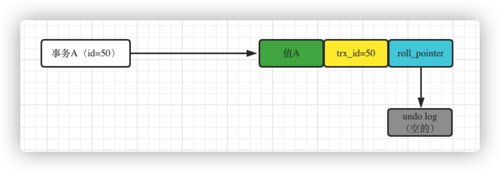
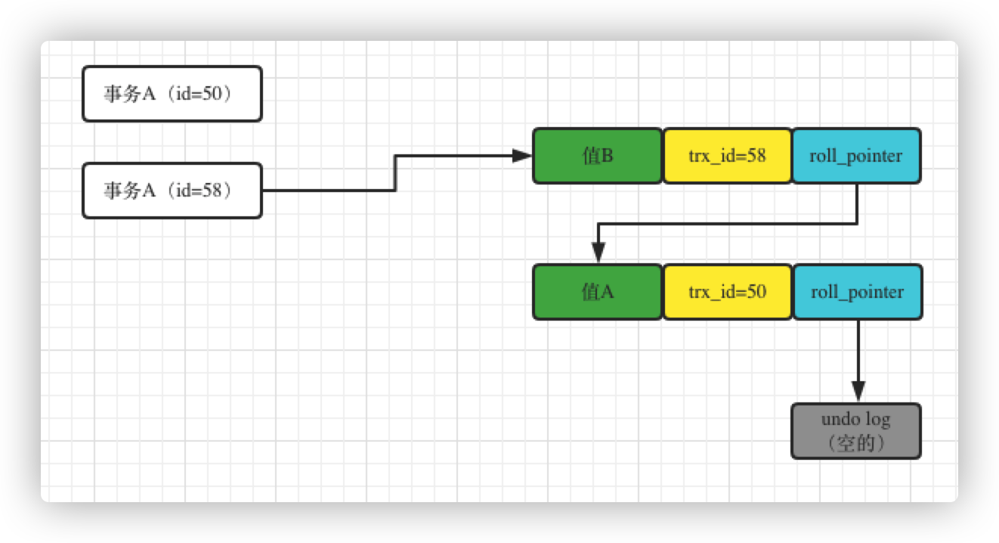
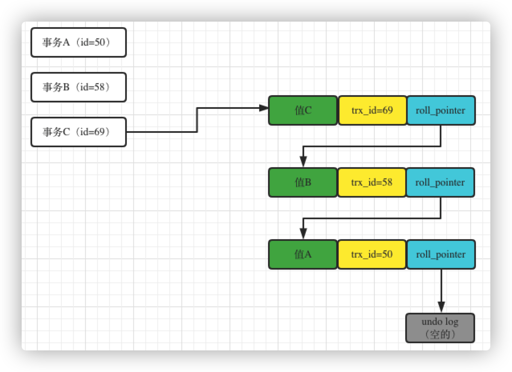
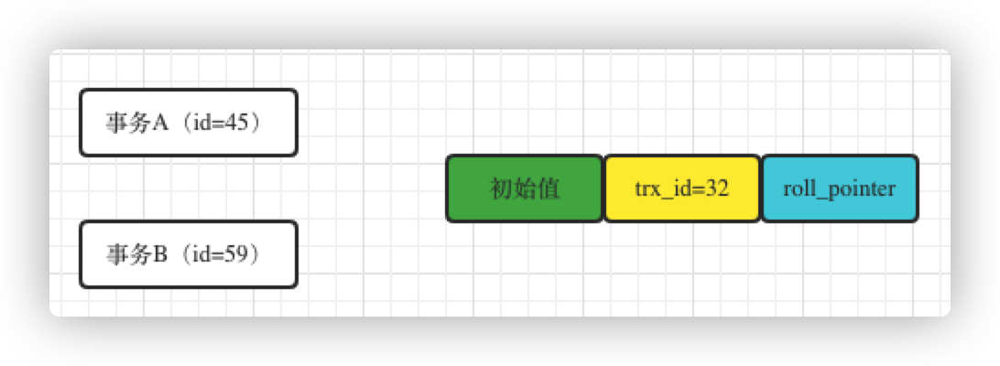
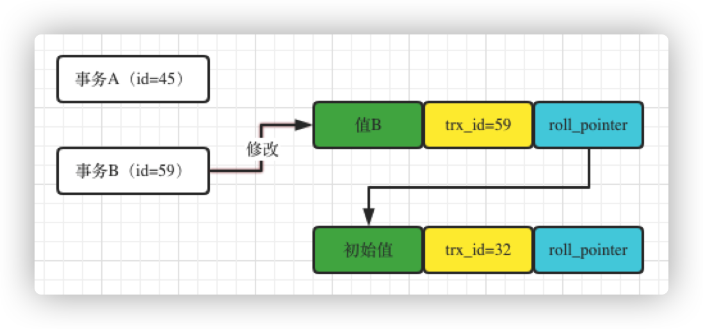
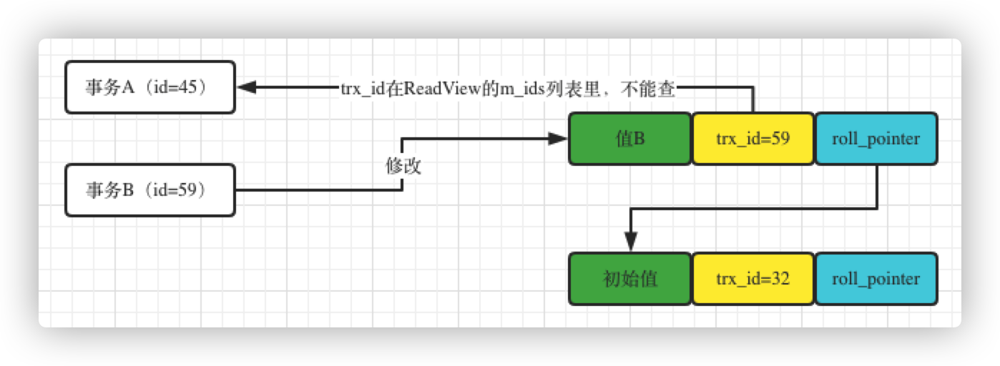
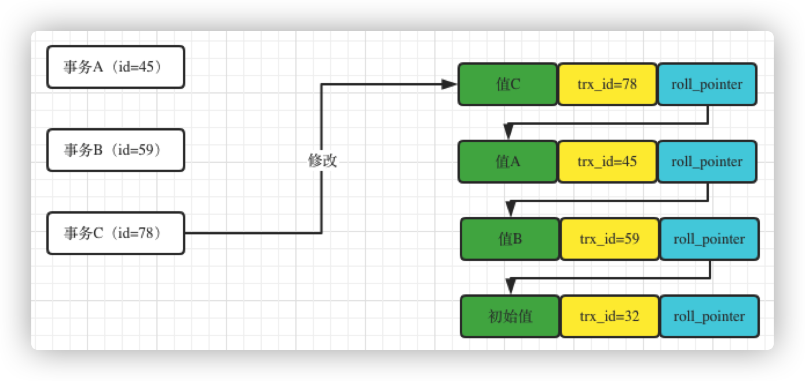
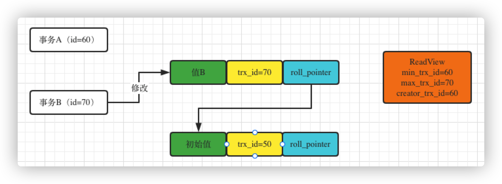
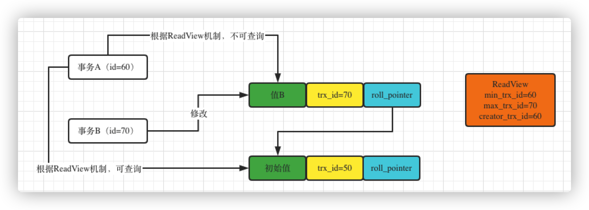
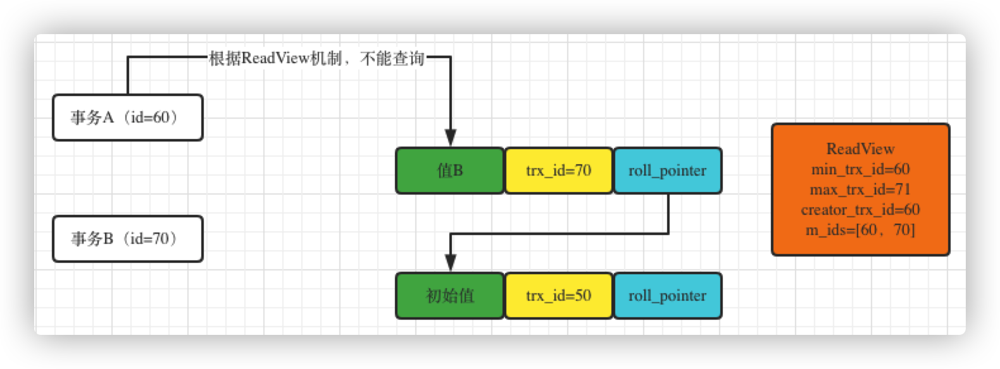

[TOC]

## 前提知识

学习了两年多的编程之后，简单的悟出了一个道理，所有的问题都没有简单、快捷的解决方法（软件设计没有银弹）。很多问题都需要及时权衡和妥协，而这篇文章其实就是数据库在并发性能和可串行化之间做的权衡和妥协 - 并发控制机制。

可串行化在数据准确性方面是最厉害的，但是它牺牲了性能，容易成为整个系统的性能瓶颈。虽然说没法水平扩展的节点在最后都会成为瓶颈，但是可串行化会让这个结果提早到来，软件开发讲究的就是在现有的机器上面，如何做到最大效率的执行，如何让这一结果越晚到来。有了并发，就可以解决一定的性能问题，但是引入并发（Concurrency），必然带来一些莫名其妙的问题。

## 并发控制机制

先不说在数据库里面的并发控制，说事务的并发控制，关于事务，在上一篇已经详细说过。接下来介绍三种最为常见的并发控制机制：

悲观并发控制、乐观并发控制和多版本并发控制。

其中悲观并发控制其实是最常见的并发控制机制，也就是锁；而乐观并发控制其实也有另一个名字：乐观锁，乐观锁其实并不是一种真实存在的锁；最后就是多版本并发控制（MVCC）了，与前两者对立的命名不同，MVCC 可以与前两者中的任意一种机制结合使用，以提高数据库的读性能。

1. ### 悲观并发控制

   悲观并发控制是真正意义上的锁，当事务需要对资源进行操作时需要先获得资源对应的锁，保证其他事务不会访问该资源后，再对资源进行各位操作；

   在悲观并发控制中，数据库程序对于数据被修改迟`悲观`的态度，在数据处理过程中，以此来解决竞争的问题。

   并发事务情况下，读-读是不会出现问题的，不过读-写、写-读、写-写这些情况可能会引起一些问题，需要加锁来处理（MVCC也可，后面说）

   - **读写锁**

     - 读锁（Shared locks），也叫做共享锁。在事务要`读取`一条记录时，需要先获取该记录的`读锁`。
     - 写锁（Exclusive Locks），也叫做排他锁。在事务要`改动`一条记录时，需要先获取该记录的`写锁`。

     假如事务T1首先获取了一条记录的读锁之后，事务T2接着也要访问这条记录：

     - 如果事务T2想获取一个记录的读锁，那么事务T2可以获取到该读锁，也就是说事务T1和事务T2在该记录上同时持有读锁
     - 如果事务T2想获取一个记录的写锁，那么此操作会阻塞，直到事务T1提交之后讲读锁释放掉，事务T2才可以获取到该记录的写锁

     如果事务T1首先获取到了一条记录的写锁，那么不管事务T2接着想获取该记录的读锁还是写锁都将阻塞，直到事务T1提交。所以总结出读锁和读锁是兼容的，读锁和写锁、写锁和写锁都是不兼容的，比较好理解，其实就是一句话：多个事务同时写入同一数据难免会发生各种诡异的问题。

   - 两阶段锁协议

     因为有大量的并发访问，为了`预防死锁`，一般应用中`推荐使用一次封锁法`，就是在方法的开始阶段，已经预先知道会用到哪些数据，然后全部锁住，在方法运行之后，再全部解锁。这种方式可以有效的避免循环死锁，但在数据库中却不适用，因为在事务开始阶段，数据库并不知道会用到哪些数据。

     数据库遵循的是两段锁协议，将事务分成两个阶段，加锁阶段和解锁阶段（所以叫两段锁）

     - 加锁阶段：在该阶段可以进行加锁操作。在对任何数据进行读操作之前要申请并获得S锁（共享锁，其它事务可以继续加共享锁，但不能加排它锁），在进行写操作之前要申请并获得X锁（排它锁，其它事务不能再获得任何锁）。加锁不成功，则事务进入等待状态，直到加锁成功才继续执行。
     - 解锁阶段：当事务释放了一个封锁以后，事务进入解锁阶段，在该阶段只能进行解锁操作不能再进行加锁操作。

     这种方式`虽然无法避免死锁`，但是两段锁协议可以保证事务的并发调度是`串行化`（串行化很重要，尤其是在数据恢复和备份的时候）的

   - 死锁的处理

     死锁在多线程编程中是经常遇到的事情，一旦涉及多个线程对资源进行争夺就需要考虑当前的几个线程或者事务是否会造成死锁；解决死锁大体来看有两种办法，一种是从源头杜绝死锁的产生和出现，另一种是允许系统进入死锁的状态，但是在系统出现死锁时能够及时发现并且进行恢复。

   - 预防死锁（TODO）

   - 死锁检测和恢复(TODO)

   - 锁的粒度（简答介绍下）

     之前提到的锁都是针对记录的，也可以称之为行级锁或者行锁，对一条记录加锁影响的也只是这条记录而已，一般会说这个锁的粒度比较细；其实一个事务也可以在`表`级别进行加锁，自然就被称之为`表级锁`或者`表锁`，对一个表加锁影响整个表中的记录，我们就说这个锁的粒度比较粗。给表加的锁也可以分为`共享锁`（`S锁`）和`独占锁`（`X锁`）

     - 给表加`S锁`(读锁)：

       如果一个事务给表加了`S锁`(读锁)，那么：

       - 别的事务可以继续获得该表的`S锁`(读锁)
       - 别的事务可以继续获得该表中的某些记录的`S锁`(读锁)
       - 别的事务不可以继续获得该表的`X锁`（写锁）
       - 别的事务不可以继续获得该表中的某些记录的`X锁`（写锁）

     - 给表加`X锁`（写锁）：

       如果一个事务给表加了`X锁`（写锁）（意味着该事务要独占这个表），那么：

       - 别的事务不可以继续获得该表的`S锁`(读锁)
       - 别的事务不可以继续获得该表中的某些记录的`S锁`(读锁)
       - 别的事务不可以继续获得该表的`X锁`（写锁）
       - 别的事务不可以继续获得该表中的某些记录的`X锁`（写锁）

     现在有一个问题就是，给一张表添加表锁时，如何才能知道这张表里面的记录已经被上行锁了呢？

     有一种锁叫做`意向锁`，它又分为两种：

     - 意向共享锁，英文名：`Intention Shared Lock`，简称`IS锁`。当事务准备在某条记录上加`S锁`时，需要先在表级别加一个`IS锁`。
     - 意向独占锁，英文名：`Intention Exclusive Lock`，简称`IX锁`。当事务准备在某条记录上加`X锁`时，需要先在表级别加一个`IX锁`。

     IS、IX锁是表级锁，它们的提出仅仅为了在之后加表级别的S锁和X锁时可以快速判断表中的记录是否被上锁，以避免用遍历的方式来查看表中有没有上锁的记录，也就是说其实IS锁和IX锁是兼容的，IX锁和IX锁是兼容的。我们画个表来看一下表级别的各种锁的兼容性。

   

2. ### 乐观并发控制

   除了悲观并发控制机制 - 锁之外，我们其实还有其他的并发控制机制，*乐观并发控制*（Optimistic Concurrency Control）。乐观并发控制也叫乐观锁，但是它并不是真正的锁，很多人都会误以为乐观锁是一种真正的锁，然而它只是一种并发控制的思想。

3. ### 多版本并发控制

   

## 多版本并发控制（MVCC）

#### 整体讨论

多版本并发控制（Multiversion Concurrency Control），每一个写操作都会创建一个新版本的数据，读操作会从有限多个版本的数据中挑选一个最合适的结果直接返回；在这时，读写操作之间的冲突就不再需要被关注，而管理和快速挑选数据的版本就成了 MVCC 需要解决的主要问题。

MVCC 并不是一个与乐观和悲观并发控制对立的东西，它能够与两者很好的`结合`以增加事务的并发量，在目前最流行的 SQL 数据库 MySQL 和 PostgreSQL 中都对 MVCC 进行了实现；但是由于它们分别实现了悲观锁和乐观锁，所以 MVCC 实现的方式也不同

#### MySql 中的 MVCC（重点）

MySQL 中实现的多版本两阶段锁协议（Multiversion 2PL）将 MVCC 和 2PL 的优点结合了起来，每一个版本的数据行都具有一个唯一的时间戳，当有读事务请求时，数据库程序会直接从多个版本的数据项中具有最大时间戳的返回。

更新操作就稍微有些复杂了，事务会先读取最新版本的数据计算出数据更新后的结果，然后创建一个新版本的数据，新数据的时间戳是目前数据行的最大版本 `＋1`。

数据版本的删除也是根据时间戳来选择的，MySQL 会将版本最低的数据定时从数据库中清除以保证不会出现大量的遗留内容。

详细解释：

**版本链**

对于 InnoDB 存储引擎来说，它的聚簇索引记录中都包含了`两`个必要的隐藏列：（这个需要注意的是，row_id并不是必要的，如果创建的表中有主键或者非 null 的 UNIQUE 键时都不包含 row_id 列）

- `trx_id`：每次一个事务对某条聚簇索引记录进行改动时，都会把该事务的事务id赋值给trx_id
- `roll_pointer`：每次对某条聚簇索引记录进行改动时，都会把旧的版本写入到 undo日志中，然后这个隐藏列就相当于一个`指针`，可以通过它来找到该记录修改前的信息

举例说明这两个属性的具体作用（理解这个很重要）

假设现在有一个事务A(id=50)，插入了一条数据，那么此时这条数据的隐藏字段以及指向的undo log如下图所示，插入的这个数据的值是指A，因为事务A的id是50，所以这条数据的trx_id就是50，roll_pointer指向一个空的undo log，因为之前是没有这条数据的。

接着假设有一个事务B修改了这条数据，把值A修改成了值B，事务的id是58，那么此时更新之前会生成一个undo log记录之前的值，然后会让roll_pointer指向这个实际的undo log回滚日志，具体就是图中这样：

注：`图中事务A（id=58）应为事务B（id=58）`

事务B修改了值为值B，此时表里的那行数据的值就是值B了，那行数据的trx_id就是事务B的事务id，也就是58，roll_pointer指向了undo_log，这个undo_log就是记录更新之前的那行数据的值。

假设接着事务C又来修改了这个值，修改为值C，它的事务id是69，此时就会把数据行里的trx_id改成69，然后生成一条undo log，记录之前事务B修改的那个值，图示这样：

图中可以清晰的看到，数据行里的值变成了值C，trx_id是事务C的id，也就是69，然后roll_pointer指向了本次修改之前生成的undo_log，也就是记录了事务B修改的那个值，包括事务B的事务id，同时事务B修改的那个undo_log还串联了最早事务A插入的那个undo_log，如图中所示，过程很清晰。

**ReadView**

从四大隔离级别入手可知，对于使用`READ UNCOMMITTED`隔离级别的事务来说，由于可以读到未提交事务修改过的记录，所以直接读取记录的最新版本就好了；

对于使用`SERIALIZABLE`隔离级别的事务来说，加锁就可以。先在这里把这点说下，后面就不说了：SERIALIZABLE，读加共享锁，写加排他锁，读写互斥。使用的悲观锁的理论，实现简单，数据更加安全，但是并发能力非常差。如果你的业务并发的特别少或者没有并发，同时又要求数据及时可靠的话，可以使用这种模式。

对于使用`READ COMMITTED`和`REPEATABLE READ`隔离级别的事务来说，都必须保证读到已经提交了的事务修改过的记录，也就是说假如另一个事务已经修改了记录但是尚未提交，是不能直接读取最新版本的记录的。

核心问题就是：需要判断一下版本链中的哪个版本是当前事务可见的，而如果判断就是要说的ReadView的概念了。

ReadView概念中有4个比较重要的内容：

- m_ids:表示在生成`ReadView`时当前系统中活跃的读写事务的`事务id`列表

- min_trx_id:表示在生成`ReadView`时当前系统中活跃的读写事务中最小的`事务id`，也就是`m_ids`中的最小值

- max_trx_id:表示生成`ReadView`时系统中应该分配给下一个事务的`id`值

  > 注意max_trx_id并不是m_ids中的最大值，事务id是递增分配的。比方说现在有id为1，2，3这三个事务，之后id为3的事务提交了。那么一个新的读事务在生成ReadView时，m_ids就包括1和2，min_trx_id的值就是1，max_trx_id的值就是4
  
- creator_trx_id:表示生成该`ReadView`的事务的`事务id`

  > 只有在对表中的记录做改动时（执行INSERT、DELETE、UPDATE这些语句时）才会为事务分配事务id，否则在一个只读事务中的事务id值都默认为0，这点需要明确下

有了这个Readview，这样在访问某条记录时，只需要按照以下的步骤判断记录的某个版本是否可见：

- 如果被访问版本的`trx_id`属性值与`ReadView`中的`creator_trx_id`值相同，意味着当前事务在访问它自己修改过的记录，所以该版本可以被当前事务访问
- 如果被访问版本的`trx_id`属性值小于`ReadView`中的`min_trx_id`值，表明生成该版本的事务在当前事务生成`ReadView`前已经提交，所以该版本可以被当前事务访问
- 如果被访问版本的`trx_id`属性值大于或等于`ReadView`中的`max_trx_id`值，表明生成该版本的事务在当前事务生成`ReadView`后才开启，所以该版本不可以被当前事务访问
- 如果被访问版本的`trx_id`属性值在`ReadView`的`min_trx_id`和`max_trx_id`之间，那就需要判断一下`trx_id`属性值是不是在`m_ids`列表中，如果在，说明创建`ReadView`时生成该版本的事务还是活跃的，该版本不可以被访问；如果不在，说明创建`ReadView`时生成该版本的事务已经被提交，该版本可以被访问

如果某个版本的数据对当前事务不可见的话，那就顺着版本链找到下一个版本的数据，继续按照上边的步骤判断可见性，依此类推，直到版本链中的最后一个版本。如果最后一个版本也不可见的话，那么就意味着该条记录对该事务完全不可见，查询结果就不包含该记录

看起来很复杂，有很多的新的属性，还是举个例子来感受一下这个机制：（例子很重要）

假设原来数据库就有一行数据，很早之前就有事务插入过了，事务id是32，他的值就是初始值，如下图：

接着，此时两个事务并发过来执行了，一个是事务A(id=45)，一个是事务B(id=59)，事务B要去更新这行数据，事务A要去读取这行数据，如图所示：

现在事务A直接开启一个Readview，这个Readview里的m_ids就包含了事务A和事务B的两个事务id，45和59，然后min_tx_id就是45，max_trx_id就是60，creator_trx_id就是45，就是事务A自己。

这个时候事务A第一次查询这行数据，会走一个判断，就是判断一下当前这行数据的trx_id是否小于Readview中的min_tx_id，此时发现trx_id是32，是小于ReadView里的min_tx_id就是45的，说明事务开启之前，修改这行数据的事务早就提交了，所以此时可以查到这行数据，如图：

接着事务B开始修改了，他把这行数据的值修改为了值B，然后这行数据的trx_id设置为自己的id，也就是59，同时roll_pointer指向了修改之前生成的一个undo log，接着这个事务B就提交了，如图：

这个时候事务A再次查询，就会发现一个问题，那就是此时的数据行里面的trx_id=59了，不是32了，那个这个trx_id是大于ReadView里的min_tx_id(45),同时小于ReadView的max_trx_id（60）的，这就说明更新这条数据的事务，很可能及时和自己差不多同时开启的，于是看一下这个trx_id(59)，是否在ReadView的m_ids列表里。

这个时候，他是在的（45和59），直接证实，这个修改数据的事务是跟自己同一时段并发执行然后提交的，所以这行数据是不能查询的，如下图所示：

这个时候发现不能查，他就会顺着roll_pointer的undo log日志链条往下找，就会找到最近的一条undo log，trx_id是32，此时发现32是小于ReadView里的min_tx_id(45)的，说明这个undo log版本必然是在事务A开启之前就执行且提交的。

这就是undo log多版本链条的作用，他可以保存一个快照链条，让你可以读到之前的快照值。

**这就是ReadView+undo log日志链条的机制，在多个事务并发执行的时候，就可以保证事务A不会读到并发执行事务B更新的值，只会读到之前最早的值。**

接着假设事务A自己更新了这行数据的值，改成值A，trx_id修改为45，同时保存之前事务B修改的值的快照，如下图：

此时事务A来查询这条数据的值，发现trx_id和自己的是一样的，说明是自己修改的，自己修改的当然可以看到了。

接着在事务A执行的过程中，突然开启了事务C,这个事务id是78，然后他更新了那行数据的值为值C，还提交了，如下图：

这个时候事务A再去查询，会发现当前数据的trx_id=78，大于自己的ReadView中的max_trx_id（60）了，这就说明事务A开启之后，然后有一个事务更新了数据，自己当然看不到了，如图：

此时就会顺着undio log版本链往下找，自己先找到值A自己之前修改过的那个版本，因为那个trx_id=45是跟自己的ReadView里的createor_trx_id是一样的，所以此时直接读取自己之前修改的那个版本，如下图：

这就是整套ReadView+undo log多版本链条的机制，通过这了机制，在你开启事务的时候产生一个ReadView，然后再由一个查询的时候，根据ReadView进行判断的机制，你就可以知道你应该读取那个版本的数据。

而且他可以保证你只能读到你事务开启之前，别的提交事务更新的值，还有就是你自己更新的值。假如说是你事务开启之前，就有别的事务正在运行，然后你事务开启之后，别的事务更新了值，你是绝对读不到的。或者是你事务开启之后，比你晚开启事务更新了值，你也是读不到的。

**ReadView机制是如何实现Read Committed（RC）隔离级别的？**

RC隔离级别实际上就是说在事务运行期间，只要别的事务修改数据还提交了，就可以读到他修改的数据的，所以会发生不可重复读，幻读这两个问题的。

`有一个非常重要的点就是在RC隔离级别下，每次发起查询，都会重新生成一个ReadView。`

假设有一行数据，是事务id=50的一个事务之前就插入进去的，然后现在，活跃着两个事务，一个是事务A(id=60)，一个是事务B(id=70)，如图：

现在的情况就是，事务B发起了一次update操作，更新了这条数据，把这个条数据的值修改为了值B，所以此时数据的trx_id会变成70，同时生成一个undo log，有roll_pointer指向，这个逻辑上面已经画过图，就不画，可参考上面的图理解。

这个时候，事务A要发起一次查询操作，此时他一发起查询操作，就回生成一个ReadView，那么此时ReadView里面有min_trx_id=60、max_trx_id=70、creator_trx_id=60这几个，如图：

这个时候事务A发起查询，发现当前这条数据的trx_id=70，也就是说，属于ReadView的事务id范围之内，说明是他生成ReadView之前就有这个活跃的事务，是这个事务修改了这条数据的值，但是此时

这个事务B还没有提交，所有ReadView的m_ids活跃事务列表里，是有[60,70]两个id的，所以此时根据ReadView的机制，此时事务A是无法查询到事务B修改的值B的。

接着顺着undo log版本链条往下查找，就会找到一个初始值，发现它的trx_id是50，小于当前ReadView里的min_trx_id，说明是他生成ReadView之前，就有一个事务插入了这个值并且早就提交了，因此可以查询到这个初始值，如下图：

接着，就是说到RC隔离级别的重点了，假设事务B此时已经提交了，那么提交了就说明事务B不会活跃于数据库里了。一定需要清楚，事务B现在已经提交了，按照RC隔离级别的定义，事务B一旦提交，说明事务A下次再查询，就可以读到事务B修改过的值，因为事务B提交了。

那么这个具体是怎么读到的呢？

很简单，就是上面高亮的那句话，事务A下次发起查询时，再次生成一个ReadView。此时再生成ReadView，数据库内活跃的事务只有事务A了，因此min_trx_id是60，max_trx_id是71，但是m_ids这个活跃事务列表里，就只有一个60了，事务B的id=70不会出现在m_ids这个活跃事务列表里了，此时事务A再次基于这个ReadView去查询，会发现这条数据的trx_id=70，虽然在ReadView的min_trx_id和max_trx_id范围之间，但是此时并不在m_ids列表内，说明事务B在生成本次ReadView之前就已经提交了，那就说明这次查询可以查到事务B修改过的这个值了，此时事务A就会查询到值B。如下图：

这就是RC隔离级别是如果通过MVCC+ReadView+undo log多版本日志链条机制实现的。

简单总结：要想读到一个事务提交的数据简单，直接读取就好了，关键的问题是会读取到别人还未提交的事务数据。所以RC的实现要点就是如何`避免`读取到别人还未提交的事务的数据，为了实现这一点，基于ReadView判断是否和自己同一时间点并发产生的事务，如果是和自己并发时产生的事务就暂不读取（因为和自己并发产生的事务，很有可能在修改数据但是还未提交，所以就不读取，避免读取到别人未提交的事务），但是这种方式会存在误判，因为有可能和自己一起并发的事务立马就更新提交了，如果一直基于事务开始时产生的ReadView去判断，将一直读取不到和自己同一时间的并发事务所提交的数据，为了避免这种情况，所以每次读取的时候都重新生成ReadView，这个就可以`尽最大可能`读取到最新别人已经提交的事务。虽然永远读取的是别人已经提交的事务，不会读取别人还没提交的事务，并且尽最大可能读取最新事务提交事务的数据，但是无法避免的是有时会未及时读取到最新事务提交的数据。所以RC的定义就是：尽最大可能读取到最新事务提交的数据，永远不读取别人未提交的数据，有些情况下读取不到最新事务提交的数据。如果想做到永远保证自己读取的数据是最新一次事务提交的数据，那就是只能加锁了。

这段有点绕，仔细读，多阅读几遍还是可以想清楚的。

**ReadView机制是如何实现REPEATABLE READ（RR）隔离级别的？**

RR隔离级别下，这个事务读一条数据，无论读多少次，都是一个值，别的事务修改数据之后哪怕提交了，这个事务也是看不到他修改的值的，这就避免了不可重复读的问题。

`有一个非常重要的点就是在RR隔离级别下，在第一次读取数据时生成一个ReadView。`

首先假设有一条是数据的事务id=5的一个事务插入的，同时此时有事务A(id=60)和事务B(id=70)同时运行，如图：

这个时候，事务A发起了一个查询，第一次查询就会生成一个ReadView，此时ReadView里的creator_trx_id是60，min_trx_id是60，m_ids是[60,70]，接着事务A基于这个ReadView去查这条数据，会发现这条数据的trx_id为50，是小于ReadView里的min_trx_id的，说明他发起查询之前，已经有事务查询这条数据并且提交了，所以此时可以查到这条数据。

接着事务B此时更新了这条数据的值为值B，此时会修改trx_id=70，同时生成一个undo log，而且关键是事务B此时还提交了，也就是说事务B已经结束了，如下图：

此时ReadView中的m_id还是[60,70]，因为上面的高亮红字说过了，在RR隔离级别下，在第一次读取数据时生成一个ReadView，一旦生成就不会再变了，这个时候虽然事务B已经结束了，但是事务A的 ReadView里，还是会有60，70两个事务id。就是说事务A去查询的时候，事务B当时是在运行的，然后事务A查询的时候，会发现trx_id是70，70一方面在min_trx_id和max_trx_id这个范围区间中，同时还在m_ids列表中。

这就说明了起码在事务A开启查询的时候，id为70的这个事务B还是在运行的，然后由这个事务B更新了这条数据，所以此时事务A是不能查询到事务B更新的这个值的，因此这个时候继续顺着指针往历史版本链条上去找，如下图：

往下找就找到了trx_id=50的这条数据，50是小于ReadView的min_trx_id的，说明在他开启查询之前，就已经提交了这个事务了，所以可以查询到，图就不画了，理解到就可以了。

这样的话就避免了不可重复读的问题，事务A多次读同一个数据，每次读到的都是一样的值，除非是他自己修改了值，否则读到的一直会是一样的值。不管别的事务如何修改数据，事务A的ReadView始终是不变的，他基于这个ReadView始终看到的值是一样的。

还有一个幻读的问题，假设现在事务A用 select * from x where id > 10 来查询，此时可能查到的就是一条数据，而且读到的这条数据就是初始值那个版本，原因上面说过了。假设现在有一个事务C插入了一条数据，然后提交了，如下图：

这个时候，事务A再此查询，此时会发现符合条件的有2条数据，一条是原始值那个数据，一条是事务C插入的那条数据，但是事务C插入的那条数据的trx_id是80，这个80大于自己ReadView的max_trx_id的，说明是自己发起查询之后，这个事务才启动的，所以次数这条数据是不能查询的。

所以，在这里可以发现，事务A根本不会发生幻读，他根据条件查询的时候，每次读到的数据都是不一样的，不会读到人家插入进去的数据，这就是依据ReadView机制实现的。

这里简答再把当前读和快照读总结一下，因为这个还是比较重要的，mysql到底在RR隔离级别下有没有解决幻读搞清楚这个很重要：

- 当前读（`next-key锁[行记录锁+Gap间隙锁]`）

  - select...lock in share mode (共享读锁)
  - select...for update
  - update , delete , insert

  当前读, 读取的是最新版本, 并且对读取的记录加锁, 阻塞其他事务同时改动相同记录，避免出现安全问题

  例如，假设要update一条记录，但是另一个事务已经delete这条数据并且commit了，如果不加锁就会产生冲突。所以update的时候肯定要是当前读，得到最新的信息并且锁定相应的记录

- 快照读（`undolog和MVCC`）

  单纯的select操作，不包括上述 select ... lock in share mode, select ... for update。　　　　

  Read Committed隔离级别：每次select都生成一个快照读。

  Read Repeatable隔离级别：开启事务后第一个select语句才是快照读的地方，而不是一开启事务就快照读

所以需要特别注意的是，`RR隔离级别下通过MVCC可以解决幻读，但是只能是在快照读的情况下，当前读情况下需要使用间隙锁才能解决幻读`，这个到总结锁的知识的时候再说

简单总结：RC和RR都是使用同一套ReadView+undo log机制，只是为了业务需要，使用的方式不同（RC每次查询都会创建ReadView视图，RR只在第一次开启查询的时候创建ReadView视图，之后查询都不会重新创建ReadView视图），从而导致了不同的问题。就好像InnoDB提供了一套功能组件，看你需要实现什么样功能，去决定怎么去使用它。 ReadView+undo log机制，只是保证了在同一个ReadView视图（m_ids，min_trx_id，max_trx_id，creator_trx_id）中，小于min_trx_id和在[min_trx_id, max_trx_id)之间，但是没有在m_ids活跃事务列表中的数据都能读到，除此之外的都不能读到（不可见）。

#### PostgreSQL 中的 MVCC

与 MySQL 中使用悲观并发控制不同，PostgreSQL 中都是使用乐观并发控制的，这也就导致了 MVCC 在于乐观锁结合时的实现上有一些不同，最终实现的叫做多版本时间戳排序协议（Multiversion Timestamp Ordering），在这个协议中，所有的事务在执行之前都会被分配一个唯一的时间戳，每一个数据项都有读写两个时间戳

当 PostgreSQL 的事务发出了一个读请求，数据库直接将最新版本的数据返回，不会被任何操作阻塞，而写操作在执行时，事务的时间戳一定要大或者等于数据行的读时间戳，否则就会被回滚。

这种 MVCC 的实现保证了读事务永远都不会失败并且不需要等待锁的释放，对于读请求远远多于写请求的应用程序，乐观锁加 MVCC 对数据库的性能有着非常大的提升；虽然这种协议能够针对一些实际情况做出一些明显的性能提升，但是也会导致两个问题，一个是每一次读操作都会更新读时间戳造成两次的磁盘写入，第二是事务之间的冲突是通过回滚解决的，所以如果冲突的可能性非常高或者回滚代价巨大，数据库的读写性能还不如使用传统的锁等待方式。

## 总结

数据库的并发控制机制到今天已经有了非常成熟、完善的解决方案，我们并不需要自己去设计一套新的协议来处理不同事务之间的冲突问题，从数据库的并发控制机制中学习到的相关知识，无论是锁还是乐观并发控制在其他的领域或者应用中都被广泛使用，所以了解、熟悉不同的并发控制机制的原理是很有必要的。

