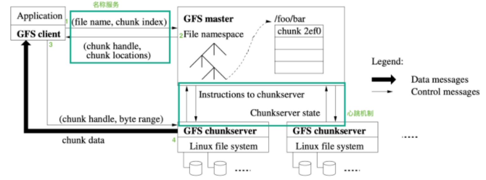
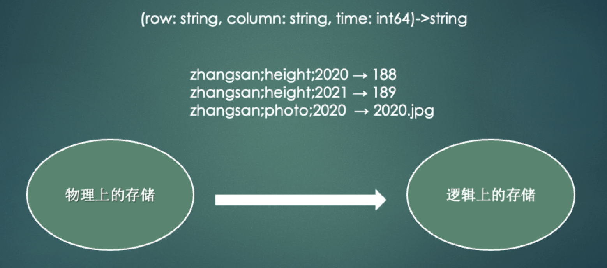
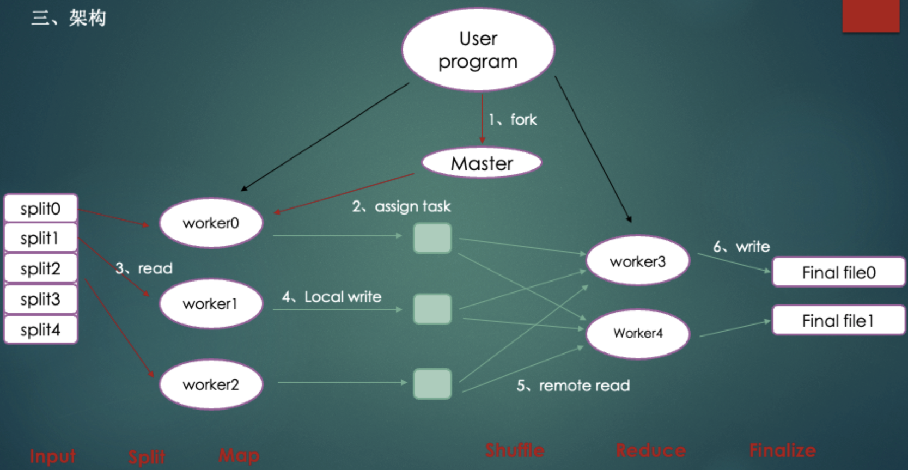

<aside> 💡 MIT 6824是学习分布式必学的课程(Robert Morris 当年因为发明蠕虫病毒而蹲监然后回MIT当教授的神人！！！)

</aside>

## 历史起源

1998年9月4日，Google公司在美国硅谷成立，它是一家做搜索引擎起家的公司。

无独有偶，一位名叫Doug Cutting的美国工程师，也迷上了搜索引擎。他做了一个用于文本搜索的函数库（姑且理解为软件的功能组件），命名为Lucene。

这里要补充说明一下雅虎招安Doug的背景：2004年之前，作为互联网开拓者的雅虎，是使用Google搜索引擎作为自家搜索服务的。在2004年开始，雅虎放弃了Google，开始自己研发搜索引擎。所以。。。

加盟Yahoo之后，Doug Cutting将NDFS和MapReduce进行了升级改造，并重新命名为**Hadoop**（NDFS也改名为HDFS，Hadoop Distributed File System）。

这个，就是后来大名鼎鼎的大数据框架系统——Hadoop的由来。而Doug Cutting，则被人们称为**Hadoop之父**。

以上信息来自互联网

**三大论文整体架构**

## 那些年谷歌发布的论文

1.按时间算第一篇的论文应该2003年公布的 **Google File System**，这是一个可扩展的分布式文件系统，用于大型的、分布式的、对大量数据进行访问的应用。文件被分割成很多块，使用冗余的方式储存于商用机器集群上(基本上Google每篇论文都是关于“商用机型”)。

2.2004年发布的的 **MapReduce**现在基本上可以代表大数据。主要思想是将任务分解然后在多台处理能力较弱的计算节点中同时处理，将结果合并从而完成大数据处理，传说中Google使用它计算他们的搜索索引。Mikio L. Braun(柏林工业大学机器学习学博士后，TWIMPACT联合创始人兼首席数据科学家)认为其工作模式应该是：Google把所有抓取的页面都放置于他们的集群上，并且每天都使用MapReduce来重算。

3.**Bigtable**发布于2006年，启发了无数的NoSQL数据库，比如：Cassandra、HBase等等。Cassandra架构中有一半是模仿Bigtable，包括了数据模型、SSTables以及提前写日志（另一半是模仿Amazon的Dynamo数据库，使用点对点集群模式）。

Google并没有止步于MapReduce，事实上，随着Internet的指数增长，从零开始重算所有搜索索引变得不切实际,他们在MapReduce不适用的地方开发新方法,对于大数据领域来说这是个福音。MapReduce不是万能的。当然，你可以更深入一步，比如说将磁盘数据移入内存，然而同样还存在一些任务的内部结构并不是MapReduce可以扩展的。

4、2010年发表的 **Percolator**的论文中，Google展示了其网络搜索是如何保持着与时俱进。Percolator建立于已存类似Bigtable的技术，但是加入了事务以及行和表上的锁和表变化的通知。这些通知之后会被用于触发不同阶段的计算。通过这样的方式，个体的更新就可以“渗透”整个数据库。

5、在2010年，Google还公布了 **Dremel**论文。一个为结构化数据设计，并拥有类SQL语言的交互式数据库。然而取代SQL数据库使用字段填补的表格，Dremel中使用的是类JSON格式数据（更准确的说，使用Google Protocol buffer格式，这将加强对允许字段的限制）。内部，数据被使用特殊格式储存，可以让数据扫描工作来的更高效。查询被送往服务器，而优秀的格式可以最大性能的输出结果

6、Google还需要挖掘图数据，比如在线社交网络的社交图谱；所以他们开发了 **Pregel**，并在2010年公布其论文。论文陈述了许多算法的实现，比如Google的PageRank、最短路径、二分图匹配等。Mikio L. Braun认为，对比MapReduce或SPF，Pregel需要更多实现的再思考。

7、Google在2009年提出了Spanner远景计划，并在2012年对外公布**Spanner–全球分布式数据库**论文。Spanner的公布可以说是Google向大数据技术中添的又一把火，Spanner具有高扩展性、多版本、全球级分布以及同步复制等特性，跨数据中心的高扩展性及全球分布会对一致性保障提出苛刻的需求,读写的外部一致性和基于时间戳的全局读一致性。为了保障这一点，Google引入了TrueTime API。TureTime API可以同步全球的时间，拥有一个TT.now（）的方法，将获得一个绝对时间，同时还能得到时间误差。为了保证万无一失，TrueTime API具有GPS和原子钟双保险。也只有这样的机制才能让全球范围内的并发处理得到保障。

在Google思路以及论文的启发下，同样涌现出一些开源项目，比如：Apache Drill、Apache Giraph、斯坦福GPS等等。

文件系统（GFS）—> 数据模型（BigTable）—> 算法（MapReduce）

## 1、GFS（The Google File System）(2003年)

[Google-File-System中文版_1.0.pdf](https://s3-us-west-2.amazonaws.com/secure.notion-static.com/d0a17540-b0b7-4fd9-958f-522a62566910/Google-File-System_1.0.pdf)

### 出现背景：

- 背景1：分布式组件经常发生错误，应当将此视为常态而不是意外

  组件（也就是分布式系统中的 commodity hardware，可以理解为配置不高的商用主机）发生错误的原因有很多，比如：应用或者操作系统 BUG，人为错误、硬盘、内存、网络甚至是电源故障；

- 背景2：文件通常是大文件，而不是小文件

  这里的大文件是相对于传统标准而言的，比如 GB 在这属于大文件，KB 级别属于小文件；论文指出，应当操作大文件而不是小文件，即使系统本身支持 billion 级别（十亿个）的 kB 大小的文件的操作，但是这种操作也是不明智的，因为会明显巨大的额外开销。

  这是一个非常重要的假设，因为后面会提到 GFS 中直接将 chuksize 设置为 64 MB，因为我们面对的是大文件，因此即使以 64MB 这么大的空间作为存储的管理单元，磁盘空间的浪费也不会很严重。

- 背景3：大部分文件（主要是指字节数量占比高，而不是操作次数）通过 append（在已有的文件末尾追加）新数据的方式实现修改，而不是直接重写现有数据

  这是基于 Google 对 GFS 的应用场景的判断而做出的背景，因为大部分操作都是 append，因此 GFS 系统优化的中心也放在 record append 操作上。而对于随机写 GFS 仅仅给出一个存在不一致性问题的解决方案。

  总之，这种假设下 I/O 操作都是顺序 I/O，效率比随机 I/O 高很多。

- 背景4：协同设计应用以及文件系统可以提高系统整体灵活性，最终使整个系统收益

### **GFS是什么？**

Google 文件系统（Google File System，缩写为 GFS 或 GoogleFS），一种专有分布式文件系统，由 Google 公司开发，运行于 Linux 平台上。尽管 Google 在 2003 年公布了该系统的一些技术细节，但 Google 并没有将该系统的软件部分作为开源软件发布。正是因为如此，由雅虎牵头根据 Google 三篇论文做出来的 Hadoop 并没有达到 Google 宣称的速度，可见在大数据相关领域，世界上只有 Google 在领跑，其他公司都只是在陪跑。

GFS 的地位相当高，早些年基于 GFS 系统的 MapReduce 以及 BigTable 框架实际上随着时代都逐渐被取代了，并且 MapReduce 以及 BigTable 作为 Google 大数据三驾马车的后两篇论文，也没有 GFS 那样写得详细。

### **前提与假设**

- 分布系统的各个组件是廉价的商品主机，而不是专业服务器，因此它们不得不频繁地自我监测、发现故障，并被要求有一定故障容错与自我故障恢复能力；

- 文件数量处于几百万的规模，每一个文件的大小通常为 100 MB 或者更大，GB 也是很常见的数据大小；文件系统虽然支持小文件，但是不会进行特殊的优化（因此直接使用 GFS 应当基于大文件的应用背景）；

- **读工作负载**主要由两种读方式构成：大规模的串行读以及小规模的随机读

  - **大规模顺序读**：顺序（磁盘地址连续地）读取**数百及以上个** KB 大小的数据（或者单位改成 MB）；

  - **小规模随机读**：以任意偏移量读取几个 KB 大小的数据；

    > 小规模随机读会有优化，比如进行排序后的批处理化，以稳定地遍历文件（排序可能是按照索引的指针大小），而不是来回地随机读取。

- **写工作负载**主要是大规模的、连续（即串行的）的写操作，这些操作将数据追加到文件末尾。写操作的规模通常和大规模串行读的规模类似；

  > 这要求：文件一旦写好，就几乎不会进行覆写，虽然 GFS 支持在文件的任意位置进行修改，但是并不会进行优化，存在并发安全问题，因此应当尽量避免使用。

- 系统需要支持并发写，即支持数百台机器并发地追加数据到一个文件。操作的原子性和同步开销是主要指标；

- **高持续带宽（High sustained bandwidth）比低延迟更重要**；

  > 大多数的应用更子在乎高速率地处理大量数据，但是很少应用对单个读写操作由严格的响应时间要求。参考 StackOverflow 相关问题的回答，我们可以将带宽和延迟用比喻的方式进行比较：带宽和高速公路上的车道数有关，能同时跑多少量车就是带宽，延迟和路况有关，平均车速就是在描述延迟。带宽和延迟反相关。具体来说，作为一个文件管理系统可能因为涉及异步异地备份而比较耗时，因此延迟比较大。而对于一个游戏服务来说，延迟就不能高。正是因为如此，一个文件服务器的带宽被占用过多时，下载文件的速率就会明显降低。一个游戏为了保障用户体验，在服务器爆满时会采用排队机制，比如 LOL 或者 WOW 服务器在周末时因为在线玩家较多，就会出现登陆排队，另一方面会国内游戏（包括代理）往往会有多个频道或者区的概念，目的都是为了分流。总之目的都是避免服务器因为带宽被占满导致游戏延迟多大，玩家游戏体验过差。

### **GFS架构**

这是一个可扩展的分布式文件系统，用于大型的、分布式的、对大量数据进行访问的应用。运行与廉价的普通硬件上，提供容错功能。

从根本上来说，文件被分割成很多块，使用冗余的方式储存于商用机器集群上

- 集群由每一个单个的master和好多个 chunkserver
- 每一个节点都是一个普通的Linux计算机，运行的是一个用户级别（user-level）的服务器进程
- 在GFS下，每一个文件都拆成固定大小的chunk(块)
  - 每一个块都是由master根据创建的时间产生一个全局唯一的以后不会改变的64位的 chunk handle 标志
- Chunkservers
  - 在本地磁盘上用Linux文件系统保存这些块
  - 并且根据 chunk handle 和字节区间，通过Linux文件系统读写这个块的数据
- 处于可靠性的考虑
  - 每一个块都会在不同的chunkserver上保存备份。缺省情况下，保存3个备份
- 为避免单master单点失效
  - Google 允许一个GFS集群中有多个backup master存在
  - 当master失效，通过Chubby 锁服务选择一个backup master作为master

GFS由一个master和大量的chunkserver构成。Google设置一个master来保存目录和索引信息，这是为了简化系统结果，提高性能来考虑的，但是这就会造成主成为单点故障或者瓶颈。为了消除主的单点故障Google把每个chunk设置的很大(64M)，这样，由于代码访问数据的本地性，application端和master的交互会减少，而主要数据流量都是Application和chunkserver之间的访问。

另外，master所有信息都存储在内存里,启动时信息从chunkserver中获取。提高了master的性能和吞吐量，也有利于master当掉后，很容易把后备j机器切换成master。客户端和chunkserver都不对文件数据单独做缓存，只是用linux文件系统自己的缓存。

### **从问题入手：**

1、如何保存一个文件：

有一个硬盘，硬盘会有一些原始信息，比如说文件名称，创建时间，文件大小，这些都是数据，为了寻找到这些数据在硬盘中的位置，就会有一个索引，有了索引就可以找到这个数据在硬盘中的位置了。1block = 1024byte

2、如何保存一个大文件：

我们需要一个Chunk，1chunk = 64MB=64*2014=64536blocks，优点：减少元数据，减少流量。缺点：小文件会浪费空间

3、如何保存一个超大文件：

单机1chunk保存不下了，所以我们就需要一个主从结构，Master 保存元数据（metaData），文件名、大小、创建时间。还会有index，然后再来两个 ChunkServer，索引指向 ChunkServer，关键点就是一个Master + many ChunkServers。缺点：Chunkserver数据的改变都需要通知 Master。

4、减少Master的数据和流量：

系统设计原则：耦合和聚合，只需要把属于他的放在他这里，不属于他的放给别人。Master 不记录每块数据的偏移量。优点：减少 Master 的元数据信息。2、减少 Master 和 ChunkServer 之间的通信。

5、发现数据损坏：

会有一个机制鉴定出数据损坏，chunk 里面存在一个一个的Block小块，大小为64kb。每一个block保存一个小小的CheckSum(32bit)，block里面的数据通过某种算法计算一下，如果和这个CheckSum不一样，那他就是错误的。那会不会担心这个很大，会占用空间。其实可以计算一下：1T / 64kb*32bit = 64MB。

6、如何减少 ChunkServer 挂掉带来的损失？

复制 ChunkServer，创建副本：3个。如何选择一个ChunkServer：我们可以说轮询，但是进一步可以：硬盘利用率低、数据块不要都写入到一个ChunkServer上（loadBanlance）、跨机架跨中心：2+1

7、如果ChunkServer发现自身信息不准确或者挂掉呢？

可以向Master发送请求，然后Master告诉他你可以哪个chunkserver复制数据。这个时候chunkserver 和 master之间会有一个心跳感应。

如果感受不到了，master就会让其他的chunkserver ping 一下没有心跳的哪个chunkserver。如果确实没有了，Master会有一个修复进程，记录了每一个chunkserver存活的数量，先从存活最少的开始修复。

### **chunkServer 为什么设计为 64M ?**

答：

### **为什么 chunkServer 要复制3个副本**

选择这个数字是为了最大限度地降低一个块坏的概率

答：

2000年后 Google 公布下一代分布式文件系统

## 2、BigTable（Bigtable: A Distributed Storage System for Structured Data）（2006年）

[Google-Bigtable中文版_1.0.pdf](https://s3-us-west-2.amazonaws.com/secure.notion-static.com/bdedd77d-e9f4-45b4-8897-f77f5536e7c4/Google-Bigtable_1.0.pdf)

### 前提

Bigtable发布于2006年，启发了无数的NoSQL数据库，比如：Cassandra、HBase等等。Cassandra架构中有一半是模仿Bigtable，包括了数据模型、SSTables以及提前写日志（另一半是模仿Amazon的Dynamo数据库，使用点对点集群模式）

BigTable 是建立在 GFS 和 MapReduce 之上的。每个Table都是一个多维的稀疏图

为了管理巨大的Table，把Table根据行分割，这些分割后的数据统称为：Tablets。每个Tablets大概有 100-200 MB，每个机器存储100个左右的 Tablets。底层的架构是：GFS。

由于GFS是一种分布式的文件系统，采用Tablets的机制后，可以获得很好的负载均衡。比如：可以把经常响应的表移动到其他空闲机器上，然后快速重建。

### **是什么**

Bigtable 是一种压缩的、高性能的、高可扩展性的，基于 Google 文件系统（Google File System，GFS）的**数据存储系统**，用于存储大规模结构化数据，适用于云端计算。

Bigtable 的设计是为了能可靠地处理 PB 级的海量数据，使其能够部署在千台机器上。Bigtable 借鉴了 **parallel databases（并行数据库）**和 **main-memory databases(内存数据库)**的一些特性，但是提供了一个完全不同接口：

- 不支持完整的关系数据模型，只为用户提供简单的数据模型；
- 模型支持动态控制数据的分布和格式，在 Bigtable 中，数据并没有固定的格式，用户可以自定义数据的 schema；
- 允许客户机自己推断（reason）底层数据存储的 locality properties；
- 支持使用列名或者行名作为索引，名字可以是任意字符串；
- 将数据视为未解释的字符串，尽管客户端未必真的就是用字符串格式进行存储，比如客户端经常将各种 structured and semi-structured（结构化和半结构化，它们不是纯文本）的序列化到 BitTable 的字符串中；
- 允许客户端动态控制 BitTable 的数据来源：内存 or 磁盘；

正如论文引言所描述的那样，Bigtable 实现了如下四个目标：

- Wide Applicability - 广泛的适用性；
- Scalability - 可伸缩性（特指横向）；
- High Performance - 高性能；
- High Availability - 高可用性；

Bigtable 论文声称 Google Bigtable 在其公司内部应用十分广泛，基于它设计的应用程序有 Google Analytics, Google Finance, Orkut, Search, Writely, and Google Earth。当然，时至今日（论文 2006 年发表）上面部分应用已经停止服务了。这些应用在如何使用 Bigtable 上也有所区别：

- **数据格式不同**：不同的应用之间存在许多类似的数据格式，但是同时也有着各自的数据格式侧重，比如：URL、网页内容、Web 索引、卫星图像；
- **吞吐量和延迟的不同侧重**：基于 BitTable 的服务既涉及面向吞吐量的批处理作业，又囊括了面向终端用户的延迟敏感数据服务；
- **集群规模不同**：这些服务有的基于拥有少量主机的 Bigtable 集群，有的基于拥有数千台主机的 Bigtable 集群；

### **视图逻辑**

### **BT架构**

## 3、MapReduce（MapReduce: Simplified Data Processing onLarge Clusters）（2004年）

[Google-MapReduce中文版_1.0.pdf](https://s3-us-west-2.amazonaws.com/secure.notion-static.com/f5bb308d-5a71-4699-aed8-f1ebd82c6301/Google-MapReduce_1.0.pdf)

### **概览**

MapReduce 的本质是一种编程模型，是一种编程方法，抽象理论，其主要用于大规模数据集的并行运算。它极大地方便了编程人员在不会分布式并行编程的情况下，将自己的程序运行在分布式系统上。

MapReduce 在以下背景下产生：单机系统无法处理海量数据，在各大互联网公司已经广泛采用分布式系统，但是缺少同一的范式来简化问题，导致只有少数的技术大牛才能写出、搭建出良好的分布式系统。

大数据的分布式计算方式，主要思想是将任务分解然后在多台处理能力较弱的计算节点中同时处理，然后将结果合并从而完成大数据处理

Mapreduce是针对分布式并行计算的一套编程模型。

讲到并行计算，就不能不谈到微软的Herb Sutter在2005年发表的文章” The Free Lunch Is Over: A Fundamental Turn Toward Concurrency in Software”，主要意思是通过提高cpu主频的方式来提高程序的性能很快就要过去了，cpu的设计方向也主要是多核、超线程等并发上。但是以前的程序并不能自动的得到多核的好处，只有编写并发程序，才能真正获得多核的好处。分布式计算也是一样。

Mapreduce由Map和reduce组成,来自于Lisp，Map是影射，把指令分发到多个worker上去，reduce是规约，把Map的worker计算出来的结果合并。Mapreduce使用GFS存储数据。

MapReduce 是一个编程模型，也是一个处理和生成超大数据集的算法模型的相关实现。用户首先创建一个 Map函数处理一个基于key/value pair 的数据集合，输出中间的基于key/valuepair 的数据集合;然后再创建一个 Reduce函数用来合并所有的具有相同中间key值的中间value值 。

MapReduce架构的程序能够在大量的普通配置的计算机上实现并行化处理。这个系统在运行时只关心:如何分割输入数据，在大量计算机组成的集群上的调度，集群中计算机的错误处理，管理集群中计算机之间必要的通信。采用 MapReduce架构可以使那些没有并行计算和分布式处理系统开发经验的程序员有效利用分布式系统的丰富资源。

### **mp架构**

本文参考：

> https://zhuanlan.zhihu.com/p/32172999

> https://static.googleusercontent.com/media/research.google.com/zh-CN//archive/mapreduce-osdi04.pdf

> https://www.youtube.com/watch?v=EpIgvowZr00&t=23s&ab_channel=MIT6.824%3ADistributedSystems

> https://www.youtube.com/watch?v=WLad7CCexo8&t=1s&ab_channel=BitTiger官方频道BitTigerOfficialChannel