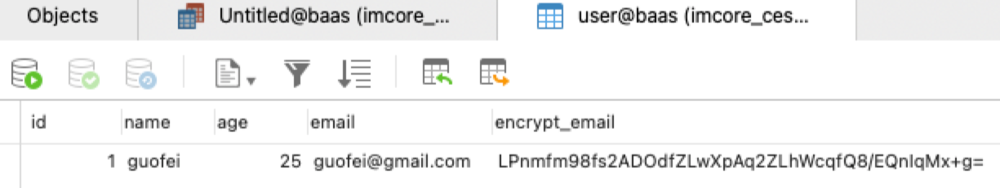
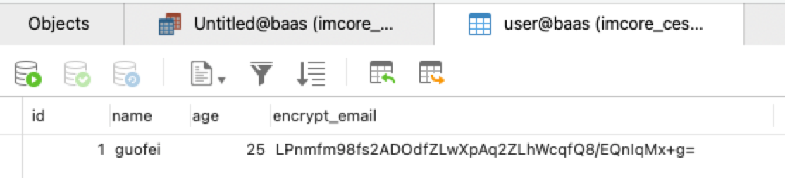

## **ShardingSphere 介绍**

Apache ShardingSphere 是一套开源的分布式数据库解决方案组成的生态圈，它由 JDBC、Proxy 和 Sidecar（规划中）这 3 款既能够独立部署，又支持混合部署配合使用的产品组成。 它们均提供标准化的数据水平扩展、分布式事务和分布式治理等功能，可适用于如 Java 同构、异构语言、云原生等各种多样化的应用场景。

### **背景：**

安全控制一直是治理的重要环节，数据加密属于安全控制的范畴。无论对互联网公司还是传统行业来说，数据安全一直是极为重视和敏感的话题。 数据加密是指对某些敏感信息通过加密规则进行数据的变形，实现敏感隐私数据的可靠保护。 涉及客户安全数据或者一些商业性敏感数据，如身份证号、手机号、卡号、客户号等个人信息按照相关部门规定，都需要进行数据加密。

对于数据加密的需求，在现实的业务场景中一般分为两种情况：

1. 新业务上线，安全部门规定需将涉及用户敏感信息，例如银行、手机号码等进行加密后存储到数据库，在使用的时候再进行解密处理。因为是全新系统，因而没有存量数据清洗问题，所以实现相对简单。
2. 已上线业务，之前一直将明文存储在数据库中。相关部门突然需要对已上线业务进行加密整改。这种场景一般需要处理 3 个问题：
   1. 历史数据需要如何进行加密处理，即洗数
   2. 如何能在不改动业务SQL和逻辑情况下，将新增数据进行加密处理，并存储到数据库；在使用时，再进行解密取出
   3. 如何较为安全、无缝、透明化地实现业务系统在明文与密文数据间的迁移

### **挑战：**

在真实业务场景中，相关业务开发团队则往往需要针对公司安全部门需求，自行实行并维护一套加解密系统。 而当加密场景发生改变时，自行维护的加密系统往往又面临着重构或修改风险。 此外，对于已经上线的业务，在不修改业务逻辑和 SQL 的情况下，透明化、安全低风险地实现无缝进行加密改造也相对复杂

## **目标：**

根据业界对加密的需求及业务改造痛点，提供了一套完整、安全、透明化、低改造成本的数据加密整合解决方案，是Apache ShardingSphere 数据加密模块的主要设计目标

## **技术演练**

在 ShardingSphere 的关于数据脱敏的场景分析里，针对已上线的历史数据，需要业务方自己进行清洗。

1. 首先数据库对那些需要脱敏的列，新增额外的加密列，比如需要对 email 进行脱敏，则新建额外的加密列 encrypt_email。
2. 系统接入 sharding-jdbc，并配置好脱敏规则。
3. 写个脚本，多线程同时遍历需要脱敏的历史数据，将明文列（email）取出，更新到加密列（encrypt_email），由于sharding-jdbc 会根据脱敏规则，对SQL进行解析、改写，最后加密列存储的其实是加密后的数据。

### **使用 ShardingSphere 测试数据脱敏处理**

### **数据库结构**

user 表结构，其中 email 为明文列，encrypt_email 为密文列。

```sql
CREATE TABLE `user` (
  `id` int unsigned NOT NULL AUTO_INCREMENT COMMENT '主键ID',
  `name` varchar(30) CHARACTER SET utf8mb4 COLLATE utf8mb4_general_ci NOT NULL COMMENT '姓名',
  `age` int unsigned NOT NULL COMMENT '年龄',
  `email` varchar(50) CHARACTER SET utf8mb4 COLLATE utf8mb4_general_ci NOT NULL COMMENT '明文邮箱 ',
  `encrypt_email` varchar(50) CHARACTER SET utf8mb4 COLLATE utf8mb4_general_ci DEFAULT '' COMMENT '加密邮箱',
  PRIMARY KEY (`id`),
  UNIQUE KEY `uk_email` (`email`) USING BTREE COMMENT '邮箱唯一索引'
) ENGINE=InnoDB  DEFAULT CHARSET=utf8mb4 COLLATE=utf8mb4_general_ci;
```

### **解析配置**

暂时只配置关于 shardingsphere 部分

```yaml
spring:
  application:
    name: infocent-baas
  shardingsphere:
    datasource:
      name: ds
      ds:
        driver-class-name: com.mysql.cj.jdbc.Driver
        type: com.zaxxer.hikari.HikariDataSource
        jdbc-url: jdbc:mysql://****:3306/baas?characterEncoding=utf8&useSSL=false&serverTimezone=Asia/Shanghai&rewriteBatchedStatements=true
        username: root
        password: 123456
    encrypt:
      # 加密器配置
      encryptors:
        # 加密器的名字，这里设置为：email_encryptor
        email_encryptor:
          # 加密方式，内置MD5/AES
          type: aes
          props:
            # 配置AES加密器的KEY属性
            aes.key.value: 123456abc
      tables:
        # 脱敏表名
        user:
          columns:
            # 脱敏逻辑列，真实面向用户编写SQL
            email:
              # 存储明文列
              plainColumn: email
              # 存储加密列
              cipherColumn: encrypt_email
              # 使用的加密器
              encryptor: email_encryptor
    props:
      # 是否使用密文列查询
      query.with.cipher.column: true
      # 是否打印SQL，默认false
      sql.show: true
```

### **编写业务逻辑**

### **controller**

```java
    @GetMapping("user/{id}")
    private BaseResponse testUsers(@PathVariable("id") Integer id){
        TestUser testUser = userMapper.selectByPrimaryKey(id);
        return BaseResponse.success(JSONUtil.toJsonStr(testUser));
    }
    @GetMapping("addUser")
    private BaseResponse addTestUsers(){
        TestUser testUser = new TestUser();
        testUser.setName("guofei");
        testUser.setEmail("guofei@gmail.com");
        testUser.setAge(25);
        userMapper.insert(testUser);
        return BaseResponse.success(JSONUtil.toJsonStr(testUser));
    }
```

### **mapper**

```xml
<?xml version="1.0" encoding="UTF-8"?>
<!DOCTYPE mapper PUBLIC "-//mybatis.org//DTD Mapper 3.0//EN" "<http://mybatis.org/dtd/mybatis-3-mapper.dtd>">
<mapper namespace="com.infocent.infocentbaas.mapper.TestUserMapper">
    <resultMap id="BaseResultMap" type="com.infocent.infocentbaas.entity.TestUser">
        <id column="id" jdbcType="INTEGER" property="id"/>
        <result column="name" jdbcType="VARCHAR" property="name"/>
        <result column="age" jdbcType="VARCHAR" property="age"/>
        <result column="email" jdbcType="VARCHAR" property="email"/>
        <result column="encrypt_email" jdbcType="VARCHAR" property="encryptEmail"/>
    </resultMap>
    <sql id="Base_Column_List">
        id, `name`, age, email, encrypt_email
    </sql>
    <select id="selectByPrimaryKey" parameterType="java.lang.Integer" resultMap="BaseResultMap">
        select
        <include refid="Base_Column_List"/>
        from user
        where id = #{id,jdbcType=INTEGER}
    </select>
    <insert id="insert" keyColumn="id" keyProperty="id" parameterType="com.infocent.infocentbaas.entity.TestUser"
            useGeneratedKeys="true">
        insert into user (`name`, age, email)
        values (#{name,jdbcType=VARCHAR}, #{age,jdbcType=INTEGER}, #{email,jdbcType=VARCHAR})
    </insert>
</mapper>
```

### **entity**

```java
@Data
public class TestUser {
    private Integer id;
    private String name;
    private Integer age;
    private String email;
    private String encryptEmail;
}
```

### **运行试验对比**

插入一条数据

```java
add(new User("guofei","guofei@gmail.com","25"));// 伪代码
```

观察控制台打印的两条 log

```java
2021-09-24 14:46:51.749  INFO 24757 --- [nio-8200-exec-2] ShardingSphere-SQL                       : Logic SQL: insert into user (`name`, age, email)
        values (?, ?, ?)
2021-09-24 14:46:51.749  INFO 24757 --- [nio-8200-exec-2] ShardingSphere-SQL                       : SQLStatement:
2021-09-24 14:46:51.750  INFO 24757 --- [nio-8200-exec-2] ShardingSphere-SQL                       : Actual SQL: ds ::: insert into user (`name`, age, encrypt_email, email)
        values (?, ?, ?, ?) ::: [guofei, 25, LPnmfm98fs2ADOdfZLwXpAq2ZLhWcqfQ8/EQnIqMx+g=, guofei@gmail.com]
```

再观察数据库



加密列 encrypt_email 被 sharding-jdbc 加密存储

查询数据，并设置 query.with.cipher.column: true，开启密文列查询：

观察控制台打印的两条 log

```
2021-09-24 14:53:23.449  INFO 24757 --- [nio-8200-exec-5] ShardingSphere-SQL                       : Logic SQL: select

        id, `name`, age, email, encrypt_email

        from user
        where id = ?
2021-09-24 14:53:23.450  INFO 24757 --- [nio-8200-exec-5] ShardingSphere-SQL                       : Actual SQL: ds ::: select

        id, `name`, age, encrypt_email AS email, encrypt_email

        from user
        where id = ? ::: [1]
```

获得结果

```
{
    "code": "0",
    "msg": "success",
    "data": "{\\"encryptEmail\\":\\"LPnmfm98fs2ADOdfZLwXpAq2ZLhWcqfQ8/EQnIqMx+g=\\",\\"name\\":\\"guofei\\",\\"id\\":1,\\"age\\":25,\\"email\\":\\"guofei@gmail.com\\"}",
    "success": true
}
```

设置query.with.cipher.column: false，关闭密文列查询：

观察控制台打印的两条 log

```java
2021-09-24 14:58:12.543  INFO 24944 --- [nio-8200-exec-1] ShardingSphere-SQL                       : Logic SQL: select

        id, `name`, age, email, encrypt_email

        from user
        where id = ?
2021-09-24 14:58:12.544  INFO 24944 --- [nio-8200-exec-1] ShardingSphere-SQL                       : Actual SQL: ds ::: select

        id, `name`, age, email AS email, encrypt_email

        from user
        where id = ? ::: [1]
```

从开启和关闭密文列查询查询配置可以得出：

**开启密文列查询配置后，实际sharding-jdbc会在中间把密文解密后返回，最终返回实体里面的email应该是解密后的明文，密文存在的还是在密文列 encrypt_email 中**

假如后期业务上线一段时间后（或者生产环境），需要完全删除明文列，只保留密文列，在不改变代码的基础上是否可行？那直接在数据库层，把 email 列删除



已删除明文 email 列

查询观察控制台 log 和返回结果

```java
2021-09-24 15:04:37.648  INFO 24944 --- [nio-8200-exec-4] ShardingSphere-SQL                       : Logic SQL: select

        id, `name`, age, email, encrypt_email

        from user
        where id = ?
2021-09-24 15:04:37.651  INFO 24944 --- [nio-8200-exec-4] ShardingSphere-SQL                       : Actual SQL: ds ::: select

        id, `name`, age, email AS email, encrypt_email

        from user
        where id = ? ::: [1]
2021-09-24 15:04:37.727 ERROR 24944 --- [nio-8200-exec-4] c.i.i.Exception.GlobalExceptionHandler   : 发生业务异常！原因是:
### Error querying database.  Cause: java.sql.SQLSyntaxErrorException: Unknown column 'email' in 'field list'
### The error may exist in file [/Users/guogoffy/companyImcore/projectImcore/BaaSAssist/code/infocent-baas/target/classes/mapper/TestUserMapper.xml]
### The error may involve com.infocent.infocentbaas.mapper.TestUserMapper.selectByPrimaryKey-Inline
### The error occurred while setting parameters
### SQL: select                   id, `name`, age, email, encrypt_email               from user         where id = ?
### Cause: java.sql.SQLSyntaxErrorException: Unknown column 'email' in 'field list'
; bad SQL grammar []; nested exception is java.sql.SQLSyntaxErrorException: Unknown column 'email' in 'field list'
```

此时显示报错，因为已经删除了 email 列，但是配置中还配置了 plainColumn: email，所以报错 SQLSyntaxErrorException

注释掉 #plainColumn: email

执行观察观察控制台 log 和返回结果

```java
2021-09-24 15:07:22.231  INFO 25144 --- [nio-8200-exec-1] ShardingSphere-SQL                       : Logic SQL: select

        id, `name`, age, email, encrypt_email

        from user
        where id = ?
2021-09-24 15:07:22.231  INFO 25144 --- [nio-8200-exec-1] ShardingSphere-SQL                       : Actual SQL: ds ::: select

        id, `name`, age, encrypt_email AS email, encrypt_email

        from user
        where id = ? ::: [1]
{
    "code": "0",
    "msg": "success",
    "data": "{\\"encryptEmail\\":\\"LPnmfm98fs2ADOdfZLwXpAq2ZLhWcqfQ8/EQnIqMx+g=\\",\\"name\\":\\"guofei\\",\\"id\\":1,\\"age\\":25,\\"email\\":\\"LPnmfm98fs2ADOdfZLwXpAq2ZLhWcqfQ8/EQnIqMx+g=\\"}",
    "success": true
}
```

可以看到返回的也是密文，为什么可以正常执行：

因为有 logicColumn 存在，用户的编写 SQL 都面向这个虚拟列，Encrypt-JDBC 就可以把这个逻辑列和底层数据表中的密文列进行映射转换

## **总结**

sharding-jdbc 确实做到了**屏蔽底层对数据的脱敏处理** ，但是要接入 sharding-jdbc 的前提是，**团队有制定严格的SQL规范** ，这样可能接入数据库中间件的时候，才会出现比较少的问题，对于一些老系统，动辄几百行的SQL，各种复杂函数，还是放弃接入的好，到时候只会是一步一个坑。

