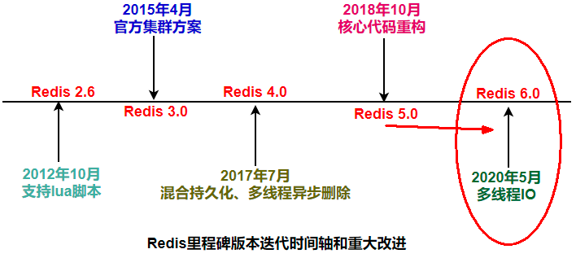
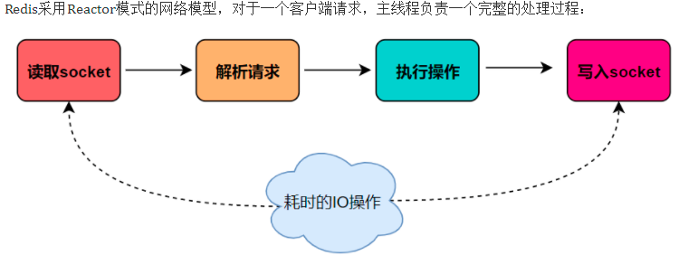
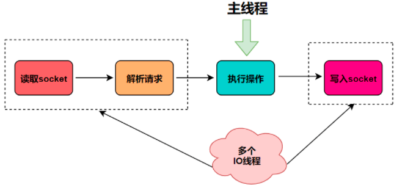
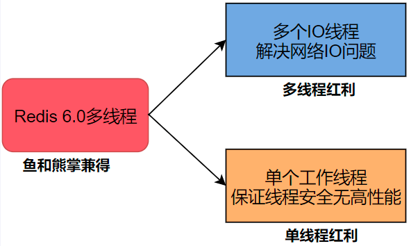
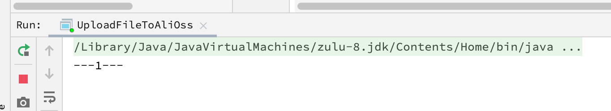

## 前沿

这篇文章依旧从总分总的结构开始学起，要学习I/O多路复用，就得先学网络I/O，然后带着Redis为什么这么快以及Redis到底是单线程还是多线程这两个问题一步一步学习，最后得出结论。在得出这个结论的过程中学习所用到的技术和理论，以及Redis作者为何这么设计，技术如何服务于应用。

## 预热

### Redis 为什么选择单线程？

这种问法其实并不严谨，为啥这么说呢?

Redis的版本很多3.x、4.x、6.x，版本不同架构也是不同的，不限定版本问是否单线程也不太严谨。

1. 版本3.x ，最早版本，也就是大家口口相传的redis是单线程，阳哥2016年讲解的redis就是3.X的版本。
2. 版本4.x，严格意义来说也不是单线程，而是负责处理客户端请求的线程是单线程，但是 开始加了点多线程的东西(异步删除) 。
3. 最新版本的6.0.x后， 告别了大家印象中的单线程，用一种全新的多线程来解决问题。



5.0版本是直接升级到6.0版本，对于这个激进的升级，Redis之父antirez表现得很有信心和兴奋，所以第一时间发文来阐述6.0的一些重大功能"Redis 6.0.0 GA is out!"。

[Redis 6.0.0 GA is out! - ](http://antirez.com/news/132)

Redis单线程：主要是指Redis的网络IO和键值对读写是由一个线程来完成的，Redis在处理客户端的请求时包括获取 (socket 读)、解析、执行、内容返回 (socket 写) 等都由一个顺序串行的主线程处理，这就是所谓的“单线程”。这也是Redis对外提供键值存储服务的主要流程。

但Redis的其他功能， 比如持久化、异步删除、集群数据同步等等，其实是由额外的线程执行的。

Redis工作线程是单线程的，但是，整个Redis来说，是多线程的。

### Redis 为什么后面又加入多线程？

Redis3.x单线程时代但性能依旧很快的主要原因：

- 基于内存操作：Redis的所有数据都存在内存中，因此所有的运算都是内存级别的
- 数据结构简单：Redis的数据结构是专门设计的，而这些简单的数据结构的查询和操作的时间大部分复杂度都是O(1)
- 多路复用和非阻塞IO：Redis使用多路复用功能来监听多个socket连接客户端，这样就可以使用一个线程连接来处理多个请求，减少线程切换带来的开销，同时也避免了IO阻塞操作
- 避免上下文切换：因为是单线程模型，因此避免了不必要的上下文切换和多线程竞争，且单线程不存在死锁的问题

为什么后面加入了多线程：

单线程的苦恼：正常情况下使用 del 指令可以很快的删除数据，而当被删除的 key 是一个非常大的对象时，例如时包含了成千上万个元素的 hash 集合时，那么 del 指令就会造成 Redis 主线程卡顿。

 这就是redis3.x单线程时代最经典的故障，大key删除的头疼问题，由于redis是单线程的，del bigKey .....等待很久这个线程才会释放，类似加了一个synchronized锁，你可以想象高并发下，程序堵成什么样子？

所以4.0版本引入了多个线程来实现数据的异步惰性删除等功能，但是其处理读写请求的仍然是一个线程，所以算是狭义上的单线程。

### Redis6.0 的多线程和IO多路复用入门篇

对于Redis来说，主要的性能瓶颈是内存或者网络带宽，并非CPU。

所以，最后可以确定瓶颈在网络IO，Redis6真正的多线程登场。

I/O 的读和写本身是堵塞的，比如当 socket 中有数据时，Redis 会通过调用先将数据从内核态空间拷贝到用户态空间，再交给 Redis 调用，而这个拷贝的过程就是阻塞的，当数据量越大时拷贝所需要的时间就越多，而这些操作都是基于单线程完成的。



在 Redis 6.0 中新增了多线程的功能来提高 I/O 的读写性能，他的主要实现思路是将主线程的 IO 读写任务拆分给一组独立的线程去执行，这样就可以使多个 socket 的读写可以并行化了，采用多路 I/O 复用技术可以让单个线程高效的处理多个连接请求（尽量减少网络IO的时间消耗），将最耗时的Socket的读取、请求解析、写入单独外包出去，剩下的命令执行仍然由主线程串行执行并和内存的数据交互。



结合可知，网络IO操作就变成多线程化了，其他核心部分仍然是线程安全的，是个不错的折中办法。

Redis 6.0 将网络数据读写、请求协议解析通过多个IO线程的来处理 ，对于真正的命令执行来说，仍然使用主线程操作，一举两得，便宜占尽！！




### Redis6.0 是否默认开启多线程

Redis将所有数据放在内存中，内存的响应时长大约为100纳秒，对于小数据包，Redis服务器可以处理8W到10W的QPS，这也是Redis处理的极限了， 对于80%的公司来说，单线程的Redis已经足够使用了。

在Redis6.0中， 多线程机制默认是关闭的 ，如果需要使用多线程功能，需要在redis.conf中完成两个设置

```shell
# By default threading is disabled, we suggest enabling it only in machines
# that have at least 4 or more cores, leaving at least one spare core.
# Using more than 8 threads is unlikely to help much. We also recommend using
# threaded I/O only if you actually have performance problems, with Redis
# instances being able to use a quite big percentage of CPU time, otherwise
# there is no point in using this feature.
#
# So for instance if you have a four cores boxes, try to use 2 or 3 I/O
# threads, if you have a 8 cores, try to use 6 threads. In order to
# enable I/O threads use the following configuration directive:
#
# io-threads 4
#
# Setting io-threads to 1 will just use the main thread as usual.
# When I/O threads are enabled, we only use threads for writes, that is
# to thread the write(2) syscall and transfer the client buffers to the
# socket. However it is also possible to enable threading of reads and
# protocol parsing using the following configuration directive, by setting
# it to yes:
#
# io-threads-do-reads no
```


- 设置io-thread-do-reads配置项为yes，表示启动多线程。
- 设置线程个数。关于线程数的设置，官方的建议是如果为 4 核的 CPU，建议线程数设置为 2 或 3， 如果为 8 核 CPU 建议线程数设置为 6 ，线程数一定要小于机器核数，线程数并不是越大越好。

### Redis 还是那个 Redis

Redis自身出道就是优秀，基于内存操作、数据结构简单、多路复用和非阻塞 I/O、避免了不必要的线程上下文切换等特性，在单线程的环境下依然很快；

但对于大数据的 key 删除还是卡顿厉害，因此在 Redis 4.0 引入了多线程unlink key/flushall async 等命令，主要用于 Redis 数据的异步删除；

而在 Redis 6.0 中引入了 I/O 多线程的读写，这样就可以更加高效的处理更多的任务了， Redis 只是将 I/O 读写变成了多线程 ，而 命令的执行依旧是由主线程串行执行的 ，因此在多线程下操作 Redis 不会出现线程安全的问题。

Redis 无论是当初的单线程设计，还是如今与当初设计相背的多线程，目的只有一个：让 Redis 变得越来越快。

所以 Redis 依旧没变，他还是那个曾经的少年。

## 分而学习

要把上面的知识点彻底搞明白，弄清楚。就得从很多底层开始学起，比如说Unix网络编程中的五种IO模型：阻塞IO（Blocking IO=BIO）、非阻塞IO（NoneBlocking IO=NIO）、IO多路复用（IO multiplexing）、信号驱动（signal driven IO）、异步IO（asynchronous IO）。

## 阻塞 IO与非阻塞 IO

### 阻塞非阻塞

#### 什么是阻塞

这个词，既陌生、又熟悉。就是一提到都知道，但一具体解释，就迷迷糊糊。

这个函数是阻塞的吗？

```java
public void function() {
   while(true){}
}
```

这个呢？

```java
public void function() {
   Thread.sleep(2000);
}
```

#### 从代码入手

```java
public static void main(String[] args) {
        Scanner scanner = new Scanner(System.in);
			  System.out.println("---1---");
        String line = scanner.nextLine();
        System.out.println("----2--");
        System.out.println(line);
    }
```

运行这段代码程序将会停在 ` scanner.nextLine()`这一行，如果在控制台输入并且按下了回车，程序才会继续往下走，打印出具体的结果。



跟踪这段代码，一直跟到无法再往下跟，发现到了这一步：

```java
/**
     * Reads a subarray as a sequence of bytes.
     * @param b the data to be written
     * @param off the start offset in the data
     * @param len the number of bytes that are written
     * @exception IOException If an I/O error has occurred.
     */
    private native int readBytes(byte b[], int off, int len) throws IOException;
```

当然也可以一直跟踪下去，通过JDK的源码，但是，也可以通过 `strace`命令直接将其找到：

```shell
strace -ff -e trace=desc java Zuse
```

然后可以发现程序阻塞到了这里

```shell
read(0,
```

当输入字符串"hello"后，发现打印出了这个

```shell
read(0, "hello\n", 8192)
```

OK。可以确定触发Linux 的系统调用的就是 read()，相当于直接访问到了Linux内核的代码，中间什么的，暂时可以不用在意。

> 具体这个怎么执行的，可以看这篇文章学习：https://mp.weixin.qq.com/s/vekemOfUHBjZSy3uXb49Rw

一直往下走，会发现这段代码：

```c
// 将当前任务置为可中断的等待状态
void interruptible_sleep_on (struct task_struct **p) {
 ...
 current->state = TASK_INTERRUPTIBLE;
 schedule ();
 ...
}
```

也就是说，只要用户不输入，自负队列就为空，此时将调用`interruptible_sleep_on`函数，将线程状态变为可中断的等待状态，同时调用` schedule ()`函数，进行一次进程调度。

> 关于进程是怎么调度的，可以看这篇文章学习：https://mp.weixin.qq.com/s/zzGcNr59AJ3bqI9GF9xMqA

它里面有一个runnable状态（state=0）,观察上面的代码可以看到江state设置成了`TASK_INTERRUPTIBLE`，意思就是告诉进程调度算法，下次不要调度我，相当于放弃了CPU的执行权，也就是相当于将当前进程挂起。

而底层的这一操作，直接让上层看来就好像停在那一行不走一样。这就是阻塞的本质。

既然有阻塞就会唤醒，同样的也可以发现这样一句代码：

```c
wake_up(&tty->secondary.proc_list);
```

跟进去

```c
void wake_up(struct task_struct **p)
{
    if (p && *p) {
        (**p).state = TASK_RUNNABLE;
        *p = NULL;
    }
}
```

可以发现，就是将进程的状态改为了`TASK_RUNNABLE`，一会进程调度时，就可以参与了，这就是唤醒的本质。

所以，Java 代码中的一行 readline 会导致**阻塞**，实际上就是运行到了这段代码。

```c
interruptible_sleep_on (&tty->secondary->proc_list);
```

而键盘输入后会将其**唤醒**，实际上就是运行到了这段代码。

```c
wake_up(&tty->secondary.proc_list);
```

这两段代码里，其实就是通过**改写 state 值**去玩的，剩下的交给**调度算法**。

```c
// 阻塞
current->state = TASK_INTERRUPTIBLE;
// 唤醒
(**p).state = TASK_RUNNABLE;
```

回到开头的问题中，跟代码可以发现第一个不是阻塞，第二个是阻塞。

以上就是从代码的角度分析，而如何理解呢？

调用方一直在等待而且别的什么事都不做，当前进/线程会被挂起，啥都不干。

> 进程和线程的区别，linux下都是task_struct结构，一视同仁参与调度，只不过共享的资源不同。调度到哪个就运行哪个，在微观的调度机制层面，其实可以忘掉进程这个概念，调度机制看到的全是一个个线程。
>
> 阻塞、挂起的本质就是让出CPU资源，一个被动一个主动

#### 什么是非阻塞

调用在发出去后，调用方先去忙别的事，不会阻塞当前进/线程，而会立即返回

#### 阻塞非阻塞本质

**阻塞和非阻塞，描述的是函数本身，在等待某一事件的结果时，是将线程挂起，还是立即返回一个未就绪等信息。**

一般都是描述 IO 等，也别想其他的了，比如一个读取磁盘数据的函数。

至于这个函数被调用者用同步还是异步的方式调用，都不影响这个函数本身是阻塞还是非阻塞的性质。

说到这里，顺便记录一下什么同步、什么是异步？

### 同步异步

**同步和异步，描述的是调用者，要不要主动等待函数的返回值。**

这个就是同步

```java
public static void main() {
    int result = doSomeThing();
}
```

这个就是异步

```java
public static void main() {
    new Thread(() -> {
        int result = doSomeThing();    
    })
}
```

当然，异步可以配合回调机制，但这就和同步异步本身的区别没啥关系了，添枝加叶的东西而已。

## IO 多路复用

