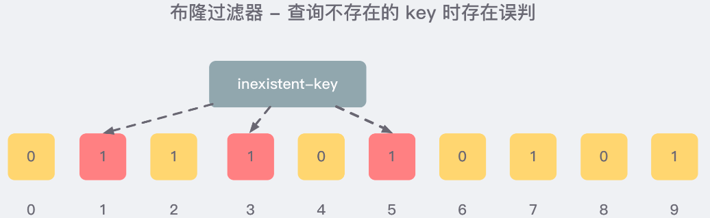

## 是什么？

**布隆过滤器**（英语：Bloom Filter）是1970年由布隆提出的。它实际上是一个很长的二进制向量和一系列随机映射（hash）函数。布隆过滤器可以用于检索一个元素是否在一个集合中。

通常我们会遇到很多要判断一个元素是否在某个集合中的业务场景，一般想到的是将集合中所有元素保存起来，然后通过比较确定。

链表、树、散列表（又叫哈希表，Hash table）等等数据结构都是这种思路。

但是随着集合中元素的增加，我们需要的存储空间也会呈现线性增长，最终达到瓶颈。同时检索速度也越来越慢，上述三种结构的检索时间复杂度分别为O(n),O(logn),O(1)。这个时候，布隆过滤器（Bloom Filter）就应运而生。


一言以蔽之：由一个初值都为0的bit数组和多个哈希函数构成没用来快速判断某个数据是否存在

本质就是判断具体数据在不在一个大的集合里面

## 特点

- 高效的插入和查询，占用空间少，返回的结果是不准确的。
- **一个元素如果判断结果为存在的时候元素不一定存在，但是判断结果为不存在的时候一定不存在**
- 布隆过滤器可以添加元素，但是不能删除元素。因为删除元素会导致误判率增加
- 误判只会发生在过滤器没有添加过的元素，对于添加过的元素不会发生误判

简单总结：有，是可能有；无，是肯定无。

## 使用场景

1. 解决缓存穿透的问题

   简单提一下什么是缓存穿透：一般情况下，先查询缓存redis是否有该条数据，缓存中没有时，再查询数据库。当数据库也不存在该条数据时，每次查询都要访问数据库，这就是缓存穿透。缓存透带来的问题是，当有大量请求查询数据库不存在的数据时，就会给数据库带来压力，甚至会拖垮数据库。

   **可以使用布隆过滤器解决缓存穿透的问题**

   把已存在数据的key存在布隆过滤器中，相当于redis前面挡着一个布隆过滤器。当有新的请求时，先到布隆过滤器中查询是否存在：如果布隆过滤器中不存在该条数据则直接返回；如果布隆过滤器中已存在，才去查询缓存redis，如果redis里没查询到则穿透到Mysql数据库。

2. 黑名单校验

   发现存在黑名单中的，就执行特定操作。比如：识别垃圾邮件，只要是邮箱在黑名单中的邮件，就识别为垃圾邮件。假设黑名单的数量是数以亿计的，存放起来就是非常耗费存储空间的，布隆过滤器则是一个较好的解决方案。把所有黑名单都放在布隆过滤器中，在收到邮件时，判断邮件地址是否在布隆过滤器中即可。

## 原理

- Java中传统的哈希

  哈希函数的概念是：将任意大小的输入数据转换成特定大小的输出数据的函数，转换后的数据称为哈希值或哈希编码，也叫散列值。

  

  如果两个散列值是不相同的（根据同一函数）那么这两个散列值的原始输入也是不相同的。这个特性是散列函数具有确定性的结果，具有这种性质的散列函数称为单向散列函数。

   散列函数的输入和输出不是唯一对应关系的， 如果两个散列值相同，两个输入值很可能是相同的，但也可能不同 ，这种情况称为“散列碰撞（collision）”。

   用 hash表存储大数据量时，空间效率还是很低，当只有一个 hash 函数时，还很容易发生哈希碰撞。

  举例：

  ```java
      public static void main(String[] args) {
          Set<Integer> objects = new HashSet<>();
          for (int i = 0; i < 200000; i++) {
              int i1 = new Object().hashCode();
              if (objects.contains(i1)){
                  System.out.println(("出现了重复的hashcode:" + i1 + "\t 运行到" + i));
              }
              objects.add(i1);
          }
      }
  出现了重复的hashcode:2134400190	 运行到103642
  出现了重复的hashcode:651156501	 运行到109089
  出现了重复的hashcode:2038112324	 运行到143273
  出现了重复的hashcode:1164664992	 运行到144206
  出现了重复的hashcode:273791087	 运行到150186
  出现了重复的hashcode:996371445	 运行到178798
  出现了重复的hashcode:254720071	 运行到182111
  出现了重复的hashcode:1872358815	 运行到184739
    -------------------------------------------
  System.out.println("Aa".hashCode());
  System.out.println("BB".hashCode());
  System.out.println("柳柴".hashCode());
  System.out.println("柴柕".hashCode());
  2112
  2112
  851553
  851553
  ```

- 原理和数据结构

  布隆过滤器(Bloom Filter) 是一种专门用来解决去重问题的高级数据结构。

  实质就是 一个大型 **位数组**  和几个不同的无偏hash函数 (无偏表示分布均匀)。由一个初值都为零的bit数组和多个个哈希函数构成，用来快速判断某个数据是否存在 。但是跟 HyperLogLog 一样，它也一样有那么一点点不精确，也存在一定的误判概率。

  - 添加key

    使用多个hash函数对key进行hash运算得到一个整数索引值，对位数组长度进行取模运算得到一个位置，每个hash函数都会得到一个不同的位置，将这几个位置都置1就完成了add操作。

  - 查询key

    只要有其中一位是零就表示这个key不存在，但如果都是1， 则不一定存在对应的key。

  当有变量被加入集合时，通过N个映射函数将这个变量映射成位图中的N个点，把它们置为 1（假定有两个变量都通过 3 个映射函数）。

  

  查询某个变量的时候我们只要看看这些点是不是都是 1， 就可以大概率知道集合中有没有它了，如果这些点， **有任何一个为零则被查询变量一定不在，**如果都是 1，则被查询变量很 可能存在。

  为什么说是可能存在，而不是一定存在呢？那是因为映射函数本身就是散列函数，散列函数是会有碰撞的。

  > 正是基于布隆过滤器的快速检测特性，我们可以在把数据写入数据库时，使用布隆过滤器做个标记。当缓存缺失后，应用查询数据库时，可以通过查询布隆过滤器快速判断数据是否存在。如果不存在，就不用再去数据库中查询了。这样一来，即使发生缓存穿透了，大量请求只会查询Redis和布隆过滤器，而不会积压到数据库，也就不会影响数据库的正常运行。布隆过滤器可以使用Redis实现，本身就能承担较大的并发访问压力。

- 步骤

  - 初始化

    布隆过滤器 本质上 是由长度为 m 的位向量或位列表（仅包含 0 或 1 位值的列表）组成，最初所有的值均设置为 0 。

  - 添加

    当我们向布隆过滤器中添加数据时，为了尽量地址不冲突， 会使用多个 hash 函数对 key 进行运算 ，算得一个下标索引值，然后对位数组长度进行取模运算得到一个位置，每个 hash 函数都会算得一个不同的位置。再把位数组的这几个位置都置为 1 就完成了 add 操作。

    例如，我们添加一个字符串wmyskxz：

    

  - 判断是否存在

    向布隆过滤器查询某个key是否存在时，先把这个 key 通过相同的 多个 hash 函数进行运算 ，查看对应的位置是否都为 1，只要有一个位为 0，那么说明布隆过滤器中这个 key 不存在；如果这几个位置全都是 1，那么说明极有可能存在；因为这些位置的 1 可能是因为其他的 key 存在导致的，也就是前面说过的hash冲突。。。。。

    

     就比如我们在 add 了字符串wmyskxz数据之后，很明显下面1/3/5 这几个位置的 1 是因为第一次添加的 wmyskxz 而导致的；此时我们查询一个没添加过的不存在的字符串inexistent-key，它有可能计算后坑位也是1/3/5 ，这就是误判了......
  
    

- 误判（为什么不能删除）

  布隆过滤器的误判是指多个输入经过哈希之后在相同的bit位置1了，这样就无法判断究竟是哪个输入产生的，因此误判的根源在于相同的 bit 位被多次映射且置 1。

   这种情况也造成了布隆过滤器的删除问题，因为布隆过滤器的每一个 bit 并不是独占的，很有可能多个元素 共享了某一位 。如果我们直接删除这一位的话，会影响其他的元素。

## 优缺点

- 优点

  高效的插入和查询，占用空间少

- 缺点

  - 不能删除元素：因为删除元素会导致误判率增加。因为hash冲突同一个位置可能存在的东西是有多个共有的，删除一个元素的同时可能也把其他的删除了。
  - 存在误判：不同的数据可能出来相同的hash值

## 总结

本质上布隆过滤器是一种数据结构，比较巧妙的概率型数据结构（probabilistic data structure），特点是高效地插入和查询，可以用来告诉你 **“某样东西一定不存在或者可能存在”**。

相比于传统的 List、Set、Map 等数据结构，它更高效、占用空间更少，但是缺点是其返回的结果是概率性的，而不是确切的。

注：传统的布隆过滤器并不支持删除操作。但是名为 Counting Bloom filter 的变种可以用来测试元素计数个数是否绝对小于某个阈值，它支持元素删除。可以参考文章 [Counting Bloom Filter 的原理和实现](https://cloud.tencent.com/developer/article/1136056)


