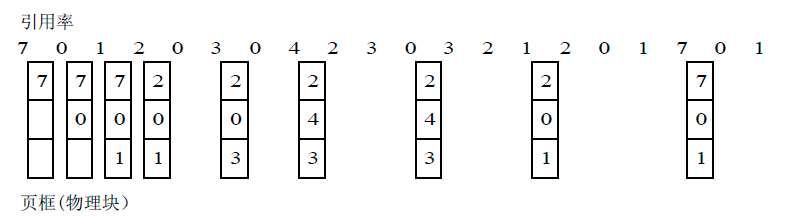

[TOC]


## Redis 的删除策略

- 立即删除
- 惰性删除
- 定期删除

### 立即删除

Redis 不可能时时刻刻遍历所有被设置了生存时间的 key，来检测数据是否已经到达过期时间，然后对它进行删除。立即删除能保证内存中数据的最大新鲜度，因为它保证过期键值会在过期后立马被删除，其所占用的内存也会随之释放。但是立即删除对cpu是最不友好的。因为删除会占用cpu的时间，如果刚好碰上cpu比较忙的时候，比如正在做交集或排序等计算的时候，就会给cpu造成额外的压力。

优点：保证内存中数据的最大新鲜度

缺点：产生大量的性能消耗，同时也会影响数据的读取操作

总结：**对CPU不友好，用处理器性能换取存储空间（拿时间换空间）**

### 惰性删除

数据到达过期时间，不做处理。等下次访问该数据时，如果未过期，返回数据；发现已经过期，删除，返回不存在。

缺点：对内存是最不友好的。

如果一个键已经过期，而这个键又仍然保留在Redis中，那么只要这个过期键不被删除，他所占用的内存就不会释放。

在使用惰性删除策略时，如果数据库中有非常多的过期键，而这些过期键又恰好没有被访问到的话，那么她们也许永远也不会被删除（除非用户手动执行FLUSHDB），理论上来说，我们将这种情况 看作是一种内存泄漏----无用的垃圾占用了大量的内存，而服务器却不会自己去释放他们。这对于运行状态非常依赖内存的Redis服务器来说，肯定不是什么好事。

总结：**对内存不友好，用存储空间换取处理器性能（拿空间换时间）**

### 定期删除

定期删除是前两种策略的折中策略：**每隔一段时间执行一次删除过期键操作**，并通过限制删除操作执行的时长和频率来减少删除操作对cpu的影响。

周期性轮询redis库中的时效性数据，采用随机抽取的策略，利用过期数据占比的方式控制删除频度 。

特点1：CPU性能占用设置有峰值，检测频度可自定义设置 

特点2：内存压力不是很大，长期占用内存的冷数据会被持续清理

总结：**周期性抽查存储空间 （随机抽查，重点抽查）** 

举例：redis默认每个100ms检查，是否有过期的key，有过期key则删除。 注意： redis不是每隔100ms将所有的key检查一次而是随机抽取进行检查( 如果每隔100ms,全部key进行检查，redis直接进去ICU )。因此，如果只采用定期删除策略，会导致很多key到时间没有删除。

定期删除策略的难点是确定删除操作执行的时长和频率：如果删除操作执行得太频繁，或者执行的时间太长，定期删除策略就会退化成立即删除策略，以至于将CPU时间过多地消耗在删除过期键上面。如果删除操作执行得太少，或者执行的时间太短，定期删除策略又会和惰性删除束略一样，出现浪费内存的情况。因此，如果采用定期删除策略的话，服务器必须根据情况，合理地设置删除操作的 执行时长和执行频率。

上面三种在极端情况下都会有问题：定期删除（从来没有被抽查到）；惰性删除（也从来没有被点中使用过），存在内存泄漏的风险。所以必须要有一个更好的兜底方案。

**Redis自身提供的三大删除策略，都不是最完美的，所有引入缓存淘汰策略。**

## Redis缓存淘汰策略

### 种类（Redis6.0.8）

1. volatile-lru：对所有设置了过期时间的key使用LRU算法进行删除
2. allkeys-lru：对所有key使用LRU算法进行删除
3. volatile-lfu：对所有设置了过期时间的key使用LFU算法进行删除
4. allkeys-lfu：对所有key使用LFU算法进行删除
5. volatile-random：对所有设置了过期时间的key随机删除
6. allkeys-random：对所有key随机删除
7. volatile-ttl：删除马上过期的key
8. noeviction：不会删除任何key（默认）

```shell
# volatile-lru -> Evict using approximated LRU, only keys with an expire set.
# allkeys-lru -> Evict any key using approximated LRU.
# volatile-lfu -> Evict using approximated LFU, only keys with an expire set.
# allkeys-lfu -> Evict any key using approximated LFU.
# volatile-random -> Remove a random key having an expire set.
# allkeys-random -> Remove a random key, any key.
# volatile-ttl -> Remove the key with the nearest expire time (minor TTL)
# noeviction -> Don't evict anything, just return an error on write operations.
# The default is:
#
# maxmemory-policy noeviction（默认）
```

总结：（2 * 4 = 8）

1. 2个维度（过期键中筛选、所有键中筛选）
2. 4个方面（LRU、LFU、random、ttl）
3. 8个方案

### 1、LRU（重点学习）

#### 什么是LRU

以内存访问为例解释缓存的工作原理。假设缓存的大小固定，初始状态为空，每发生一次读内存操作，首先查找待读取的数据是否存在于缓存中，若是，则缓存命中，返回数据；若不是，则缓存未命中，从内存中读取数据，并把该数据添加到缓存中。

向缓存中添加数据时，如果缓存已满，则需要删除访问时间最早的那条数据，这种更新缓存的办法就叫LRU（Least Recently Used）。

#### 核心思想

最近使用的数据很大概率将会再次被使用。而最近一段时间都没有使用的数据，很大概率不会再使用。

#### 时间复杂度

LRU最需要关注的就是读性能和写性能，理想的LRU应该可以在O(1)的时间内读取一条数据或更新一条数据，也就是说读写的时间复杂度都是O(1)。

可以想到HashMap，根据数据的键访问数据可以达到O(1)的速度，但是更新缓存的速度无法达到O(1)，因为需要确定那一条数据的访问时间最早，就需要遍历所有缓存才能找到。

因此需要一种既按访问时间排序，又能在常数时间内随机访问的数据结构。

#### 实现逻辑

通过HashMap+双链表的思想来实现。

HashMap保证通过Key访问数据的时间为O(1)，双向链表则按照访问时间的顺序依次穿过每个数据。之所以选择双向链表而不是单链表，是为了可以从中间任意节点修改链表结构，而不必从头节点开始遍历。

#### 实现代码

```java
/**
 * Created with IntelliJ IDEA.
 *
 * @Author: GuoFei
 * @Date: 2021/11/15/15:18
 * @Description: LRU（Least Recently Used） 缓存算法
 * 使用HashMap + 双向列表实现，使得get和put的时间复杂度达到O(1)
 * get:读缓存时从HashMap中查找key
 * put:更新缓存时同时更新HashMap和双向链表，双向链表始终按照访问顺序排列
 *
 */
public class LRUCache {


    /**
     * 构造函数
     * @param capacity
     */
    public LRUCache(int capacity) {
        this.capacity = capacity;
        this.map = new HashMap<>((int)(capacity / 0.75 + 1), 0.75f);
        this.head = new Entry(0, 0);
        this.tail = new Entry(0, 0);
        head.next = tail;
        tail.prev = head;
    }

    /**
     * 缓存容量
     */
    private final int capacity;
    /**
     * 用于O(1)访问到的缓存的HashMap
     */
    private HashMap<Integer,Entry> map;
    /**
     * 双向链表头节点，这边的缓存项访问时间较早
     */
    private Entry head;
    /**
     * 双向链表尾节点，这边的缓存项访问时间较新
     */
    private Entry tail;


    /**
     * 从缓存中获取key对应的值，若未命中则返回-1,如果命中，调整节点位置
     * @param key
     * @return
     */
    public int get(int key){
        if (map.containsKey(key)){
            Entry entry = map.get(key);
            popToTail(entry);
            return entry.value;
        }
        return -1;
    }

    /**
     * 向缓存中插入或更新值
     * @param key 待更新的键
     * @param value 待更新的值
     */
    public void put(int key,int value){
        if (map.containsKey(key)){
            Entry entry = map.get(key);
            entry.value = value;
            popToTail(entry);
        }else{
            Entry newEntry = new Entry(key, value);
            if (map.size() >= capacity){
                Entry entry = removeFirst();
                map.remove(entry.key);
            }
            addToTail(newEntry);
            map.put(key,newEntry);
        }
    }


    /**
     * 缓存项的包装类 包含键、值、前驱结点、后继结点
     */
    class Entry{
        /**
         * 键
         */
        int key;
        /**
         * 值
         */
        int value;
        /**
         * 前驱结点
         */
        Entry prev;
        /**
         * 后继结点
         */
        Entry next;
        Entry(int key,int value){
            this.key = key;
            this.value = value;
        }
    }

    /**
     * 将entry结点移动到链表末端
     * @param entry
     */
    private void popToTail(Entry entry){
        Entry prev = entry.prev;
        Entry next = entry.next;
        prev.next = next;
        next.prev = prev;
        Entry last = tail.prev;
        last.next = entry;
        tail.prev = entry;
        entry.prev = last;
        entry.next = tail;
    }

    /**
     * 添加entry结点到链表末端
     * @param entry
     */
    private void addToTail(Entry entry) {
        Entry last = tail.prev;
        last.next = entry;
        tail.prev = entry;
        entry.prev = last;
        entry.next = tail;
    }

    /**
     * 移除链表首端的结点
     * @return
     */
    private Entry removeFirst() {
        Entry first = head.next;
        Entry second = first.next;
        head.next = second;
        second.prev = head;
        return first;
    }

    /**
     * 测试程序，访问顺序为[[1,1],[2,2],[1],[3,3],[2],[4,4],[1],[3],[4]]，其中成对的数调用put，单个数调用get。
     * get的结果为[1],[-1],[-1],[3],[4]，-1表示缓存未命中，其它数字表示命中。
     * @param args
     */
    public static void main(String[] args) {
        LRUCache cache = new LRUCache(2);
        cache.put(1,1);
        cache.put(2,2);
        System.out.println(cache.get(1));
        cache.put(3, 3);
        System.out.println(cache.get(2));
        cache.put(4, 4);
        System.out.println(cache.get(1));
        System.out.println(cache.get(3));
        System.out.println(cache.get(4));
    }
}
```

当然，JDK（HashMap）也自带了LRU淘汰算法，可以重写下removeEldestEntry()方法即可。

```java
/**
 * Created with IntelliJ IDEA.
 *
 * @Author: GuoFei
 * @Date: 2021/11/15/16:03
 * @Description: 继承JDK（HashMap）自带的 removeEldestEntry()方法
 */
public class LRUCacheLinkedHashMap {
    private LinkedHashMap<Integer, Integer> map;
    private final int capacity;

    public LRUCacheLinkedHashMap(int capacity) {
        this.map = new LinkedHashMap<Integer, Integer>(capacity, 0.75f, true){
            @Override
            protected boolean removeEldestEntry(Map.Entry<Integer, Integer> eldest) {
                //return super.removeEldestEntry(eldest);
                return size()>capacity;
            }
        };
        this.capacity = capacity;
    }
    public int get(int key){
        return map.getOrDefault(key, -1);
    }
    public void put(int key, int value){
        map.put(key, value);
    }

    public static void main(String[] args) {
        LRUCacheLinkedHashMap cache = new LRUCacheLinkedHashMap(2);
        cache.put(1,1);
        cache.put(2,2);
        System.out.println(cache.get(1));
        cache.put(3, 3);
        System.out.println(cache.get(2));
        cache.put(4, 4);
        System.out.println(cache.get(1));
        System.out.println(cache.get(3));
        System.out.println(cache.get(4));
    }
}
```

#### 存在的问题

缓存污染：如果某个客户端访问大量历史数据时，可能使缓存中的数据被这些历史数据替换，其他客户端访问数据的命中率大大降低。

### 2、LFU

#### 什么是LFU

最近最不常用算法,根据数据的历史访问频率来淘汰数据，这种淘汰缓存的策略就是LFU（Least Frequently Used）。

#### 核心思想

最近使用频率高的数据很大概率将会再次被使用,而最近使用频率低的数据,很大概率不会再使用（有点类似于马太效应）。

#### 存在的问题

某些数据短时间内被重复引用，并且在很长一段时间内不再被访问。由于它的访问频率计数急剧增加，即使它在相当长的一段时间内不会被再次使用，也不会在短时间内被淘汰。这使得其他可能更频繁使用的块更容易被清除，此外，刚进入缓存的新项可能很快就会再次被删除，因为它们的计数器较低，即使之后可能会频繁使用。

### 3、ARC

自适应缓存替换算法,它结合了LRU与LFU,来获得可用缓存的最佳使用（Adaptive Replacement Cache）。

当时访问的数据趋向于访问最近的内容，会更多地命中LRU list，这样会增大LRU的空间； 当系统趋向于访问最频繁的内容，会更多地命中LFU list，这样会增加LFU的空间。

### 4、FIFO

先进先出算法,最先进入的数据,最先被淘汰

最近刚访问的，将来访问的可能性比较大 ,如果一个数据最先进入缓存中，则应该最早淘汰掉。

这种绝对的公平方式容易导致效率的降低。例如，如果最先加载进来的页面是经常被访问的页面，这样做很可能造成常被访问的页面替换到磁盘上，导致很快就需要再次发生缺页中断，从而降低效率。

### 5、2Q

有两个缓存队列，一个是FIFO队列，一个是LRU队列。当数据第一次访问时，2Q算法将数据缓存在FIFO队列里面，当数据第二次被访问时，则将数据从FIFO队列移到LRU队列里面，两个队列各自按照自己的方法淘汰数据。

------

2021-11-25 14:14:40 补充操作系统的淘汰算法

## 操作系统淘汰算法

### 最优值换算法（opt）

**最优置换算法（OPT）**是指，其所选择的被淘汰页面，将是以后永不使用的，或许是在最长(未来)时间内不再被访问的页面。采用最佳置换算法，通常可保证获得最低的缺页率。

#### 局限

于人们目前还无法预知一个进程在内存的若干个页面中，哪一个页面是未来最长时间内不再被访问的，因而该算法是无法实现的。

#### 现实意义

可以利用该算法去评价其它算法

#### 算法过程

假定系统为某进程分配了三个物理块，并考虑有以下的页面号引用串：7，0，1，2，0，3，0，4，2，3，0，3，2，1，2，0，1，7，0，1。

进程运行时，先将7，0，1 三个页面装入内存。以后，当进程要访问页面2 时，将会产生缺页中断。此时OS根据最佳置换算法，将选择页面7 予以淘汰。这是因为页面0 将作为第5 个被访问的页面，页面1 是第14 个被访问的页面，而页面7 则要在第18 次页面访问时才需调入。下次访问页面0时，因它已在内存而不必产生缺页中断。当进程访问页面3时，又将引起页面1 被淘汰；因为，它在现有的1，2，0 三个页面中，将是以后最晚才被访问的。下图所示出了采用最佳置换算法时的置换图。

由图可看出，采用最佳置换算法发生了6 次页面置换。



### 先进先出置换算法（FIFO）

最简单的页面置换算法是先入先出（FIFO）法

这种算法的实质是，总是选择在主存中停留时间最长（即最老）的一页置换，即先进入内存的页，先退出内存。理由是：最早调入内存的页，其不再被使用的可能性比刚调入内存的可能性大。建立一个FIFO队列，收容所有在内存中的页。被置换页面总是在队列头上进行。当一个页面被放入内存时，就把它插在队尾上。

局限：增加存储块的情况下，反而使缺页中断率增加了

### LRU与LFU

上文中均已记录


