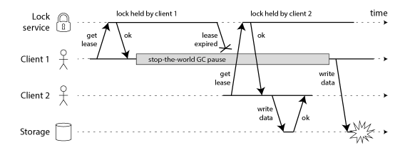
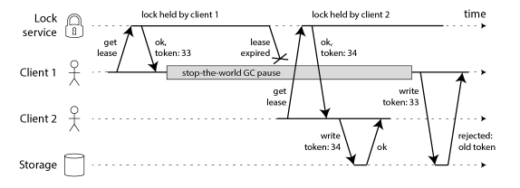

## 什么是分布式锁

在学习分布式锁之前，先回忆一下单机锁（syncronized或者Lock），在写多线程的时候，避免同时操作一个共享变量产生数据问题，通常会使用一把锁来互斥，以保证共享变量的正确性，其使用范围是在同一进程中（也就是在同一个JVM中）。

如果现在有多个进程，需要同时操作一个共享资源，该如何互斥，这就需要分布式锁来解决了。

例如：现在的业务通常是微服务架构，这也就意味着一个应用会部署多个进程（多个JVM），那么这多个进程如果需要修改MySQL中的同一行记录，为了避免操作乱序导致数据错误，就需要引入分布式锁这个机制来解决这个问题。


分布式锁：分布式锁是控制分布式系统之间同步访问共享资源的一种方式。在分布式系统中，常常需要协调他们的动作。如果不同的系统或是同一个系统的不同主机之间共享了一个或一组资源，那么访问这些资源的时候，往往需要互斥来防止彼此干扰来保证一致性，这个时候，便需要使用到分布式锁。

## 分布式锁怎么实现(理论)

从最简单的开始

想要实现分布式锁，必要要求互斥，Redis的 `SETNX`（SET IF NOT EXISTS）命令，即如果key不存在，才会设置它的值，否则什么也不做。

两个客户端进程可以执行这个命令，达到互斥，就可以实现一个非常简单的分布式锁。

```shell
127.0.0.1:6379> SETNX lock 1
(integer) 1     // 客户端1，加锁成功
```

```shell
127.0.0.1:6379> SETNX lock 1
(integer) 0     // 客户端2，加锁失败
```

上面就是两个客户端加锁的过程，在客户端1加锁成功之后，客户端2就会加锁失败，这个时候，客户端就可以去操作共享资源（数据库）了。

操作完成后，还有及时释放锁，不然别的客户端一直拿不到锁，使用`DEL`命令删除这个key即可。

```shell
127.0.0.1:6379> DEL lock // 释放锁
(integer) 1
```

以上的逻辑非常简单，但是它的问题是非常多的，挨个说明：

### 如何避免死锁

上面的逻辑中，如果客户端没能释放锁（程序处理异常、进程挂掉、服务宕机等等），那么客户端1就会一直占用这个锁，其他的客户端永远也拿不到这个锁了，这种现象就是死锁。

很容易想到的一个办法就是给这个key设置过期时间，也就是在申请锁时，给这把锁设置一个租期。

在Redis中，就是给这个key设置一个过期时间，假设操作共享资源的时间不会超过10s，那么在加锁时，给这个key设置一个10s过期时间即可。（一步一步来）

```shell
127.0.0.1:6379> SETNX lock 1    // 加锁
(integer) 1
127.0.0.1:6379> EXPIRE lock 10  // 10s后自动过期
(integer) 1
```

这样一来，只要10s时间到期，这个锁就会释放了，其他客户端就可以拿到锁，其实还是有问题，如果执行完加锁没有来得及执行给锁设置过期时间这个操作呢，比如：

1. SETNX 执行成功，Redis 异常宕机，EXPIRE 没有机会执行
2. SETNX 执行成功，执行 EXPIRE 时由于网络问题，执行失败
3. SETNX 执行成功，客户端异常崩溃，EXPIRE 也没有机会执行

等等，总之就是没有来得及给这个锁设置过期时间，后面也设置不上了，所以立马可以想到需要保证这两条命令的原子性，在Redis2.6.12之后，可以使用一条命令完成这两步操作：

```shell
// 一条命令保证原子性执行
127.0.0.1:6379> SET lock 1 EX 10 NX
OK
```

这样就解决了死锁问题，也比较简单。但是即使这样还存在问题，比如下面这样的场景：

1. 客户端 1 加锁成功，开始操作共享资源
2. 客户端 1 操作共享资源的时间，超过了锁的过期时间，锁被自动释放
3. 客户端 2 加锁成功，开始操作共享资源
4. 客户端 1 操作共享资源完成，释放锁（但释放的是客户端 2 的锁）

仔细分析一下，这个简单的场景中其实有两个非常严重的问题

- 锁过期：你没法准确评估业务代码执行的时长，所以你设置的过期时间已一定时有问题的，如果过期时间太短，业务代码没有执行完，锁自动过期，之后被其他的客户端拿到（无法评估锁的过期时间）
- 释放别人的锁：客户端执行完业务代码，然后去释放锁了，但是这个时候释放了客户端2的锁（上一步中客户端1业务代码没有执行完，但是锁的过期时间已经到了，释放了这个锁，被客户端2抢到了）

第一个问题是因为过期时间太短，其实单从设置过期时间长短上面解决不了这个问题，因为你无法评估业务代码的执行时长，所以需要有一个机制来解决这个问题，后面详细说这个问题的解决办法。

第二个问题在于一个客户端释放了其他客户端持有的锁，也就是说每一个客户端不知道这个锁是谁的，也不知道是不是自己的，都是无脑操作，没有检查这把锁是否还归自己持有，所以就会发生释放别人锁的风险，这样的解锁流程，很明显不严谨。

如何解决这个问题呢？

### 锁被别人释放怎么办

解决办法：客户端在加锁时，设置一个只有自己知道的唯一标识进去。例如，可以是自己的线程ID，也可以是一个UUID（随机且唯一）

```shell
// 锁的VALUE设置为UUID
127.0.0.1:6379> SET lock $uuid EX 20 NX
OK
```

这里先假设操作共享资源20s完全够，不考虑锁自动过期的问题

之后，在释放锁时，先判断这把锁是否是自己持有的锁，伪代码：

```java
// 锁是自己的，才释放
if redis.get("lock") == $uuid:
    redis.del("lock")
```

有没有发现，我们又绕回来了，`GET`和`DEL`两条命令又遇到原子性问题了，这时候，Redis已经提供了删锁的原子性问题（LUA脚本）

因为Redis处理每一个请求都是单线程的，在执行一个Lua脚本时，其他请求必须等待，知道这个Lua脚本执行完成，这样以来，GET+DEL之间就不会有其他逻辑了。

Lua脚本（来自Redis官网）

```shell
// 判断锁是自己的，才释放
if redis.call("get",KEYS[1]) == ARGV[1] then
    return redis.call("del",KEYS[1])
else
    return 0
end
```

到这一步，整个加、解锁的流畅就比较严谨了。

### 小结

基于Redis实现的分布式锁，一个严谨的流程如下：

1. 加锁：SET lock_key $unique_id EX $expire_time NX
2. 操作共享资源
3. 释放锁：Lua脚本，先 GET 判断锁是否归属自己，再 DEL 释放锁

现在回到上面遗留的问题，锁的过期时间不好评估怎么办？

### 锁的过期时间不好评估

锁的过期时间如果评估不好，这个锁就会有提前过期的风险。

有没有这样一种方案：**加锁时，先设置一个过期时间，然后我们开启一个「守护线程」，定时去检测这个锁的失效时间，如果锁快要过期了，操作共享资源还未完成，那么就自动对锁进行「续期」，重新设置过期时间。**

这其实就是Java封装的Redssion这个库对于锁过期时间不好评估的解决方案

Redisson 是一个 Java 语言实现的 Redis SDK 客户端，在使用分布式锁时，它就采用了自动续期的方案来避免锁过期，这个守护线程我们一般也把它叫做看门狗线程。

除了这个，这个SDK还封装了很多易用的功能：

- 可重入锁
- 乐观锁
- 公平锁
- 读写锁
- RedLock（后面重点学习这个）

### 总结

基于Redis的分布式锁，前面遇到的问题，以及对应的解决方案：

- **死锁**：设置过期时间
- **过期时间不好评估，锁提前过期**：守护线程，自动续期
- **锁被别人释放**：锁写入唯一标识，释放锁先检查标识，再释放

以为这就完美了吗？哈哈，还是太年轻了，上面玩的还是单机版的Redis，如果部署多台Redis。（使用 Redis 时，一般会采用**主从集群 + 哨兵**的模式部署，这样做的好处在于，当主库异常宕机时，哨兵可以实现「故障自动切换」，把从库提升为主库，继续提供服务，以此保证可用性）

**那当「主从发生切换」时，这个分布锁会依旧安全吗？**

有这样的场景：

1. 客户端 1 在主库上执行 SET 命令，加锁成功
2. 此时，主库异常宕机，SET 命令还未同步到从库上（主从复制是异步的）
3. 从库被哨兵提升为新主库，这个锁在新的主库上，丢失了

哈哈，可以发现，引入Redis副本后，这个分布式锁还是有问题。

为了解决这个问题，Redis的作者antirez提出一种解决方案，就是上面说到的Redlock（红锁）。先抛出这个概念，后面会详细学习红锁。值得一提是这个红锁争议很大，有个大牛针对红锁提出了自己的质疑和思考，接着antirez又就这个质疑给出了自己的答案和思考。哈哈，这就是大牛过招。

## 分布式锁历险记（实践）


## Redis 分布式锁（Redlock）

为了学习明白这个Redlock，从头开始思路：

### 分布式锁单机案例

- 加锁：加锁实际上就是在redis中，给key设置一个值，为避免死锁，并给定一个过期时间

  ```java
  /**
    *  加锁的关键逻辑
    *  @param  key
    *  @param  uniqueId
    *  @param  seconds
    *  @return
    */
  public static boolean  tryLock(String key, String uniqueId,  int  seconds) {
       return  "OK" .equals(jedis.set(key, uniqueId,  "NX" ,  "EX" , seconds));
  }
  ```

  

- 解锁：将key删除。但是不能乱删，客户端1的请求不能将客户端2的锁给删掉，只能自己删自己的锁（LUA脚本）

  ```java
  /**
    *  解锁的关键逻辑
    *  @param  key
    *  @param  uniqueId
    *  @return
    */
  public static boolean  releaseLock(String key, String uniqueId) {
      String luaScript =  "if redis.call('get', KEYS[1]) == ARGV[1] then "  +
               "return redis.call('del', KEYS[1]) else return 0 end" ;
      
       return  jedis.eval(
              luaScript,
              Collections. singletonList (key),
              Collections. singletonList (uniqueId)
      ).equals( 1L );
  }
  ```

- 超时：锁key要注意过期时间，不能长期占用

这就是最基本的分布式锁的实现，在中小公司，这样的实现完全可以，但是在整个分布式系统中，这样的设计有很大的问题

### 基于 SETNX 实现的分布式锁的缺点

在主从复制模式下，假设客户A通过redis的`setnx`申请了分布式锁并持有锁，正常情况下，主从机都会持有这个分布式锁，但是突然，master还没来得及将数据同步给slave，此时slave机器上没有对应锁的信息，然后slave上位，变成了新的master，客户B照样可以加锁成功，这个时候出现了非常可怕的情况：一锁被多建多用。于是，CAP里面的CP遭到了破坏，最大的问题是，无论是单机、主从还是主从+哨兵都有这样的风险。

官网这样描述的：

> this is a single point of failure in our architecture. What happens if the Redis master goes down? Well, let’s add a replica! And use it if the master is unavailable. This is unfortunately not viable. By doing so we can’t implement our safety property of mutual exclusion, because Redis replication is asynchronous.
>
> There is an obvious race condition with this model:
>
> 1. Client A acquires the lock in the master.
> 2. The master crashes before the write to the key is transmitted to the replica.
> 3. The replica gets promoted to master.
> 4. Client B acquires the lock to the same resource A already holds a lock for. **SAFETY VIOLATION!**
>
> Sometimes it is perfectly fine that under special circumstances, like during a failure, multiple clients can hold the lock at the same time. If this is the case, you can use your replication based solution. Otherwise we suggest to implement the solution described in this document.

从上面的分析中，即使多实例采用SETNX这种方案还是会有问题，所以Redis的作者发明了Redlock来解决这个问题。

### 使用场景

多个服务保证同一时刻同一时间段内同一用户只能有一个请求（防止关键业务出现并发攻击）。一言以蔽之：基于多个实例的分布式锁。

锁变量由多个实例维护，即使有实例发生了故障，锁变量仍然是存在的，客户端还是可以完成锁操作。Redlock算法是实现高可靠分布式锁的一种有效解决方案，可以在实际开发中使用。

### 理念

该方案也是基于（set 加锁、Lua 脚本解锁）进行改良的，所以redis之父antirez 只描述了差异的地方，大致方案如下。

假设有N个Redis主节点，例如 N = 5这些节点是完全独立的，我们不使用复制或任何其他隐式协调系统，为了得到锁客户端执行一下操作：

1. 获取当前Unix时间，以毫秒为单位。
2. 依次尝试从N个实例，使用相同的key和随机值获取锁。在步骤2，当向Redis设置锁时,客户端应该设置一个网络连接和响应超时时间，这个超时时间应该小于锁的失效时间。例如你的锁自动失效时间为10秒，则超时时间应该在5-50毫秒之间。这样可以避免服务器端Redis已经挂掉的情况下，客户端还在死死地等待响应结果。如果服务器端没有在规定时间内响应，客户端应该尽快尝试另外一个Redis实例。
3. 客户端使用当前时间减去开始获取锁时间（步骤1记录的时间）就得到获取锁使用的时间。当且仅当从大多数（这里是3个节点）的Redis节点都取到锁，并且使用的时间小于锁失效时间时，锁才算获取成功。
4. 如果取到了锁，key的真正有效时间等于有效时间减去获取锁所使用的时间（步骤3计算的结果）。
5. 如果因为某些原因，获取锁失败（*没有*在至少N/2+1个Redis实例取到锁或者取锁时间已经超过了有效时间），客户端应该在所有的Redis实例上进行解锁（即便某些Redis实例根本就没有加锁成功）。

可以看出，这个方案为了解决数据不一致的问题，直接舍弃了异步复制，只使用master节点，同时由于舍弃了slave，为了保证可用性，引入了N个master，官网建议是5。

> In our examples we set N=5, which is a reasonable value, so we need to run 5 Redis masters on different computers or virtual machines in order to ensure that they’ll fail in a mostly independent way.

Redis只支持AP，为了解决CP的风险，采用N个节点，N为基数，上面的5个master各自完全独立，不是主从或者集群。

为什么是奇数？N=2X+1（N是最终部署机器数，X是容错机器数）

先明确一下什么是容错，字面理解就是可以容许的错误：

 失败了多少个机器实例后我还是可以容忍的，所谓的容忍就是数据一致性还是可以Ok的，CP数据一致性还是可以满足。假如在集群环境中，redis失败1台，可接受。2X+1 = 2 * 1+1 =3，部署3台，死了1个剩下2个可以正常工作，那就部署3台；假如在集群环境中，redis失败2台，可接受。2X+1 = 2 * 2+1 =5，部署5台，死了2个剩下3个可以正常工作，那就部署5台。这就是容错。

然后为什么是奇数呢：

很明显是为了用最少的机器，最多的产出效果。 假如在集群环境中，redis失败1台，可接受。2N+2= 2 * 1+2 =4，部署4台；假如在集群环境中，redis失败2台，可接受。2N+2 = 2 * 2+2 =6，部署6台。这就是为什么是奇数。

这就是Redlock的实现理念，简单总结一下。

### 总结

#### 为什么要在多了实例上加锁？

本质上是为了容错，部分实例异常宕机，剩余的实例加锁成功，整个锁服务依旧可用。

#### 为什么大多数加锁成功，才算成功？

多个 Redis 实例一起来用，其实就组成了一个分布式系统。在分布式系统中，总会出现异常节点，所以，在谈论分布式系统问题时，需要考虑异常节点达到多少个，也依旧不会影响整个系统的正确性。这是一个分布式系统容错问题，这个问题的结论是：**如果只存在故障节点，只要大多数节点正常，那么整个系统依旧是可以提供正确服务的**。这就是P。

> 多说一点没用的，这个问题其实就是典型的拜占庭将军问题，

#### 为什么步骤3加锁成功后，还有计算加锁的累计耗时？

因为操作的是多个节点，所以耗时肯定会比操作单个实例耗时更久，而且，因为是网络请求，网络情况是复杂的，有可能存在**延迟、丢包、超时**等情况发生，网络请求越多，异常发生的概率就越大。所以，即使大多数节点加锁成功，但如果加锁的累计耗时已经「超过」了锁的过期时间，那此时有些实例上的锁可能已经失效了，这个锁就没有意义了。

#### 为什么释放锁，要操作所有节点？

在某一个 Redis 节点加锁时，可能因为「网络原因」导致加锁失败。例如，客户端在一个 Redis 实例上加锁成功，但在读取响应结果时，网络问题导致**读取失败**，那这把锁其实已经在 Redis 上加锁成功了。所以，释放锁时，不管之前有没有加锁成功，需要释放「所有节点」的锁，以保证清理节点上残留的锁。

以上就是Redlock实现分布式的锁的方案，是不是觉得很完美了，哈哈，非也。下面开始本文的精彩重点，看两位大佬如何博弈

## 从 Redlock 的争论思考

Redis的作者这个方案（Redlock）一出，马上就受到了业界著名的分布式系统大佬的质疑，这个大佬就是 **Martin Kleppmann**。


看见手里的那本书了吗？没错，这本书就是著名的DDIA（数据密集型应用系统设计）,他就是作者。

面对Redlock这个解决方案，他马上写了篇文章，质疑这个算法是有问题的，并提出了自己的看法，之后，Redis作者当然不甘示弱，也写了一篇文章，反驳了对方的观点，并详细的剖析了Redlock算法的更多设计细节。

这两篇文章分别在此：

[How to do distributed locking — Martin Kleppmann’s blog](https://martin.kleppmann.com/2016/02/08/how-to-do-distributed-locking.html)

[Is Redlock safe? - ](http://antirez.com/news/101)

### 分布式专家 Martin 对于 Redlock 的质疑

首先，Martin 开篇便表达了对Redis的喜爱。

> Before I go into the details of Redlock, let me say that I quite like Redis, and I have successfully used it in production in the past. I think it’s a good fit in situations where you want to share some **transient, approximate, fast-changing** data between servers, and where it’s not a big deal if you occasionally lose that data for whatever reason. 
>
> 在详细介绍 Redlock 之前，先说我非常喜欢 Redis，并且我过去在生产中成功使用过它。我认为它非常适合您希望在服务器之间共享一些**瞬态、近似、快速**变化的数据的情况，并且如果您偶尔出于某种原因丢失这些数据也没什么大不了的。

接着，他就开始质疑Redis

> However, Redis has been gradually making inroads into areas of data management where there are stronger consistency and durability expectations – which worries me, because this is not what Redis is designed for. Arguably, distributed locking is one of those areas. 
>
> 然而，Redis 已经逐渐进入数据管理领域，那里有更强的一致性和持久性期望——这让我担心，因为这不是 Redis 的设计目标。可以说，分布式锁是这些领域之一。

#### 分布式锁的目的是什么？

Martin 表示，你必须先清楚你在使用分布式锁的目的是什么？他认为有两个目的。

- 效率

  使用锁可以避免不必要地做同样的工作两次（例如一些昂贵的计算）。如果锁定失败并且两个节点最终完成相同的工作，结果是成本略有增加（您最终向 AWS 支付的费用比其他情况多 5 美分）或带来轻微的不便（例如，用户最终两次收到相同的电子邮件通知）。

- 正确性

  使用锁可以防止并发进程相互干扰并破坏系统状态。如果锁定失败并且两个节点同时处理同一条数据，则结果是文件损坏、数据丢失、永久性不一致、给患者服用的药物剂量错误或其他一些严重问题。

然后他表示，如果是为了效率，那么使用单机版 Redis 就可以了，即使偶尔发生锁失效（宕机、主从切换），都不会产生严重的后果。而使用 Redlock 太重了，没必要。如果是为了正确性，他表示，Redlock 根本达不到安全性的要求，依旧存在锁失效的问题。

#### 锁在分布式系统中会遇到的问题

Martin 表示，分布式系统中的锁不像多线程应用程序中的互斥锁。这是一个更复杂的野兽，因为每一个节点和网络都可能以各种方式独立失败的问题。

> It’s important to remember that a lock in a distributed system is not like a mutex in a multi-threaded application. It’s a more complicated beast, due to the problem that different nodes and the network can all fail independently in various ways.

然后他列举了分布式系统中最严重的三个问题，同时这也就是分布式系统会遇到的三座大山（NPC）：

1. N：Network Delay，网络延迟
2. P：Process Pause，进程暂停（GC）
3. C：Clock Drift，时钟漂移

##### 进程暂停

关于进程暂停，Martin 举了一个例子，



在这个例子中，获取锁的客户端在持有锁的同时暂停了很长一段时间——例如因为垃圾收集器（GC）启动。锁有一个超时（即它是一个租约），这是一个好主意（否则崩溃的客户端最终可能会永远持有锁并且永远不会释放它）。但是，如果 GC 暂停持续时间超过租用到期时间，并且客户端没有意识到它已经到期，它可能会继续进行一些不安全的更改。紧接着，他还继续说这个错误不是理论上的，HBase 曾经发生过这样的问题，通常，GC 暂停时间很短，但“Stop the world”的 GC 暂停有时会持续 几分钟——当然足以让租约到期。即使是所谓的“并发”垃圾收集器，如 HotSpot JVM 的 CMS，也不能完全与应用程序代码并行运行——即使它们需要Stop the world。

然后他还接着补刀，虽然Redis是用C语言构建的，没有长时间的GC，但也不要因此自鸣得意，你的进程总会因为其他原因暂停，总之一定会出现这样的问题的。

##### 网络延迟

关于网络延迟，Martin 表示请求文件写入请求在到达存储服务之前可能会在网络中延迟，以太网和IP等数据包网络可能会任意延迟数据包，然后他举了Github的一个著名事件（[Downtime last Saturday | The GitHub Blog](https://github.blog/2012-12-26-downtime-last-saturday/)），数据包在网络中延迟了大约90s，意味着可能会发送一个写请求，当租约已经到期时，他可能会在一分钟到达存储服务器。

也就是说，即使在管理良好的网络中，这种事情也可能发生，你根本无法对时间作出任何假设，这就是无论为什么无论你使用什么代码，上面的代码都根本上都是不安全的（是不是很无力的感觉）。

##### 时钟漂移

关于时钟漂移，Martin 也举了一个例子，他觉得Redlock对于时序的假设依赖有严重的问题，假设系统有五个 Redis 节点（A、B、C、D 和 E）和两个客户端（1 和 2）。如果其中一个 Redis 节点上的时钟向前跳跃会发生什么？

1. 客户端 1 获取节点 A、B、C 上的锁。由于网络问题，无法访问 D 和 E。
2. 节点 C 上的时钟向前跳跃，导致锁到期。
3. 客户端 2 获取节点 C、D、E 上的锁。由于网络问题，无法访问 A 和 B。
4. 客户端 1 和 2 现在都相信他们持有锁。

然后他还接着用这个例子补充了一下上面的进程暂停问题：

1. 客户端 1 请求锁定节点 A、B、C、D、E。
2. 在对客户端 1 的响应进行中时，客户端 1 进入 stop-the-world GC。
3. 所有 Redis 节点上的锁都会过期。
4. 客户端 2 获取节点 A、B、C、D、E 上的锁。
5. 客户端 1 完成 GC，并接收来自 Redis 节点的响应，表明它已成功获取锁（在进程暂停时，它们保存在客户端 1 的内核网络缓冲区中）。
6. 客户端 1 和 2 现在都相信他们持有锁。

他表示，较长的网路延迟会产生和进程暂停相同的效果。所以取决于你的TCP用户超时时间，如果这个时间明显短于Redis TTL，那么延迟的数据包就可能被忽略了，但是这个问题是存在的，所以必须详细查看TCP才能复现出这个问题。所以还是回到了时间测量的准确性。

Martin 继续阐述，机器的时钟发生错误，是很有可能发生的：

- 系统管理员手动修改了机器时钟
- 机器时钟在同步 NTP 时间时，发生了大的跳跃

总之，Martin 认为，Redlock 的算法是建立在同步模型基础上的，有大量资料研究表明，同步模型的假设，在分布式系统中是有问题的。在混乱的分布式系统的中，你不能假设系统时钟就是对的，所以，你必须非常小心你的假设。

#### 提出 fecing token 的方案，保证正确性

Martin 提出一种被叫作 fecing token 的方案，保证分布式锁的正确性。

你需要在对存储服务的每个写入请求中包含一个**防护令牌**。在这种情况下，防护令牌只是一个数字，每次客户端获取锁时都会增加（例如，由锁服务增加）。如下图所示：



1.  客户端 1 获得租用并获得 33 的令牌，但随后它进入长时间的暂停并且租用到期。
2. 客户端 2 获取租约，得到 34 的令牌（数字总是增加），然后将其写入发送到存储服务，包括 34 的令牌。
3. 稍后，客户端 1 起死回生，并将其写入发送到存储服务，包括其令牌值 33。但是，存储服务器记住它已经处理了具有更高令牌号 (34) 的写入，因此它拒绝具有令牌 33 的请求。

这样一来，无论NPC哪种异常情况发生，都可以保证分布式锁的安全性，因为它是建立在异步模型上的。并且锁服务生成严格单调递增的令牌，这使得锁是安全的。例如ZooKeeper里面，则可以使用zxid znode 版本号或 znode 版本号作为防护令牌。

Redlock没有任何用于生成隔离令牌的工具，不会生产任何保证每次客户端获取锁时都会增加的数字。这意味着即使Redlock在其他方面做的非常好，但是使用它也不是不安全的。因为在一个客户端暂停或其数据包延迟的情况下，你无法防止客户端之间的竞争条件。

Martin还表示，**一个好的分布式锁，无论 NPC 怎么发生，可以不在规定时间内给出结果，但并不会给出一个错误的结果。也就是只会影响到锁的性能（或称之为活性），而不会影响它的正确性。**也就是说，你用分布锁就是为了正确性，如果你不能保证正确性，你可以告诉我你不能保证，但是你不能给我一个错误的值。

#### Martin 的结论

1. **Redlock 不伦不类**：它对于效率来讲，Redlock 比较重，没必要这么做，而对于正确性来说，Redlock 是不够安全的。
2. **时钟假设不合理**：该算法对系统时钟做出了危险的假设（假设多个节点机器时钟都是一致的），如果不满足这些假设，锁就会失效。
3. **无法保证正确性**：Redlock 不能提供类似 fencing token 的方案，所以解决不了正确性的问题。为了正确性，请使用有共识系统的软件，例如 Zookeeper。

Martin反对Redlock的论据，简直有理有据，别着急，Redis也是大牛级别的人物，第二天就对Martin进行了反驳。。。

### Redis 作者 antirez 对于 Martin 的反驳和思考


