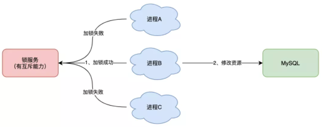

[TOC]


## 什么是分布式锁

在学习分布式锁之前，先回忆一下单机锁（syncronized或者Lock），在写多线程的时候，避免同时操作一个共享变量产生数据问题，通常会使用一把锁来互斥，以保证共享变量的正确性，其使用范围是在同一进程中（也就是在同一个JVM中）。

如果现在有多个进程，需要同时操作一个共享资源，该如何互斥，这就需要分布式锁来解决了。

例如：现在的业务通常是微服务架构，这也就意味着一个应用会部署多个进程（多个JVM），那么这多个进程如果需要修改MySQL中的同一行记录，为了避免操作乱序导致数据错误，就需要引入分布式锁这个机制来解决这个问题。





分布式锁：分布式锁是控制分布式系统之间同步访问共享资源的一种方式。在分布式系统中，常常需要协调他们的动作。如果不同的系统或是同一个系统的不同主机之间共享了一个或一组资源，那么访问这些资源的时候，往往需要互斥来防止彼此干扰来保证一致性，这个时候，便需要使用到分布式锁。

## 分布式锁怎么实现（理论）

从最简单的开始

想要实现分布式锁，必要要求互斥，Redis的 `SETNX`（SET IF NOT EXISTS）命令，即如果key不存在，才会设置它的值，否则什么也不做。

两个客户端进程可以执行这个命令，达到互斥，就可以实现一个非常简单的分布式锁。

```shell
127.0.0.1:6379> SETNX lock 1
(integer) 1     // 客户端1，加锁成功
```

```shell
127.0.0.1:6379> SETNX lock 1
(integer) 0     // 客户端2，加锁失败
```

上面就是两个客户端加锁的过程，在客户端1加锁成功之后，客户端2就会加锁失败，这个时候，客户端就可以去操作共享资源（数据库）了。

操作完成后，还有及时释放锁，不然别的客户端一直拿不到锁，使用`DEL`命令删除这个key即可。

```shell
127.0.0.1:6379> DEL lock // 释放锁
(integer) 1
```

以上的逻辑非常简单，但是它的问题是非常多的，挨个说明：

### 如何避免死锁

上面的逻辑中，如果客户端没能释放锁（程序处理异常、进程挂掉、服务宕机等等），那么客户端1就会一直占用这个锁，其他的客户端永远也拿不到这个锁了，这种现象就是死锁。

很容易想到的一个办法就是给这个key设置过期时间，也就是在申请锁时，给这把锁设置一个租期。

在Redis中，就是给这个key设置一个过期时间，假设操作共享资源的时间不会超过10s，那么在加锁时，给这个key设置一个10s过期时间即可。（一步一步来）

```shell
127.0.0.1:6379> SETNX lock 1    // 加锁
(integer) 1
127.0.0.1:6379> EXPIRE lock 10  // 10s后自动过期
(integer) 1
```

这样一来，只要10s时间到期，这个锁就会释放了，其他客户端就可以拿到锁，其实还是有问题，如果执行完加锁没有来得及执行给锁设置过期时间这个操作呢，比如：

1. SETNX 执行成功，Redis 异常宕机，EXPIRE 没有机会执行
2. SETNX 执行成功，执行 EXPIRE 时由于网络问题，执行失败
3. SETNX 执行成功，客户端异常崩溃，EXPIRE 也没有机会执行

等等，总之就是没有来得及给这个锁设置过期时间，后面也设置不上了，所以立马可以想到需要保证这两条命令的原子性，在Redis2.6.12之后，可以使用一条命令完成这两步操作：

```shell
// 一条命令保证原子性执行
127.0.0.1:6379> SET lock 1 EX 10 NX
OK
```

这样就解决了死锁问题，也比较简单。但是即使这样还存在问题，比如下面这样的场景：

1. 客户端 1 加锁成功，开始操作共享资源
2. 客户端 1 操作共享资源的时间，超过了锁的过期时间，锁被自动释放
3. 客户端 2 加锁成功，开始操作共享资源
4. 客户端 1 操作共享资源完成，释放锁（但释放的是客户端 2 的锁）

仔细分析一下，这个简单的场景中其实有两个非常严重的问题

- 锁过期：你没法准确评估业务代码执行的时长，所以你设置的过期时间已一定时有问题的，如果过期时间太短，业务代码没有执行完，锁自动过期，之后被其他的客户端拿到（无法评估锁的过期时间）
- 释放别人的锁：客户端执行完业务代码，然后去释放锁了，但是这个时候释放了客户端2的锁（上一步中客户端1业务代码没有执行完，但是锁的过期时间已经到了，释放了这个锁，被客户端2抢到了）

第一个问题是因为过期时间太短，其实单从设置过期时间长短上面解决不了这个问题，因为你无法评估业务代码的执行时长，所以需要有一个机制来解决这个问题，后面详细说这个问题的解决办法。

第二个问题在于一个客户端释放了其他客户端持有的锁，也就是说每一个客户端不知道这个锁是谁的，也不知道是不是自己的，都是无脑操作，没有检查这把锁是否还归自己持有，所以就会发生释放别人锁的风险，这样的解锁流程，很明显不严谨。

如何解决这个问题呢？

### 锁被别人释放怎么办

解决办法：客户端在加锁时，设置一个只有自己知道的唯一标识进去。例如，可以是自己的线程ID，也可以是一个UUID（随机且唯一）

```shell
// 锁的VALUE设置为UUID
127.0.0.1:6379> SET lock $uuid EX 20 NX
OK
```

这里先假设操作共享资源20s完全够，不考虑锁自动过期的问题

之后，在释放锁时，先判断这把锁是否是自己持有的锁，伪代码：

```java
// 锁是自己的，才释放
if redis.get("lock") == $uuid:
    redis.del("lock")
```

有没有发现，我们又绕回来了，`GET`和`DEL`两条命令又遇到原子性问题了，这时候，Redis已经提供了删锁的原子性问题（LUA脚本）

因为Redis处理每一个请求都是单线程的，在执行一个Lua脚本时，其他请求必须等待，知道这个Lua脚本执行完成，这样以来，GET+DEL之间就不会有其他逻辑了。

Lua脚本（来自Redis官网）

```shell
// 判断锁是自己的，才释放
if redis.call("get",KEYS[1]) == ARGV[1] then
    return redis.call("del",KEYS[1])
else
    return 0
end
```

到这一步，整个加、解锁的流畅就比较严谨了。

### 小结

基于Redis实现的分布式锁，一个严谨的流程如下：

1. 加锁：SET lock_key $unique_id EX $expire_time NX
2. 操作共享资源
3. 释放锁：Lua脚本，先 GET 判断锁是否归属自己，再 DEL 释放锁

现在回到上面遗留的问题，锁的过期时间不好评估怎么办？

### 锁的过期时间不好评估

锁的过期时间如果评估不好，这个锁就会有提前过期的风险。

有没有这样一种方案：**加锁时，先设置一个过期时间，然后我们开启一个「守护线程」，定时去检测这个锁的失效时间，如果锁快要过期了，操作共享资源还未完成，那么就自动对锁进行「续期」，重新设置过期时间。**

这其实就是Java封装的Redssion这个库对于锁过期时间不好评估的解决方案

Redisson 是一个 Java 语言实现的 Redis SDK 客户端，在使用分布式锁时，它就采用了自动续期的方案来避免锁过期，这个守护线程我们一般也把它叫做看门狗线程。

### WatchDog 实现（源码分析）

要解决的问题：业务逻辑还没有处理完，锁的过期时间到了，如何实现锁的自动续约？

先写一个简单的测试 demo 体会一下

```java
/**
 * Created with IntelliJ IDEA.
 *
 * @Author: GuoFei
 * @Date: 2021/11/18/16:06
 * @Description: Redssion 看门狗源码分析
 */
public class WatchDogDemo {

    public static final String LOCK_KEY = "AAA";
    private static Config config;
    private static Redisson redisson;

    static {
        config = new Config();
        config.useSingleServer().setAddress( "redis://" + "127.0.0.1" + ":6379").setDatabase(0);
        redisson = (Redisson) Redisson.create(config);
    }

    public static void main(String[] args) {
        RLock lock = redisson.getLock(LOCK_KEY);
        lock.lock();

        try {
            System.out.println("AAA start...");
            try {
                TimeUnit.SECONDS.sleep(25);
            } catch (InterruptedException e) {
                e.printStackTrace();
            }
        } catch (Exception e) {
            e.printStackTrace();
        } finally {
            if (lock.isLocked() && lock.isHeldByCurrentThread()){
                lock.unlock();
            }
        }

        System.out.println(Thread.currentThread().getName()+ "end.");

        try  {
            TimeUnit. SECONDS .sleep( 3 );
        }  catch  (InterruptedException e) {
            e.printStackTrace();
        }
        redisson .shutdown();
    }
}
```

观察一下这个 key 的过期情况：

```shell
127.0.0.1:6379> ttl AAA
(integer) 27
127.0.0.1:6379> ttl AAA
(integer) 25
127.0.0.1:6379> ttl AAA
(integer) 21
127.0.0.1:6379> ttl AAA
(integer) 20
127.0.0.1:6379> ttl AAA
(integer) 29
127.0.0.1:6379> hgetall
(error) ERR wrong number of arguments for 'hgetall' command
127.0.0.1:6379> hgetall AAA
1) "832b4c9a-218a-4fce-9bc3-309b84a1110a:1"
2) "1"
127.0.0.1:6379> ttl AAA
(integer) -2
127.0.0.1:6379> 
```

可以发现，在代码中没有设置key的过期时间，然而，使用`TTL`检测key的过期时间时，竟然发现默认为30s，而且在退回到20s的时候自动续期到30s了。

#### 守护线程续命

Redisson内部额外起一个线程，定期检查线程是否还持有锁，如果有则延长过期时间。


#### 源码分析   

可以发现Redisson实现了JUC


一下源码只保留重要的逻辑部分

```java
private void lock(long leaseTime, TimeUnit unit, boolean interruptibly) throws InterruptedException {
        long threadId = Thread.currentThread().getId();
        // 尝试是否占用
        Long ttl = tryAcquire(-1, leaseTime, unit, threadId);
        // lock acquired
        if (ttl == null) {
            return;
        }

        RFuture<RedissonLockEntry> future = subscribe(threadId);
        if (interruptibly) {
            commandExecutor.syncSubscriptionInterrupted(future);
        } else {
            commandExecutor.syncSubscription(future);
        }

        try {
            while (true) {
                ttl = tryAcquire(-1, leaseTime, unit, threadId);
                // lock acquired
                if (ttl == null) {
                    break;
                }

                // waiting for message
                if (ttl >= 0) {
                    try {
                        future.getNow().getLatch().tryAcquire(ttl, TimeUnit.MILLISECONDS);
                    } catch (InterruptedException e) {
                        if (interruptibly) {
                            throw e;
                        }
                        future.getNow().getLatch().tryAcquire(ttl, TimeUnit.MILLISECONDS);
                    }
                } else {
                    if (interruptibly) {
                        future.getNow().getLatch().acquire();
                    } else {
                        future.getNow().getLatch().acquireUninterruptibly();
                    }
                }
            }
        } finally {
            unsubscribe(future, threadId);
        }
//        get(lockAsync(leaseTime, unit));
    }
```

点进去 tryAcquire

```java
 private Long tryAcquire(long waitTime, long leaseTime, TimeUnit unit, long threadId) {
   // get返回一个 Long 时间，但是参数是 tryAcquireAsync（异步）
        return get(tryAcquireAsync(waitTime, leaseTime, unit, threadId));
    }
```

点进去 tryAcquireAsync

```java
private <T> RFuture<Long> tryAcquireAsync(long waitTime, long leaseTime, TimeUnit unit, long threadId) {
        RFuture<Long> ttlRemainingFuture;
  // leaseTime = -1 不走if
        if (leaseTime != -1) {
            ttlRemainingFuture = tryLockInnerAsync(waitTime, leaseTime, unit, threadId, RedisCommands.EVAL_LONG);
        } else {
          // 进来，点进去 tryLockInnerAsync 
            ttlRemainingFuture = tryLockInnerAsync(waitTime, internalLockLeaseTime,
                    TimeUnit.MILLISECONDS, threadId, RedisCommands.EVAL_LONG);
        }
  // 可以发现一旦上面的任务执行完毕，下面的 Future 立马开始执行，其实就是上面分主线程负责干活，下面的守护线程（Future）负责续约
        ttlRemainingFuture.onComplete((ttlRemaining, e) -> {
            if (e != null) {
                return;
            }

            // lock acquired
            if (ttlRemaining == null) {
                if (leaseTime != -1) {
                    internalLockLeaseTime = unit.toMillis(leaseTime);
                } else {
                  // 续约
                    scheduleExpirationRenewal(threadId);
                }
            }
        });
        return ttlRemainingFuture;
    }
```

加锁的逻辑会进入到tryLockInnerAsync中，在获取到锁成功之后，会进入scheduleExpirationRenewal

```java
protected long internalLockLeaseTime;

    protected final LockPubSub pubSub;

    final CommandAsyncExecutor commandExecutor;

    public RedissonLock(CommandAsyncExecutor commandExecutor, String name) {
        super(commandExecutor, name);
        this.commandExecutor = commandExecutor;
        this.internalLockLeaseTime = commandExecutor.getConnectionManager().getCfg().getLockWatchdogTimeout();
        this.pubSub = commandExecutor.getConnectionManager().getSubscribeService().getLockPubSub();
    }
    
    // -----------------------------------
    // 可以发现默认时间为 30s
    private long lockWatchdogTimeout = 30 * 1000;
```

先看一下怎么续约的，点进去 scheduleExpirationRenewal(threadId)

```java
protected void scheduleExpirationRenewal(long threadId) {
        ExpirationEntry entry = new ExpirationEntry();
        ExpirationEntry oldEntry = EXPIRATION_RENEWAL_MAP.putIfAbsent(getEntryName(), entry);
        if (oldEntry != null) {
            oldEntry.addThreadId(threadId);
        } else {
            entry.addThreadId(threadId);
            try {
            		// 续约
                renewExpiration();
            } finally {
                if (Thread.currentThread().isInterrupted()) {
                // 取消续约
                    cancelExpirationRenewal(threadId);
                }
            }
        }
    }	
```

点进去 renewExpiration()

```java
// 发现这是一个递归调用
private void renewExpiration() {
        ExpirationEntry ee = EXPIRATION_RENEWAL_MAP.get(getEntryName());
        if (ee == null) {
            return;
        }
        
        Timeout task = commandExecutor.getConnectionManager().newTimeout(new TimerTask() {
            @Override
            public void run(Timeout timeout) throws Exception {
                ExpirationEntry ent = EXPIRATION_RENEWAL_MAP.get(getEntryName());
                if (ent == null) {
                    return;
                }
                Long threadId = ent.getFirstThreadId();
                if (threadId == null) {
                    return;
                }
                
                RFuture<Boolean> future = renewExpirationAsync(threadId);
                future.onComplete((res, e) -> {
                    if (e != null) {
                        log.error("Can't update lock " + getRawName() + " expiration", e);
                        EXPIRATION_RENEWAL_MAP.remove(getEntryName());
                        return;
                    }
                    
                    if (res) {
                        // reschedule itself
                        renewExpiration();
                    } else {
                        cancelExpirationRenewal(null);
                    }
                });
            }
        }, internalLockLeaseTime / 3, TimeUnit.MILLISECONDS);
        // internalLockLeaseTime / 3 internalLockLeaseTime = 30 30/3=10 可以发现每10s会续约一次，递归调用
        ee.setTimeout(task);
    }
```

在这里初始化了一个定时器，dely的时间是 internalLockLeaseTime / 3，在 Redisson 中，internalLockLeaseTime 是 30s，也就是每隔 10s 续期一次，每次 30s。

客户端A加锁成功，就会启动一个watch dog看门狗，他是一个后台线程，会每隔10秒检查一下，如果客户端A还持有锁key，那么就会不断的延长锁key的生存时间，默认每次续命又从30秒新开始

这就是整个续约流程，然后分析下具体怎么续约的，也就是进入tryLockInnerAsync

```java
<T> RFuture<T> tryLockInnerAsync(long waitTime, long leaseTime, TimeUnit unit, long threadId, RedisStrictCommand<T> command) {
        return evalWriteAsync(getRawName(), LongCodec.INSTANCE, command,
                "if (redis.call('exists', KEYS[1]) == 0) then " +
                        "redis.call('hincrby', KEYS[1], ARGV[2], 1); " +
                        "redis.call('pexpire', KEYS[1], ARGV[1]); " +
                        "return nil; " +
                        "end; " +
                        "if (redis.call('hexists', KEYS[1], ARGV[2]) == 1) then " +
                        "redis.call('hincrby', KEYS[1], ARGV[2], 1); " +
                        "redis.call('pexpire', KEYS[1], ARGV[1]); " +
                        "return nil; " +
                        "end; " +
                        "return redis.call('pttl', KEYS[1]);",
                Collections.singletonList(getRawName()), unit.toMillis(leaseTime), getLockName(threadId));
    }
```

使用了一段LUA脚本进行续约，可见Redis里面如果想要保证原子性，基本都是选择LUA脚本来实现

这段代码解释如下（分三段解释）：


1. 通过exist判断，如果锁不存在，则设置值和过期时间，加锁成功
2. 通过hexists判断，如果锁已经存在，并且锁的是当前线程，则证明是可重入锁，加锁成功
3. 如果锁已存在，但锁的不是当前线程，则证明有其他线程持有锁，返回当前锁的过期时间（代表了当前锁的剩余生存时间），加锁失败

在这里有一个很重要的点需要提一下，就是Redisson如何解决可重入锁的呢？

在上面的体验中，可以发现有一条hash结构的数据，key为锁的名字，field为随机字符串+线程ID，值为1:

```shell
127.0.0.1:6379> hgetall AAA
1) "832b4c9a-218a-4fce-9bc3-309b84a1110a:1"
2) "1"
```

如果我们加三次锁，然后释放三次锁（可重入锁最重要的一点，加几次锁，解几次锁）

```java
 // 伪代码
 // 加锁
 lock.lock();
 lock.lock();
 lock.lock();
 // 解锁
 lock.unlock();
 lock.unlock();
 lock.unlock();
```

可以发现,，如果同一线程多次调用Lock方法，值就为+1。可重入锁实现（具体实现代码LUA脚本加锁第二段）

```shell
127.0.0.1:6379> hgetall AAA
1) "65f48045-6ae4-432c-8dd7-8ee75b95fb0c:1"
2) "3"
```

以上就是加锁续约+可重入锁的实现逻辑，接下来分析解锁实现逻辑

```java
protected RFuture<Boolean> unlockInnerAsync(long threadId) {
        return evalWriteAsync(getRawName(), LongCodec.INSTANCE, RedisCommands.EVAL_BOOLEAN,
                "if (redis.call('hexists', KEYS[1], ARGV[3]) == 0) then " +
                        "return nil;" +
                        "end; " +
                        "local counter = redis.call('hincrby', KEYS[1], ARGV[3], -1); " +
                        "if (counter > 0) then " +
                        "redis.call('pexpire', KEYS[1], ARGV[2]); " +
                        "return 0; " +
                        "else " +
                        "redis.call('del', KEYS[1]); " +
                        "redis.call('publish', KEYS[2], ARGV[1]); " +
                        "return 1; " +
                        "end; " +
                        "return nil;",
                Arrays.asList(getRawName(), getChannelName()), LockPubSub.UNLOCK_MESSAGE, internalLockLeaseTime, getLockName(threadId));
    }
```

也是分三段解释：

1. 如果释放锁的线程和已存锁的线程不是同一个线程，返回null
2. 通过hincrby递减1，先释放一次锁，若剩余次数还大于0，则证明当前是可重入锁，刷新过期时间
3. 若剩余次数小于0，删除key并发布锁释放消息，解锁成功

除了这个，这个SDK还封装了很多易用的功能：

- 可重入锁
- 乐观锁
- 公平锁
- 读写锁
- RedLock（后面重点学习这个）

### 总结

基于Redis的分布式锁，前面遇到的问题，以及对应的解决方案：

- **死锁**：设置过期时间
- **过期时间不好评估，锁提前过期**：守护线程，自动续期
- **锁被别人释放**：锁写入唯一标识，释放锁先检查标识，再释放

以为这就完美了吗？哈哈，还是太年轻了，上面玩的还是单机版的Redis，如果部署多台Redis。（使用 Redis 时，一般会采用**主从集群 + 哨兵**的模式部署，这样做的好处在于，当主库异常宕机时，哨兵可以实现「故障自动切换」，把从库提升为主库，继续提供服务，以此保证可用性）

**那当「主从发生切换」时，这个分布锁会依旧安全吗？**

有这样的场景：

1. 客户端 1 在主库上执行 SET 命令，加锁成功
2. 此时，主库异常宕机，SET 命令还未同步到从库上（主从复制是异步的）
3. 从库被哨兵提升为新主库，这个锁在新的主库上，丢失了

哈哈，可以发现，引入Redis副本后，这个分布式锁还是有问题。

为了解决这个问题，Redis的作者antirez提出一种解决方案，就是上面说到的Redlock（红锁）。先抛出这个概念，后面会详细学习红锁。值得一提是这个红锁争议很大，有个大牛针对红锁提出了自己的质疑和思考，接着antirez又就这个质疑给出了自己的答案和思考。哈哈，这就是大牛过招。

## 分布式锁历险记（实践）


## Redis 分布式锁（Redlock）

为了学习明白这个Redlock，从头开始思路：

### 分布式锁单机案例

- 加锁：加锁实际上就是在redis中，给key设置一个值，为避免死锁，并给定一个过期时间

  ```java
  /**
    *  加锁的关键逻辑
    *  @param  key
    *  @param  uniqueId
    *  @param  seconds
    *  @return
    */
  public static boolean  tryLock(String key, String uniqueId,  int  seconds) {
       return  "OK" .equals(jedis.set(key, uniqueId,  "NX" ,  "EX" , seconds));
  }
  ```

  

- 解锁：将key删除。但是不能乱删，客户端1的请求不能将客户端2的锁给删掉，只能自己删自己的锁（LUA脚本）

  ```java
  /**
    *  解锁的关键逻辑
    *  @param  key
    *  @param  uniqueId
    *  @return
    */
  public static boolean  releaseLock(String key, String uniqueId) {
      String luaScript =  "if redis.call('get', KEYS[1]) == ARGV[1] then "  +
               "return redis.call('del', KEYS[1]) else return 0 end" ;
      
       return  jedis.eval(
              luaScript,
              Collections. singletonList (key),
              Collections. singletonList (uniqueId)
      ).equals( 1L );
  }
  ```

- 超时：锁key要注意过期时间，不能长期占用

这就是最基本的分布式锁的实现，在中小公司，这样的实现完全可以，但是在整个分布式系统中，这样的设计有很大的问题

### 基于 SETNX 实现的分布式锁的缺点

在主从复制模式下，假设客户A通过redis的`setnx`申请了分布式锁并持有锁，正常情况下，主从机都会持有这个分布式锁，但是突然，master还没来得及将数据同步给slave，此时slave机器上没有对应锁的信息，然后slave上位，变成了新的master，客户B照样可以加锁成功，这个时候出现了非常可怕的情况：一锁被多建多用。于是，CAP里面的CP遭到了破坏，最大的问题是，无论是单机、主从还是主从+哨兵都有这样的风险。

官网这样描述的：

> this is a single point of failure in our architecture. What happens if the Redis master goes down? Well, let’s add a replica! And use it if the master is unavailable. This is unfortunately not viable. By doing so we can’t implement our safety property of mutual exclusion, because Redis replication is asynchronous.
>
> There is an obvious race condition with this model:
>
> 1. Client A acquires the lock in the master.
> 2. The master crashes before the write to the key is transmitted to the replica.
> 3. The replica gets promoted to master.
> 4. Client B acquires the lock to the same resource A already holds a lock for. **SAFETY VIOLATION!**
>
> Sometimes it is perfectly fine that under special circumstances, like during a failure, multiple clients can hold the lock at the same time. If this is the case, you can use your replication based solution. Otherwise we suggest to implement the solution described in this document.

从上面的分析中，即使多实例采用SETNX这种方案还是会有问题，所以Redis的作者发明了Redlock来解决这个问题。

### 使用场景

多个服务保证同一时刻同一时间段内同一用户只能有一个请求（防止关键业务出现并发攻击）。一言以蔽之：基于多个实例的分布式锁。

锁变量由多个实例维护，即使有实例发生了故障，锁变量仍然是存在的，客户端还是可以完成锁操作。Redlock算法是实现高可靠分布式锁的一种有效解决方案，可以在实际开发中使用。

### 理念

该方案也是基于（set 加锁、Lua 脚本解锁）进行改良的，所以redis之父antirez 只描述了差异的地方，大致方案如下。

假设有N个Redis主节点，例如 N = 5这些节点是完全独立的，我们不使用复制或任何其他隐式协调系统，为了得到锁客户端执行一下操作：

1. 获取当前Unix时间，以毫秒为单位。
2. 依次尝试从N个实例，使用相同的key和随机值获取锁。在步骤2，当向Redis设置锁时,客户端应该设置一个网络连接和响应超时时间，这个超时时间应该小于锁的失效时间。例如你的锁自动失效时间为10秒，则超时时间应该在5-50毫秒之间。这样可以避免服务器端Redis已经挂掉的情况下，客户端还在死死地等待响应结果。如果服务器端没有在规定时间内响应，客户端应该尽快尝试另外一个Redis实例。
3. 客户端使用当前时间减去开始获取锁时间（步骤1记录的时间）就得到获取锁使用的时间。当且仅当从大多数（这里是3个节点）的Redis节点都取到锁，并且使用的时间小于锁失效时间的，锁才算获取成功。
4. 如果取到了锁，key的真正有效时间等于有效时间减去获取锁所使用的时间（步骤3计算的结果）。
5. 如果因为某些原因，获取锁失败（*没有*在至少N/2+1个Redis实例取到锁或者取锁时间已经超过了有效时间），客户端应该在所有的Redis实例上进行解锁（即便某些Redis实例根本就没有加锁成功）。

可以看出，这个方案为了解决数据不一致的问题，直接舍弃了异步复制，只使用master节点，同时由于舍弃了slave，为了保证可用性，引入了N个master，官网建议是5。

> In our examples we set N=5, which is a reasonable value, so we need to run 5 Redis masters on different computers or virtual machines in order to ensure that they’ll fail in a mostly independent way.

Redis只支持AP，为了解决CP的风险，采用N个节点，N为基数，上面的5个master各自完全独立，不是主从或者集群。

为什么是奇数？N=2X+1（N是最终部署机器数，X是容错机器数）

先明确一下什么是容错，字面理解就是可以容许的错误：

 失败了多少个机器实例后我还是可以容忍的，所谓的容忍就是数据一致性还是可以Ok的，CP数据一致性还是可以满足。假如在集群环境中，redis失败1台，可接受。2X+1 = 2 * 1+1 =3，部署3台，死了1个剩下2个可以正常工作，那就部署3台；假如在集群环境中，redis失败2台，可接受。2X+1 = 2 * 2+1 =5，部署5台，死了2个剩下3个可以正常工作，那就部署5台。这就是容错。

然后为什么是奇数呢：

很明显是为了用最少的机器，最多的产出效果。 假如在集群环境中，redis失败1台，可接受。2N+2= 2 * 1+2 =4，部署4台；假如在集群环境中，redis失败2台，可接受。2N+2 = 2 * 2+2 =6，部署6台。这就是为什么是奇数。

这就是Redlock的实现理念，简单总结一下。

### 总结

#### 为什么要在多个实例上加锁？

本质上是为了容错，部分实例异常宕机，剩余的实例加锁成功，整个锁服务依旧可用。

#### 为什么大多数加锁成功，才算成功？

多个 Redis 实例一起来用，其实就组成了一个分布式系统。在分布式系统中，总会出现异常节点，所以，在谈论分布式系统问题时，需要考虑异常节点达到多少个，也依旧不会影响整个系统的正确性。这是一个分布式系统容错问题，这个问题的结论是：**如果只存在故障节点，只要大多数节点正常，那么整个系统依旧是可以提供正确服务的**。这就是P。

> 多说一点没用的，这个问题其实就是典型的拜占庭将军问题，

#### 为什么步骤 3 加锁成功后，还有计算加锁的累计耗时？

因为操作的是多个节点，所以耗时肯定会比操作单个实例耗时更久，而且，因为是网络请求，网络情况是复杂的，有可能存在**延迟、丢包、超时**等情况发生，网络请求越多，异常发生的概率就越大。所以，即使大多数节点加锁成功，但如果加锁的累计耗时已经「超过」了锁的过期时间，那此时有些实例上的锁可能已经失效了，这个锁就没有意义了。

#### 为什么释放锁，要操作所有节点？

在某一个 Redis 节点加锁时，可能因为「网络原因」导致加锁失败。例如，客户端在一个 Redis 实例上加锁成功，但在读取响应结果时，网络问题导致**读取失败**，那这把锁其实已经在 Redis 上加锁成功了。所以，释放锁时，不管之前有没有加锁成功，需要释放「所有节点」的锁，以保证清理节点上残留的锁。

以上就是Redlock实现分布式的锁的方案，是不是觉得很完美了，哈哈，非也。下面开始本文的精彩重点，看两位大佬如何博弈

## 从 Redlock 的争论思考

Redis的作者这个方案（Redlock）一出，马上就受到了业界著名的分布式系统大佬的质疑，这个大佬就是 **Martin Kleppmann**。


看见手里的那本书了吗？没错，这本书就是著名的DDIA（数据密集型应用系统设计）,他就是作者。

面对Redlock这个解决方案，他马上写了篇文章，质疑这个算法是有问题的，并提出了自己的看法，之后，Redis作者当然不甘示弱，也写了一篇文章，反驳了对方的观点，并详细的剖析了Redlock算法的更多设计细节。

这两篇文章分别在此：

[How to do distributed locking — Martin Kleppmann’s blog](https://martin.kleppmann.com/2016/02/08/how-to-do-distributed-locking.html)

[Is Redlock safe? - ](http://antirez.com/news/101)

### 分布式专家 Martin 对于 Redlock 的质疑

首先，Martin 开篇便表达了对Redis的喜爱。

> Before I go into the details of Redlock, let me say that I quite like Redis, and I have successfully used it in production in the past. I think it’s a good fit in situations where you want to share some **transient, approximate, fast-changing** data between servers, and where it’s not a big deal if you occasionally lose that data for whatever reason. 
>
> 在详细介绍 Redlock 之前，先说我非常喜欢 Redis，并且我过去在生产中成功使用过它。我认为它非常适合您希望在服务器之间共享一些**瞬态、近似、快速**变化的数据的情况，并且如果您偶尔出于某种原因丢失这些数据也没什么大不了的。

接着，他就开始质疑Redis

> However, Redis has been gradually making inroads into areas of data management where there are stronger consistency and durability expectations – which worries me, because this is not what Redis is designed for. Arguably, distributed locking is one of those areas. 
>
> 然而，Redis 已经逐渐进入数据管理领域，那里有更强的一致性和持久性期望——这让我担心，因为这不是 Redis 的设计目标。可以说，分布式锁是这些领域之一。

#### 分布式锁的目的是什么？

Martin 表示，你必须先清楚你在使用分布式锁的目的是什么？他认为有两个目的。

- 效率

  使用锁可以避免不必要地做同样的工作两次（例如一些昂贵的计算）。如果锁定失败并且两个节点最终完成相同的工作，结果是成本略有增加（您最终向 AWS 支付的费用比其他情况多 5 美分）或带来轻微的不便（例如，用户最终两次收到相同的电子邮件通知）。

- 正确性

  使用锁可以防止并发进程相互干扰并破坏系统状态。如果锁定失败并且两个节点同时处理同一条数据，则结果是文件损坏、数据丢失、永久性不一致、给患者服用的药物剂量错误或其他一些严重问题。

然后他表示，如果是为了效率，那么使用单机版 Redis 就可以了，即使偶尔发生锁失效（宕机、主从切换），都不会产生严重的后果。而使用 Redlock 太重了，没必要。如果是为了正确性，他表示，Redlock 根本达不到安全性的要求，依旧存在锁失效的问题。

#### 锁在分布式系统中会遇到的问题

Martin 表示，分布式系统中的锁不像多线程应用程序中的互斥锁。这是一个更复杂的野兽，因为每一个节点和网络都可能以各种方式独立失败的问题。

> It’s important to remember that a lock in a distributed system is not like a mutex in a multi-threaded application. It’s a more complicated beast, due to the problem that different nodes and the network can all fail independently in various ways.

然后他列举了分布式系统中最严重的三个问题，同时这也就是分布式系统会遇到的三座大山（NPC）：

1. N：Network Delay，网络延迟
2. P：Process Pause，进程暂停（GC）
3. C：Clock Drift，时钟漂移

##### 进程暂停

关于进程暂停，Martin 举了一个例子，


在这个例子中，获取锁的客户端在持有锁的同时暂停了很长一段时间——例如因为垃圾收集器（GC）启动。锁有一个超时（即它是一个租约），这是一个好主意（否则崩溃的客户端最终可能会永远持有锁并且永远不会释放它）。但是，如果 GC 暂停持续时间超过租用到期时间，并且客户端没有意识到它已经到期，它可能会继续进行一些不安全的更改。紧接着，他还继续说这个错误不是理论上的，HBase 曾经发生过这样的问题，通常，GC 暂停时间很短，但“Stop the world”的 GC 暂停有时会持续 几分钟——当然足以让租约到期。即使是所谓的“并发”垃圾收集器，如 HotSpot JVM 的 CMS，也不能完全与应用程序代码并行运行——即使它们需要Stop the world。

然后他还接着补刀，虽然Redis是用C语言构建的，没有长时间的GC，但也不要因此自鸣得意，你的进程总会因为其他原因暂停，总之一定会出现这样的问题的。

##### 网络延迟

关于网络延迟，Martin 表示请求文件写入请求在到达存储服务之前可能会在网络中延迟，以太网和IP等数据包网络可能会任意延迟数据包，然后他举了Github的一个著名事件（[Downtime last Saturday | The GitHub Blog](https://github.blog/2012-12-26-downtime-last-saturday/)），数据包在网络中延迟了大约90s，意味着可能会发送一个写请求，当租约已经到期时，他可能会在一分钟到达存储服务器。

也就是说，即使在管理良好的网络中，这种事情也可能发生，你根本无法对时间作出任何假设，这就是无论为什么无论你使用什么代码，上面的代码都根本上都是不安全的（是不是很无力的感觉）。

##### 时钟漂移

关于时钟漂移，Martin 也举了一个例子，他觉得Redlock对于时序的假设依赖有严重的问题，假设系统有五个 Redis 节点（A、B、C、D 和 E）和两个客户端（1 和 2）。如果其中一个 Redis 节点上的时钟向前跳跃会发生什么？

1. 客户端 1 获取节点 A、B、C 上的锁。由于网络问题，无法访问 D 和 E。
2. 节点 C 上的时钟向前跳跃，导致锁到期。
3. 客户端 2 获取节点 C、D、E 上的锁。由于网络问题，无法访问 A 和 B。
4. 客户端 1 和 2 现在都相信他们持有锁。

然后他还接着用这个例子补充了一下上面的进程暂停问题：

1. 客户端 1 请求锁定节点 A、B、C、D、E。
2. 在对客户端 1 的响应进行中时，客户端 1 进入 stop-the-world GC。
3. 所有 Redis 节点上的锁都会过期。
4. 客户端 2 获取节点 A、B、C、D、E 上的锁。
5. 客户端 1 完成 GC，并接收来自 Redis 节点的响应，表明它已成功获取锁（在进程暂停时，它们保存在客户端 1 的内核网络缓冲区中）。
6. 客户端 1 和 2 现在都相信他们持有锁。

他表示，较长的网路延迟会产生和进程暂停相同的效果。所以取决于你的TCP用户超时时间，如果这个时间明显短于Redis TTL，那么延迟的数据包就可能被忽略了，但是这个问题是存在的，所以必须详细查看TCP才能复现出这个问题。所以还是回到了时间测量的准确性。

Martin 继续阐述，机器的时钟发生错误，是很有可能发生的：

- 系统管理员手动修改了机器时钟
- 机器时钟在同步 NTP 时间时，发生了大的跳跃

总之，Martin 认为，Redlock 的算法是建立在同步模型基础上的，有大量资料研究表明，同步模型的假设，在分布式系统中是有问题的。在混乱的分布式系统的中，你不能假设系统时钟就是对的，所以，你必须非常小心你的假设。

#### 提出 fecing token 的方案，保证正确性

Martin 提出一种被叫作 fecing token 的方案，保证分布式锁的正确性。

你需要在对存储服务的每个写入请求中包含一个**防护令牌**。在这种情况下，防护令牌只是一个数字，每次客户端获取锁时都会增加（例如，由锁服务增加）。如下图所示：


1.  客户端 1 获得租用并获得 33 的令牌，但随后它进入长时间的暂停并且租用到期。
2. 客户端 2 获取租约，得到 34 的令牌（数字总是增加），然后将其写入发送到存储服务，包括 34 的令牌。
3. 稍后，客户端 1 起死回生，并将其写入发送到存储服务，包括其令牌值 33。但是，存储服务器记住它已经处理了具有更高令牌号 (34) 的写入，因此它拒绝具有令牌 33 的请求。

这样一来，无论NPC哪种异常情况发生，都可以保证分布式锁的安全性，因为它是建立在异步模型上的。并且锁服务生成严格单调递增的令牌，这使得锁是安全的。例如ZooKeeper里面，则可以使用zxid znode 版本号或 znode 版本号作为防护令牌。

Redlock没有任何用于生成隔离令牌的工具，不会生产任何保证每次客户端获取锁时都会增加的数字。这意味着即使Redlock在其他方面做的非常好，但是使用它也不是不安全的。因为在一个客户端暂停或其数据包延迟的情况下，你无法防止客户端之间的竞争条件。

Martin还表示，**一个好的分布式锁，无论 NPC 怎么发生，可以不在规定时间内给出结果，但并不会给出一个错误的结果。也就是只会影响到锁的性能（或称之为活性），而不会影响它的正确性。**也就是说，你用分布锁就是为了正确性，如果你不能保证正确性，你可以告诉我你不能保证，但是你不能给我一个错误的值。

#### Martin 的结论

1. **Redlock 不伦不类**：它对于效率来讲，Redlock 比较重，没必要这么做，而对于正确性来说，Redlock 是不够安全的。
2. **时钟假设不合理**：该算法对系统时钟做出了危险的假设（假设多个节点机器时钟都是一致的），如果不满足这些假设，锁就会失效。
3. **无法保证正确性**：Redlock 不能提供类似 fencing token 的方案，所以解决不了正确性的问题。为了正确性，请使用有共识系统的软件，例如 Zookeeper。

Martin反对Redlock的论据，简直有理有据，别着急，Redis也是大牛级别的人物，第二天就对Martin进行了反驳。。。

### Redis 作者 antirez 对于 Martin 的反驳和思考

首先，Redis 作者先是很高兴Martin发表了分析，感谢了Martin。然后开始说自己不同意这个观点，并且提取了Martin分析中重要的两点（为什么Redis 和 Redlock 实现应该切换到大多数操作系统提供的单调时间 API，以便使上述问题不那么严重认为Redlock不安全）：

1. 具有自动释放特性的分布式锁（互斥锁属性仅在获取锁后的固定时间段内有效）需要一种方法来避免客户端在过期时间后使用锁时出现问题，违反互斥锁访问共享资源时排除。Martin 说 Redlock 没有这样的机制。
2. 无论问题1如何，这个算法本质上都是不安全的，因为它对系统模型做出了实际系统中无法保证的假设。

基于这两点，Redis作者一眼就看出了对方提出的核心问题：**时钟问题**

#### 解释分析“时钟问题”

他表示，Redlock并不需要完全一致的时钟，只需要大体一致就可以了，允许有误差，例如倒计时5s，但实际可能记了4.5s，之后又记了5.5s，有一定误差，但是只要不超过误差范围（锁失效时间）即可，这种对于时钟的要求并不是很高，而且也很符合现实环境。

对于对方提到的时钟修改问题，Redis作者反驳道：

1. 手动修改时钟：不要这么做就好了，不然你修改Raft日志，那Raft也无法工作（Raft：一种分布式共识算法）
2. 时钟跳跃：通过恰当的运维，保证机器不会大幅度跳跃（每次通过微小的调整来完成），实际上是可以做到的。

> Martin says that the clock can randomly jump in a system because of two issues:
>
> 1. The system administrator manually alters the clock.
>
> 2. The ntpd daemon changes the clock a lot because it receives an update.
>
> The above two problems can be avoided by “1” not doing this (otherwise even corrupting a Raft log with “echo foo > /my/raft/log.bin” is a problem), and “2” using an ntpd that does not change the time by jumping directly, but by distributing the change over the course of a larger time span.

当然这里他还肯定了对方提出的单调时间API的方案，认为Redis 和 Redlock 实现应该切换到大多数操作系统提供的单调时间 API，以便使上述问题不那么严重。表示自己会在接下来的几周实现它。

接着他开始对对方提出的网络延迟和GC问题提供解释。

#### 解释网络延迟和 GC 问题

先回顾下，Martin提出的问题的假设：

1. 客户端 1 请求锁定节点 A、B、C、D、E
2. 客户端 1 的拿到锁后，进入 GC
3. 所有 Redis 节点上的锁都过期了
4. 客户端 2 获取节点 A、B、C、D、E 上的锁
5. 客户端 1 GC 结束，认为成功获取锁
6. 客户端 2 也认为获取到锁，发生「冲突」


Redis作者反驳到，这个假设是有问题，Redlock是可以保证锁安全的。

复习一下Redlock的那5步：

1. 客户端先获取「当前时间戳T1」
2. 客户端依次向这 5 个 Redis 实例发起加锁请求（用前面讲到的 SET 命令），且每个请求会设置超时时间（毫秒级，要远小于锁的有效时间），如果某一个实例加锁失败（包括网络超时、锁被其它人持有等各种异常情况），就立即向下一个 Redis 实例申请加锁
3. 如果客户端从 3 个（大多数）以上 Redis 实例加锁成功，则再次获取「当前时间戳T2」，如果 T2 - T1 < 锁的过期时间，此时，认为客户端加锁成功，否则认为加锁失败
4. 加锁成功，去操作共享资源（例如修改 MySQL 某一行，或发起一个 API 请求）
5. 加锁失败，向「全部节点」发起释放锁请求（前面讲到的 Lua 脚本释放锁）

注意，重点在1-3，步骤3，加锁成功之后为什么还要重新获取当前时间戳T2，还用T2-T1的时间，与锁的过期时间做比较？

Redis 作者强调：如果在 1-3 发生了网络延迟、进程 GC 等耗时长的异常情况，那在第 3 步 T2 - T1，是可以检测出来的，如果超出了锁设置的过期时间，那这时就认为加锁会失败，之后释放所有节点的锁就好了！

Redis 作者继续论述，如果对方认为，发生网络延迟、进程 GC 是在步骤 3 之后，也就是客户端确认拿到了锁，去操作共享资源的途中发生了问题，导致锁失效，那这**不止是 Redlock 的问题，任何其它锁服务例如 Zookeeper，都有类似的问题，这不在讨论范畴内**。

什么意思呢？

1. 客户端通过 Redlock 成功获取到锁（通过了大多数节点加锁成功、加锁耗时检查逻辑）
2. 客户端开始操作共享资源，此时发生网络延迟、进程 GC 等耗时很长的情况
3. 此时，锁过期自动释放
4. 客户端开始操作 MySQL（此时的锁可能会被别人拿到，锁失效）

Redis 作者这里的结论就是：

- 客户端在拿到锁之前，无论经历什么耗时长问题，Redlock 都能够在第 3 步检测出来
- 客户端在拿到锁之后，发生 NPC，那 Redlock、Zookeeper 都无能为力

所以，Redis 作者认为 Redlock 在保证时钟正确的基础上，是可以保证正确性的。

#### 质疑 Martin 的 **fencing token 机制**

Redis作者也对fencing token机制提出了自己的看法，有两点：

第一，这个方案必须有拒绝旧 Token 的能力，什么意思，举个例子，要操作 MySQL，从锁服务拿到一个递增数字的 token，然后客户端要带着这个 token 去改 MySQL 的某一行，这就需要利用 MySQL 的「事物隔离性」来做。类似于乐观锁那样。

```mysql
// 两个客户端必须利用事物和隔离性达到目的
// 注意 token 的判断条件
UPDATE table T SET val = $new_val WHERE id = $id AND current_token < $token
```

但是如果操作的不是MySQL呢，例如向磁盘上写一个文件，或发起一个 HTTP 请求，那这个方案就无能为力了，这对要操作的资源服务器，提出了更高的要求。也就是说，大部分的资源服务器，是没有这种互斥能力的。再说了，如果有这种互斥能力，都可以不用分布式锁了。

第二，虽然Redlock没有提供fencing token这种机制，但 Redlock 已经提供了随机值（就是前面讲的 UUID），利用这个随机值，也可以达到与 fecing token 同样的效果。

1. 客户端使用 Redlock 拿到锁
2. 客户端在操作共享资源之前，先把这个锁的 VALUE，在要操作的共享资源上做标记
3. 客户端处理业务逻辑，最后，在修改共享资源时，判断这个标记是否与之前一样，一样才修改（类似 CAS 的思路）

还是以 MySQL 为例，举个例子就是这样的：

1. 客户端使用 Redlock 拿到锁
2. 客户端要修改 MySQL 表中的某一行数据之前，先把锁的 VALUE 更新到这一行的某个字段中（这里假设为 current_token 字段)
3. 客户端处理业务逻辑
4. 客户端修改 MySQL 的这一行数据，把 VALUE 当做 WHERE 条件，再修改

```mysql
UPDATE table T SET val = $new_val WHERE id = $id AND current_token = $redlock_value
```

也就是说，这种方案依赖MySQL的事务机制，也可以达到对方的fencing token一样效果。

但这里还有个小问题，是网友参与问题讨论时提出的：**两个客户端通过这种方案，先标记再检查+修改共享资源，那这两个客户端的操作顺序无法保证啊？**

而用 Martin 提到的 fecing token，因为这个 token 是单调递增的数字，资源服务器可以拒绝小的 token 请求，保证了操作的「顺序性」！

Redis 作者对这问题做了不同的解释，我觉得很有道理，他解释道：**分布式锁的本质，是为了互斥，只要能保证两个客户端在并发时，一个成功，一个失败就好了，不需要关心顺序性**。

#### 总结 Redis 的作者的结论和思考

1. 作者同意对方关于时钟跳跃对 Redlock 的影响，但认为时钟跳跃是可以避免的，取决于基础设施和运维。
2. Redlock 在设计时，充分考虑了 NPC 问题，在 Redlock 步骤 3 之前出现 NPC，可以保证锁的正确性，但在步骤 3 之后发生 NPC，不止是 Redlock 有问题，其它分布式锁服务同样也有问题，所以不在讨论范畴内。

以上，就是分布式领域两位大佬的过招，是不是很过瘾。

## 基于 Zookeeper 的分布式锁实现

### 思路

1. 客户端 1 和 2 都尝试创建「临时节点」，例如 /lock
2. 假设客户端 1 先到达，则加锁成功，客户端 2 加锁失败
3. 客户端 1 操作共享资源
4. 客户端 1 删除 /lock 节点，释放锁

可以发现，Zookeeper没有考虑锁的过期时间问题，它采用了临时节点这种方案，保证客户端1拿到锁，只要连接不断，就可以一直持有锁。而且，如果客户端1异常奔溃了，那么这个临时节点就会被删除，保证了锁一定会被释放，不存在死锁的问题。

那么，思考一下，客户端 1 创建临时节点后，Zookeeper 是如何保证让这个客户端一直持有锁呢？

因为**客户端 1 此时会与 Zookeeper 服务器维护一个 Session，这个 Session 会依赖客户端「定时心跳」来维持连接**。

如果 Zookeeper 长时间收不到客户端的心跳，就认为这个 Session 过期了，也会把这个临时节点删除。

### 类 GC 问题对于 Zookeeper 分布式锁的影响

同样的，用这个方案把GC这种问题套进去体验下：

1. 客户端 1 创建临时节点 /lock 成功，拿到了锁
2. 客户端 1 发生长时间 GC
3. 客户端 1 无法给 Zookeeper 发送心跳，Zookeeper 把临时节点「删除」
4. 客户端 2 创建临时节点 /lock 成功，拿到了锁
5. 客户端 1 GC 结束，它仍然认为自己持有锁（冲突）

可见，即使是使用 Zookeeper，也无法保证进程 GC、网络延迟异常场景下的安全性。

**这就是前面 Redis 作者在反驳的文章中提到的：如果客户端已经拿到了锁，但客户端与锁服务器发生「失联」（例如 GC），那不止 Redlock 有问题，其它锁服务都有类似的问题，Zookeeper 也是一样！**

到这里，可以大概明白，一个分布式锁，没有百分百是安全的，在极端情况下，不一定是百分百安全的。不要去假设分布式锁一定的安全的。

### 总结

Zookeeper 的优点：

1. 不需要考虑锁的过期时间
2. watch 机制，加锁失败，可以 watch 等待锁释放，实现乐观锁

但它的劣势是：

1. 性能不如 Redis
2. 部署和运维成本高
3. 客户端与 Zookeeper 的长时间失联，锁被释放问题

## 我的分布式锁的理解和感悟

### Redlock 可不可以使用

可以使用，但是只要确保时钟正确的前提下使用，否则不要使用。但同时，时钟正确并不是那么轻易就可以实现的

1. **从硬件角度来说**，时钟发生偏移是时有发生，无法避免。例如，CPU 温度、机器负载、芯片材料都是有可能导致时钟发生偏移的。
2. **从经验以及网上查阅资料来说**，我曾经就遇到过时钟错误、运维暴力修改时钟的情况发生，进而影响了系统的正确性，虽然没有造成什么大的损失，但是这个问题实实在在的存在，所以。人为错误也是很难完全避免的。

所以，如果团队内部可以轻松驾驭Redlock，并对时钟问题有较好的解决方案，那就可以试试。

### 如何正确使用分布式锁？

算法 + 人为兜底

1. 使用分布式锁，在上层完成「互斥」目的，虽然极端情况下锁会失效，但它可以最大程度把并发请求阻挡在最上层，减轻操作资源层的压力。
2. 但对于要求数据绝对正确的业务，在资源层一定要做好「兜底」，设计思路可以借鉴 fecing token 的方案来做。

到这里，我觉得基本大多数的业务场景，是可以满足了。

## 总结

这篇文章从什么是分布式锁、如何实现、一步一个坑的踩，到学习 Redis 提供的Redlock算法，以及最精彩的部分（分布式领域两位大佬的过招），到最后拉出Zookeeper来整体的分析分布式锁这个问题的业界解决方案以及生产该怎么做。一步一步从浅到深的再到浅的系统学习记录了分布式锁的解决方案。

适合反复阅读，体会其中的奥秘。

## 后记

这篇文章的信息量非常大，但也是从主线部分学习记录了分布式锁的解决方案，任何一个分支都是非常重要的一部分。但现在可以不需要全部都理解，只要顺着这个思路走下来，搞清楚每次提出的质疑和对应的反驳在说什么就差不多了。

在学习这篇文章时，我在网上查了很多资料，看了很多别人的博客，可以说是收获满满，也记录下一些心得：

1、在分布式系统环境下，看似完美的设计方案，可能并不是那么严丝合缝，如果稍加推敲，就会发现各种问题。所以，在思考分布式系统问题时，一定要**谨慎再谨慎**。

2、从 Redlock 的争辩中，我们不要过多关注对错，而是要多学习大神的思考方式，以及对一个问题严格审查的严谨精神。

最后，用 Martin 在对于 Redlock 争论过后，写下的感悟来结尾：

“**前人已经为我们创造出了许多伟大的成果：站在巨人的肩膀上，我们可以才得以构建更好的软件。无论如何，通过争论和检查它们是否经得起别人的详细审查，这是学习过程的一部分。但目标应该是获取知识，而不是为了说服别人，让别人相信你是对的。有时候，那只是意味着停下来，好好地想一想。**”

共勉。

