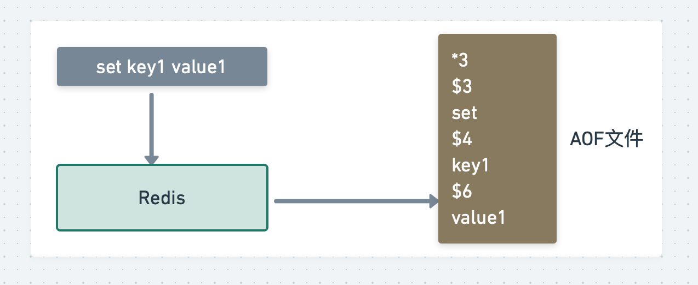

## 前言

我一直在想如何做到 Redis 的稳定、高可用，是不是那些骇人的概念（主从复制、哨兵、集群、分片。。。），那如何从最简单的一步一步构建出稳定、高性能的Redis集群呢？这方面的知识点该如何学习，一个一个点的学习不太能从整体视角审视这个问题，所以计划本文一次性说清楚这个问题（计划先用一段白话文说清楚每个阶段在干什么，为什么这么干。然后对于每一步拆开详细学习记录，最后总结），预计又是一篇万字长文，来吧！

## 一步一步构建稳定、高性能的 Redis

### 最简单的单机版 Redis

为了性能，为了读性能，引进了缓存（Redis）这个概念，从MySQL中查出数据，然后放到Redis里面，之后的业务就去Redis里面去取，看起来很好。

随着时间，业务数据的增大，Redis存储的数据越来越大，往Redis里面存储的数据也越来越重要，那么此时对Redis的依赖也越来越重。如果有一天Redis故障无法再提供服务，轻则无法保证部分业务数据的准确性，重则整个系统岌岌可危。

既然 Redis 只把数据存储在内存中，那是否可以把这些数据也写一份到磁盘上呢？如果采用这种方式，当 Redis 重启时，我们把磁盘中的数据快速**恢复**到内存中，这样它就可以继续正常提供服务了。是的，这是一个很好的解决方案，这个把内存数据写到磁盘上的过程，就是数据持久化。

### 数据持久化（RDB & AOF）：有备无患

首先，可以想到，持久化当然是持久到本地的磁盘上，最容易想到的一个方案就是Redis每一次执行写操作，，同时也写一份到磁盘上。这就是最简单、最直接的方案。但是，分析一下。如果每次客户端的写操作，既需要写内存，又需要写磁盘，而且写磁盘的耗时要比写内存的时间长的长的长，这肯定会拖慢Redis本来的性能。

所以，接下来可以这样优化：Redis 写内存由主线程来做，写内存完成后就给客户端返回结果，然后 Redis 用另一个线程去写磁盘，这样就可以避免主线程写磁盘对性能的影响。

除此之外，从Redis本身被设计的原因考虑（缓存），这就意味着尽管Redis中没有保存全量数据，对于不在缓存中的数据，依旧可以通过查询数据库后都回写Redis，只不过速度慢点，但是业务结果数据的准确性影响不大，基于这个特点，Redis的持久化还可以用数据快照的方式来做。

Redis 的数据快照，是记录某一时刻下 Redis 中的数据，然后只需要把这个数据快照写到磁盘上就可以了。它的优势在于，只在需要持久化时，把数据「一次性」写入磁盘，其它时间都不需要操作磁盘。基于这个方案可以定时给Redis做数据快照，把数据持久化道磁盘上。

上面说到的持久化方案其实就是 Redis 的 RDB 和 AOF。

当然，关于RDB和AOF下面具体再说，接着说做完持久化又会有什么新的问题。

即便把持久化优化的特别好，但别忘了，恢复总是需要时间的，在这期间业务还是会受到影响。

这个时候，就要用上主从复制了：一个实例宕机，只能用恢复数据处理，那是否可以部署多个Redis示例，然后让这些示例数据保持实时同步，这样当一个实例宕机时，就从剩下的示例中选择一个继续提供服务就好了。

### 主从复制：多副本

一般的主从复制会部署3台（一台master，两台slave），这样就是3个Redis示例。

采用多副本的优势：

1. 短期不可用时间：master 发生宕机，我们可以手动把 slave 提升为 master 继续提供服务
2. 提升读性能：让 slave 分担一部分读请求，提升应用的整体性能

这个方案看起来不错，不仅节省了数据恢复的时间，还能提升性能，那它有什么问题嘛？

当 master 宕机时，需要手动把 slave 提升为 master，这个过程也是需要花费时间的。

虽然比恢复数据要快得多，但还是需要人工介入处理。一旦需要人工介入，就必须要算上人的反应时间、操作时间，所以，在这期间你的业务应用依旧会受到影响。

是否可以把这个切换的过程，变成自动化呢？对于这种情况，就需要一个故障自动切换机制，这就是经常听到的哨兵所具备的能力。

### 哨兵：故障自动切换

现在，可以引入一个类似观察者的角色，让他实时检测master的健康状态，这个观察者就是哨兵。

1. 哨兵每间隔一段时间，询问 master 是否正常
2. master 正常回复，表示状态正常，回复超时表示异常
3. 哨兵发现异常，发起主从切换

有个这个方案，就不需要人工介入，可以让他们自动化的执行，但是还有一个问题，就是如果哨兵和master之间的网络发生了问题，那这个哨兵就有可能会误判。这个问题该怎么办？

可以部署多个哨兵，让它们分布在不同的机器上，它们一起监测 master 的状态，流程就变成了这样：

1. 多个哨兵每间隔一段时间，询问 master 是否正常
2. master 正常回复，表示状态正常，回复超时表示异常
3. 一旦有一个哨兵判定 master 异常（不管是否是网络问题），就询问其它哨兵，如果多个哨兵（设置一个阈值）都认为 master 异常了，这才判定 master 确实发生了故障
4. 多个哨兵经过协商后，判定 master 故障，则发起主从切换

所以，我们用多个哨兵互相协商来判定 master 的状态，这样一来，就可以大大降低误判的概率。

哨兵协商判定 master 异常后，这里还有一个问题：**由哪个哨兵来发起主从切换呢？**

答案是，选出一个哨兵「领导者」，由这个领导者进行主从切换。

问题又来了，这个领导者怎么选？

想象一下，在现实生活中，选举是怎么做的？是的，投票。

在选举哨兵领导者时，可以制定这样一个选举规则：

1. 每个哨兵都询问其它哨兵，请求对方为自己投票
2. 每个哨兵只投票给第一个请求投票的哨兵，且只能投票一次
3. 首先拿到超过半数投票的哨兵，当选为领导者，发起主从切换

其实，这个选举的过程就是我们经常听到的：分布式系统领域中的共识算法。

> 共识算法：在分布式系统领域，多个节点如何就一个问题达成共识的算法，就叫共识算法
>
> 通过特殊节点的投票，在很短的时间内完成对交易的验证和确认；对一笔交易，如果利益不相干的若干个节点能够达成共识，我们就可以认为全网对此也能够达成共识

现在，我们用多个哨兵共同监测 Redis 的状态，这样一来，就可以避免误判的问题了。

到这里，看着问题一点点意思了，从简单的单机版，经过数据持久化、主从多副本、哨兵集群，这一路优化下来，你的 Redis 不管是性能还是稳定性，都越来越高，就算节点发生故障，也不用担心了。但是这样就没有问题了吗？

继续分析：

1. 稳定性：Redis 故障宕机，我们有哨兵 + 副本，可以自动完成主从切换
2. 性能：读请求量增长，我们可以再部署多个 slave，读写分离，分担读压力
3. 性能：写请求量增长，但我们只有一个 master 实例，这个实例达到瓶颈怎么办？

到了么，如果写请求量越来越大时，一个 master 实例可能就无法承担这么大的写流量了。想要完美的解决这个问题，此时就要考虑使用集群分片了。

### 分片集群：横向扩展

什么是分片集群？

简单来讲，一个实例扛不住写压力，那可以部署多个实例，然后把这些实例按照一定规则组织起来，把它们当成一个整体，对外提供服务，这样不就可以解决集中写一个实例的瓶颈问题吗？

关于分片集群的详细问题下面再专门学习。

至此，Redis 已经很稳定和高可用了，这也就业界给出的答案。

## 简单总结

首先，在使用最简单的单机版 Redis 时，发现当 Redis 故障宕机后，数据无法恢复的问题，因此想到了数据持久化，把内存中的数据也持久化到磁盘上一份，这样 Redis 重启后就可以从磁盘上快速恢复数据。

在进行数据持久化时，又面临如何更高效地将数据持久化到磁盘的问题。之后发现 Redis 提供了 RDB 和 AOF 两种方案，分别对应了数据快照和实时的命令记录。如果对数据完整性要求不高时，可以选择 RDB 持久化方案。如果对于数据完整性要求较高，那么可以选择 AOF 持久化方案。

但是又发现，AOF 文件体积会随着时间增长变得越来越大，此时想到的优化方案是，使用 AOF rewrite 的方式对其进行瘦身，减小文件体积，再后来，发现可以结合 RDB 和 AOF 各自的优势，在 AOF rewrite 时使用两者结合的「混合持久化」方式，又进一步减小了 AOF 文件体积。

之后，发现尽管可以通过数据恢复的方式还原数据，但恢复数据也是需要花费时间的，这意味着业务应用还是会受到影响。进一步优化，采用多副本的方案，让多个实例保持实时同步，当一个实例故障时，可以手动把其它实例提升上来继续提供服务。

但是这样也有问题，手动提升实例上来，需要人工介入，人工介入操作也需要时间，开始想办法把这个流程变得自动化，所以又引入了哨兵集群，哨兵集群通过互相协商的方式，发现故障节点，并可以自动完成切换，这样就大幅降低了对业务应用的影响。

最后，把关注点聚焦在如何支撑更大的写流量上，所以，又引入了分片集群来解决这个问题，让多个 Redis 实例分摊写压力，未来面对更大的流量，还可以添加新的实例，横向扩展，进一步提升集群的性能。

至此，如此构建的Redis 集群才得以长期稳定、高性能的为业务提供服务。

## 思考

上面专门说了如何通过Redis构建一个稳定、高性能的集群，其实，这就是架构设计的核心思想：

- 高性能：读写分离、分片集群
- 高可用：数据持久化、多副本、故障自动切换
- 易扩展：分片集群、横向扩展

而且，关于哨兵集群、分片集群，其实还提到了一些关于分布式系统的相关知识：

- 分布式共识：哨兵领导者选举
- 负载均衡：分片集群数据分片、数据路由

其实，对与Redis是这样，构建任何一个数据集群，都可以沿用这个思考去思考，去优化。

在做软件架构设计时，面临的场景就是发现问题、分析问题、解决问题，一步步去演化、升级架构，最后在性能、可靠性方面达到一个平衡。虽然各种软件层出不穷，但架构设计的思想不会变，只要真正掌握这一套思想，才会学有所获。下面，开始挨个攻破上面提到的这些知识点。

## RDB、AOF

### AOF 日志

当初学习Mysql的时候，接触到一写前日志（Write Ahead Log，WAL）的概念，事实上，大多数数据库都会使用这个机制来进行数据持久化，具体就是在实际写数据前，先把修改的数据记到日志文件中，以便故障时进行恢复。不过，AOF日志恰好相反，它是写后日志，“写后”的意思就是说Redis先执行命令，把数据写入内存，然后才记录日志。

#### AOF 日志如何实现

这里以Redis收到`set key1 value1`命令后的日志为例，看看AOF日志的内容。

“*3"表示当前命令有三个部分，每部分都是由“$+数字”开头，后面紧跟着具体的命令，键或值。

如果是写前日志的话，Redis在向AOF里面记录日志的时候，就不会先去对这些命令进行语法检查。就有可能记录了错误的命令，那在恢复的时候哦，就可能会出错。

而写后日志这种方式，就是让系统先执行命令，只有命令能执行成功，才会被记录到日志中，否则，系统就直接向客户端报错了。所以，AOF的一大好处就是：**可以避免出现记录错误命令的情况**。

还有一个好处，可以思考一下，既然它是在命令执行后才记录日志，所以**不会阻塞当前的写操作**。

那既然不会阻塞当前写操作，那肯定会给下一个操作带来阻塞风险。因为，AOF日志也是在主线程中进行的，如果把日志文件写入磁盘时，磁盘写压力过大，就会导致写盘很慢，进而导致后续的操作也无法执行。

还有一个风险就是如果刚执行完一个命令，此时宕机了，日志没有来得及记录，所以，就丢失了最后一次写操作的日志记录。

#### 三种写回策略

仔细分析：这两个风险都是和AOF写入磁盘的时机相关的，也就是说，如果可以控制这个时机，那这两个风险就可以相对避免掉。为此，AOF机制提供了三种选择，也就是AOF配置项`appendfsync`的三个可选值。

- Always：同步写回。每个写命令执行完，立马同步的将日志写回磁盘
- Everysec：每秒写回。每个写命令执行完，只是先把日志记到AOF的缓冲区，每隔一秒把缓冲区的内容写回磁盘。
- No：操作系统控制的写回。每个写命令执行完，只是先把日志写到AOF的缓冲区，由操作系统决定何时将缓冲区的内容写回磁盘。

但是比较遗憾的是，这三种写回策略都无法做的两全其美（避免主线程阻塞、减少数据丢失）。

- 同步写回：可以做的基本不丢数据，但是它在每一个写命令后面都有一个慢速的落盘操作，不可避免的会影响主线程性能。
- 操作系统控制写回：虽然写完缓冲区后，就可以执行后续的命令，但是这个落盘的时机已经不在Redis手中，只要AOF记录没有写回磁盘，一旦宕机对应的数据就会丢失。
- 每秒写回：采用一秒写回一次的频率，避免了同步写回的性能开销，虽然减少了对系统性能的影响，但是如果发生宕机，上一秒内未落盘的命令操作仍然会丢失。所以，这只能算是，在两者上面取了一个折中。

可见，万物都在折中。以上配置项的优缺点用表格汇总：

| 配置项   | 写回时机           | 优点                     | 缺点                             |
| -------- | ------------------ | ------------------------ | -------------------------------- |
| Always   | 同步写回           | 可靠性高，数据基本不丢失 | 每个写命令都要落盘，性能影响较大 |
| Everysec | 每秒写回           | 性能适中                 | 宕机时丢失1秒内的数据            |
| No       | 操作系统控制的写回 | 性能好                   | 宕机时丢失数据较多               |

根据上面的总结，选择哪种策略就很一目了然了。

但是，到这还有问题，因为AOF是以文件的形式记录收到的所有命令，所以，就会有性能问题了。

1. 文件系统本身就会文件大小有限制，无法保存过大的文件
2. 如果文件太大，之后再里面追加命令记录的话，效率就会降低
3. 如果发生宕机，恢复的时候这个文件记录的命令需要一个一个被执行，整个恢复过程就会非常慢，进而影响到Redis的正常使用。

所以，就需要采取一定的控制手段，就是**AOF重写机制**。

#### 日志文件太大？AOF 重写机制解决

简单的说，AOF重写机制就是在重写时，Redis根据数据库的现状创建一个新的AOF文件。也就是说，读取数据库中的所有键值对，然后对每一个键值对用一条命令记录它的写入。比如：

当读取了键值对“key1”:"value1"之后，重写机制会记录`set key1 value1`这条命令。这样，当恢复的时候，可以重新执行该命令，实现“key1”:"value1"的写入。

是不是觉得没啥区别，先别着急，实际上，重写机制具有“多变一”功能。所谓的“多变一”，就是说，旧日志文件中的多条命令，在重写后的新日志文件中变成了一条命令。

详细的说就是这样：AOF文件是以追加的方式，逐一记录接受到的写命令的。当一个键值对被多条写命令反复修改时，AOF文件会记录相应的多条记录。但是，在重写的时候，是根据这个键值对当前的最新状态，为它生成对应的写入命令。遮这样一来，一个键值对在重写日志只有一条命令就行了。那么，在恢复时，只需要执行这条命令，就可以完成这个键值对的写入了。

这样处理后，日志文件太大这个问题就算解决了，但是，要是把整个数据库的最新数据的操作日志都写回磁盘，仍然是一个非常耗时的操作。那么，这个耗时操作会不会阻塞主线程。

#### AOF 重写会阻塞吗？

和AOF日志由主线程写回不同，重写过程是由后台线程 bgrewriteaof 来完成的，这也是为了避免阻塞主线程，导致数据库性能下降。

这个过程，把它总结为“一个拷贝、两处日志”。

- 一个拷贝：每次执行重写时，主线程 fork 出后台 bgrewriteaof子进程。此时，fork 会把主线程的内存拷贝一份给 bgrewriteaof 子进程，这里面就包括了数据库的最新数据，然后，bgrewriteaof 子进程就可以在不影响主线程的情况下，逐一把拷贝的数据写成操作，记入重写日志。
- 两处日志：因为主线程未阻塞，仍然可以处理新来的操作。此时，如果是写操作，第一处日志就是指正在使用的AOF日志，Redis会把这个操作写到它的缓冲区，这样一来，即使宕机了，这个AOF日志的操作仍然是齐全的，可以用于恢复。第二处日志，就是指新的AOF重写日志，这个操作也会被写回到重写日志的缓冲区。这样，重写日志也不会丢失最新的操作。等到拷贝数据的所有操作记录重写完成后，重写日志记录的这些最新操作也会写入新的AOF文件，也保证数据最新状态的记录。此时，就可以用新的AOF文件替代旧文件了。

总结来说，每次AOF重写时，Redis会先执行一个内存拷贝，用于重写；然后，使用两个日志保证在重写过程中，新写入的数据不会丢失。而且，因为Redis采用额外的线程进行数据重写，所以，这个过程并不会阻塞主线程。

#### AOF 重写日志潜在风险

但是，既然是这样，AOF重写日志依然存在风险：fork 子进程和 AOF 重写过程中父进程产生写入的场景

- fork 子进程和 AOF 重写过程中父进程产生写入的场景
  - fork 子进程：fork 这个瞬间一定会阻塞主线程的（注意，fork 时并不会一次性拷贝所有内存数据给子进程）fork 采用操作系统提供的写时复制（Copy On Write）机制，就是为了避免一次性拷贝大量内存数据给子进程造成的长时间阻塞问题，但 fork 子进程需要拷贝父进程必要的数据结构，其实有一项就是拷贝内存页表（虚拟内存和物理内存的映射索引表），这个拷贝过程会消耗大量的CPU资源，拷贝完成之前整个进程都是阻塞的，阻塞时间取决于整个实例的内存大小，实例越大，内存页表越大，fork 阻塞时间越久。拷贝完内存页表完成后，子进程与父进程指向相同的内存地址空间，也就是说此时虽然产生了子进程，但是并没有申请与父进程相同的内存大小，那什么时候父进程才会真正内存分离呢？“写时复制“顾名思义，就是在写发生时，才真正拷贝内存真正的数据，这个过程中，父进程也可能会产生阻塞的风险，就是第二点讲要说的
  - fork 出的子进程指向与父进程相同的内存地址空间，此时子进程就可以执行AOF重写，把内存中的所有数据写入到AOF文件中。但是此时父进程依旧是会有流量写入的，如果父进程操作的是一个已经存在的key，那么这个时候父进程就会真正拷贝这个key的对应的内存数据，申请新的内存空间，这样逐渐地，父子进程内存数据开始分离，父子进程逐渐拥有各自独立的内存空间。因为内存分配是以页为单位的，默认是4K，如果父进程此时操作的是一个bigkey，重新申请大块内存耗时会变长，可能会产生阻塞风险。另外，如果操作系统开启了内存大页机制（Huge Page机制，页面大小为2M），那么父进程申请内存是阻塞的概率将会大大提高，所有在Redis机器上需要关闭Huge Page机制。

#### 小结

AOF机制：通过逐一记录操作命令，在恢复时逐一执行命令的方式，保证了数据的可靠性。

看似简单，但也是充分考虑了对Redis性能的影响。总的来说，它提供了三种写回策略，分别为Always、Everysec，No，这三种策略在可靠性上从高到低，而在性能上从低到高。

此外，为了避免日志文件过大，又提供了AOF重写机制，直接根据数据库里数据的最新状态，生成这个数据的插入命令，作为新日志。这个过程时后台线程完成，避免了对主线程的阻塞。

但是，重写日志也是有很大的风险，就是需要fork子进程的时候，这个瞬间是会影响主线程的。还有就是把数据写入到AOF文件时，此时父进程是在正常运行的（比如正在写数据），那么重新申请内存耗时就会变长，可能就会产生阻塞风险，

还有一点需要说一下，AOF重写为什么不复用AOF本身的日志？

- 父子进程写同一个文件必然会产生竞争问题，控制竞争意味着影响父进程的性能
- 如果AOF重写过程失败了，那么原本的AOF文件相当于被污染了，无法做恢复使用。所以AOF重写一个新文件，重写失败的话，直接删除这个文件就好了，不会对原先的AOF文件产生影响。等重新完成之后，直接替换旧文件即可。

### RDB 快照

#### 是什么

所谓快照，就是指内存中的数据在某一时刻的状态记录。就好比拍照，一张照片就可以把朋友一瞬间的形象完全记下来。

对Redis来说，它实现类似照片记录效果的方式，就是把某一时刻的状态以文件的形式写到磁盘上，也就是快照。这样一来，即使宕机，快照文件也不会丢失，数据的可靠性也就得到了保证。这个快找文件就称为RDB文件，其中，RDB就是Redis DataBase的缩写。

和AOF相比，RDB记录的是某一时刻的数据，并不是操作，所以，在做数据恢复的时候，可以直接把RDB文件读入内存，很快的完成恢复。听起来好像不错，但内存快照也并不是最优选项。还要思考两个关键问题：

- 对哪些数据做快照？这关系到快照的执行效率问题；
- 做快照时，数据还能被增删改吗？这关系到Redis是否被阻塞，能否同时正常处理请求。

#### 给哪些内存数据做快照？

Redis的数据都在内存中，为了提供所有数据的可靠性保证，它执行的是全两快照。也就是说，把内存中的所有记录都记录到磁盘中/这样做的好处就是一次性记录了所有数据。但是带来的问题就是，给内存的全量数据做快照时，把它们全部写入磁盘会花费很多时间。而且，RDB文件越大，往磁盘上写数据的时间开销就越大。

对于Redis来说，它的单线程模型就决定了要尽量避开所有会阻塞主线程的操作。所以，针对任何操作，都需要明确：这个操作它会阻塞主线程吗？

Redis提供了两个命令来生成RDB文件，分别是`save`和`bgsave `：

- save：在主线程中执行，会导致阻塞。
- bgsave：创建一个子进程，专门用于写入RDB文件，避免了主线程的阻塞，这也是默认配置。

#### 快照数据能修改吗？

既然是快照，就不希望数据“动”，不希望数据发生改变。

举个例子：在时刻t给内存做跨照，假设内存数据量是4G，磁盘的写入带宽是0.2GB/s，简单来说，至少需要20s(4/0.2=20)才能做完。如果在t+5s时，一个还没有被写入磁盘的内存数据A，被修改成了A‘，那么机会破坏快照的完整性。

但是，在快照执行期间，数据不能修改，这肯定会给业务造成巨大的影响。

所以，这个时候Redis借助操作系统的写时复制（COW）技术，在快照进行的同时，正常进行写操作。

简单来说，bgsave子进程是由主线程fork生成的，可以共享主线程的所有内存数据。bgsave子进程运行后，开始读取主线程的内存数据，并把它们写入RDB文件。此时，读操作它们相互不影响，但是，如果主线程要修改一块数据，那么，这块数据就会被复制一份，生成该数据的副本。然后，bgsave子进程会把这个副本数据写入RDB文件，而在这个过程中，主线程仍然可以直接修改原来的数据。

这样既保证了快照的完整性，也允许主线程同时对数据进行修改，避免了对正常业务的影响。

接下里，思考下一个问题？可以“连拍”吗？

#### 可以每秒做一次快照吗？

频繁执行全量快照，会有两方面的开销：

- 磁盘压力变大
- 虽然子进程在创建后不会阻塞主线程，但是，别忘了，fork这个创建过程本身就会阻塞主线程，而且主线程的内存越大，阻塞时间就越长。如果频繁fork，当然就会频繁阻塞主线程。

所以，基于上面的问题，就需要做增量快照。所谓增量快照，就是指做了一次全量快照后，后续的快照只对修改过的数据进行快照记录，这样就可以避免每次全量快照的开销。

但是，做增量更新的时候，需要记住被修改过的数据，不要小瞧记住这个功能，它需要使用额外的元数据信息去记录哪些数据被修改了，这又会带来额外的空间开销问题。

到这，可以发现，虽然跟AOF相比，快照的速度快，但是，快照的频率不好把握，如果频率太低，两次快照之间一旦宕机，就可能有比较多的数据丢失。如果频率太高，又会产生额外开销，那么有什么好的办法既能利用RDB的跨度恢复，又能以较小的开销做到尽量少丢失数据呢？

#### 混合使用AOF日志和RDB内存快照

在Redis4.0中提出了一个混合使用AOF日志和RDB内存快照的方法，简单来说，内存快照以一定的频率执行，在两次快照之间，使用AOF日志记录这期间的所有命令操作。

这个方法既能享受到RDB文件快速恢复的好处，又能享受到AOF只记录操作命令的简单优势，一般生产环境中也会这么使用。

#### 小结

RDB快照用于避免数据丢失的内存快照，优势在于，可以快速恢复数据库，也就是只需要把RDB文件直接读入内存，这就避免了AOF需要顺序、逐一重新执行操作命令带来的低效性能问题。不过，内存快照也有它的局限性，它拍的是一张内存的“大合影”，不可避免的会耗时耗力。所以，应该将两者结合起来，扬长避短，以较小的性能开销保证数据可靠性和性能。

最后，关于AOF和RDB的选择问题，有三点建议：

- 数据不能丢失时，内存快照和AOF混合使用
- 如果允许分钟级别的数据丢失，可以只使用RDB
- 如果只用AOF，优先使用everysec的配置选项，因为它在可靠性和性能之间取了一个平衡

最后附几个链接：我觉得写的很好，可以学习：

[Redis专题：万字长文详解持久化原理 - SegmentFault 思否](https://segmentfault.com/a/1190000039208726)

## 主从复制

## 哨兵

## 分片集群

## 总结

