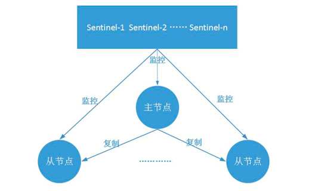

### Redis哨兵主备切换的数据丢失问题：异步复制、集群脑裂

#### 异步复制

因为master -> slave的复制是异步的，所以可能有部分数据还没复制到slave，master就宕机了，此时这些部分数据就丢失了

#### 集群脑裂

脑裂：也就是说，某个master所在的机器突然脱离了正常网络，也就是因为网络的原因哨兵节点监控不到了，然后把Slave提升为新的Master，但是等网络恢复后，前面的那个master由正常提供服务了，这个时候就产生了两个master，也就是所谓的脑裂。

此时虽然某个slave被切换成了master，但是可能client还没来得及切换到新的master，还继续写向旧master的数据可能也丢失了。

#### 解决方法

##### 异步复制

```shell
min-slaves-to-write 1
min-slaves-max-lag 10
```

要求至少有1个slave，数据复制和恢复的延迟不能超过10秒

如果说一旦所有的slave，数据复制和同步的延迟都超过了10秒钟，那么这个时候，master就不会再接收任何请求了

举个例子：先给master写数据，然后同步到slave，配置了上面的参数之后，比如说已经过了10秒了，这个时候mater就拒绝client的写请求，那client就需要在自己的内存中暂时缓存，尝试写其他的master，或者停顿一会。

如果不做这个配置，那就丢失多少就多少。

一般来说，会在client做降级，写到本地磁盘里面，在client对外接收请求，再做降级，做限流，减慢请求涌入的速度。

或者client 可能会采取将数据临时灌入一个Kafka消息队列中，每隔10分钟去队列里面取一次，尝试重新发回master。

##### 集群脑裂

如果一个master出现了脑裂，跟其他slave丢了连接，那么上面两个配置可以确保说，如果不能继续给指定数量的slave发送数据，而且slave超过10秒没有给自己ack消息，那么就直接拒绝客户端的写请求。

这样脑裂后的旧master就不会接受client的新数据，也就避免了数据丢失。

上面的配置就确保了，如果跟任何一个slave丢了连接，在10秒后发现没有slave给自己ack，那么就拒绝新的写请求，因此在脑裂场景下，最多就丢失10秒的数据。

### 哨兵选举详解

#### 作用

做介绍哨兵之前，首先从宏观角度理解一下Redis实现高可用相关的技术，包括：持久化、复制、哨兵和集群。

- 持久化：持久化是最简单的高可用方法（有时候甚至不被归为高可用的手段），主要作用是数据备份，即数据存储在硬盘，保证数据不会因进程退出而丢失。
- 复制：复制是高可用Redis的基础，哨兵和集群都是在复制基础上实现高可用的。复制主要实现了数据的多机备份，以及对于读操作的负载均衡和简单的故障恢复。缺陷：故障恢复无法自动化；写操作无法负载均衡；存储能力受到单机的限制；
- 哨兵：在复制的基础上，哨兵实现了自动化的故障恢复。缺陷：写操作无法负载均衡；存储能力受到单机的限制。
- 集群：通过集群，Redis解决了写操作无法负载均衡，以及存储能力收到单机限制的问题，实现了较为完善了的高可用方案。

#### 哨兵

Redis Sentinel，即Redis哨兵，在Redis 2.8版本开始引入。**哨兵的核心功能是主节点的自动故障转移。**下面是Redis官方文档对于哨兵功能的描述：

- **监控（Monitoring**）： Sentinel 会不断地检查你的主服务器和从服务器是否运作正常。
- **提醒（Notification）**： 当被监控的某个 Redis 服务器出现问题时， Sentinel 可以通过 API 向管理员或者其他应用程序发送通知。
- **自动故障迁移（Automatic failover）**： 当一个主服务器不能正常工作时， Sentinel 会开始一次自动故障迁移操作， 它会将失效主服务器的其中一个从服务器升级为新的主服务器， 并让失效主服务器的其他从服务器改为复制新的主服务器； 当客户端试图连接失效的主服务器时， 集群也会向客户端返回新主服务器的地址， 使得集群可以使用新主服务器代替失效服务器。

#### 架构



-  哨兵节点：哨兵系统由一个或多个哨兵节点组成，哨兵节点是特殊的redis节点，不存储数据。
- 数据节点：主节点和从节点都是数据节点。

#### 基本原理

##### 哨兵节点支持的命令

哨兵节点作为运行在特殊模式下的redis节点，其支持的命令与普通的redis节点不同。在运维中，我们可以通过这些命令查询或修改哨兵系统；不过更重要的是，哨兵系统要实现故障发现、故障转移等各种功能，离不开哨兵节点之间的通信，而通信的很大一部分是通过哨兵节点支持的命令来实现的。下面介绍哨兵节点支持的主要命令。

（1）基础查询：通过这些命令，可以查询哨兵系统的拓扑结构、节点信息、配置信息等。

- info sentinel：获取监控的所有主节点的基本信息
- sentinel masters：获取监控的所有主节点的详细信息
- sentinel master mymaster：获取监控的主节点mymaster的详细信息
- sentinel slaves mymaster：获取监控的主节点mymaster的从节点的详细信息
- sentinel sentinels mymaster：获取监控的主节点mymaster的哨兵节点的详细信息
- sentinel get-master-addr-by-name mymaster：获取监控的主节点mymaster的地址信息，前文已有介绍
- sentinel is-master-down-by-addr：哨兵节点之间可以通过该命令询问主节点是否下线，从而对是否客观下线做出判断

（2）增加/移除对主节点的监控

- sentinel monitor mymaster2 192.168.92.128 16379 2：与部署哨兵节点时配置文件中的sentinel monitor功能完全一样，不再详述
- sentinel remove mymaster2：取消当前哨兵节点对主节点mymaster2的监控

（3）强制故障转移

- sentinel failover mymaster：该命令可以**强制对mymaster执行故障转移**即便当前的主节点运行完好；例如，如果当前主节点所在机器即将报废，便可以提前通过failover命令进行故障转移。

##### 基本原理

关于哨兵的原理，关键是了解以下几个概念。

（1）定时任务：每个哨兵节点维护了3个定时任务。定时任务的功能分别如下：通过向主从节点发送info命令获取最新的主从结构；通过发布订阅功能获取其他哨兵节点的信息；通过向其他节点发送ping命令进行心跳检测，判断是否下线。

（2）主观下线：在心跳检测的定时任务中，如果其他节点超过一定时间没有回复，哨兵节点就会将其进行主观下线。顾名思义，主观下线的意思是一个哨兵节点“主观地”判断下线；与主观下线相对应的是客观下线。

（3）客观下线：哨兵节点在对主节点进行主观下线后，会通过sentinel is-master-down-by-addr命令询问其他哨兵节点该主节点的状态；如果判断主节点下线的哨兵数量达到一定数值，则对该主节点进行客观下线。

**需要特别注意的是，客观下线是主节点才有的概念；如果从节点和哨兵节点发生故障，被哨兵主观下线后，不会再有后续的客观下线和故障转移操作。**

（4）选举领导者哨兵节点：当主节点被判断客观下线以后，各个哨兵节点会进行协商，选举出一个领导者哨兵节点，并由该领导者节点对其进行故障转移操作。

监视该主节点的所有哨兵都有可能被选为领导者，选举使用的算法是Raft算法；Raft算法的基本思路是先到先得：即在一轮选举中，哨兵A向B发送成为领导者的申请，如果B没有同意过其他哨兵，则会同意A成为领导者。选举的具体过程这里不做详细描述，一般来说，哨兵选择的过程很快，谁先完成客观下线，一般就能成为领导者。

（5）故障转移：选举出的领导者哨兵，开始进行故障转移操作，该操作大体可以分为3个步骤：

- 在从节点中选择新的主节点：选择的原则是，首先过滤掉不健康的从节点；然后选择优先级最高的从节点(由slave-priority指定)；如果优先级无法区分，则选择复制偏移量最大的从节点；如果仍无法区分，则选择runid最小的从节点。
- 更新主从状态：通过slaveof no one命令，让选出来的从节点成为主节点；并通过slaveof命令让其他节点成为其从节点。
- 将已经下线的主节点(即6379)设置为新的主节点的从节点，当6379重新上线后，它会成为新的主节点的从节点。