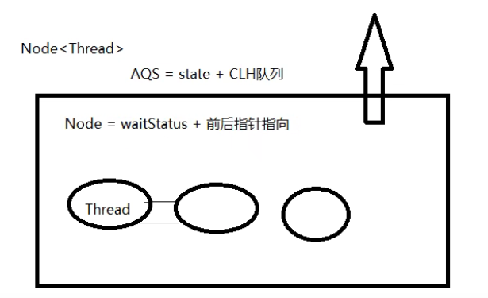
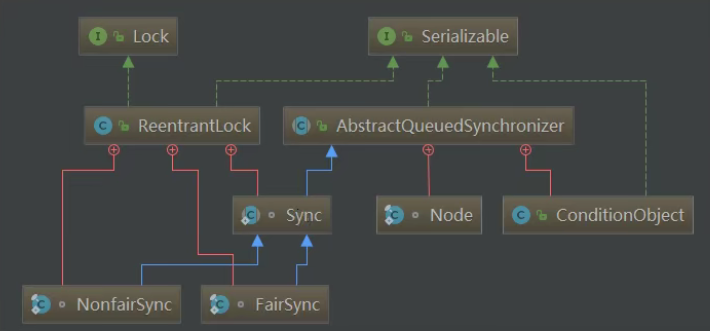
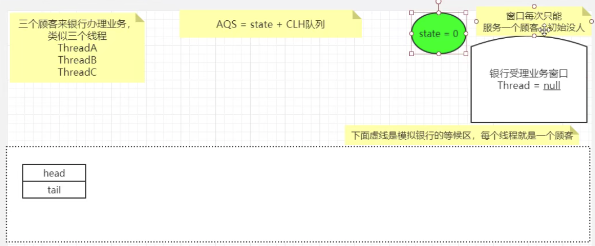

[TOC]


## AQS理论初步

AbstractQueuedSynchronizer 抽象队列同步器

```java
public abstract class AbstractQueuedSynchronizer
    extends AbstractOwnableSynchronizer
    implements java.io.Serializable {
    
    ...
    
}
```

是用来构建锁或者其它同步器组件的重量级基础框架及整个JUC体系的基石，通过内置的FIFO队列来完成资源获取线程的排队工作，并通过一个int类型变量表示持有锁的状态。


CLH：Craig、Landin and Hagersten队列，是一个单向链表，AQS中的队列是CLH变体的虚拟双向队列FIFO。

## AQS作用


### 进一步理解锁和同步器的关系

- 锁：面向锁的使用者。定义了程序员和锁交互的使用层API，隐藏了实现细节，你调用即可
- 同步器：面向锁的实现者。比如Java并发大神DougLee，提出统一规范并简化了锁的实现，屏蔽了同步状态管理、阻塞线程队列和通知、唤醒机制等。

### 作用

加锁会导致阻塞，有阻塞就需要队列，实现排队必然需要队列。

抢到资源的线程直接使用处理业务，抢不到资源的必然涉及一种 排队等候机制 。抢占资源失败的线程继续去等待(类似银行业务办理窗口都满了，暂时没有受理窗口的顾客只能去 候客区排队等候 )，但等候线程仍然保留获取锁的可能且获取锁流程仍在继续(候客区的顾客也在等着叫号，轮到了再去受理窗口办理业务)。

既然说到了 排队等候机制 ，那么就一定会有某种队列形成，这样的队列是什么数据结构呢？

如果共享资源被占用， 就需要一定的阻塞等待唤醒机制来保证锁分配 。这个机制主要用的是CLH队列的变体实现的，将暂时获取不到锁的线程加入到队列中，这个队列就是AQS的抽象表现。它将请求共享资源的线程封装成队列的结点（ **Node**  ），通过CAS、自旋以及LockSupport.park()的方式，维护state变量的状态，使并发达到同步的效果。

## 源码体系

> Provides a framework for implementing blocking locks and related synchronizers (semaphores, events, etc) that rely on first-in-first-out (FIFO) wait queues. This class is designed to be a useful basis for most kinds of synchronizers that rely on a single atomic int value to represent state. Subclasses must define the protected methods that change this state, and which define what that state means in terms of this object being acquired or released. Given these, the other methods in this class carry out all queuing and blocking mechanics. Subclasses can maintain other state fields, but only the atomically updated int value manipulated using methods getState(), setState(int) and compareAndSetState(int, int) is tracked with respect to synchronization.
>
> AbstractQueuedSynchronizer (Java Platform SE 8 )
>
> 提供一个框架来实现阻塞锁和依赖先进先出（FIFO）等待队列的相关同步器（信号量、事件等）。此类被设计为大多数类型的同步器的有用基础，这些同步器依赖于单个原子“int”值来表示状态。子类必须定义更改此状态的受保护方法，以及定义此状态在获取或释放此对象方面的含义。给定这些，这个类中的其他方法执行所有排队和阻塞机制。子类可以维护其他状态字段，但是只有使用方法getState（）、setState（int）和compareAndSetState（int，int）操作的原子更新的’int’值在同步方面被跟踪。

有阻塞就需要排队，实现排队必然需要队列

AQS使用一个volatile的int类型的成员变量来表示同步状态，通过内置的FIFO队列来完成资源获取的排队工作将每条要去抢占资源的线程封装成一个Node节点来实现锁的分配，通过CAS完成对State值的修改。

### AQS 自身

AQS的int变量

- AQS的同步状态state成员变量
- 零就是没人，自由状态可以办理;大于等于1，有人占用窗口，等着去

```java
public abstract class AbstractQueuedSynchronizer
    extends AbstractOwnableSynchronizer
    implements java.io.Serializable {

    ...

     * The synchronization state.
      // 零就是没人，自由状态可以办理;大于等于1，有人占用窗口，等着去
    private volatile int state;
    
    ...
}
```

AQS的CLH队列

- CLH队列(三个大牛的名字组成)，，默认为一个单向链表，AQS修改为了一个双向队列。
- 银行候客区的等待顾客。

> The wait queue is a variant of a “CLH” (Craig, Landin, and Hagersten) lock queue. CLH locks are normally used forspinlocks. We instead use them for blocking synchronizers, butuse the same basic tactic of holding some of the controlinformation about a thread in the predecessor of its node. A"status" field in each node keeps track of whether a threadshould block. A node is signalled when its predecessorreleases. Each node of the queue otherwise serves as aspecific-notification-style monitor holding a single waiting thread. The status field does NOT control whether threads aregranted locks etc though. A thread may try to acquire if it isfirst in the queue. But being first does not guarantee success;it only gives the right to contend. So the currently releasedcontender thread may need to rewait.
>
> To enqueue into a CLH lock, you atomically splice it in as new tail. To dequeue, you just set the head field. 本段文字出自AbstractQueuedSynchronizer内部类Node源码注释
>
> 等待队列是“CLH”（Craig、Landin和Hagersten）锁队列的变体。CLH锁通常用于旋转锁。相反，我们使用它们来阻止同步器，但是使用相同的基本策略，即在其节点的前一个线程中保存一些关于该线程的控制信息。每个节点中的“status”字段跟踪线程是否应该阻塞。当一个节点的前一个节点释放时，它会发出信号。否则，队列的每个节点都充当一个特定的通知样式监视器，其中包含一个等待线程。状态字段并不控制线程是否被授予锁等。如果线程是队列中的第一个线程，它可能会尝试获取。但是，第一并不能保证成功，它只会给人争取的权利。因此，当前发布的内容线程可能需要重新等待。
>
> 要排队进入CLH锁，您可以将其作为新的尾部进行原子拼接。要出列，只需设置head字段。

### 内部类 node

```java
public abstract class AbstractQueuedSynchronizer
    extends AbstractOwnableSynchronizer
    implements java.io.Serializable {

    ...

     * Creates a new {@code AbstractQueuedSynchronizer} instance
    protected AbstractQueuedSynchronizer() { }

     * Wait queue node class.
    static final class Node {
        //表示线程以共享的模式等待锁
        /** Marker to indicate a node is waiting in shared mode */
        static final Node SHARED = new Node();
        
        //表示线程正在以独占的方式等待锁
        /** Marker to indicate a node is waiting in exclusive mode */
        static final Node EXCLUSIVE = null;

        //线程被取消了
        /** waitStatus value to indicate thread has cancelled */
        static final int CANCELLED =  1;

        //后继线程需要唤醒
        /** waitStatus value to indicate successor's thread needs unparking */
        static final int SIGNAL    = -1;
        
        //等待condition唤醒
        /** waitStatus value to indicate thread is waiting on condition */
        static final int CONDITION = -2;
        
        //共享式同步状态获取将会无条件地传播下去
        * waitStatus value to indicate the next acquireShared should     
        static final int PROPAGATE = -3;

        //当前节点在队列中的状态（重点）
        //说人话：
        //等候区其它顾客(其它线程)的等待状态
        //队列中每个排队的个体就是一个Node
        //初始为0，状态上面的几种
         * Status field, taking on only the values:
        volatile int waitStatus;

        //前驱节点（重点）
         * Link to predecessor node that current node/thread relies on
        volatile Node prev;

        //后继节点（重点）
         * Link to the successor node that the current node/thread
        volatile Node next;

        //表示处于该节点的线程
         * The thread that enqueued this node.  Initialized on
        volatile Thread thread;

        //指向下一个处于CONDITION状态的节点
         * Link to next node waiting on condition, or the special
        Node nextWaiter;

         * Returns true if node is waiting in shared mode.
        final boolean isShared() {

        //返回前驱节点，没有的话抛出npe
         * Returns previous node, or throws NullPointerException if null.
        final Node predecessor() throws NullPointerException {

        Node() {    // Used to establish initial head or SHARED marker

        Node(Thread thread, Node mode) {     // Used by addWaiter

        Node(Thread thread, int waitStatus) { // Used by Condition
    }
	...
}	
```

### AQS同步队列的基本结构


CLH：Craig、Landin and Hagersten 队列，是个单向链表，AQS中的队列是CLH变体的虚拟双向队列（FIFO）



## 源码分析（ReentrantLock）



```java
ReentrantLock reentrantLock = new ReentrantLock();
```

Lock接口的实现类，基本都是通过聚合了一个队列同步器的子类（sync）完成线程访问控制的。

### 公平锁和非公平锁

```java
@ReservedStackAccess
final boolean nonfairTryAcquire(int acquires) {
      final Thread current = Thread.currentThread();
      int c = getState();
      if (c == 0) {
        if (compareAndSetState(0, acquires)) {
          setExclusiveOwnerThread(current);
          return true;
        }
      }
      else if (current == getExclusiveOwnerThread()) {
        int nextc = c + acquires;
        if (nextc < 0) // overflow
          throw new Error("Maximum lock count exceeded");
        setState(nextc);
        return true;
      }
      return false;
    }
```

```java
@ReservedStackAccess
protected final boolean tryAcquire(int acquires) {
  final Thread current = Thread.currentThread();
  int c = getState();
  if (c == 0) {
    if (!hasQueuedPredecessors() &&
        compareAndSetState(0, acquires)) {
      setExclusiveOwnerThread(current);
      return true;
    }
  }
  else if (current == getExclusiveOwnerThread()) {
    int nextc = c + acquires;
    if (nextc < 0)
      throw new Error("Maximum lock count exceeded");
    setState(nextc);
    return true;
  }
  return false;
}
```

可以明显看出公平锁与非公平锁的lock()方法唯一的区别就是在于公平锁在获取状态时多了一个限制条件hasQueuedPredecessors()，这个条件的作用是判断等待队列中是否存在有效节点的方法。

```java
public final boolean hasQueuedPredecessors() {
        // The correctness of this depends on head being initialized
        // before tail and on head.next being accurate if the current
        // thread is first in queue.
        Node t = tail; // Read fields in reverse initialization order
        Node h = head;
        Node s;
        return h != t &&
            ((s = h.next) == null || s.thread != Thread.currentThread());
    }
```

### 从ReentrantLock的非公平锁开始

带入一个银行办理业务的案例来模拟AQS如何进行线程的管理和通知唤醒机制，从非公平锁开始进入。

```java
public static void main(String[] args) {

        ReentrantLock lock = new ReentrantLock();

        //3个线程模拟3个人来银行网点，受理窗口办理业务的顾客
        new Thread(()->{
            lock.lock();
            try {
                System.out.println("------A thread come in");
                try { TimeUnit.MINUTES.sleep(20); } catch (InterruptedException e) { e.printStackTrace(); }
            }finally {
                lock.unlock();
            }
        },"A").start();

        new Thread(()->{
            lock.lock();
            try {
                System.out.println("------B thread come in");
            }finally {
                lock.unlock();
            }
        },"B").start();

        new Thread(()->{
            lock.lock();
            try {
                System.out.println("------C thread come in");
            }finally {
                lock.unlock();
            }
        },"C").start();
    }
```

图示：



#### 加锁

```java
// 调用了sync这个内部类的lock方法，所有的API层面的lock实际上都是sync这个内部类实现的
public void lock() {
        sync.lock();
    }
// 可以发现Sync继承了AQS
 abstract static class Sync extends AbstractQueuedSynchronizer {
        private static final long serialVersionUID = -5179523762034025860L;

        /**
         * Performs {@link Lock#lock}. The main reason for subclassing
         * is to allow fast path for nonfair version.
         */
        abstract void lock();
   。。。
 }
// AQS的抽象类
public abstract class AbstractQueuedSynchronizer
    extends AbstractOwnableSynchronizer
    implements java.io.Serializable {
  。。。
}
```

整个ReentrantLock的加锁阶段，可以分为三个阶段：

1. 尝试加锁
2. 加锁失败、线程进入队列
3. 线程进入队列后，进入阻塞状态

```java
@ReservedStackAccess
				// 争锁
        final void lock() {
          // 比较并设置，A线程第一个进来，此时state是默认值0，所以设置成功，此时A线程抢到锁，进入银行受理窗口办理业务。这个时候state的值被CAS成了1
            if (compareAndSetState(0, 1))
              // 设置占用这个锁的线程，把这个值设置为当前线程，也就是占用了此时的银行受理窗口，
                setExclusiveOwnerThread(Thread.currentThread());
            else
                acquire(1);
        }
```

此时，A线程占用窗口办理业务，这个时候B线程进来，走上面的逻辑发现进不了if，只能走else，所以进入`acquire(1)`。

> 这里有一个值得学习的地方：模版设计模式。
>
> 把顶层的设计放到足够高，把底层的实现放的足够低，抛出异常来限制子类的实现。逼迫子类必须实现这个方法，否则就会返回错误

```java
@ReservedStackAccess
    public final void acquire(int arg) {
      // 根据下面的nonfairTryAcquire分析，tryAcquire(arg)会返回false,取反返回true.
        if (!tryAcquire(arg) &&
            acquireQueued(addWaiter(Node.EXCLUSIVE), arg))
            selfInterrupt();
    }

// 模版设计模式
protected boolean tryAcquire(int arg) {
        throw new UnsupportedOperationException();
    }

//----------------nonfairTryAcquire----------------------
@ReservedStackAccess
// 非公平锁TryAcquire(
        final boolean nonfairTryAcquire(int acquires) {
            final Thread current = Thread.currentThread();
          // 获取当前的state=1，说明已经有线程在占用（A）
            int c = getState();
          //不进入
            if (c == 0) {
              // 有一种可能就是B刚刚要进去，A走了，所以B这个时候运气比较好是可以抢到锁的。所以会走这里
                if (compareAndSetState(0, acquires)) {
                    setExclusiveOwnerThread(current);
                    return true;
                }
            }
          // 不进入，当前线程是B,getExclusiveOwnerThread的线程是A
            else if (current == getExclusiveOwnerThread()) {
              // 如果当前线程等于抢到锁的这个线程，就说明还是之前（A）抢到锁的线程又抢到锁了，那就是重入了，所以+1
                int nextc = c + acquires;
                if (nextc < 0) // overflow
                    throw new Error("Maximum lock count exceeded");
              // 设置这个state
                setState(nextc);
                return true;
            }
          //走这个
            return false;
        }
//------------------nonfairTryAcquire-------------------------

//-------------------addWaiter-----------------------------
// 传进来的Node.EXCLUSIVE排他的，
 private Node addWaiter(Node mode) {
   // 这个node就是线程B
        Node node = new Node(Thread.currentThread(), mode);
        // Try the fast path of enq; backup to full enq on failure
   // 现在还没有线程排在阻塞区，这个时候tail = null,进入enq(node)这个方法。
        Node pred = tail;
        if (pred != null) {
            node.prev = pred;
            if (compareAndSetTail(pred, node)) {
                pred.next = node;
                return node;
            }
        }
   // 此时到这一步B线程就进入阻塞队列（等候区）了
        enq(node);
        return node;
    }
//-------------------addWaiter-----------------------------

//--------- enq(node)-------------------
private Node enq(final Node node) {
  // 自旋，node进来的是B节点
        for (;;) {
            Node t = tail;
          // 尾指针为null
            if (t == null) { // Must initialize
              // 此时这个node是系统新new了一个出来，并不是传进来的B线程，新建一个node,把它作为头节点，一般被成为傀儡节点或者哨兵节点，用来占位，waitState=默认值0
                if (compareAndSetHead(new Node()))
                  // 这句代码的意思就是说把head指向这个傀儡节点，把tail节点也指向这个傀儡节点
                    tail = head;
            } else {
              // B节点真正的入队，B节点的前指针指向这个傀儡节点
                node.prev = t;
              // 比较并交换，把尾节点指向B节点
                if (compareAndSetTail(t, node)) {
                  // 傀儡节点的下一个节点指向B节点
                    t.next = node;
                    return t;
                }
            }
        }
    }
//--------- enq(node)-------------------
```

接着分析：C线程还是会如法炮制，走这些逻辑。唯一不同的是C进入的时候已经有Bnode了，所有指针转换那里也会稍有不同。这样的话等候区里面就连成了一个队列。

```java
public final void acquire(int arg) {
      // 根据下面的nonfairTryAcquire分析，tryAcquire(arg)会返回false,取反返回true.
        if (!tryAcquire(arg) && acquireQueued(addWaiter(Node.EXCLUSIVE), arg))
            selfInterrupt();
    }

//-----------acquireQueued--------------------
@ReservedStackAccess
    final boolean acquireQueued(final Node node, int arg) {
        boolean failed = true;
        try {
            boolean interrupted = false;
          // 自旋
            for (;;) {
              // 返回队列的第一个prev节点，此时就是返回傀儡节点
                final Node p = node.predecessor();
              // 头节点是傀儡节点，所以p == head true，走后面再接tryAcquire失败不进去
              // 如果抢占成功 进入
                if (p == head && tryAcquire(arg)) {
                  // 
                    setHead(node);
                    p.next = null; // help GC
                    failed = false;
                    return interrupted;
                }
              // 自旋shouldParkAfterFailedAcquire(p, node) = true,走后面
              // parkAndCheckInterrupt 会卡在这，等待唤醒
                if (shouldParkAfterFailedAcquire(p, node) && parkAndCheckInterrupt())
                    interrupted = true;
            }
        } finally {
            if (failed)
                cancelAcquire(node);
        }
    }

//----------------shouldParkAfterFailedAcquire------------------
// 传进来的两个参数分别为傀儡节点和B node
private static boolean shouldParkAfterFailedAcquire(Node pred, Node node) {
  // 傀儡节点的waitStatus = 0
        int ws = pred.waitStatus;
  // 0=-1 false
        if (ws == Node.SIGNAL)
            /*
             * This node has already set status asking a release
             * to signal it, so it can safely park.
             */
            return true;
  //0>0  false
        if (ws > 0) {
            /*
             * Predecessor was cancelled. Skip over predecessors and
             * indicate retry.
             */
            do {
                node.prev = pred = pred.prev;
            } while (pred.waitStatus > 0);
            pred.next = node;
        } else {
          // 进来
            /*
             * waitStatus must be 0 or PROPAGATE.  Indicate that we
             * need a signal, but don't park yet.  Caller will need to
             * retry to make sure it cannot acquire before parking.
             */
          // 比较并交换，waitStatus = -1
            compareAndSetWaitStatus(pred, ws, Node.SIGNAL);
        }
  // 返回false
        return false;
    }

//------------parkAndCheckInterrupt-------------
private final boolean parkAndCheckInterrupt() {
  // 被阻塞、正在排队等待中。。。B线程在这里被阻塞，等待unpark被唤醒
        LockSupport.park(this);
        return Thread.interrupted();
}
```

以上就是加锁的逻辑

#### 解锁

```java
public void unlock() {
        sync.release(1);
    }
```

```java
@ReservedStackAccess
    public final boolean release(int arg) {
      // true 进来
        if (tryRelease(arg)) {
          // 
            Node h = head;
            if (h != null && h.waitStatus != 0)
              // 唤醒
                unparkSuccessor(h);
            return true;
        }
        return false;
    }

//-------------tryRelease-----------------
@ReservedStackAccess
        protected final boolean tryRelease(int releases) {
          // 1-1=0
            int c = getState() - releases;
            if (Thread.currentThread() != getExclusiveOwnerThread())
                throw new IllegalMonitorStateException();
            boolean free = false;
            if (c == 0) {
              // 进来
                free = true;
              // 设置当前窗口的占用线程为null
                setExclusiveOwnerThread(null);
            }
            setState(c);
            return free;
        }

//---------unparkSuccessor-------------
//唤醒后继节点，从上面调用处知道，参数node是head头结点
private void unparkSuccessor(Node node) {
        /*
         * If status is negative (i.e., possibly needing signal) try
         * to clear in anticipation of signalling.  It is OK if this
         * fails or if status is changed by waiting thread.
         */
        int ws = node.waitStatus;
  // 如果head节点当前waitStatus<0, 将其修改为0
        if (ws < 0)
          // 设置WaitStatus为0
            compareAndSetWaitStatus(node, ws, 0);

        /*
         * Thread to unpark is held in successor, which is normally
         * just the next node.  But if cancelled or apparently null,
         * traverse backwards from tail to find the actual
         * non-cancelled successor.
         */
  
  			// B node
  //下面的代码就是唤醒后继节点，但是有可能后继节点取消了等待（waitStatus==1）
  //从队尾往前找，找到waitStatus<=0的所有节点中排在最前面的
        Node s = node.next;
        if (s == null || s.waitStatus > 0) {
            s = null;
            for (Node t = tail; t != null && t != node; t = t.prev)
                if (t.waitStatus <= 0)
                    s = t;
        }
        if (s != null)
          // B node 要被唤醒，还记得前面说过B和C会被阻塞呢，这里就会唤醒，唤醒之后就会出队
            LockSupport.unpark(s.thread);
    }
//--------------unparkSuccessor------------------
```

唤醒线程以后，被唤醒的线程将从以下代码中继续往前走：

```java
private final boolean parkAndCheckInterrupt() {
    LockSupport.park(this); // 刚刚线程被挂起在这里了
    return Thread.interrupted();
}
// 又回到这个方法了：acquireQueued(final Node node, int arg)，这个时候，node的前驱是head了
```

## 总结

在并发环境下，加锁和解锁需要以下三个部件的协调：

1. 锁状态。我们要知道锁是不是被别的线程占有了，这个就是 state 的作用，它为 0 的时候代表没有线程占有锁，可以去争抢这个锁，用 CAS 将 state 设为 1，如果 CAS 成功，说明抢到了锁，这样其他线程就抢不到了，如果锁重入的话，state进行 +1 就可以，解锁就是减 1，直到 state 又变为 0，代表释放锁，所以 lock() 和 unlock() 必须要配对啊。然后唤醒等待队列中的第一个线程，让其来占有锁。
2. 线程的阻塞和解除阻塞。AQS 中采用了 LockSupport.park(thread) 来挂起线程，用 unpark 来唤醒线程。
3. 阻塞队列。因为争抢锁的线程可能很多，但是只能有一个线程拿到锁，其他的线程都必须等待，这个时候就需要一个 queue 来管理这些线程，AQS 用的是一个 FIFO 的队列，就是一个链表，每个 node 都持有后继节点的引用。

## 参考

[一行一行源码分析清楚AbstractQueuedSynchronizer_Javadoop](https://www.javadoop.com/post/AbstractQueuedSynchronizer)

[一行一行源码分析清楚 AbstractQueuedSynchronizer (二)_Javadoop](https://www.javadoop.com/post/AbstractQueuedSynchronizer-2)

[一行一行源码分析清楚 AbstractQueuedSynchronizer (三)_Javadoop](https://www.javadoop.com/post/AbstractQueuedSynchronizer-3)

[11 AQS · 深入浅出Java多线程 (redspider.group)](http://concurrent.redspider.group/article/02/11.html)

[【AQS源码】condition、CountDownLatch、CyclicBarrier、中断、共享等_努力充实，远方可期-CSDN博客](https://blog.csdn.net/hancoder/article/details/120954315)

