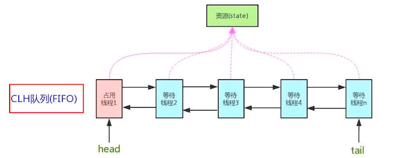
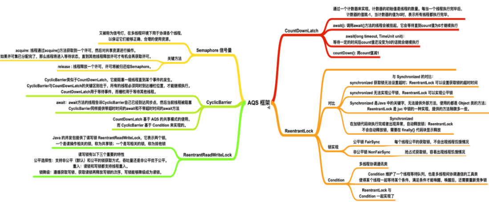
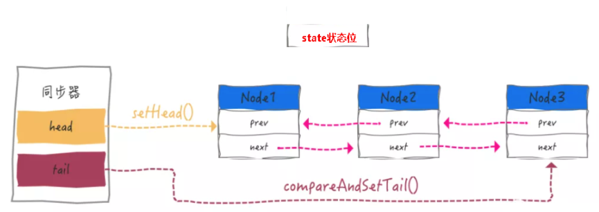

## AQS理论初步

AbstractQueuedSynchronizer 抽象队列同步器

```java
public abstract class AbstractQueuedSynchronizer
    extends AbstractOwnableSynchronizer
    implements java.io.Serializable {
    
    ...
    
}
```

是用来构建锁或者其它同步器组件的重量级基础框架及整个JUC体系的基石，通过内置的FIFO队列来完成资源获取线程的排队工作，并通过一个int类型变量表示持有锁的状态。



CLH：Craig、Landin and Hagersten队列，是一个单向链表，AQS中的队列是CLH变体的虚拟双向队列FIFO。

## AQS作用



### 进一步理解锁和同步器的关系

- 锁：面向锁的使用者。定义了程序员和锁交互的使用层API，隐藏了实现细节，你调用即可
- 同步器：面向锁的实现者。比如Java并发大神DougLee，提出统一规范并简化了锁的实现，屏蔽了同步状态管理、阻塞线程队列和通知、唤醒机制等。

### 作用

加锁会导致阻塞，有阻塞就需要队列，实现排队必然需要队列。

抢到资源的线程直接使用处理业务，抢不到资源的必然涉及一种 排队等候机制 。抢占资源失败的线程继续去等待(类似银行业务办理窗口都满了，暂时没有受理窗口的顾客只能去 候客区排队等候 )，但等候线程仍然保留获取锁的可能且获取锁流程仍在继续(候客区的顾客也在等着叫号，轮到了再去受理窗口办理业务)。

既然说到了 排队等候机制 ，那么就一定会有某种队列形成，这样的队列是什么数据结构呢？

如果共享资源被占用， 就需要一定的阻塞等待唤醒机制来保证锁分配 。这个机制主要用的是CLH队列的变体实现的，将暂时获取不到锁的线程加入到队列中，这个队列就是AQS的抽象表现。它将请求共享资源的线程封装成队列的结点（ **Node**  ），通过CAS、自旋以及LockSupport.park()的方式，维护state变量的状态，使并发达到同步的效果。

## 源码体系

> Provides a framework for implementing blocking locks and related synchronizers (semaphores, events, etc) that rely on first-in-first-out (FIFO) wait queues. This class is designed to be a useful basis for most kinds of synchronizers that rely on a single atomic int value to represent state. Subclasses must define the protected methods that change this state, and which define what that state means in terms of this object being acquired or released. Given these, the other methods in this class carry out all queuing and blocking mechanics. Subclasses can maintain other state fields, but only the atomically updated int value manipulated using methods getState(), setState(int) and compareAndSetState(int, int) is tracked with respect to synchronization.
>
> AbstractQueuedSynchronizer (Java Platform SE 8 )
>
> 提供一个框架来实现阻塞锁和依赖先进先出（FIFO）等待队列的相关同步器（信号量、事件等）。此类被设计为大多数类型的同步器的有用基础，这些同步器依赖于单个原子“int”值来表示状态。子类必须定义更改此状态的受保护方法，以及定义此状态在获取或释放此对象方面的含义。给定这些，这个类中的其他方法执行所有排队和阻塞机制。子类可以维护其他状态字段，但是只有使用方法getState（）、setState（int）和compareAndSetState（int，int）操作的原子更新的’int’值在同步方面被跟踪。

有阻塞就需要排队，实现排队必然需要队列

AQS使用一个volatile的int类型的成员变量来表示同步状态，通过内置的FIFO队列来完成资源获取的排队工作将每条要去抢占资源的线程封装成一个Node，节点来实现锁的分配，通过CAS完成对State值的修改。

### AQS 自身

AQS的int变量 - AQS的同步状态state成员变量

```java
public abstract class AbstractQueuedSynchronizer
    extends AbstractOwnableSynchronizer
    implements java.io.Serializable {

    ...

     * The synchronization state.
      // 零就是没人，自由状态可以办理;大于等于1，有人占用窗口，等着去
    private volatile int state;
    
    ...
}
```

AQS的CLH队列

- CLH队列(三个大牛的名字组成)，为一个双向队列
- 银行候客区的等待顾客

> The wait queue is a variant of a “CLH” (Craig, Landin, and Hagersten) lock queue. CLH locks are normally used forspinlocks. We instead use them for blocking synchronizers, butuse the same basic tactic of holding some of the controlinformation about a thread in the predecessor of its node. A"status" field in each node keeps track of whether a threadshould block. A node is signalled when its predecessorreleases. Each node of the queue otherwise serves as aspecific-notification-style monitor holding a single waiting thread. The status field does NOT control whether threads aregranted locks etc though. A thread may try to acquire if it isfirst in the queue. But being first does not guarantee success;it only gives the right to contend. So the currently releasedcontender thread may need to rewait.
>
> To enqueue into a CLH lock, you atomically splice it in as new tail. To dequeue, you just set the head field. 本段文字出自AbstractQueuedSynchronizer内部类Node源码注释
>
> 等待队列是“CLH”（Craig、Landin和Hagersten）锁队列的变体。CLH锁通常用于旋转锁。相反，我们使用它们来阻止同步器，但是使用相同的基本策略，即在其节点的前一个线程中保存一些关于该线程的控制信息。每个节点中的“status”字段跟踪线程是否应该阻塞。当一个节点的前一个节点释放时，它会发出信号。否则，队列的每个节点都充当一个特定的通知样式监视器，其中包含一个等待线程。状态字段并不控制线程是否被授予锁等。如果线程是队列中的第一个线程，它可能会尝试获取。但是，第一并不能保证成功，它只会给人争取的权利。因此，当前发布的内容线程可能需要重新等待。
>
> 要排队进入CLH锁，您可以将其作为新的尾部进行原子拼接。要出列，只需设置head字段。

### 内部类 node

```java
public abstract class AbstractQueuedSynchronizer
    extends AbstractOwnableSynchronizer
    implements java.io.Serializable {

    ...

     * Creates a new {@code AbstractQueuedSynchronizer} instance
    protected AbstractQueuedSynchronizer() { }

     * Wait queue node class.
    static final class Node {
        //表示线程以共享的模式等待锁
        /** Marker to indicate a node is waiting in shared mode */
        static final Node SHARED = new Node();
        
        //表示线程正在以独占的方式等待锁
        /** Marker to indicate a node is waiting in exclusive mode */
        static final Node EXCLUSIVE = null;

        //线程被取消了
        /** waitStatus value to indicate thread has cancelled */
        static final int CANCELLED =  1;

        //后继线程需要唤醒
        /** waitStatus value to indicate successor's thread needs unparking */
        static final int SIGNAL    = -1;
        
        //等待condition唤醒
        /** waitStatus value to indicate thread is waiting on condition */
        static final int CONDITION = -2;
        
        //共享式同步状态获取将会无条件地传播下去
        * waitStatus value to indicate the next acquireShared should     
        static final int PROPAGATE = -3;

        //当前节点在队列中的状态（重点）
        //说人话：
        //等候区其它顾客(其它线程)的等待状态
        //队列中每个排队的个体就是一个Node
        //初始为0，状态上面的几种
         * Status field, taking on only the values:
        volatile int waitStatus;

        //前驱节点（重点）
         * Link to predecessor node that current node/thread relies on
        volatile Node prev;

        //后继节点（重点）
         * Link to the successor node that the current node/thread
        volatile Node next;

        //表示处于该节点的线程
         * The thread that enqueued this node.  Initialized on
        volatile Thread thread;

        //指向下一个处于CONDITION状态的节点
         * Link to next node waiting on condition, or the special
        Node nextWaiter;

         * Returns true if node is waiting in shared mode.
        final boolean isShared() {

        //返回前驱节点，没有的话抛出npe
         * Returns previous node, or throws NullPointerException if null.
        final Node predecessor() throws NullPointerException {

        Node() {    // Used to establish initial head or SHARED marker

        Node(Thread thread, Node mode) {     // Used by addWaiter

        Node(Thread thread, int waitStatus) { // Used by Condition
    }
	...
}	
```

### AQS同步队列的基本结构



CLH：Craig、Landin and Hagersten 队列，是个单向链表，AQS中的队列是CLH变体的虚拟双向队列（FIFO）

## 源码分析

[一行一行源码分析清楚AbstractQueuedSynchronizer_Javadoop](https://www.javadoop.com/post/AbstractQueuedSynchronizer)

[一行一行源码分析清楚 AbstractQueuedSynchronizer (二)_Javadoop](https://www.javadoop.com/post/AbstractQueuedSynchronizer-2)

[一行一行源码分析清楚 AbstractQueuedSynchronizer (三)_Javadoop](https://www.javadoop.com/post/AbstractQueuedSynchronizer-3)

[11 AQS · 深入浅出Java多线程 (redspider.group)](http://concurrent.redspider.group/article/02/11.html)

[【AQS源码】condition、CountDownLatch、CyclicBarrier、中断、共享等_努力充实，远方可期-CSDN博客](https://blog.csdn.net/hancoder/article/details/120954315)

