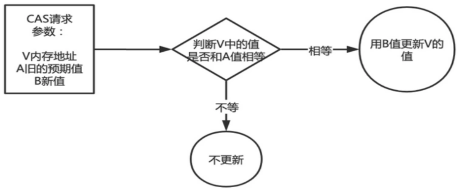

[TOC]


## 什么是 CAS

### 说明

CAS，compare and swap的缩写，中文翻译成 比较并交换, 实现并发算法时常用到的一种技术。它包含三个操作数——内存位置、预期原值及更新值。

执行CAS操作的时候，将内存位置的值与预期原值比较：如果相匹配 ，那么处理器会自动将该位置值更新为新值，如果不匹配，处理器不做任何操作，多个线程同时执行CAS操作只有一个会成功 。 

### 原理

CAS有3个操作数，位置内存值V，旧的预期值A，要修改的更新值B。当且仅当旧的预期值A和内存值V相同时，将内存值V修改为B，否则什么都不做或重来。



### 硬件级别保证

CAS是JDK提供的 非阻塞 原子性操作，它通过 硬件保证 了比较-更新的原子性。它是非阻塞的且自身原子性，也就是说这玩意效率更高且通过硬件保证，说明这玩意更可靠。

 CAS是一条CPU的原子指令（ cmpxchg指令 ），不会造成所谓的数据不一致问题，Unsafe提供的CAS方法（如compareAndSwapXXX）底层实现即为CPU指令cmpxchg。

执行cmpxchg指令的时候，会判断当前系统是否为多核系统，如果是就给总线加锁，只有一个线程会对总线加锁成功，加锁成功之后会执行cas操作， 也就是说CAS的原子性实际上是CPU实现的 ， 其实在这一点上还是有排他锁的，只是比起用synchronized， 这里的排他时间要短的多， 所以在多线程情况下性能会比较好。

### DEMO 代码

```java
public class CASDemo {
    public static void main(String[] args) {
        AtomicInteger atomicInteger = new AtomicInteger(5);
        System.out.println(atomicInteger.get());


        System.out.println(atomicInteger.compareAndSet(5, 308) + "\t" + atomicInteger.get());

        System.out.println(atomicInteger.compareAndSet(5, 3333) + "\t" + atomicInteger.get());
    }
}
```

### 源码分析

```java
		// package sun.misc;
		// unsafe.java

    /**
     * Atomically update Java variable to <tt>x</tt> if it is currently
     * holding <tt>expected</tt>.
     * @return <tt>true</tt> if successful
     */
    public final native boolean compareAndSwapObject(Object o, long offset,
                                                     Object expected,
                                                     Object x);

    /**
     * Atomically update Java variable to <tt>x</tt> if it is currently
     * holding <tt>expected</tt>.
     * @return <tt>true</tt> if successful
     */
    public final native boolean compareAndSwapInt(Object o, long offset,
                                                  int expected,
                                                  int x);

    /**
     * Atomically update Java variable to <tt>x</tt> if it is currently
     * holding <tt>expected</tt>.
     * @return <tt>true</tt> if successful
     */
    public final native boolean compareAndSwapLong(Object o, long offset,
                                                   long expected,
                                                   long x);
```

上面三个方法都是类似的，主要对4个参数做一下说明。

- Object o：表示要操作的对象
- long offset：表示要操作对象中属性地址的偏移量
- long expected：表示需要修改数据的期望的值
- Object/int/long x：表示需要修改为的新值

```java
// package java.util.concurrent.atomic;
// AtomicInteger.java

/**
     * Atomically sets the value to the given updated value
     * if the current value {@code ==} the expected value.
     *
     * @param expect the expected value
     * @param update the new value
     * @return {@code true} if successful. False return indicates that
     * the actual value was not equal to the expected value.
     */
public final boolean compareAndSet(int expect, int update) {
        return unsafe.compareAndSwapInt(this, valueOffset, expect, update);
    }
```

## Unsafe底层原理

### 源码分析

```java
// package java.util.concurrent.atomic;
// AtomicInteger.java

private static final long serialVersionUID = 6214790243416807050L;

// setup to use Unsafe.compareAndSwapInt for updates
private static final Unsafe unsafe = Unsafe.getUnsafe();
// 变量值在内存中的 偏移地址
private static final long valueOffset;

static {
  try {
    valueOffset = unsafe.objectFieldOffset
      (AtomicInteger.class.getDeclaredField("value"));
  } catch (Exception ex) { throw new Error(ex); }
}
// volatile 修饰
private volatile int value;
```

- Unsafe是CAS的核心类，由于Java方法无法直接访问底层系统，需要通过本地（native）方法来访问，Unsafe相当于一个后门，基于该类可以直接操作特定内存的数据。 Unsafe类存在于sun.misc包中 ，其内部方法操作可以像C的 **指针**  一样直接操作内存，因为Java中CAS操作的执行依赖于Unsafe类的方法。

  **注意Unsafe类中的所有方法都是native修饰的，也就是说Unsafe类中的方法都直接调用操作系统底层资源执行相应任务**

- 变量valueOffset，表示该变量值在内存中的 偏移地址 ，因为Unsafe就是根据内存偏移地址获取数据的。

- 变量value用volatile修饰，保证了多线程之间的内存可见性。

```java
		// package sun.misc;
		// unsafe.java

    /**
     * Atomically exchanges the given reference value with the current
     * reference value of a field or array element within the given
     * object <code>o</code> at the given <code>offset</code>.
     *
     * @param o object/array to update the field/element in
     * @param offset field/element offset
     * @param newValue new value
     * @return the previous value
     * @since 1.8
     */
    public final Object getAndSetObject(Object o, long offset, Object newValue) {
        Object v;
        do {
        		// 获取对象内存地址偏移量上的数值v
            v = getObjectVolatile(o, offset);
            // 如果现在还是v,设置为newValue,否则返回false,！false=true，一直循环直到等于v退出循环返回v
        } while (!compareAndSwapObject(o, offset, v, newValue));
        return v;
    }
```

假设线程A和线程B两个线程同时执行getAndAddInt操作（分别跑在不同CPU上）：

1. AtomicInteger里面的value原始值为3，即主内存中AtomicInteger的value为3，根据JMM模型，线程A和线程B各自持有一份值为3的value的副本分别到各自的工作内存。
2. 线程A通过getIntVolatile(var1, var2)拿到value值3，这时线程A被挂起。
3. 线程B也通过getIntVolatile(var1, var2)方法获取到value值3，此时刚好线程B 没有被挂起 并执行compareAndSwapInt方法比较内存值也为3，成功修改内存值为4，线程B打完收工，一切OK。
4. 这时线程A恢复，执行compareAndSwapInt方法比较，发现自己手里的值数字3和主内存的值数字4不一致，说明该值已经被其它线程抢先一步修改过了，那A线程本次修改失败， 只能重新读取重新来一遍了。
5. 线程A重新获取value值，因为变量value被volatile修饰，所以其它线程对它的修改，线程A总是能够看到，线程A继续执行compareAndSwapInt进行比较替换，直到成功。

### 底层汇编

Unsafe类中的compareAndSwapInt，是一个本地方法，该方法的实现位于unsafe.cpp中 

```c++
UNSAFE_ENTRY(jboolean, Unsafe_CompareAndSwapInt(JNIEnv *env, jobject unsafe, jobject obj, jlong offset, jint e, jint x))
  UnsafeWrapper("Unsafe_CompareAndSwapInt");
  oop p = JNIHandles::resolve(obj);
// 先想办法拿到变量value在内存中的地址，根据偏移量valueOffset，计算 value 的地址
  jint* addr = (jint *) index_oop_from_field_offset_long(p, offset);
// 调用 Atomic 中的函数 cmpxchg来进行比较交换，其中参数x是即将更新的值，参数e是原内存的值
  return (jint) (Atomic::cmpxchg(x, addr, e)) == e;
UNSAFE_END
```

Atomic::cmpxchg(x, addr, e)大概上可以看出调用了cmpxchg这个函数

```c++

unsigned Atomic:: cmpxchg (unsigned int exchange_value,volatile unsigned int* dest, unsigned int compare_value) {
    assert(sizeof(unsigned int) == sizeof(jint), "more work to do");
   /*
   * 根据操作系统类型调用不同平台下的重载函数，这个在预编译期间编译器会决定调用哪个平台下的重载函数*/
    return (unsigned int)Atomic::cmpxchg((jint)exchange_value, (volatile jint*)dest, (jint)compare_value);
}
-----------------------------------
  inline jint Atomic::cmpxchg (jint exchange_value, volatile jint* dest, jint compare_value) {
  //判断是否是多核CPU
  int mp = os::is_MP();
  __asm {
    //三个move指令表示的是将后面的值移动到前面的寄存器上
    mov edx, dest
    mov ecx, exchange_value
    mov eax, compare_value
    //CPU原语级别，CPU触发
    LOCK_IF_MP(mp)
    //比较并交换指令
    //cmpxchg: 即“比较并交换”指令
    //dword: 全称是 double word 表示两个字，一共四个字节
    //ptr: 全称是 pointer，与前面的 dword 连起来使用，表明访问的内存单元是一个双字单元 
    //将 eax 寄存器中的值（compare_value）与 [edx] 双字内存单元中的值进行对比，
    //如果相同，则将 ecx 寄存器中的值（exchange_value）存入 [edx] 内存单元中
    cmpxchg dword ptr [edx], ecx
  }
}
```

你只需要记住：CAS是靠硬件实现的从而在硬件层面提升效率，最底层还是交给硬件来保证原子性和可见性实现方式是基于硬件平台的汇编指令，在intel的CPU中(X86机器上)，使用的是汇编指令cmpxchg指令。 

核心思想就是：比较要更新变量的值V和预期值E（compare），相等才会将V的值设为新值N（swap）如果不相等自旋再来。

## 原子引用

AtomicInteger 原子整形，也可以有其他原子类型（AtomicBook、AtomicUser）

```java
public class AtomicReferenceDemo {

    public static void main(String[] args) {
        User z3 = new User("z3",24);
        User li4 = new User("li4",26);

        AtomicReference<User> atomicReferenceUser = new AtomicReference<>();

        atomicReferenceUser.set(z3);
System.out.println(atomicReferenceUser.compareAndSet(z3,li4)+"\t"+atomicReferenceUser.get().toString());
        System.out.println(atomicReferenceUser.compareAndSet(z3,li4)+"\t"+atomicReferenceUser.get().toString());
    }
}

@Getter
@ToString
@AllArgsConstructor
class User {
    String userName;
    int    age;
}
```

## 自旋锁（spinlock）

### 是什么

自旋锁（spinlock）是指尝试获取锁的线程不会立即阻塞，而是 采用 **循环的方式** 去尝试获取锁 ，当线程发现锁被占用时，会不断循环判断锁的状态，直到获取。这样的好处是减少线程上下文切换的消耗，缺点是循环会消耗CPU。

### 手写自旋锁

```java
public class SpinLockDemo {
    AtomicReference<Thread> atomicReference = new AtomicReference<>();

    public void MyLock(){
        System.out.println((Thread.currentThread().getName() + "\t" + "come in..."));
        while (!atomicReference.compareAndSet(null,Thread.currentThread())){

        }
        System.out.println((Thread.currentThread().getName() + "\t" + "持有锁成功。。。"));
    }
    public void MyUnlock(){
        atomicReference.compareAndSet(Thread.currentThread(),null);
        System.out.println((Thread.currentThread().getName() + "\t" + "释放锁成功。。。"));
    }

    public static void main(String[] args) {
        SpinLockDemo spinLockDemo = new SpinLockDemo();
        new Thread(()->{
            spinLockDemo.MyLock();
            try {
                TimeUnit.SECONDS.sleep(5);
            } catch (InterruptedException e) {
                e.printStackTrace();
            }
            spinLockDemo.MyUnlock();
        },"t1").start();
        new Thread(()->{
            spinLockDemo.MyLock();
            spinLockDemo.MyUnlock();
        },"t2").start();
    }
}
--------------------------
t1	come in...
t1	持有锁成功。。。
t2	come in...
t1	释放锁成功。。。
t2	持有锁成功。。。
t2	释放锁成功。。。
```

## CAS 缺点

### 循环时间长开销大

我们可以看到getAndSetObject方法执行时，有个do while ，如果CAS失败，会一直进行尝试。如果CAS长时间一直不成功，可能会给CPU带来很大的开销。 

```java
public final Object getAndSetObject(Object o, long offset, Object newValue) {
        Object v;
        do {
        		// 获取对象内存地址偏移量上的数值v
            v = getObjectVolatile(o, offset);
            // 如果现在还是v,设置为newValue,否则返回false,！false=true，一直循环直到等于v退出循环返回v
        } while (!compareAndSwapObject(o, offset, v, newValue));
        return v;
    }
```

### ABA 问题

 CAS会导致“ABA问题”。

CAS算法实现一个重要前提需要取出内存中某时刻的数据并在当下时刻比较并替换，那么在这个时间差类会导致数据的变化。

 比如说一个线程one从内存位置V中取出A，这时候另一个线程two也从内存中取出A，并且线程two进行了一些操作将值变成了B，然后线程two又将V位置的数据变成A，这时候线程one进行CAS操作发现内存中仍然是A，然后线程one操作成功。尽管线程one的CAS操作成功，但是不代表这个过程就是没有问题的。

解决 ABA 问题（使用版本号时间戳原子引用）

```java
public class ABADemo {
    static AtomicInteger atomicInteger = new AtomicInteger(100);
    static AtomicStampedReference<Integer> atomicStampedReference = new AtomicStampedReference<>(100, 1);

    public static void main(String[] args) {
        new Thread(() -> {
            int stamp = atomicStampedReference.getStamp();
            System.out.println(Thread.currentThread().getName() + "\t" + "---默认版本号: " + stamp);
            //让后面的t4获得和t3一样的版本号，都是1，好比较
            try {
                TimeUnit.SECONDS.sleep(1);
            } catch (InterruptedException e) {
                e.printStackTrace();
            }

            atomicStampedReference.compareAndSet(100, 101, stamp, stamp + 1);
            System.out.println(Thread.currentThread().getName() + "\t" + "---1次版本号: " + atomicStampedReference.getStamp());
            atomicStampedReference.compareAndSet(101, 100, atomicStampedReference.getStamp(), atomicStampedReference.getStamp() + 1);
            System.out.println(Thread.currentThread().getName() + "\t" + "---2次版本号: " + atomicStampedReference.getStamp());
        }, "t3").start();

        new Thread(() -> {
            int stamp = atomicStampedReference.getStamp();
            System.out.println(Thread.currentThread().getName() + "\t" + "---默认版本号: " + stamp);
            //上前面的t3完成ABA问题
            try {
                TimeUnit.SECONDS.sleep(3);
            } catch (InterruptedException e) {
                e.printStackTrace();
            }
            boolean result = atomicStampedReference.compareAndSet(100, 20210308, stamp, stamp + 1);
            System.out.println(Thread.currentThread().getName() + "\t" + "---操作成功否：" + result + "\t" + atomicStampedReference.getStamp() + "\t" + atomicStampedReference.getReference());
        }, "t4").start();
    }

    public static void abaProblem() {
        new Thread(() -> {
            atomicInteger.compareAndSet(100, 101);
            atomicInteger.compareAndSet(101, 100);
        }, "t1").start();

        //暂停毫秒
        try {
            TimeUnit.MILLISECONDS.sleep(10);
        } catch (InterruptedException e) {
            e.printStackTrace();
        }

        new Thread(() -> {
            boolean b = atomicInteger.compareAndSet(100, 20210308);
            System.out.println(Thread.currentThread().getName() + "\t" + "修改成功否：" + b + "\t" + atomicInteger.get());
        }, "t2").start();
    }
}
```

## 总结

CAS：CPU并发原语，执行CAS操作的时候，将内存位置的值与预期原值比较：如果相匹配 ，那么处理器会自动将该位置值更新为新值，如果不匹配，处理器不做任何操作，多个线程同时执行CAS操作只有一个会成功 。 但是会产生ABA问题，使用版本号可以解决这个问题。

