## 什么是锁

”锁“本身是一个对象，synchronized这个关键字不是“锁”。硬要说的话，加synchronized仅仅是相当于“加锁”这个操作。

### 为什么每一个对象都可以成为一个锁呢？

#### 理论

要解释这个问题，首先需要从一个Monitor的名词开始，它可以理解为一种同步工具，也可以理解为一种同步机制，在Java里常常被描述为一个Java对象。

Java对象是天生的Monitor，每一个Java对象都有成为Monitor的潜质，因为在Java的设计中 ，每一个Java对象自打娘胎里出来就带了一把看不见的锁，它叫做内部锁或者Monitor锁。

Monitor的本质是依赖于底层操作系统的Mutex Lock实现，操作系统实现线程之间的切换需要从用户态到内核态的转换，成本非常高。

为了记住这个Monitor，我查阅了资料发现它其实有个很好听的名字叫做管程。

> 管程 (英语：Monitors，也称为监视器) 是一种程序结构，结构内的多个子程序（对象或模块）形成的多个工作线程互斥访问共享资源。 
>
> 这些共享资源一般是硬件设备或一群变量。对共享变量能够进行的所有操作集中在一个模块中。（把信号量及其操作原语“封装”在一个对象内部）管程实现了在一个时间点，最多只有一个线程在执行管程的某个子程序。管程提供了一种机制，管程可以看做一个软件模块，它是将共享的变量和对于这些共享变量的操作封装起来，形成一个具有一定接口的功能模块，进程可以调用管程来实现进程级别的并发控制

#### 实践

写一段简单的代码实践下

```java
public class MyObject {

    private final Object object = new Object();
    public void m1(){
        synchronized (object){
            System.out.println(11);
        }
    }

}
```

编译之后查看这个类的字节码文件（也可以通过` javap -c MyObject.class`命令行的方式查看）

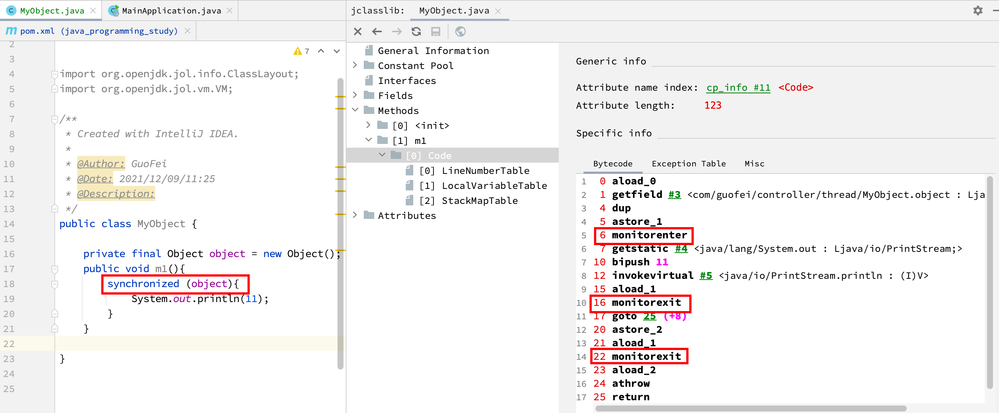

可以发现执行同步代码块后首先要先执行**monitorenter**指令，退出的时候**monitorexit**指令，为什么还会有一个monitorexit指令呢，这是因为synchronized本身是可重入锁。当然如果出现异常就不会

> 即在同一锁程中，线程不需要再次获取同一把锁。Synchronized先天具有重入性。**每个对象拥有一个计数器，当线程获取该对象锁后，计数器就会加一，释放锁后就会将计数器减一**。

### 锁的应用场景

首先要明白几个前提：

- 互斥的最基本条件是：共用同一把锁
- 静态方法的锁是所在类的Class对象，普通方法的锁是this对象
- 针对同一个线程，synchronized锁可以支持重入

> 高并发时，同步调用应该去考量锁的性能损耗。能用无锁数据结构，就不要用锁；能锁区块，就不要锁整个方法体；能用对象锁，就不要用类锁。 说明：尽可能使加锁的代码块工作量尽可能的小，避免在锁代码块中调用 RPC 方法。--阿里手册

## synchronized 的实现


## synchronized 的性能变化

### JDK5 之前

只有synchronized，此时的synchronized是一个操作系统级别的重量级操作。

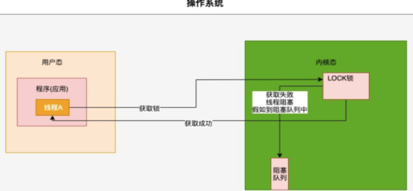

 java的线程是映射到操作系统原生线程之上的，如果要阻塞或唤醒一个线程就需要操作系统介入，需要在用户态与内核态之间切换，这种切换会消耗大量的系统资源，因为用户态与内核态都有各自专用的内存空间，专用的寄存器等，用户态切换至内核态需要传递给许多变量、参数给内核，内核也需要保护好用户态在切换时的一些寄存器值、变量等，以便内核态调用结束后切换回用户态继续工作。

 在Java早期版本中， synchronized属于重量级锁，效率低下，因为监视器锁（monitor）是依赖于底层的操作系统的Mutex Lock来实现的 ，挂起线程和恢复线程都需要转入内核态去完成，阻塞或唤醒一个Java线程需要操作系统切换CPU状态来完成，这种状态切换需要耗费处理器时间，如果同步代码块中内容过于简单，这种切换的时间可能比用户代码执行的时间还长”，时间成本相对较高，这也是为什么早期的synchronized效率低的原因。

Java 6之后，为了减少获得锁和释放锁所带来的性能消耗， 引入了轻量级锁和偏向锁

### JDK6 之后

为了减少获得锁和释放锁所带来的性能消耗，引入了轻量级锁和偏向锁

需要有个逐步升级的过程，不会一开始就直接上到重量级锁上面

## synchronized 的锁种类以及锁升级

### 多线程访问情况

- 只有一个线程来访问，有且唯一
- 有2个线程A、B交替访问
- 竞争激烈，多个线程来访问

### 升级流程

synchronized 用的锁是存在Java对象头里的MarkWord中，锁升级功能主要依赖MarkWord中锁标识位和释放偏向锁标识位。随着并发访问的热度而升级调整。

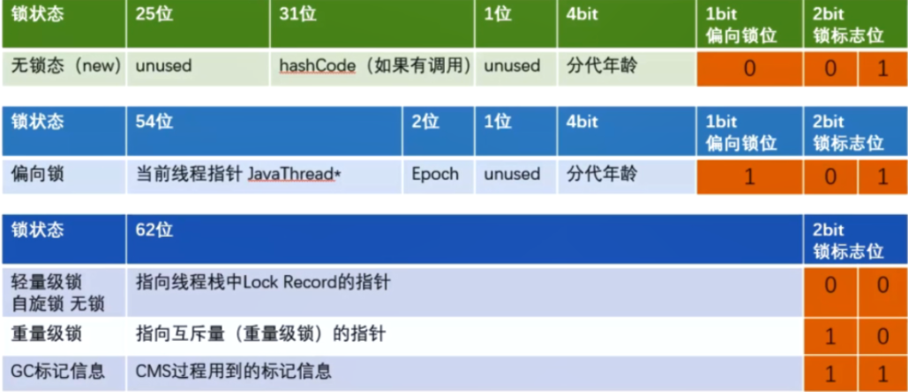

共识：表面上三个线程访问，实际上多次只有一个线程，同一个线程获得锁（synchronized）

### 无锁

程序不会有锁的竞争

#### code演示

```java
public class SyncUpgradeDemo {

    public static void main(String[] args) {
        Object o = new Object();
        System.out.println("10进制 hash 码"+o.hashCode());
        System.out.println("16进制 hash 码"+Integer.toHexString(o.hashCode()));
        System.out.println("2进制 hash 码"+Integer.toBinaryString(o.hashCode()));

        //  101010000100111001101001010101
        //00101010000100111001101001010101
        System.out.println(ClassLayout.parseInstance(o).toPrintable());
    }
}
---------------------
10进制 hash 码705927765
16进制 hash 码2a139a55
2进制 hash 码101010000100111001101001010101
java.lang.Object object internals:
 OFFSET  SIZE   TYPE DESCRIPTION                               VALUE
      0     4        (object header)                           01 55 9a 13 (00000001 01010101 10011010 00010011) (328881409)
      4     4        (object header)                           2a 00 00 00 (00101010 00000000 00000000 00000000) (42)
      8     4        (object header)                           28 0f 00 00 (00101000 00001111 00000000 00000000) (3880)
     12     4        (loss due to the next object alignment)
Instance size: 16 bytes
Space losses: 0 bytes internal + 4 bytes external = 4 bytes total
```

#### 一图解释

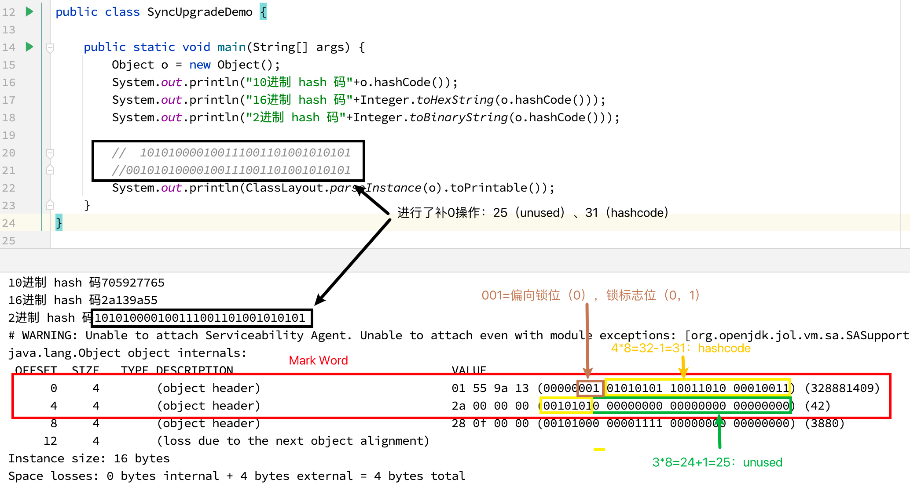

#### 对照无锁的标记图


### 偏向锁

#### 主要作用

当一段同步代码一直被同一个线程多次访问，由于只有一个线程那么该线程在后续访问是便会自动获得锁。

#### code演示

```java
public class TrainTicketDemo {
    
    public static void main(String[] args) {
        TrainTicket trainTicket = new TrainTicket();
        new Thread(() -> { for (int i = 1; i <=55 ; i++) trainTicket.sale(); },"t1").start();
        new Thread(() -> { for (int i = 1; i <=55 ; i++) trainTicket.sale(); },"t2").start();
        new Thread(() -> { for (int i = 1; i <=55 ; i++) trainTicket.sale(); },"t3").start();
        new Thread(() -> { for (int i = 1; i <=55 ; i++) trainTicket.sale(); },"t4").start();
    }
    
}

class TrainTicket{
    
    private int number = 50;
    Object objectLock = new Object();

    public void sale() {
        synchronized (objectLock) {
            if(number>0) {
                System.out.println(Thread.currentThread().getName()+"\t"+"---卖出第： "+(number--));
            }
        }
    }
    
}
--------------------------
  t1	---卖出第： 50
t1	---卖出第： 49
t1	---卖出第： 48
t1	---卖出第： 47
t1	---卖出第： 46
t1	---卖出第： 45
t1	---卖出第： 44
t1	---卖出第： 43
t1	---卖出第： 42
t1	---卖出第： 41
t1	---卖出第： 40
t1	---卖出第： 39
t1	---卖出第： 38
t1	---卖出第： 37
t1	---卖出第： 36
t1	---卖出第： 35
t1	---卖出第： 34
t1	---卖出第： 33
t1	---卖出第： 32
t1	---卖出第： 31
t1	---卖出第： 30
t1	---卖出第： 29
t1	---卖出第： 28
t1	---卖出第： 27
t1	---卖出第： 26
t1	---卖出第： 25
t1	---卖出第： 24
t2	---卖出第： 23
t2	---卖出第： 22
t2	---卖出第： 21
t2	---卖出第： 20
t2	---卖出第： 19
t2	---卖出第： 18
t1	---卖出第： 17
t1	---卖出第： 16
t1	---卖出第： 15
t1	---卖出第： 14
t1	---卖出第： 13
t1	---卖出第： 12
t1	---卖出第： 11
t1	---卖出第： 10
t1	---卖出第： 9
t1	---卖出第： 8
t1	---卖出第： 7
t1	---卖出第： 6
t1	---卖出第： 5
t1	---卖出第： 4
t1	---卖出第： 3
t1	---卖出第： 2
t1	---卖出第： 1
```

#### 案例结论

Hotspot 的作者经过研究发现，大多数情况下：多线程的情况下，锁不仅不存在多线程竞争，还存在锁 由同一线程多次获得的情况 ，偏向锁就是在这种情况下出现的，它的出现是为了解决 只有在一个线程执行同步时提高性能。

#### 理论落地

在实际应用运行过程中发现，“锁总是同一个线程持有，很少发生竞争”，也就是说 锁总是被第一个占用他的线程拥有 ， 这个线程就是锁的偏向线程。

那么只需要在锁第一次被拥有的时候，记录下偏向线程ID。这样偏向线程就一直持有着锁(后续这个线程进入和退出这段加了同步锁的代码块时， 不需要再次加锁和释放锁 。而是直接比较对象头里面是否存储了指向当前线程的偏向锁)。

- 如果相等 表示偏向锁是偏向于当前线程的，就不需要再尝试获得锁了，直到竞争发生才释放锁。以后每次同步，检查锁的偏向线程ID与当前线程ID是否一致，如果一致直接进入同步。无需每次加锁解锁都去CAS更新对象头。 **如果自始至终使用锁的线程只有一个**  ，很明显偏向锁几乎没有额外开销，性能极高。
- 假如不一致意味着发生了竞争，锁已经不是总是偏向于同一个线程了，这时候可能需要升级变为轻量级锁，才能保证线程间公平竞争锁。 偏向锁只有遇到其他线程尝试竞争偏向锁时，持有偏向锁的线程才会释放锁，线程是不会主动释放偏向锁的。

#### 技术实现

一个synchronized方法被一个线程抢到了锁时，那这个方法所在的对象就会在其所在的Mark Word中将偏向锁修改状态位，同时还

会有占用前54位来存储线程指针作为标识。若该线程再次访问同一个synchronized方法时，该线程只需去对象头的Mark Word 中去判断一下是否有偏向锁指向本身的ID，无需再进入 Monitor 去竞争对象了。


#### 举例论证

偏向锁的操作不用直接捅到操作系统，不涉及 用户到内核转换 ， 不必要直接升级为最高级。

以一个account对象的“对象头”为例，假如有一个线程执行到synchronized代码块的时候，JVM使用CAS操作把线程指针ID记录到Mark Word当中，并修改标偏向标示，标示当前线程就获得该锁。锁对象变成偏向锁（通过CAS修改对象头里的锁标志位），字面意思是“偏向于第一个获得它的线程”的锁。执行完同步代码块后，线程并不会主动释放偏向锁。

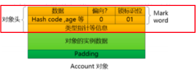

这时线程获得了锁，可以执行同步代码块。当该线程第二次到达同步代码块时会判断此时持有锁的线程是否还是自己（持有锁的线程ID也在对象头里），JVM通过account对象的Mark Word判断：当前线程ID还在，说明还持有着这个对象的锁，就可以继续进入临界区工作。


由于之前没有释放锁，这里也就不需要重新加锁。**如果自始至终使用锁的线程只有一个**  ，很明显偏向锁几乎没有额外开销，性能极高。

#### 技术结论

JVM不用和操作系统协商设置Mutex(争取内核)，它只需要记录下线程ID就标示自己获得了当前锁，不用操作系统接入。

上述就是偏向锁：在没有其他线程竞争的时候，一直偏向偏心当前线程，当前线程可以一直执行。

#### 偏向锁的JVM命令

```shell
*  实际上偏向锁在 JDK1.6 之后是默认开启的，但是启动时间有延迟，
*  所以需要添加参数 -XX:BiasedLockingStartupDelay=0 ，让其在程序启动时立刻启动。
*  开启偏向锁：
* -XX:+UseBiasedLocking -XX:BiasedLockingStartupDelay=0
*  关闭偏向锁：关闭之后程序默认会直接进入------------------------------------------>>>>>>>>   轻量级锁状态。
* -XX:-UseBiasedLocking
```

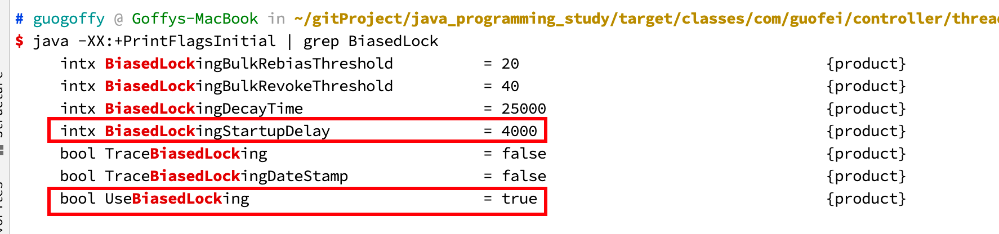

演示：默认无效果

偏向锁在JDK1.6 以上默认开启 ，开启后程序启动几秒后才会被激活，可以使用JVM参数来关闭延迟 -XX:BiasedLockingStartupDelay=0

如果确定锁通常处于竞争状态 则可通过JVM参数 *-XX:-UseBiasedLocking* 关闭偏向锁，那么默认会进入轻量级锁

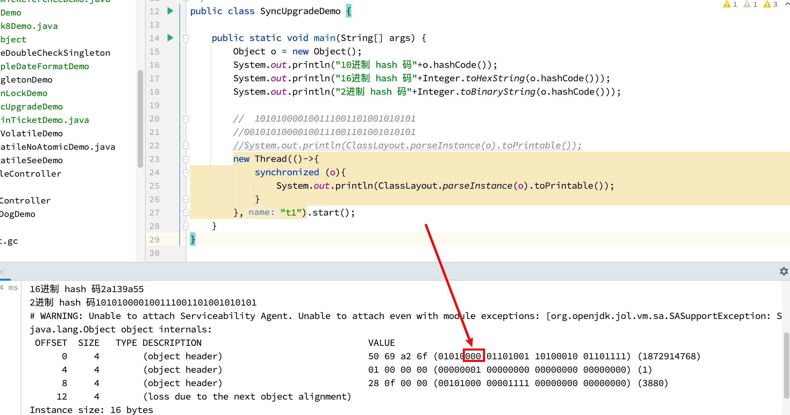

设置JVM启动参数： -XX:BiasedLockingStartupDelay=0

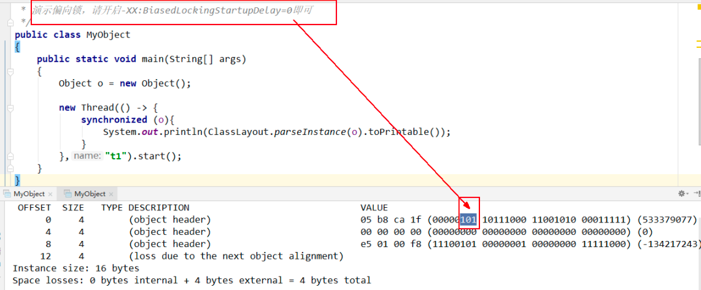

#### 偏向锁的撤销

好景不长，开始有第二个线程来抢夺了。这个时候就不能使用偏向锁了，要升级为轻量级锁。竞争线程尝试CAS更新对象头失败，会等待到安全点（此时不会执行任何代码）撤销偏向锁。

偏向锁使用一种等到 竞争出现才释放锁的机制 ，只有当其他线程竞争锁时，持有偏向锁的原来线程才会被撤销。撤销需要等待全局安全点(该时间点上没有字节码正在执行) ，同时检查持有偏向锁的线程是否还在执行：  

1.  第一个线程正在执行synchronized方法( 处于同步块 )，它还没有执行完，其它线程来抢夺，该偏向锁会被取消掉并出现 **锁升级**  。此时轻量级锁由原持有偏向锁的线程持有，继续执行其同步代码，而正在竞争的线程会进入自旋等待获得该轻量级锁。
2. 第一个线程执行完成synchronized方法( 退出同步块 )，则将对象头设置成无锁状态并撤销偏向锁，重新偏向 。

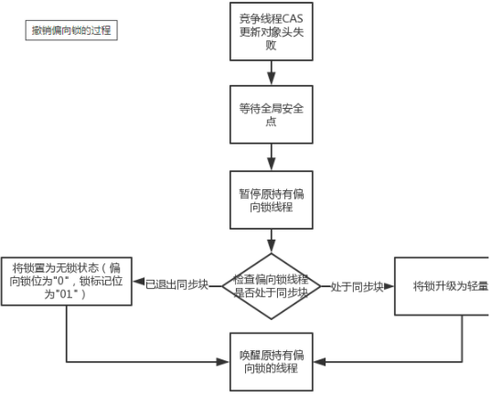

### 轻量级锁

#### 主要作用

有线程来参与锁的竞争，但是获取锁的冲突事件极短。其本质就是自旋锁。

#### 轻量级锁的获取

轻量级锁是为了在线程近乎交替执行同步块时提高性能。

##### 主要目的

是在没有多线程竞争的情况下，通过CAS减少重量级锁使用操作系统互斥量产生的性能消耗，说白了就是先自旋再阻塞。

##### 升级时机

当关闭偏向锁功能或多线程竞争偏向锁，会导致偏向锁升级为轻量级锁

假如线程A已经拿到锁，这时线程B又来抢占该对象的锁，由于该对象的锁已经被线程A拿到，当前该锁已经是偏向锁了。而线程B在争抢时发现对象头Mark Word中的线程ID不是线程B自己的线程ID（而是线程A），那线程B就会进行CAS操作希望能获得锁。

此时线程B操作会有两种情况：

1. 如果获取锁成功：直接替换Mark Word中的线程ID为B自己的ID（A->B），重新偏向于其他线程（即偏向锁交给其他线程，相当于当前线程“被”释放了锁），该锁会保持偏向锁状态，A线程over，B线程上位。

   

2. 如果获取锁失败：则偏向锁升级为轻量级锁，此时轻量级锁由原持有偏向锁的线程持有，继续执行其同步代码，而正在竞争的线程B会进入自旋等待获得该轻量级锁。

   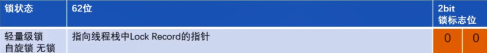

#### code 演示

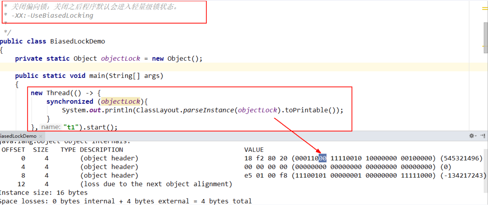

#### 自旋次数和程度

##### JDK1.6之前

默认启用，默认情况下自旋的次数时10次，-XX:PreBlockSpin=10，或者是自旋线程数超过CPU核数一半。

##### JDK1.6之后

自适应。意味着自旋的次数不是固定不变的，而是根据同一个锁上一次自旋的时间和拥有线程的状态来决定。

#### 轻量级锁和偏向锁的区别

- 争抢轻量级锁失败时，自旋尝试抢占锁
- 轻量级锁没错退出同步块都需要释放锁，而偏向锁是在竞争发生时才释放锁。

### 重量级锁

#### 作用场景

有大量的线程参与锁的竞争，冲突性很高。

#### 锁标志位

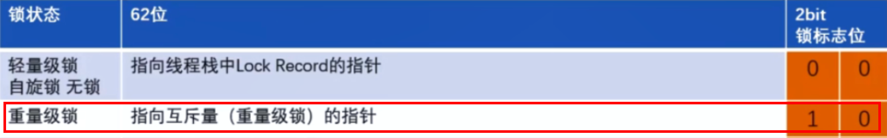

#### code 演示

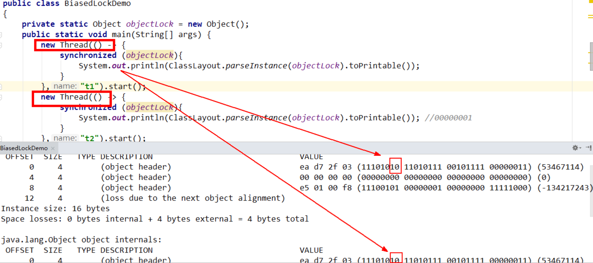


### 小总结

| 锁       | 优点                                                         | 缺点                                           | 适用场景                           |
| -------- | ------------------------------------------------------------ | ---------------------------------------------- | ---------------------------------- |
| 偏向锁   | 加锁和解锁不需要额外的消耗，和执行同步方法相比仅存在纳秒级的差距 | 如果线程间存在锁竞争，会带来额外的锁撤销的消耗 | 使用一个只有线程访问同步块场景     |
| 轻量级锁 | 竞争的线程不会阻塞，提高了程序的响应速度                     | 如果始终得不到锁竞争的线程，使用自旋会消耗CPU  | 追求响应时间、同步块执行速度非常快 |
| 重量级锁 | 线程竞争不使用自旋，不会消耗CPU                              | 线程阻塞，响应时间缓慢                         | 追求吞吐量、同步块执行速度较长     |

synchronized锁升级过程总结：一句话，就是先自旋，不行再阻塞。实际上是把之前的悲观锁(重量级锁)变成在一定条件下使用偏向锁以及使用轻量级(自旋锁CAS)的形式。

- 偏向锁：适用于单线程适用的情况，在不存在锁竞争的时候进入同步方法/代码块则使用偏向锁。 
- 轻量级锁：适用于竞争较不激烈的情况(这和乐观锁的使用范围类似)， 存在竞争时升级为轻量级锁，轻量级锁采用的是自旋锁，如果同步方法/代码块执行时间很短的话，采用轻量级锁虽然会占用cpu资源但是相对比使用重量级锁还是更高效。
- 重量级锁：适用于竞争激烈的情况，如果同步方法/代码块执行时间很长，那么使用轻量级锁自旋带来的性能消耗就比使用重量级锁更严重，这时候就需要升级为重量级锁。

## 总结

- ”锁“本身是一个对象，synchronized这个关键字不是“锁”。硬要说的话，加synchronized仅仅是相当于“加锁”这个操作。
- synchronized 的性能变化（JDK1.6之前，重量级锁；1.6之后，优化）
- synchronized 的锁种类以及锁升级（无锁->偏向锁->轻量级锁->重量级锁）

