## 简介

### 是什么

ThreadLocal提供线程局部变量。这些变量与正常的变量不同，因为每一个线程在访问ThreadLocal实例的时候（通过其get或set方法） 都有自己的、独立初始化的变量副本 。ThreadLocal实例通常是类中的私有静态字段，使用它的目的是希望将状态（例如，用户ID或事务ID）与线程关联起来。

### 能干嘛

实现 每一个线程都有自己专属的本地变量副本 (自己用自己的变量不麻烦别人，不和其他人共享，人人有份，人各一份)，

主要解决了让每个线程绑定自己的值，通过使用get()和set()方法，获取默认值或将其值更改为当前线程所存的副本的值从而避免了线程安全问题。

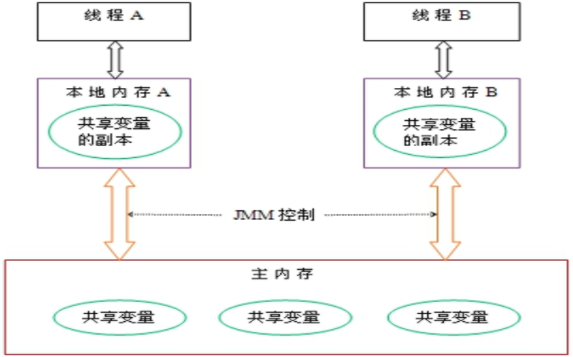

### api 介绍

#### get()：

```java

    /**
     * Returns the value in the current thread's copy of this
     * thread-local variable.  If the variable has no value for the
     * current thread, it is first initialized to the value returned
     * by an invocation of the {@link #initialValue} method.
     *
     * @return the current thread's value of this thread-local
     */
    public T get() {
        Thread t = Thread.currentThread();
        ThreadLocalMap map = getMap(t);
        if (map != null) {
            ThreadLocalMap.Entry e = map.getEntry(this);
            if (e != null) {
                @SuppressWarnings("unchecked")
                T result = (T)e.value;
                return result;
            }
        }
        return setInitialValue();
    }
```

#### set()：

```java

    /**
     * Sets the current thread's copy of this thread-local variable
     * to the specified value.  Most subclasses will have no need to
     * override this method, relying solely on the {@link #initialValue}
     * method to set the values of thread-locals.
     *
     * @param value the value to be stored in the current thread's copy of
     *        this thread-local.
     */
    public void set(T value) {
        Thread t = Thread.currentThread();
        ThreadLocalMap map = getMap(t);
        if (map != null)
            map.set(this, value);
        else
            createMap(t, value);
    }
```

#### remove()：

```java

    /**
     * Removes the current thread's value for this thread-local
     * variable.  If this thread-local variable is subsequently
     * {@linkplain #get read} by the current thread, its value will be
     * reinitialized by invoking its {@link #initialValue} method,
     * unless its value is {@linkplain #set set} by the current thread
     * in the interim.  This may result in multiple invocations of the
     * {@code initialValue} method in the current thread.
     *
     * @since 1.5
     */
     public void remove() {
         ThreadLocalMap m = getMap(Thread.currentThread());
         if (m != null)
             m.remove(this);
     }
```

#### withInitial()：

```java

    /**
     * Creates a thread local variable. The initial value of the variable is
     * determined by invoking the {@code get} method on the {@code Supplier}.
     *
     * @param <S> the type of the thread local's value
     * @param supplier the supplier to be used to determine the initial value
     * @return a new thread local variable
     * @throws NullPointerException if the specified supplier is null
     * @since 1.8
     */
    public static <S> ThreadLocal<S> withInitial(Supplier<? extends S> supplier) {
        return new SuppliedThreadLocal<>(supplier);
    }
```

### 小总结

- 每个Thread内有自己的实例副本且该副本只由当前线程自己使用
- 既然其他Thread不可访问，那就不存在多线程间共享的问题
- 统一设置初始值，但是每个线程对这个值的修改都是各自线程互相独立的

一句话：如何才能不争抢：1、加入synchronized 或者Lock控制资源的访问顺序；2、使用ThreadLocal每个线程独一份，各自安好，没必要抢夺。

## 从阿里规范说起

### 非线程安全的 SimpleDateFormat

SimpleDateFormat中的日期格式不是同步的。推荐（建议）为每个线程创建独立的格式实例。如果多个线程同时访问一个格式，则它必须保持外部同步。

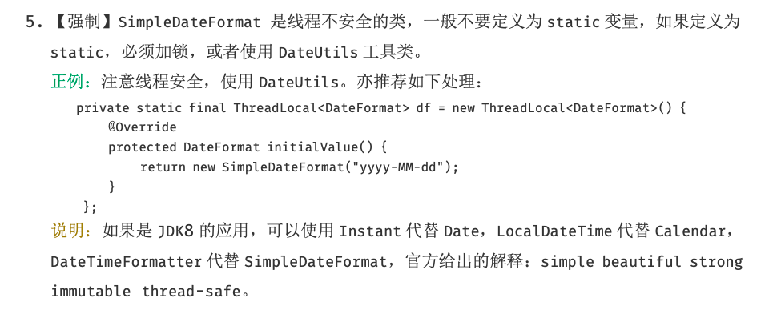

### 代码示例

```java
public class SimpleDateFormatDemo {

    public static final SimpleDateFormat sdf = new SimpleDateFormat("yyyy-MM-dd HH:mm:ss");

    public static Date parseDate(String stringDate) throws ParseException {
        return sdf.parse(stringDate);
    }

    public static void main(String[] args) {
        for (int i = 0; i < 30; i++) {
            new Thread(()->{
                try {
                    System.out.println(SimpleDateFormatDemo.parseDate("2021-11-11 11:11:11"));
                } catch (ParseException e) {
                    e.printStackTrace();
                }
            }, String.valueOf(i)).start();
        }
    }
}
```

看看这个惨痛的报错信息

```java
Thu Nov 11 11:11:11 CST 2021
Thu Nov 11 11:11:11 CST 2021
Thu Nov 11 11:11:11 CST 2021
Thu Nov 11 11:11:11 CST 2021
Thu Nov 11 11:11:11 CST 2021
Thu Nov 11 11:11:11 CST 2021
Thu Nov 11 11:11:11 CST 2021
Thu Nov 11 11:11:11 CST 2021
Thu Nov 11 11:11:11 CST 2021
Thu Nov 11 11:11:11 CST 2021
Thu Nov 11 11:11:11 CST 2021
Thu Nov 11 11:11:11 CST 2021
Fri Jun 11 11:11:11 CST 20304613
Thu Nov 11 11:11:11 CST 2021
Thu Nov 11 11:11:11 CST 2021
Thu Nov 11 11:11:11 CST 2021
Tue Jul 11 11:11:11 CST 2113
Thu Nov 11 11:11:11 CST 2021
Thu Nov 11 11:11:11 CST 2021
Thu Nov 11 11:11:11 CST 2021
Thu Nov 11 11:11:11 CST 2021
Thu Nov 11 11:11:11 CST 2021
Thu Nov 11 11:11:11 CST 2021
Thu Nov 11 11:11:11 CST 2021
Thu Nov 11 11:11:11 CST 2021
Exception in thread "0" Exception in thread "5" Exception in thread "7" java.lang.NumberFormatException: For input string: "E112"
	at java.lang.NumberFormatException.forInputString(NumberFormatException.java:65)
	at java.lang.Long.parseLong(Long.java:589)
	at java.lang.Long.parseLong(Long.java:631)
	at java.text.DigitList.getLong(DigitList.java:195)
	at java.text.DecimalFormat.parse(DecimalFormat.java:2084)
	at java.text.SimpleDateFormat.subParse(SimpleDateFormat.java:2162)
	at java.text.SimpleDateFormat.parse(SimpleDateFormat.java:1514)
	at java.text.DateFormat.parse(DateFormat.java:364)
	at com.guofei.controller.thread.SimpleDateFormatDemo.parseDate(SimpleDateFormatDemo.java:22)
	at com.guofei.controller.thread.SimpleDateFormatDemo.lambda$main$0(SimpleDateFormatDemo.java:29)
	at java.lang.Thread.run(Thread.java:748)
java.lang.NumberFormatException: multiple points
	at sun.misc.FloatingDecimal.readJavaFormatString(FloatingDecimal.java:1890)
	at sun.misc.FloatingDecimal.parseDouble(FloatingDecimal.java:110)
	at java.lang.Double.parseDouble(Double.java:538)
	at java.text.DigitList.getDouble(DigitList.java:169)
	at java.text.DecimalFormat.parse(DecimalFormat.java:2089)
	at java.text.SimpleDateFormat.subParse(SimpleDateFormat.java:1869)
	at java.text.SimpleDateFormat.parse(SimpleDateFormat.java:1514)
	at java.text.DateFormat.parse(DateFormat.java:364)
	at com.guofei.controller.thread.SimpleDateFormatDemo.parseDate(SimpleDateFormatDemo.java:22)
	at com.guofei.controller.thread.SimpleDateFormatDemo.lambda$main$0(SimpleDateFormatDemo.java:29)
	at java.lang.Thread.run(Thread.java:748)
Exception in thread "16" java.lang.NumberFormatException: For input string: ""
	at java.lang.NumberFormatException.forInputString(NumberFormatException.java:65)
	at java.lang.Long.parseLong(Long.java:601)
	at java.lang.Long.parseLong(Long.java:631)
	at java.text.DigitList.getLong(DigitList.java:195)
	at java.text.DecimalFormat.parse(DecimalFormat.java:2084)
	at java.text.SimpleDateFormat.subParse(SimpleDateFormat.java:1869)
	at java.text.SimpleDateFormat.parse(SimpleDateFormat.java:1514)
	at java.text.DateFormat.parse(DateFormat.java:364)
	at com.guofei.controller.thread.SimpleDateFormatDemo.parseDate(SimpleDateFormatDemo.java:22)
	at com.guofei.controller.thread.SimpleDateFormatDemo.lambda$main$0(SimpleDateFormatDemo.java:29)
	at java.lang.Thread.run(Thread.java:748)
Exception in thread "2" java.lang.NumberFormatException: For input string: "E112"
	at sun.misc.FloatingDecimal.readJavaFormatString(FloatingDecimal.java:2043)
	at sun.misc.FloatingDecimal.parseDouble(FloatingDecimal.java:110)
	at java.lang.Double.parseDouble(Double.java:538)
	at java.text.DigitList.getDouble(DigitList.java:169)
	at java.text.DecimalFormat.parse(DecimalFormat.java:2089)
	at java.text.SimpleDateFormat.subParse(SimpleDateFormat.java:1869)
	at java.text.SimpleDateFormat.parse(SimpleDateFormat.java:1514)
	at java.text.DateFormat.parse(DateFormat.java:364)
	at com.guofei.controller.thread.SimpleDateFormatDemo.parseDate(SimpleDateFormatDemo.java:22)
	at com.guofei.controller.thread.SimpleDateFormatDemo.lambda$main$0(SimpleDateFormatDemo.java:29)
	at java.lang.Thread.run(Thread.java:748)
java.lang.NumberFormatException: For input string: ".1111"
	at java.lang.NumberFormatException.forInputString(NumberFormatException.java:65)
	at java.lang.Long.parseLong(Long.java:578)
	at java.lang.Long.parseLong(Long.java:631)
	at java.text.DigitList.getLong(DigitList.java:195)
	at java.text.DecimalFormat.parse(DecimalFormat.java:2084)
	at java.text.SimpleDateFormat.subParse(SimpleDateFormat.java:2162)
	at java.text.SimpleDateFormat.parse(SimpleDateFormat.java:1514)
	at java.text.DateFormat.parse(DateFormat.java:364)
	at com.guofei.controller.thread.SimpleDateFormatDemo.parseDate(SimpleDateFormatDemo.java:22)
	at com.guofei.controller.thread.SimpleDateFormatDemo.lambda$main$0(SimpleDateFormatDemo.java:29)
	at java.lang.Thread.run(Thread.java:748)

```

SimpleDateFormat类内部有一个Calendar对象引用,它用来储存和这个SimpleDateFormat相关的日期信息,例如sdf.parse(dateStr),sdf.format(date) 诸如此类的方法参数传入的日期相关String,Date等等, 都是交由Calendar引用来储存的.这样就会导致一个问题 如果你的SimpleDateFormat是个static的, 那么多个thread 之间就会共享这个SimpleDateFormat, 同时也是共享这个Calendar引用。

### 解决

ThreadLoacl，线程本地变量或者线程本地存储

```java
public class SimpleDateFormatDemo {

    /*public static final SimpleDateFormat sdf = new SimpleDateFormat("yyyy-MM-dd HH:mm:ss");

    public static Date parseDate(String stringDate) throws ParseException {
        return sdf.parse(stringDate);
    }*/


    public static final ThreadLocal<SimpleDateFormat> sdf = ThreadLocal.withInitial(()->new SimpleDateFormat("yyyy-MM-dd HH:mm:ss"));

    public static Date parseDateTL(String stringDate) throws ParseException {
        return sdf.get().parse(stringDate);
    }
    public static void main(String[] args) {
        for (int i = 0; i < 30; i++) {
            new Thread(()->{
                try {
                    System.out.println(SimpleDateFormatDemo.parseDateTL("2021-11-11 11:11:11"));
                } catch (ParseException e) {
                    e.printStackTrace();
                }
            }, String.valueOf(i)).start();
        }
    }
}

```

结果：

```java
Thu Nov 11 11:11:11 CST 2021
Thu Nov 11 11:11:11 CST 2021
Thu Nov 11 11:11:11 CST 2021
Thu Nov 11 11:11:11 CST 2021
。。。25。。。
Thu Nov 11 11:11:11 CST 2021
```

当然也可以加锁或者调用其他第三方时间库解决这个问题。

## 源码分析

### Thread、ThreadLocal、ThreadLocalMap之间的关系

#### Thread、ThreadLocal

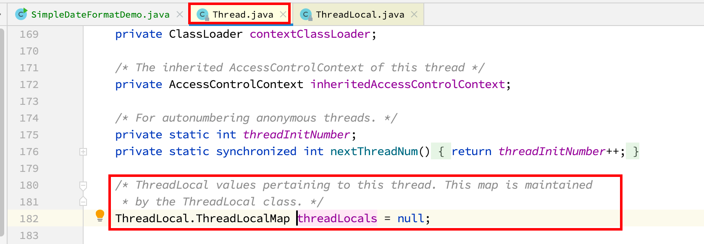

各自线程、人手一份，每一个Thread里面都有一个ThreadLocal

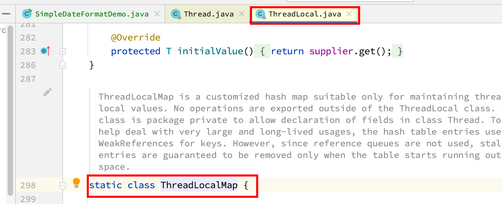

又调用了ThreadLocal里面的静态类ThreadLocalMap

三者之间的关系：

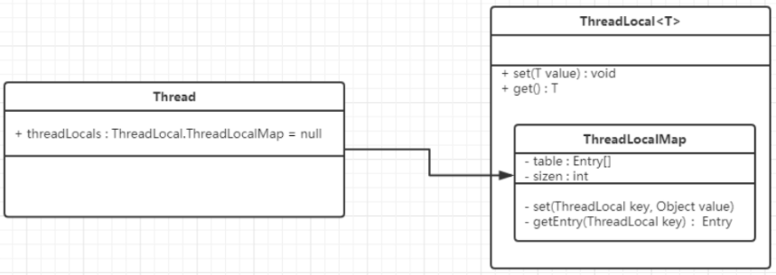

threadLocalMap实际上就是一个以threadLocal实例为key，任意对象为value的Entry对象。

当我们为threadLocal变量赋值，实际上就是以当前threadLocal实例为key，值为value的Entry往这个threadLocalMap中存放

近似的可以理解为：ThreadLocalMap从字面上就可以看出这是一个保存ThreadLocal对象的map（其实是以ThreadLocal为key），不过是经过了两层包装的ThreadLocal对象。

JVM内部维护了一个线程版的Map<Thread,T>( 通过ThreadLocal对象的set方法，结果把ThreadLocal对象自己当做key，放进了ThreadLoalMap中 ) ,每个线程要用到这个T的时候，用当前的线程去Map里面获取， 通过这样让每个线程都拥有了自己独立的变量 ，人手一份，竞争条件被彻底消除，在并发模式下是绝对安全的变量。

## 内存泄漏问题

### 阿里规范

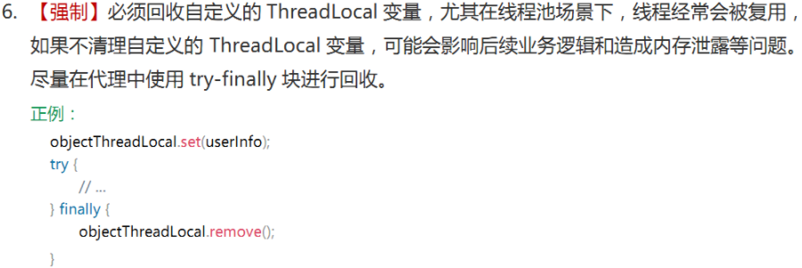

### 什么是内存泄漏

不再被使用的对象或者变量所占用的内存不能被回收，就是内存泄漏。

### 对象引用

在 Java 里万事万物皆对象，这里有个对象，那么对象引用是什么呢？

```java
User user=new User("zhangsan");
```

一个对象被 user 引用了，这里 user 把他叫做对象引用 。

在 Java 里对象的引用也是分几种类型的，分以下四种类型：强引用、软引用、弱引用、虚引用

#### 强引用

强引用就是我们平时开发中用的最多的，比如说上面的user对象就是强引用。

当一个对象被强引用时候，JVM 垃圾回收的时候是不会回收的，宁愿执行 OOM（Out Of Memory）异常也绝不回收，因为 JVM 垃圾回收的时候会认为这个对象是被用户正在使用，若回收了很有可能造成无法想象的错误。

#### 软引用

如果一个对象具有软引用，内存空间足够，JVM 垃圾回收器就不会回收它；如果内存空间不足了，就会回收这些对象的内存。只要垃圾回收器没有回收它，该对象就可以被程序使用。软引用可用来实现内存敏感的高速缓存，比如网页缓存、图片缓存等。

使用软引用能防止内存泄露，增强程序的健壮性。

java.lang.ref.SoftReference 的特点是它的一个实例保存对一个 Java 对象的软引用， 该软引用的存在不妨碍垃圾收集线程对该 Java 对象的回收。

也就是说，一旦 SoftReference 保存了对一个 Java 对象的软引用后，在垃圾线程对这个 Java 对象回收前，SoftReference 类所提供的 get()方法返回 Java 对象的强引用。

如果引用对象被清除或者被 GC 回收，这个 get 方法就返回 null。

#### 弱引用

弱引用也是用来描述非必需对象的，当 JVM 下一次进行垃圾回收时，无论内存是否充足，都会回收被弱引用关联的对象。在 java 中，用 java.lang.ref.WeakReference 类来表示。**与软引用不同的是，不管是否内存不足，弱引用都会被回收。**。弱引用可以结合 来使用，当由于系统触发 gc，导致软引用的对象被回收了，JVM 会把这个弱引用加入到与之相关联的 ReferenceQueue 中，不过由于垃圾收集器线程的优先级很低，所以弱引用不一定会被很快回收。

假如有一个应用需要读取大量的本地图片:

1.  如果每次读取图片都从硬盘读取则会严重影响性能
2. 如果一次性全部加载到内存中又可能造成内存溢出

此时使用软引用可以解决这个问题，设计思路是：用一个HashMap来保存图片的路径和相应图片对象关联的软引用之间的映射关系，在内存不足时，JVM会自动回收这些缓存图片对象所占用的空间，从而有效地避免了OOM的问题。 

#### 虚引用

虚引用和前面的软引用、弱引用不同，它并不影响对象的生命周期。在 java 中用 java.lang.ref.PhantomReference 类表示。如果一个对象与虚引用关联，则跟没有引用与之关联一样，在任何时候都可能被垃圾回收器回收。

虚引用的主要作用是跟踪对象被垃圾回收的状态。  **仅仅是提供了一种确保对象被 finalize以后，做某些事情的机制。**  PhantomReference的get方法总是返回null ，因此无法访问对应的引用对象。

其意义在于：说明一个对象已经进入finalization阶段，可以被gc回收，用来实现比finalization机制更灵活的回收操作 。

换句话说，设置虚引用关联的唯一目的，就是在这个对象被收集器回收的时候收到一个系统通知或者后续添加进一步的处理

**注意**：虚引用必须和引用队列关联使用，当垃圾回收器准备回收一个对象时，如果发现它还有虚引用，就会把这个虚引用加入到与之关联的引用队列中。程序可以通过判断引用队列中是否已经加入了虚引用，来了解被引用的对象是否将要被垃圾回收。如果程序发现某个虚引用已经被加入到引用队列，那么就可以在所引用的对象的内存被回收之前采取必要的行动。

### ThreadLocal 内存泄漏

每个Thread对象维护着一个ThreadLocalMap的引用，ThreadLocalMap是ThreadLocal的内部类，用Entry来进行存储

- 调用ThreadLocal的set()方法时，实际上就是往ThreadLocalMap设置值，key是ThreadLocal对象，值Value是传递进来的对象
- 调用ThreadLocal的get()方法时，实际上就是往ThreadLocalMap获取值，key是ThreadLocal对象

ThreadLocal本身并不存储值，它只是自己作为一个key来让线程从ThreadLocalMap获取value，正因为这个原理，所以ThreadLocal能够实现“数据隔离”，获取当前线程的局部变量值，不受其他线程影响。

#### entry 为什么是弱引用

我们在new一个ThreadLocal的时候相当于一个强引用，如果这个方法执行完毕后，栈帧销毁这个强引用也没有了，但此时线程的ThreadLocalMap里某个entry的key引用还指向这个对象。

若这个key引用是 **强引用**  ，就会导致key指向的ThreadLocal对象及v指向的对象不能被gc回收，造成内存泄漏；若这个key引用是 **弱引用**  就 大概率 会减少内存泄漏的问题。（这里还有一个小坑，key为null的小问题，后面说）

使用弱引用，就可以使ThreadLocal对象在方法执行完毕后顺利被回收且Entry的 key引用指向为null

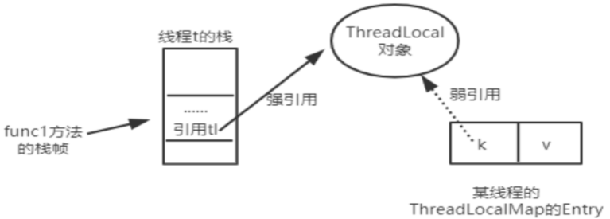

#### key 为 null 的问题

为threadLocal变量赋值，实际上就是当前的Entry（threadLocal实例为key、值为value）忘这个threadLocalMap中存放。Entry中的Key是弱引用，当threadLocal外部强引用被置为null(tl=null),那么系统 GC 的时候。根据可达性分析，这个threadLocal实例就没有任何一条链路能够引用到它，这个ThreadLocal势必会被回收。但是呢，这样一来 ，ThreadLocalMap中就会出现key为null的Entry，就没有办法访问这些key为null的Entry的value，如果当前线程再迟迟不结束的话，这些key为null的Entry的value就会一直存在一条强引用链：Thread Ref -> Thread -> ThreaLocalMap -> Entry -> value永远无法回收，如果这个value非常大的话，就非常有可能造成内存泄漏。

当 然，如果当前thread运行结束，threadLocal，threadLocalMap,Entry没有引用链可达，在垃圾回收的时候都会被系统进行回收。

但在实际使用中 我们有时候会用线程池 去维护我们的线程，比如在Executors.newFixedThreadPool()时创建线程的时候，为了复用线程是不会结束的，所以threadLocal内存泄漏就值得我们小心

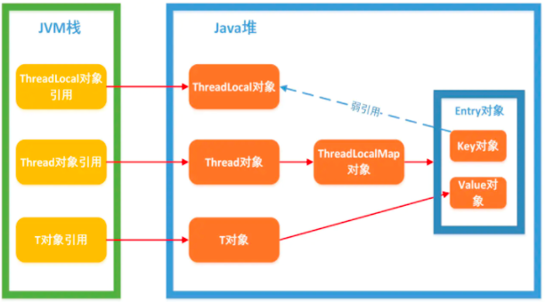

ThreadLocalMap使用ThreadLocal的弱引用作为key，如果一个ThreadLocal没有外部强引用引用他，那么系统gc的时候，这个ThreadLocal势必会被回收，这样一来，ThreadLocalMap中就会出现 key为null的Entry ，就没有办法访问这些key为null的Entry的value，如果当前线程再迟迟不结束的话(比如正好用在线程池)，这些key为null的Entry的value就会一直存在一条强引用链。

虽然弱引用，保证了key指向的ThreadLocal对象能被及时回收，但是v指向的value对象是需要ThreadLocalMap调用get、set时发现key为null时才会去回收整个entry、value， 因此弱引用不能100%保证内存不泄露。 **我们要在不使用某个ThreadLocal对象后，手动调用remoev方法来删除它**  ，尤其是在线程池中，不仅仅是内存泄露的问题，因为线程池中的线程是重复使用的，意味着这个线程的ThreadLocalMap对象也是重复使用的，如果我们不手动调用remove方法，那么后面的线程就有可能获取到上个线程遗留下来的value值，造成bug。

#### set()、get()等方法就去检查所有键为 null 的 Entry 对象

##### set()

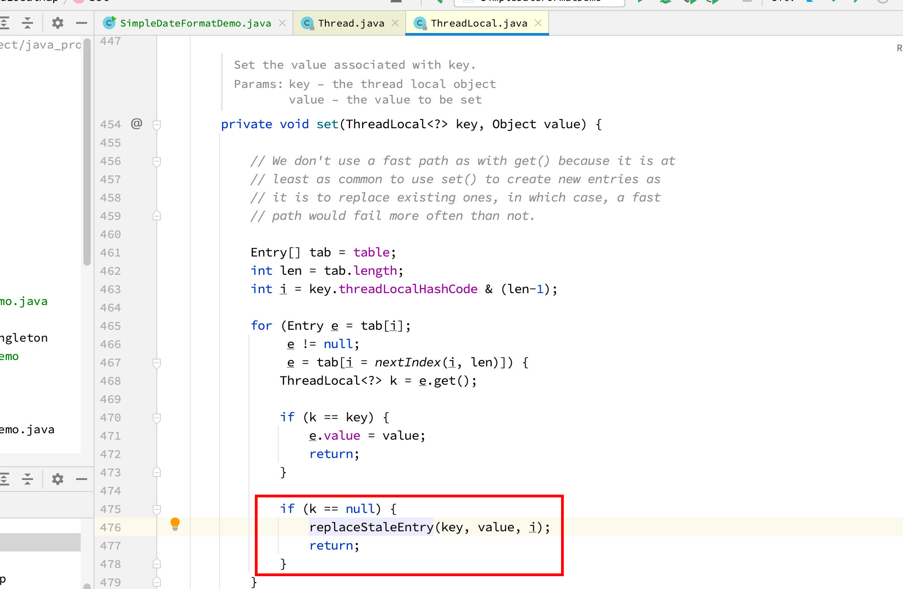

##### get()

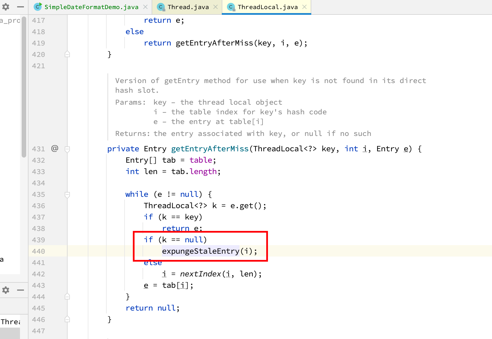

##### remove()

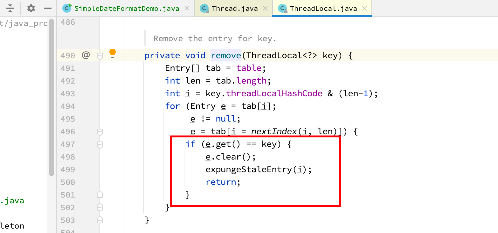

##### 结论

从前面的set,getEntry,remove方法看出，在threadLocal的生命周期里，针对threadLocal存在的内存泄漏的问题，都会通过expungeStaleEntry，cleanSomeSlots,replaceStaleEntry这三个方法清理掉key为null的脏entry。

## 总结

- ThreadLocal并不解决线程间共享数据的问题
- ThreadLocal适用于变量在线程间隔离且在方法间共享的场景
- ThreadLocal 通过隐式的在不用线程内创建独立副本避免了实例线程安全的问题
- 每个线程持有一个只属于自己的专属Map并维护了ThreadLocal对象与具体实例的映射，该Map由于只被它的线程访问，故不存在线程安全以及锁的问题
- ThreadLocalMap的Entry对ThreadLocal的引用为弱引用，避免了ThreadLocal对象无法被回收的问题
- 通过expungeStaleEntry，cleanSomeSlots,replaceStaleEntry这三个方法回收键为null的Entry对象的值以及Entry对象本身从从而防止内存泄漏，属于更加坚固的方法。
- 平时使用一定注意Remove()，尤其是在线程池的使用场景下。

## 比较好的文章

https://mp.weixin.qq.com/s/76lIW4ia8D90Htoyg2NJpw

