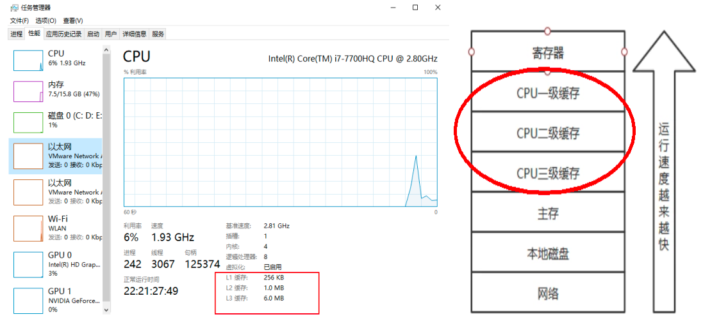
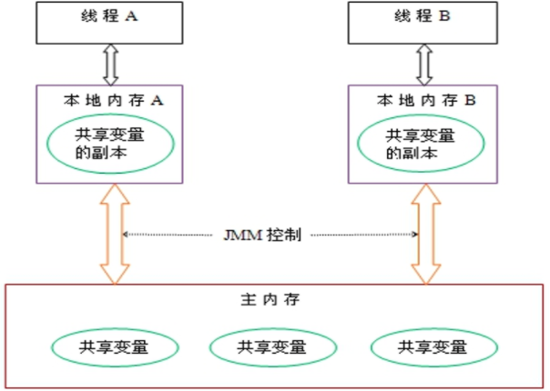
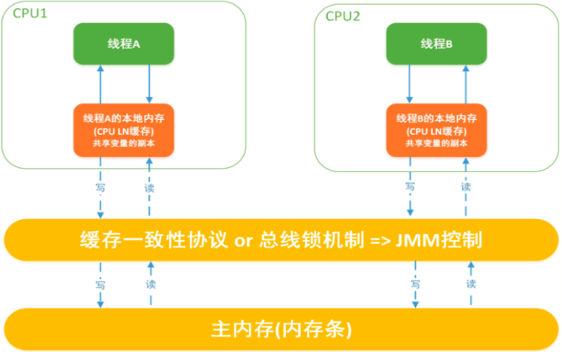

## 计算机硬件体系

计算机存储结构，从本地磁盘到主存到CPU缓存，也就是从硬盘到内存，到CPU。一般对应的程序的操作就是从数据库查数据到内存然后到CPU进行计算。

## JMM

JMM(Java内存模型Java Memory Model，简称JMM)本身是一种抽象的概念并不真实存在 它 仅仅描述的是一组约定或规范 ，通过这组规范定义了程序中(尤其是多线程)各个变量的读写访问方式并决定一个线程对共享变量的写入何时以及如何变成对另一个线程可见，关键技术点都是围绕多线程的 原子性、可见性和有序性。

## 原则

JMM的关键技术点都是围绕多线程的 原子性、可见性和有序性展开的。

## 作用

- 通过JMM来实现线程和主内存之间的抽象关系。
- 屏蔽各个**硬件平台**和**操作系统** 的内存访问差异以实现让Java程序在各种平台下都能达到一致的内存访问效果。

## JMM规范下的三大特性

1. 可见性

   当一个线程修改了某一个共享变量的值，其他线程是否能够立即知道该变更，JMM规定了所有的变量都存储在 主内存中

   

   Java中 普通的共享变量不保证可见性 ，因为数据修改被写入内存的时机是不确定的，多线程并发下很可能出现"脏读"，所以每个线程都有自己的 工作内存  ，线程自己的工作内存中保存了该线程使用到的变量的 主内存副本拷贝 ，线程对变量的所有操作（读取，赋值等 ）都必需在线程自己的工作内存中进行，而不能够直接读写主内存中的变量。不同线程之间也无法直接访问对方工作内存中的变量，线程间变量值的传递均需要通过主内存来完成。

2. 原子性

   指一个操作是不可中断的，即多线程环境下，操作不能被其他线程干扰

3. 有序性

## JMM规范下，多线程对变量的读取过程

### 读取过程

由于JVM运行程序的实体是线程，而每个线程创建时JVM都会为其创建一个工作内存(有些地方称为栈空间)，工作内存是每个线程的私有数据区域，而Java内存模型中规定所有变量都存储在 主内存 ，主内存是共享内存区域，所有线程都可以访问， 但线程对变量的操作(读取赋值等)必须在工作内存中进行，首先要将变量从主内存拷贝到的线程自己的工作内存空间，然后对变量进行操作，操作完成后再将变量写回主内存， 不能直接操作主内存中的变量，各个线程中的工作内存中存储着主内存中的 **变量副本拷贝**  ，因此不同的线程间无法访问对方的工作内存，线程间的通信(传值)必须通过主内存来完成，其简要访问过程如下图：

### JMM定义了线程和主内存之间的抽象关系

1. 线程之间的共享变量存储在主内存中(从硬件角度来说就是内存条)
2. 每个线程都有一个私有的本地工作内存，本地工作内存中存储了该线程用来读/写共享变量的副本(从硬件角度来说就是CPU的缓存，比如寄存器、L1、L2、L3缓存等)

## 小总结

- 我们定义的所有共享变量都存储在物理主内存中
- 每个线程都有自己独立的工作内存，里面保存该线程使用到的变量的副本（主内存中该变量的一份拷贝）
- 线程对共享变量所有的操作都必须现在线程自己的工作内存中进行写回主内存，不能直接从主内存中读写（不能越级）
- 不用线程直接也无法直接访问其他线程的工作内存中的变量，线程间变量的传递需要通过主内存来进行（同级不能相互访问）

## JMM规范下，多线程先行发生原则（Happens-Before）

在JMM中，如果一个操作执行的结果需要对另一个操作保证可见性或者代码重排序，那么这两个操作之间必须存在Happens-Before关系

### 案例

| x=5  | 线程A执行 |
| ---- | --------- |
| y=x  | 线程B执行 |

上述称之为：写后读

问题？y是否等于5呢？

如果线程A的操作（x= 5）Happens-Before(先行发生)线程B的操作（y = x）,那么可以确定线程B执行后y = 5 一定成立；如果他们不存在happens-before原则，那么y = 5 不一定成立。

这就是happens-before原则的威力。**包含可见性和有序性的约束**

### 说明

如果Java内存模型中所有的有序性都仅靠volatile和synchronized来完成，那么有很多操作都将会变得非常啰嗦，但是我们在编写Java并发代码的时候并没有察觉到这一点。

我们没有 时时、处处、次次 ，添加volatile和synchronized来完成程序，这是因为Java语言中JMM原则下有一个“先行发生”(Happens-Before)的原则限制和规矩。

 这个原则非常重要：  它是判断数据是否存在竞争，线程是否安全的非常有用的手段。依赖这个原则，我们可以通过几条简单规则一揽子解决 并发环境下两个操作之间是否可能存在冲突的所有问题 ，而不需要陷入Java内存模型苦涩难懂的底层编译原理之中。

### 总原则

- 如果一个操作Happens-Before另一个操作，那么第一个操作的执行结果将对第二个操作可见，而且第一个操作的执行顺序排在第二个之前
- 两个操作之间存在Happens-Before关系，并不意味一定要按照Happens-Before原则制定的顺序来执行。如果重排序之后的执行结果与按照Happens-Before关系执行的结果一致，那么这种重排序并不非法

### Happens-Before 8条规则

- 次序规则

  一个线程内，按照代码顺序，写在前面的操作先行发生写在后面的额操作，也就是前一个操作的结果可以被后续的操作获取。

- 锁定规则

  一个unlock操作先行发生于后面（这里的后面是指时间上的先后）对同一个锁的lock操作。

- volatile变量规则

  对一个volatile变量的写操作先行发生于后面对这个变量的读操作，前面的写对后面的读是可见的，这里的后面同样是指时间上的先后。

- 传递规则

  如果操作A先行发生于操作B，而操作B又先行发生于操作C，则可以得出操作A先行发生于操作C。

- 线程启动规则（Thread Start Rule）

  Thread对象的start()方法先行发生于此线程的每一个动作。

- 线程中断规则（Thread Interruption Rule）

  对线程interrupt()方法的调用先行发生于被中断线程的代码检测到中断事件的发生（可以通过Thread.interrupt()检测到是否发生中断）。

- 线程终止规则（Thread Termination Rule）

  线程中所有操作都先行发生于对此线程的终止检测（可以通过Thread::join()方法是否结束、Thread::isAlive()的返回值等手段检测线程是否已经终止执行）。

- 对象终结规则（Finalizer Rule）

  一个对象的初始化完成（构造函数执行结束）先行发生于它的finalized()方法的开始（对象没有完成初始化之前，是不能调用finalized()方法的）。

