## 计算机硬件体系

计算机存储结构，从本地磁盘到主存到CPU缓存，也就是从硬盘到内存，到CPU。一般对应的程序的操作就是从数据库查数据到内存然后到CPU进行计算。


## JMM

JMM(Java内存模型Java Memory Model，简称JMM)本身是一种抽象的概念并不真实存在 它 仅仅描述的是一组约定或规范 ，通过这组规范定义了程序中(尤其是多线程)各个变量的读写访问方式并决定一个线程对共享变量的写入何时以及如何变成对另一个线程可见，关键技术点都是围绕多线程的 原子性、可见性和有序性。

## 原则

JMM的关键技术点都是围绕多线程的 原子性、可见性和有序性展开的。

## 作用

- 通过JMM来实现线程和主内存之间的抽象关系。
- 屏蔽各个**硬件平台**和**操作系统** 的内存访问差异以实现让Java程序在各种平台下都能达到一致的内存访问效果。

## JMM规范下的三大特性

1. 可见性

   当一个线程修改了某一个共享变量的值，其他线程是否能够立即知道该变更，JMM规定了所有的变量都存储在 主内存中

   

   Java中 普通的共享变量不保证可见性 ，因为数据修改被写入内存的时机是不确定的，多线程并发下很可能出现"脏读"，所以每个线程都有自己的 工作内存  ，线程自己的工作内存中保存了该线程使用到的变量的 主内存副本拷贝 ，线程对变量的所有操作（读取，赋值等 ）都必需在线程自己的工作内存中进行，而不能够直接读写主内存中的变量。不同线程之间也无法直接访问对方工作内存中的变量，线程间变量值的传递均需要通过主内存来完成。

2. 原子性

   指一个操作是不可中断的，即多线程环境下，操作不能被其他线程干扰

3. 有序性

## JMM规范下，多线程对变量的读取过程

### 读取过程

由于JVM运行程序的实体是线程，而每个线程创建时JVM都会为其创建一个工作内存(有些地方称为栈空间)，工作内存是每个线程的私有数据区域，而Java内存模型中规定所有变量都存储在 主内存 ，主内存是共享内存区域，所有线程都可以访问， 但线程对变量的操作(读取赋值等)必须在工作内存中进行，首先要将变量从主内存拷贝到的线程自己的工作内存空间，然后对变量进行操作，操作完成后再将变量写回主内存， 不能直接操作主内存中的变量，各个线程中的工作内存中存储着主内存中的 **变量副本拷贝**  ，因此不同的线程间无法访问对方的工作内存，线程间的通信(传值)必须通过主内存来完成，其简要访问过程如下图：


### JMM定义了线程和主内存之间的抽象关系

1. 线程之间的共享变量存储在主内存中(从硬件角度来说就是内存条)
2. 每个线程都有一个私有的本地工作内存，本地工作内存中存储了该线程用来读/写共享变量的副本(从硬件角度来说就是CPU的缓存，比如寄存器、L1、L2、L3缓存等)

## 小总结

- 我们定义的所有共享变量都存储在物理主内存中
- 每个线程都有自己独立的工作内存，里面保存该线程使用到的变量的副本（主内存中该变量的一份拷贝）
- 线程对共享变量所有的操作都必须现在线程自己的工作内存中进行写回主内存，不能直接从主内存中读写（不能越级）
- 不用线程直接也无法直接访问其他线程的工作内存中的变量，线程间变量的传递需要通过主内存来进行（同级不能相互访问）

## JMM规范下，多线程先行发生原则（Happens-Before）

在JMM中，如果一个操作执行的结果需要对另一个操作保证可见性或者代码重排序，那么这两个操作之间必须存在Happens-Before关系

### 案例

| x=5  | 线程A执行 |
| ---- | --------- |
| y=x  | 线程B执行 |

上述称之为：写后读

问题？y是否等于5呢？

如果线程A的操作（x= 5）Happens-Before(先行发生)线程B的操作（y = x）,那么可以确定线程B执行后y = 5 一定成立；如果他们不存在happens-before原则，那么y = 5 不一定成立。

这就是happens-before原则的威力。**包含可见性和有序性的约束**

### 说明

如果Java内存模型中所有的有序性都仅靠volatile和synchronized来完成，那么有很多操作都将会变得非常啰嗦，但是我们在编写Java并发代码的时候并没有察觉到这一点。

我们没有 时时、处处、次次 ，添加volatile和synchronized来完成程序，这是因为Java语言中JMM原则下有一个“先行发生”(Happens-Before)的原则限制和规矩。

 这个原则非常重要：  它是判断数据是否存在竞争，线程是否安全的非常有用的手段。依赖这个原则，我们可以通过几条简单规则一揽子解决 并发环境下两个操作之间是否可能存在冲突的所有问题 ，而不需要陷入Java内存模型苦涩难懂的底层编译原理之中。

### 总原则

- 如果一个操作Happens-Before另一个操作，那么第一个操作的执行结果将对第二个操作可见，而且第一个操作的执行顺序排在第二个之前
- 两个操作之间存在Happens-Before关系，并不意味一定要按照Happens-Before原则制定的顺序来执行。如果重排序之后的执行结果与按照Happens-Before关系执行的结果一致，那么这种重排序并不非法

### Happens-Before 8条规则

- 次序规则

  一个线程内，按照代码顺序，写在前面的操作先行发生写在后面的额操作，也就是前一个操作的结果可以被后续的操作获取。

- 锁定规则

  一个unlock操作先行发生于后面（这里的后面是指时间上的先后）对同一个锁的lock操作。

- volatile变量规则

  对一个volatile变量的写操作先行发生于后面对这个变量的读操作，前面的写对后面的读是可见的，这里的后面同样是指时间上的先后。

- 传递规则

  如果操作A先行发生于操作B，而操作B又先行发生于操作C，则可以得出操作A先行发生于操作C。

- 线程启动规则（Thread Start Rule）

  Thread对象的start()方法先行发生于此线程的每一个动作。

- 线程中断规则（Thread Interruption Rule）

  对线程interrupt()方法的调用先行发生于被中断线程的代码检测到中断事件的发生（可以通过Thread.interrupt()检测到是否发生中断）。

- 线程终止规则（Thread Termination Rule）

  线程中所有操作都先行发生于对此线程的终止检测（可以通过Thread::join()方法是否结束、Thread::isAlive()的返回值等手段检测线程是否已经终止执行）。

- 对象终结规则（Finalizer Rule）

  一个对象的初始化完成（构造函数执行结束）先行发生于它的finalized()方法的开始（对象没有完成初始化之前，是不能调用finalized()方法的）。

## Volatile 两大特点

可见性、有序性

## Volatile 的内存语义 

当写一个 Volatile 变量时，JMM 会把线程对应的本地内存中的共享变量值立即刷新回主内存中；当读一个 Volatile 变量时，JMM 会把该线程对应的本地内存设置为无效，直接从主内存中读取共享变量。所以，Volatile的写内存语义是直接刷新到主内存中，读的内存语义是直接从主内存中读取。

## 内存屏障

内存屏障（也称内存栅栏，内存栅障，屏障指令等，是一类同步屏障指令，是CPU或编译器在对内存随机访问的操作中的一个同步点，使得此点之前的所有读写操作都执行后才可以开始执行此点之后的操作），避免代码重排序。

内存屏障其实就是一种JVM指令，Java内存模型的重排规则会要求Java编译器在生成JVM指令时插入特定的内存屏障指令 ，通过这些内存屏障指令，volatile实现了Java内存模型中的可见性和有序性，但volatile无法保证原子性。

内存屏障之前的所有写操作都要 写到主内存 ，内存屏障之后的所有读操作都能获得内存屏障之前的所有写操作的最新结果(实现了可见性)。因此重排序时，不允许把内存屏障之后的指令重排序到内存屏障之前。

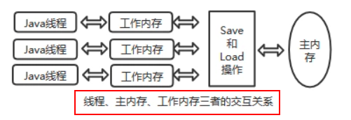

一句话：对一个 volatile 域的写, happens-before 于任意后续对这个 volatile 域的读，也叫写后读。

#### JVM 提供了四类内存屏障指令

前面说到的Happens-Before原则类似于一种规范，它的实际落地就是JVM提供的四类内存屏障指令。

- loadload()
- storestore(）
- loadstore()
- storeload()

#### 源码探析

sun.misc.Unsafe

```java

    /**
     * Ensures lack of reordering of loads before the fence
     * with loads or stores after the fence.
     * @since 1.8
     */
    public native void loadFence();

    /**
     * Ensures lack of reordering of stores before the fence
     * with loads or stores after the fence.
     * @since 1.8
     */
    public native void storeFence();

    /**
     * Ensures lack of reordering of loads or stores before the fence
     * with loads or stores after the fence.
     * @since 1.8
     */
    public native void fullFence();
```

unsafe.cpp（C++源码）

```c++
UNSAFE_ENTRY (void, Unsafe LoadFence (JNIEnv *env, jobject unsafe))
	UnsafeWrapper ("Unsafe LoadFence");
	OrderAccess::acquire();
UNSAFE END
UNSAFE_ENTRY (void, Unsafe StoreFence (INIEnv *env, jobject unsafe))
	UnsafeWrapper ("Unsafe StoreFence");
	OrderAccess::release();
UNSAFE END
UNSAFE_ENTRY (void, Unsafe _FullFence(JNIEnv *env, jobject unsafe))
	UnsafeWrapper ("Unsafe _FullFence");
	OrderAccess::fence0);
UNSAFE END
```

orderAccess.hpp（C++源码）

```c
class OrderAccess : AllStatic {
public:
	static void loadload();
	static void storestore();
	static void loadstore();
	static void storeload();

  static void acquire();
  static void release();
  static void fence();
...
}
```

可见一共提供了四条并发原语（loadload()、storestore(）、loadstore()、storeload()）

| 屏障类型     | 指令示例                      | 说明                                                         |
| ------------ | ----------------------------- | ------------------------------------------------------------ |
| loadload()   | Load1；loadload；Load2        | 保证Load1的读取操作在Load2及后续读取操作之前                 |
| storestore() | Store1；storestore(）；Store2 | 在Store2及其后的写操作执行前，保证Store1的写操作已刷新到主内存 |
| loadstore()  | Load1；loadstore()；Store2    | 在Store2及其后的写操作执行前，保证load1的读操作已读取结束    |
| storeload()  | Store1；storeload()；Load2    | 保证Store1的写操作已刷新到主内存之后，Load2及其后的读操作才能执行 |

orderAccess_linux_x86.inline.hpp

```c++
inline void OrderAccess::loadload(){ acquire();}
inline void OrderAccess:: storestore() { release )};
inline void OrderAccess: :loadstore(){ acquire);}
inline void OrderAccess:: storeload(){ fence)};
```

#### Happens-Before 之 Volatile 变量规则

| 第一个操作  | 第二个操作：普通读写 | 第三个操作：Volatile 读 | 第四个操作：Volatile 写 |
| ----------- | -------------------- | ----------------------- | ----------------------- |
| 普通读写    | 可以重排             | 可以重排                | 不可以重排              |
| Volatile 读 | 不可以重排           | 不可以重排              | 不可以重排              |
| Volatile 写 | 可以重排             | 不可以重排              | 不可以重排              |

- 当第一个操作为 Volatile 读时，无论第二个操作是什么，都不能重排序。这个操作保证了Volatile 读之后的操作不会被重排到Volatile读之前
- 当第二个操作为 Volatile 写时，无论第一个操作是什么，都不能重排序。这个操作保证了Volatile写之前的操作不会被重排到Volatile写之后。
- 当第一个操作为 Volatile 写时，第二个操作为 Volatile 读时，不能重排。

#### JMM 将内存屏障插入策略分为 4 种

##### 写

1. 在每一个Volatile 写操作的前面插入一个 StoreStore 屏障
2. 在每一个 Volatile 写操作的后面插入一个 StoreLoad 屏障

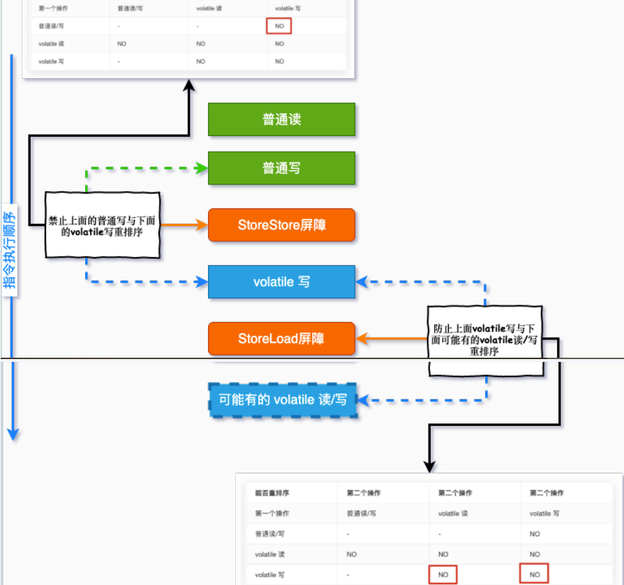

##### 读

1. 在每一个 Volatile 读操作的后面插入一个 LoadLoad 屏障
2. 在每一个 Volatile 读操作的后面插入一个 LoadStore 屏障

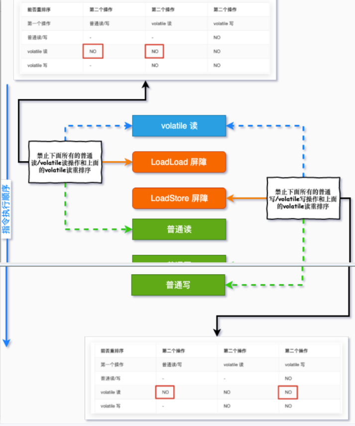

回顾这这张表格：

| 屏障类型     | 指令示例                      | 说明                                                         |
| ------------ | ----------------------------- | ------------------------------------------------------------ |
| loadload()   | Load1；loadload；Load2        | 保证Load1的读取操作在Load2及后续读取操作之前                 |
| storestore() | Store1；storestore(）；Store2 | 在Store2及其后的写操作执行前，保证Store1的写操作已刷新到主内存 |
| loadstore()  | Load1；loadstore()；Store2    | 在Store2及其后的写操作执行前，保证load1的读操作已读取结束    |
| storeload()  | Store1；storeload()；Load2    | 保证Store1的写操作已刷新到主内存之后，Load2及其后的读操作才能执行 |

## 特性

#### 保证可见性

说明：保证不同线程对这个变量进行操作时的可见性，即变量一旦改变所有线程立即可见

```java
public class VolatileSeeDemo {

    /**
     * 不加 Volatile 没有可见性
     */
    //static boolean flag = true;

    /**
     * 加 Volatile 具有可见性
     */
    volatile  static boolean flag = true;

     public static void main(String[] args)
    {
        new Thread(() -> {
            System.out.println(Thread.currentThread().getName()+"\t"+"---come in");
            while(flag)
            {
                new Integer(308);
            }
            System.out.println("t1 over");
        },"t1").start();

        try { TimeUnit.SECONDS.sleep(1); } catch (InterruptedException e) { e.printStackTrace(); }

        new Thread(() -> {
            flag = false;
        },"t2").start();
    }
}
```

Volatile 变量的读写过程

Java内存模型中定义的8种工作内存与主内存之间的原子操作：read(读取)→load(加载)→use(使用)→assign(赋值)→store(存储)→write(写入)→ lock(锁定)→unlock(解锁)

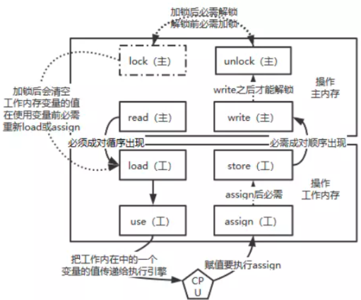

- read:  作用于主内存 ，将变量的值从主内存传输到工作内存，主内存到工作内存
- load: 作用于工作内存，将read从主内存传输的变量值放入工作 内存变量副本 中，即数据加载
- use: 作用于工作内存，将工作内存变量副本的值传递给执行引擎，每当JVM遇到需要该变量的字节码指令时会执行该操作
- assign: 作用于工作内存，将从执行引擎接收到的值赋值给工作内存变量，每当JVM遇到一个给变量赋值字节码指令时会执行该操作
- store: 作用于工作内存，将赋值完毕的工作变量的值写回给主内存
- write:  作用于主内存 ，将store传输过来的变量值赋值给主内存中的变量
- 由于上述只能保证单条指令的原子性，针对多条指令的组合性原子保证，没有大面积加锁 ，所以，JVM提供了另外两个原子指令 ：
- lock: 作用于主内存 ，将一个变量标记为一个线程独占的状态，只是写时候加锁，就只是锁了写变量的过程。
- unlock: 作用于主内存 ，把一个处于锁定状态的变量释放，然后才能被其他线程占用

#### 没有原子性

Volatile 变量的复合操作（如i++）不具有原子性

```java
public class VolatileNoAtomicDemo {

    public static void main(String[] args) {

        MyNumber myNumber = new MyNumber();

        for (int i = 0; i < 10; i++) {
            new Thread(()->{
                for (int j = 0; j < 1000; j++) {
                    myNumber.addPlusPlus();
                }
            },String.valueOf(i)).start();
        }

        //暂停几秒钟线程
        try { TimeUnit.SECONDS.sleep(1); } catch (InterruptedException e) { e.printStackTrace(); }
        System.out.println(Thread.currentThread().getName() + "\t" + myNumber.num);
    }

}
class MyNumber{

    volatile int num = 10;

    public void addPlusPlus(){
        num++;
    }

}
```

##### 从字节码的角度分析

截图

原子性指的是一个操作是 不可中断 的，即使是在多线程环境下，一个操作一旦开始就不会被其他线程影响。

```java
public void add(){
	i++; // 不具备原子性 ，该操作是先读取值，然后写回一个新值，相当于原来的值加上1，分3步完成
}
```

如果第二个线程在第一个线程读取旧值和写回新值期间读取i的域值 ，那么第二个线程就会与第一个线程一起看到同一个值，并执行相同值的加1操作，这也就造成了线程安全失败，因此对于add方法必须使用synchronized修饰，以便保证线程安全。

##### 读取赋值一个普通变量的情况

当线程1对主内存对象发起read操作到write操作第一套流程的时间里，线程2随时都有可能对这个 主内存对象 发起第二套操作。

##### 修改就是可见、为什么还不能保证原子性

Volatile 主要是对其中部分指令做了处理

要use(使用)一个变量的时候必需load(载入），要载入的时候必需从主内存read(读取）这样就解决了读的可见性。 写操作是把assign和store做了关联(在assign(赋值)后必需store(存储))。store(存储)后write(写入)。也就是做到了给一个变量赋值的时候一串关联指令直接把变量值写到主内存。 就这样通过用的时候直接从主内存取，在赋值到直接写回主内存做到了内存可见性。 注意蓝色框框的间隙

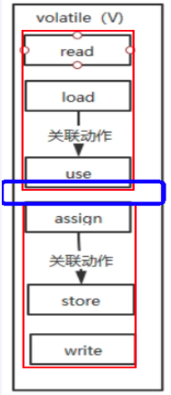

##### 结论

读取赋值一个 Volatile 变量的情况

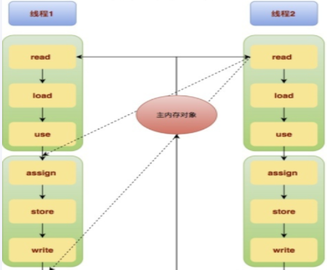

 read-load-use 和 assign-store-write 成为了两个不可分割的原子操作， 但是在use和assign之间依然有极小的一段真空期 ，有可能变量会被其他线程读取，导致 写丢失一次 ...但是无论在哪一个时间点主内存的变量和任一工作内存的变量的值都是相等的。这个特性就导致了volatile变量不适合参与到依赖当前值的运算，如i = i + 1; i++;之类的那么依靠可见性的特点volatile可以用在哪些地方呢？ 通常volatile用做保存某个状态的boolean值or int值。

《深入理解Java虚拟机》提到：

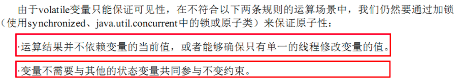

JMV的字节码，i++分成三步，间隙期不同步非原子操作（i++）

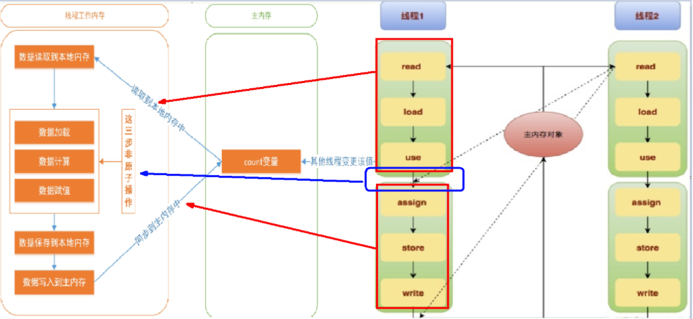

#### 指令重排序

##### 重排序

重排序是指编译器和处理器为了优化程序性能而对指令序列进行重新排序的一种手段，有时候会改变程序语句的先后顺序不存在数据依赖关系，可以重排序； 存在数据依赖关系，禁止重排序。但重排后的指令绝对不能改变原有的串行语义！ 这点在并发设计中必须要重点考虑！

##### 重排序的分类和执行流程


- 编译器优化的重排序：编译器在不改变单线程串行语义的前提下，可以重新调整指令的执行顺序 。
- 指令级并行的重排序 ：处理器使用指令级并行技术来讲多条指令重叠执行，若不存在数据依赖性，处理器可以改变语句对应机器指令的执行顺序 。
- 内存系统的重排序 ：由于处理器使用缓存和读/写缓冲区，这使得加载和存储操作看上去可能是乱序执行。

##### 数据依赖性

若两个操作访问同一变量，且这两个操作中有一个为写操作，此时两操作间就存在数据依赖性。 

##### 案例

**不存在**  数据依赖关系，可以重排序===>  重排序OK

| 重排前                                                      | 重排后                                                      |
| ----------------------------------------------------------- | ----------------------------------------------------------- |
| int a = 1; //1<br />int b = 20; //2<br />int c = a + b; //3 | int b = 20; //1<br />int a = 1; //2<br />int c = a + b; //3 |
| 结论：编译器调整了语句的顺序，但是不影响程序的最终结果。    | 重排序OK                                                    |

**存在**  数据依赖关系 ，禁止重排序 ===>  重排序发生，会导致程序运行结果不同。

 编译器和处理器在重排序时，会遵守数据依赖性，不会改变存在依赖关系的两个操作的执行,但不同处理器和不同线程之间的数据性不会被编译器和处理器考虑，其只会作用于单处理器和单线程环境，下面三种情况，只要重排序两个操作的执行顺序，程序的执行结果就会被改变。

| 名称   | 代码示例     | 说明                         |
| ------ | ------------ | ---------------------------- |
| 写后读 | a=1<br />b=a | 写一个变量之后，再读这个位置 |
| 写后写 | a=1<br />a=1 | 写一个变量之后，再写这个变量 |
| 读后写 | a=b<br />b=1 | 读一个变量之后，再写这个变量 |

##### 底层实现是通过内存屏障，再复习一遍

行为：

| 第一个操作  | 第二个操作：普通读写 | 第三个操作：Volatile 读 | 第四个操作：Volatile 写 |
| ----------- | -------------------- | ----------------------- | ----------------------- |
| 普通读写    | 可以重排             | 可以重排                | 不可以重排              |
| Volatile 读 | 不可以重排           | 不可以重排              | 不可以重排              |
| Volatile 写 | 可以重排             | 不可以重排              | 不可以重排              |

- 当第一个操作为 Volatile 读时，无论第二个操作是什么，都不能重排序。这个操作保证了Volatile 读之后的操作不会被重排到Volatile读之前
- 当第二个操作为 Volatile 写时，无论第一个操作是什么，都不能重排序。这个操作保证了Volatile写之前的操作不会被重排到Volatile写之后。
- 当第一个操作为 Volatile 写时，第二个操作为 Volatile 读时，不能重排。

插入情况：

- 在每一个Volatile写操作前面插入一个StoreStore屏障（StoreStore屏障可以保证在Volatile写之前，其前面的所有普通写都已经刷新到主内存中）
- 在每一个Volatile写操作后面插入一个StoreLoad屏障（StoreLoad屏障的作用是避免Volatile写与之后可能有的Volatile读/写操作重排序）
- 在每一个Volatile读操作后面插入一个LoadLoad屏障（LoadLoad屏障用啊来禁止处理器把上面的Volatile读与下面的普通读重排序）
- 在每一个Volatile读操作后面插入一个LoadStore屏障（LoadStore屏障用来禁止处理器把上面的Volatile读与下面的普通写重排序）

code 说明：

```java
//模拟一个单线程，什么顺序读？什么顺序写？
public class  VolatileTest {
     int  i  =  0 ;
     volatile boolean  flag  =  false ;
     public void  write(){
         i  =  2 ;
         flag  =  true ;
    }
     public void  read(){
         if ( flag ){
            System. out .println( "---i = "  +  i );
        }
    }
}
```

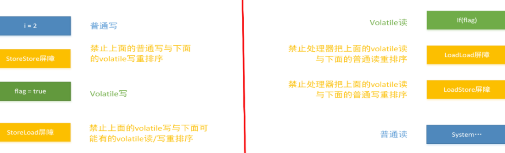

## 如何正确使用 Volatile

#### 单一赋值可以，但是含复合赋值不可以（I++类）

- Volatile int a = 10
- Volatile boolean flag = false

#### 状态标志，判断业务是否结束

```javascript
public class UseVolatileDemo {
    private volatile static boolean flag = true;


    public static void main(String[] args) {
        new Thread(() -> {
            while (flag) {
            }
        }, "t1").start();

        //暂停几秒钟线程
        try {
            TimeUnit.SECONDS.sleep(2L);
        } catch (InterruptedException e) {
            e.printStackTrace();
        }

        new Thread(() -> {
            flag = false;
        }, "t2").start();
    }
}
```

#### 开销较低的读，写锁策略

```java
public class Counter {
        private volatile int value;

        //利用 volatile 保证读取操作的可见性
        public int getValue() {
            return value;
        }

        //利用 synchronized 保证复合操作的原子性
        public synchronized int increment() {
            return value++;
        }
    }
```

#### DCL 双端锁的发布

问题：

```java
public class SafeDoubleCheckSingleton {

    private volatile static SafeDoubleCheckSingleton singleton = null;

    /**
     * 私有化构造方法
     */
    private SafeDoubleCheckSingleton(){}

    /**
     * 双重锁设计
     * @return SafeDoubleCheckSingleton
     */
    public static SafeDoubleCheckSingleton getInstance(){
        if (singleton == null){
            //1.多线程并发创建对象时，会通过加锁保证只有一个线程能创建对象
            synchronized (SafeDoubleCheckSingleton.class){
                if (singleton == null){
                    //隐患：多线程环境下，由于重排序，该对象可能还未完成初始化就被其他线程读取
                    singleton = new SafeDoubleCheckSingleton();
                }
            }
        }
        //2.对象创建完毕，执行getInstance()将不需要获取锁，直接返回创建对象
        return singleton;
    }

    public static void main(String[] args) {
        SafeDoubleCheckSingleton instance = SafeDoubleCheckSingleton.getInstance();
    }
}

```

单线程环境下，(或者说正常情况下)，在"问题代码处"，会执行如下操作，保证能获取到已完成初始化的实例。

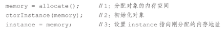

但是由于存在指令重排，就会出现问题。

多线程环境下， 在"问题代码处"，会执行如下操作，由于重排序导致2,3乱序，后果就是其他线程得到的是null而不是完成初始化的对象 。

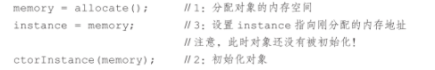

解决：

1. 加 Volatile 修饰
2. 采用静态内部内的方式实现

```java
public class SingletonDemo {
    private SingletonDemo() { }

    private static class SingletonDemoHandler
    {
        private static SingletonDemo instance = new SingletonDemo();
    }

    public static SingletonDemo getInstance()
    {
        return SingletonDemoHandler.instance;
    }
}
```

## 总结

1. JMM原则和特性：JMM的关键技术点都是围绕多线程的 原子性、可见性和有序性展开的；可见性、原子性、有序性

2. 先行并发原则：如果一个操作执行的结果需要对另一个操作保证可见性或者代码重排序，那么这两个操作之间必须存在Happens-Before关系

3. Volatile 特点、内存语义：可见性、有序性；Volatile的写内存语义是直接刷新到主内存中，读的内存语义是直接从主内存中读取。

4. 内存屏障是什么：是一种屏障指令，它使得CPU或编译器对屏障指令的前和后所发出的内存操作执行一个排序的约束。

5. 内存屏障能干嘛：

   1. 阻止屏障两边的指令重排序
   2. 写数据加入屏障，强制将线程私有工作内存的数据刷回物理内存
   3. 读数据时加入屏障，线程私有工作内存的数据失效，重新到主物理内存中获取最新数据

6. 内存屏障四大指令：loadload()、storestore()、loadstore()、storeload()

7. 一个关键字 Volatile 是怎么和底层联系上的

   1. 字节码层面：会增加一个标识：flags：ACC_VOLATILE
   2. 关键字：JVM在把字节码生成机器码的时候，发现操作时 Volatile 的变量的话，就会根据JVM要求，在相应的位置去插入内存屏障指令

8. Volatile 可见性

   1. 对一个Volatile修饰的变量进行读操作的话，总是能够读到这个变量的最新的值，也就是这个变量最后被修改的值。
   2. 一个线程修改Volatile修饰的变量的时候，那么这个变量的新的值，会立即刷新回到主内存中。
   3. 一个线程去读取Volatile修饰的变量的值的时候，该变量在工作内存中数据无效，需要重新到主内存去读取最新的数据。

9. Volatile 禁重排

   1. 写指令

      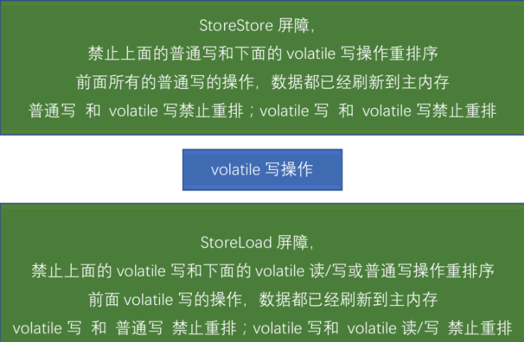

   2. 读指令

      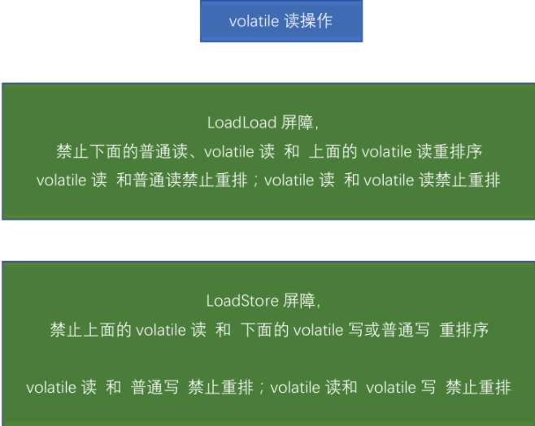

10. 一句话总结

    Volatile 写之前的操作，都禁止重排序到Volatile之后；Volatile读之后的操作，都禁止重排序到Volatile之前；Volatile写之后Volatile读，禁止重排序。
