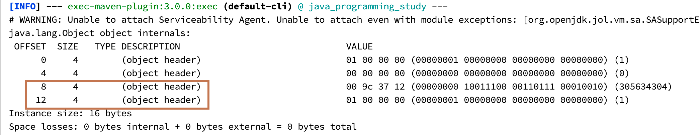

## 对象在堆内存中的布局

### 权威定义

> 在HotSpot虚拟机里，对象在堆内存中的存储布局可以划分为三个部分：对象头（Header）、实例数据（Instance Data）和对齐填充（Padding）。

### 存储布局


对象内部结构分为：对象头、实例数据、对齐填充（保证8个字节的倍数）。

对象头分为对象标记（markOop）和类元信息（klassOop），类元信息存储的是指向该对象类元数据（klass）的首地址。

#### 对象头


对象头里面存储了对象标记和类元信息。对象标记包括哈希码、GC标记、GC次数、同步锁标记和偏向锁持有者

##### 对象标记（Mark Word）


##### 类元信息（Class Pointer）

举例：

```java
Customer customer = new Customer();
```

相当于在堆空间里面new了一个Customer的实例对象。这个对象的类型指针指向方法区的类元信息。

##### 对象头大小

在64位系统中，Mark Word占了8个字节，类型指针占了8个字节，一共是16个字节。

### 实例数据

存放类的属性（Field）数据信息，包括父类的属性信息。如果是数组的实例部分还包括数据的长度，这部分内存按4字节对齐。

### 对齐填充

虚拟机要求对象起始地址必须是8字节的整数倍。填充数据不是必须存在的，仅仅是为了字节对齐。这部分内存按8字节补充对齐。

## 对象标记（Mark Word）


### HotSpot 的实现


先清楚下这张图，后面学到锁升级的时候会返回用到。

## Object obj = new Object()

### JOL证明

```xml
<dependency>
    <groupId>org.openjdk.jol</groupId>
    <artifactId>jol-core</artifactId>
    <version>0.9</version>
</dependency>
```

```java
public class MyObject {
    public static void main(String[] args) {
        //VM 的细节详细情况
        System.out.println(VM.current().details());
        // 所有的对象分配的字节都是 8 的整数倍。
        System.out.println(VM.current().objectAlignment());
    }
}
------------------------
  # Running 64-bit HotSpot VM. //64位虚拟机
# Using compressed oop with 3-bit shift. 
# Using compressed klass with 3-bit shift.
# Objects are 8 bytes aligned.
# Field sizes by type: 4, 1, 1, 2, 2, 4, 4, 8, 8 [bytes]
# Array element sizes: 4, 1, 1, 2, 2, 4, 4, 8, 8 [bytes]

8 //所有的对象分配的字节都是 8 的整数倍
```

### 代码自测

```java
public class MyObject {
    public static void main(String[] args) {
        Object o = new Object();
        System.out.println(ClassLayout.parseInstance(o).toPrintable());
    }
}
```


可以看出实际上是12个字节，但是由于是8的整数倍，所以丢失了4个字节（(loss due to the next object alignment)），然后自己补上了。

| OFFSET      | 偏移量，也就是到这个字段位置所占用的byte数 |
| ----------- | ------------------------------------------ |
| SIZE        | 后面类型的字节大小                         |
| TYPE        | 是Class中定义的类型                        |
| DESCRIPTION | DESCRIPTION是类型的描述                    |
| VALUE       | VALUE是TYPE在内存中的值                    |

### 再测


GC年龄采用4位bit存储，最大为15。

```shell
MaxTenuringThreshold of 16 is invalid; must be between 0 and 15
Error: Could not create the Java Virtual Machine.
Error: A fatal exception has occurred. Program will exit.
```

### 尾巴参数

```shell
# guogoffy @ Goffys-MacBook in ~/gitProject/java_programming_study on git:main x [11:55:43] 
$ java -XX:+PrintCommandLineFlags -version
-XX:InitialHeapSize=134217728 
-XX:MaxHeapSize=2147483648 
-XX:+PrintCommandLineFlags 
-XX:+UseCompressedClassPointers  //默认开启压缩说明
-XX:+UseCompressedOops 
-XX:+UseParallelGC 
openjdk version "1.8.0_282"
OpenJDK Runtime Environment (Zulu 8.52.0.23-CA-macos-aarch64) (build 1.8.0_282-b08)
OpenJDK 64-Bit Server VM (Zulu 8.52.0.23-CA-macos-aarch64) (build 25.282-b08, mixed mode)

```

-XX:+UseCompressedClassPointers ：默认开启压缩说明，如果不开启，测试



可以发现类型指针变成8个字节，不需要再对齐补充了。

## 总结

- 一个java对象里面包含对象头、实例数据和对齐填充（非必需）。
- 对象头里面又有对象标记（Mark Word）和类元信息
- 这个对象存在与JVM堆里面的新生代的伊甸园区里面
- Customer customer = new Customer()
  - new Customer() 堆里面开辟了一块内存空间、也就是存储了Customer的实例
  - customer 存在虚拟机栈里面，是一个引用，指向了堆里面的实例。HotSpot里面使用直接指针法指向。
  - Customer 一个类型指针，类似于一个马甲。指向方法区的该对象的Klass（类元信息）