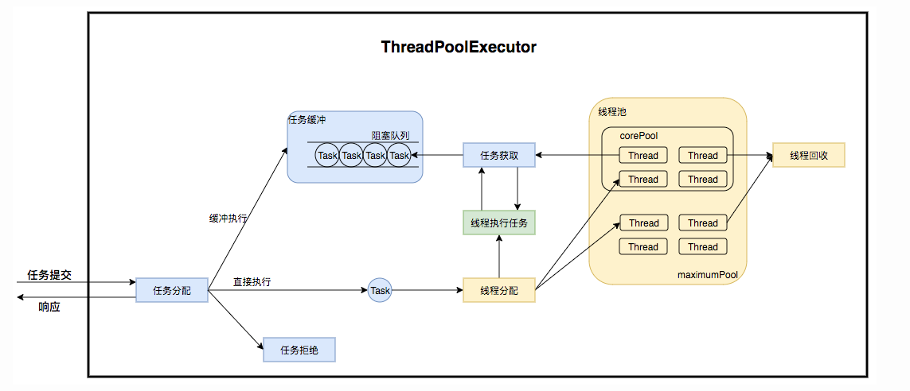
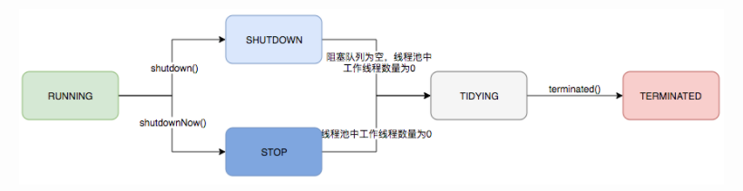
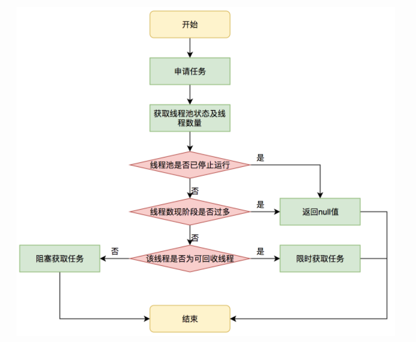
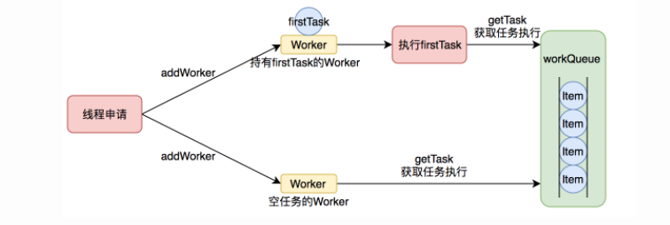
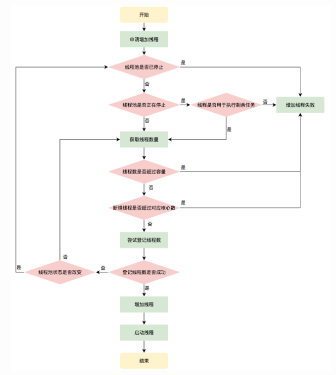
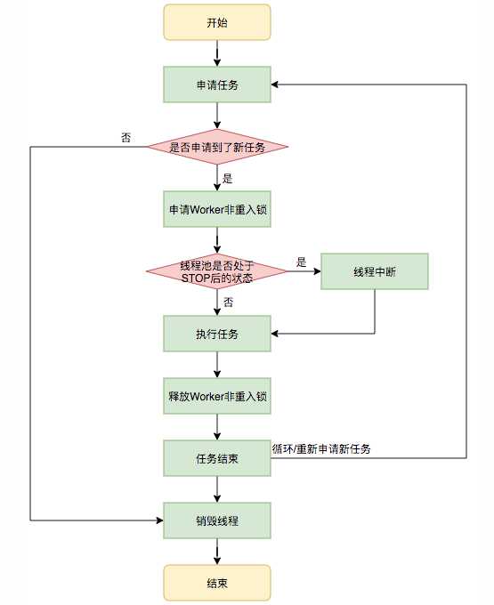

[TOC]


## 线程池是什么

线程池（Thread Pool）是一种基于池化思想管理线程的工具，经常出现在多线程服务器中，如MySQL。

线程过多会带来额外的开销，其中包括创建销毁线程的开销、调度线程的开销等等，同时也降低了计算机的整体性能。线程池维护多个线程，等待监督管理者分配可并发执行的任务。这种做法，一方面避免了处理任务时创建销毁线程开销的代价，另一方面避免了线程数量膨胀导致的过分调度问题，保证了对内核的充分利用。

- **降低资源消耗**：通过池化技术重复利用已创建的线程，降低线程创建和销毁造成的损耗。
- **提高响应速度**：任务到达时，无需等待线程创建即可立即执行。
- **提高线程的可管理性**：线程是稀缺资源，如果无限制创建，不仅会消耗系统资源，还会因为线程的不合理分布导致资源调度失衡，降低系统的稳定性。使用线程池可以进行统一的分配、调优和监控。
- **提供更多更强大的功能**：线程池具备可拓展性，允许开发人员向其中增加更多的功能。比如延时定时线程池ScheduledThreadPoolExecutor，就允许任务延期执行或定期执行。

## 线程池要解决的问题是什么

## 线程池的设计和实现

### 线程池的几个主要参数的作用

```java
public ThreadPoolExecutor(int corePoolSize,
                              int maximumPoolSize,
                              long keepAliveTime,
                              TimeUnit unit,
                              BlockingQueue<Runnable> workQueue,
                              ThreadFactory threadFactory,
                              RejectedExecutionHandler handler)
```

1. corePoolSize：核心线程数（worker数量）
2. maximumPoolSize：最大线程数
3. keepAliveTime：超出corePoolSize的那些线程的生存时间，这个线程如果长时间没有执行任务并且超过了keepAliveTime设定的时间，就会消亡
4. unit：keepAliveTime的时间单位
5. workQueue：存放任务的队列
6. threadFactory：创建线程的工厂
7. handler：当workQueue已经满了并且线程数达到maximumPoolSize，将执行拒绝策略

### 任务提交后的流程分析

用户通过submit提交一个任务。线程池会执行如下流程:

1. 判断当前运行的worker数量是否超过corePoolSize,如果不超过corePoolSize。就创建一个worker直接执行该任务。—— 线程池最开始是没有worker在运行的。
2. 如果正在运行的worker数量超过或者等于corePoolSize,那么就将该任务加入到workQueue队列中去。
3. 如果workQueue队列满了，就创建到最大线程数去执行这些任务。检查当前运行的worker数量是否小于maximumPoolSize,如果小于就创建一个worker直接执行该任务。
4. 如果当前运行的worker数量大于等于maximumPoolSize，那么就执行RejectedExecutionHandler来拒绝这个任务的提交。

### 运行机制



线程池在内部实际上构建了一个生产者消费者模型，将线程和任务两者解耦，并不直接关联，从而良好的缓冲任务，复用线程。

线程池的运行主要分成两部分：任务管理和线程管理。

- 任务管理部分充当生产者的角色，当任务提交后，线程池会判断该任务后续的流转：
  1. 直接申请线程执行该任务
  2. 缓存到队列中等待线程执行
  3. 拒绝该任务
- 线程管理部分是消费者，它们被统一维护到线程池内，根据任务请求线程的分配 ，当线程执行完任务后则会继续获取新的任务去执行，最后当线程获取不到任务的时候，线程就会被回收。

### 线程池的生命周期管理

线程池运行的状态，并不是用户显式设置的，而是伴随着线程池的运行，由内部来维护。

线程池内部使用一个变量来维护两个值：运行状态（runState）和线程数量（workCount）。线程池将这两个关键参数放在一起了。

```java
private final AtomicInteger ctl = new AtomicInteger(ctlOf(RUNNING, 0));
```

这一个属性`ctl`同时包含两部分的信息：线程池的运行状态（runState）和线程池内有效线程的数量（workCount）。高3位保存runState，低29位保存workCount，两个变量之间互不干扰。用一个变量去存储两个值，可避免在相关决策时，出现不一致的情况。不必问了维护两者的一直，而占用锁资源。

```java
// 计算当前运行状态
private static int runStateOf(int c)     { return c & ~CAPACITY; }
// 计算当前线程数量
private static int workerCountOf(int c)  { return c & CAPACITY; }
// 通过状态和线程数生成 ctl
private static int ctlOf(int rs, int wc) { return rs | wc; }
```

ThreadPoolExecutor的运行状态有5种，分别为：

```java
// runState is stored in the high-order bits
// 能接受新提交的任务，并且也能处理阻塞队列中的任务
    private static final int RUNNING    = -1 << COUNT_BITS;
// 关闭状态，不再接受新提交的任务，但是可以继续处理阻塞队列中已保存的任务
    private static final int SHUTDOWN   =  0 << COUNT_BITS;
// 不能接受新任务，也不处理队列中的任务，会中断正在处理任务的线程
    private static final int STOP       =  1 << COUNT_BITS;
// 所有的任务都已终止了，workerCount（有效线程数）为0
    private static final int TIDYING    =  2 << COUNT_BITS;
// 在 TERMINATED（）方法执行完后进入该状态
    private static final int TERMINATED =  3 << COUNT_BITS;
```

生命周期转换如下：



### 任务执行机制

#### 任务调度

任务调度是线程池的主要入口，当用户提交了一个任务，接下来这个任务将如何执行都是由这个阶段决定的。

首先，所有任务的调度都是由execute方法完成的，这部分完成的工作是：检查现在线程池的运行状态、运行线程数、运行策略，决定接下来执行的流程，是直接申请线程执行，或是缓冲到队列中执行，亦或是直接拒绝该任务。执行过程如下：

1. 首先检测线程池运行状态，如果不是RUNNING，则直接拒绝，线程池要保证在RUNNING的状态下执行任务。
2. 如果workerCount < corePoolSize，则创建并启动一个线程来执行新提交的任务。
3. 如果workerCount >= corePoolSize，且线程池内的阻塞队列未满，则将任务添加到该阻塞队列中。
4. 如果workerCount >= corePoolSize && workerCount < maximumPoolSize，且线程池内的阻塞队列已满，则创建并启动一个线程来执行新提交的任务。
5. 如果workerCount >= maximumPoolSize，并且线程池内的阻塞队列已满, 则根据拒绝策略来处理该任务, 默认的处理方式是直接抛异常。

#### 任务缓冲

任务缓冲模块是线程池能够管理任务的核心部分。线程池本质是对任务和线程的管理，而做到这一点最关键的思想就是将任务和线程两者解耦，不让两者直接关联，才可以做后续的分配工作。

线程池中是以生产者消费者模式，通过一个阻塞队列来实现的。阻塞队列缓冲任务，工作线程从阻塞队列中获取任务。

阻塞队列(BlockingQueue)是一个支持两个附加操作的队列。这两个附加的操作是：在队列为空时，获取元素的线程会等待队列变为非空。当队列满时，存储元素的线程会等待队列可用。阻塞队列常用于生产者和消费者的场景，生产者是往队列里添加元素的线程，消费者是从队列里拿元素的线程。阻塞队列就是生产者存放元素的容器，而消费者也只从容器里拿元素。

使用不同的阻塞队列可以实现不一样的任务存取策略：

| 名称                    | 描述                                                         |
| ----------------------- | ------------------------------------------------------------ |
| ArrayBlockingQueue      | 一个用数组实现的有界阻塞队列，此队列按照先进先出（FIFO）的原则对原则进行排序。支持公平锁和非公平锁 |
| **LinkedBlockingQueue** | 一个由链表结构组成的有界队列，此队列按照先进先出（FIFO）的原则对原则进行排序。此队列的默认长度为Integer.MAX_VALUE，所以默认创建的该队列有容量危险 |
| PriorityBlockingQueue   | 一个支持线程优先级排序的无界队列，默认自然序进行排序，也可以自定义实现 compareTo() 方法来指定元素排序规则，不能保证同优先级元素的顺序 |
| **DelayQueue**          | 一个实现PriorityBlockingQueue实现延迟获取的无界队列，在创建元素时，可以指定多久才能从队列中获取当前元素。只有延时期满后才能从队列中获取元素 |
| SynchronousQueue        |                                                              |
| **LinkedTransferQueue** | 一个由链表结构组成的无界阻塞队列，相当于其他队列，LinkedTransferQueue队列多了transfer和tryTransfer方法 |
| **LinkedBlockingDeque** | 一个由链表结构组成的双向阻塞队列。队列头部和尾部都可以添加和移除元素，多线程并发时，可以将锁的竞争最多降到一半 |

#### 任务申请

由上文的任务分配部分可知，任务的执行有两种可能：一种是任务直接由新创建的线程执行。另一种是线程从任务队列中获取任务然后执行，执行完任务的空闲线程会再次去从队列中申请任务再去执行。第一种情况仅出现在线程初始创建的时候，第二种是线程获取任务绝大多数的情况。

线程需要从任务缓存模块中不断地取任务执行，帮助线程从阻塞队列中获取任务，实现线程管理模块和任务管理模块之间的通信。这部分策略由getTask方法实现，其执行流程如下图所示：



getTask这部分进行了多次判断，为的是控制线程的数量，使其符合线程池的状态。如果线程池现在不应该持有那么多线程，则会返回null值。工作线程Worker会不断接收新任务去执行，而当工作线程Worker接收不到任务的时候，就会开始被回收。

#### 任务拒绝

任务拒绝模块是线程池的保护部分，线程池有一个最大的容量，当线程池的任务缓存队列已满，并且线程池中的线程数目达到maximumPoolSize时，就需要拒绝掉该任务，采取任务拒绝策略，保护线程池。

```java
public interface RejectedExecutionHandler {

    /**
     * Method that may be invoked by a {@link ThreadPoolExecutor} when
     * {@link ThreadPoolExecutor#execute execute} cannot accept a
     * task.  This may occur when no more threads or queue slots are
     * available because their bounds would be exceeded, or upon
     * shutdown of the Executor.
     *
     * <p>In the absence of other alternatives, the method may throw
     * an unchecked {@link RejectedExecutionException}, which will be
     * propagated to the caller of {@code execute}.
     *
     * @param r the runnable task requested to be executed
     * @param executor the executor attempting to execute this task
     * @throws RejectedExecutionException if there is no remedy
     */
    void rejectedExecution(Runnable r, ThreadPoolExecutor executor);
}
```

用户可以通过实现这个接口去定制拒绝策略，也可以选择JDK提供的四种已有拒绝策略，其特点如下：

|      | 名称                | 描述                                                         |
| :--: | ------------------- | ------------------------------------------------------------ |
|  1   | AbortPolicy         | 丢弃任务并抛出RejectedExecutionException异常。默认的拒绝策略。在任务不能再提交的时候，抛出异常，即使反馈程序运行状态，如果是比较关键的业务，推荐使用此拒绝策略，这样在系统不能承载更大的并发量的时候，能够及时的通过异常发现 |
|  2   | DiscardPolicy       | 丢弃任务，但是不抛出异常。使用此策略后，可能会使我们无法发现系统的异常状态。建议是一些无关紧要的业务采用此策略 |
|  3   | DiscardOldestPolicy | 丢弃队列最前面的任务，然后重新提交被拒绝的任务。             |
|  4   | CallerRunsPolicy    | 由调用线程（提交任务的线程）处理该任务。这种情况是需要让所有任务都执行完毕，那么就适合大量计算的任务类型去执行，多线程仅仅是增大吞吐量的手段，最终必须要让每个任务都执行完毕。 |

### Worker 线程管理

##### Worker线程

线程池为了掌握线程的状态并维护线程的生命周期，设计了线程池内的工作线程Worker。

```java
private final class Worker extends AbstractQueuedSynchronizer implements Runnable
    {
        /**
         * This class will never be serialized, but we provide a
         * serialVersionUID to suppress a javac warning.
         */
        private static final long serialVersionUID = 6138294804551838833L;

        /** Thread this worker is running in.  Null if factory fails. */
  // 运行的线程,前面addWorker方法中就是直接通过启动这个线程来启动这个worker
        final Thread thread;
        /** Initial task to run.  Possibly null. */
  // 当一个worker刚创建的时候,就先尝试执行这个任务
        Runnable firstTask;
        /** Per-thread task counter */
        volatile long completedTasks;

        /**
         * Creates with given first task and thread from ThreadFactory.
         * @param firstTask the first task (null if none)
         */
        Worker(Runnable firstTask) {
            setState(-1); // inhibit interrupts until runWorker
            this.firstTask = firstTask;
          //创建一个Thread,将自己设置给他,后面这个thread启动的时候,也就是执行worker的run方法
            this.thread = getThreadFactory().newThread(this);
        }

        /** Delegates main run loop to outer runWorker  */
        public void run() {
          // 这里调用了ThreadPoolExecutor的runWorker方法
            runWorker(this);
        }

        // Lock methods
        //
        // The value 0 represents the unlocked state.
        // The value 1 represents the locked state.

        protected boolean isHeldExclusively() {
            return getState() != 0;
        }

        protected boolean tryAcquire(int unused) {
            if (compareAndSetState(0, 1)) {
                setExclusiveOwnerThread(Thread.currentThread());
                return true;
            }
            return false;
        }

        protected boolean tryRelease(int unused) {
            setExclusiveOwnerThread(null);
            setState(0);
            return true;
        }

        public void lock()        { acquire(1); }
        public boolean tryLock()  { return tryAcquire(1); }
        public void unlock()      { release(1); }
        public boolean isLocked() { return isHeldExclusively(); }

        void interruptIfStarted() {
            Thread t;
            if (getState() >= 0 && (t = thread) != null && !t.isInterrupted()) {
                try {
                    t.interrupt();
                } catch (SecurityException ignore) {
                }
            }
        }
    }
```

Worker这个工作线程，实现了Runnable接口，并持有一个线程thread，一个初始化的任务firstTask。thread是在调用构造方法时通过ThreadFactory来创建的线程，可以用来执行任务；firstTask用它来保存传入的第一个任务，这个任务可以有也可以为null。

- 如果这个值是非空的，那么线程就会在启动初期立即执行这个任务，也就对应核心线程创建时的情况；
- 如果这个值是null，那么就需要创建一个线程去执行任务列表（workQueue）中的任务，也就是非核心线程的创建。



线程池需要管理线程的生命周期，需要在线程长时间不运行的时候进行回收。线程池使用一张Hash表去持有线程的引用，这样可以通过添加引用、移除引用这样的操作来控制线程的生命周期。这个时候重要的就是如何判断线程是否在运行。

Worker是通过继承AQS，使用AQS来实现独占锁这个功能。没有使用可重入锁ReentrantLock，而是使用AQS，为的就是实现不可重入的特性去反应线程现在的执行状态。

1. lock方法一旦获取了独占锁，表示当前线程正在执行任务中
2. 如果正在执行任务，则不应该中断线程
3. 如果该线程现在不是独占锁的状态，也就是空闲的状态，说明它没有在处理任务，这时可以对该线程进行中断
4. 线程池在执行shutdown方法或tryTerminate方法时会调用interruptIdleWorkers方法来中断空闲的线程，interruptIdleWorkers方法会使用tryLock方法来判断线程池中的线程是否是空闲状态；如果线程是空闲状态则可以安全回收

##### worker 线程增加

增加线程是通过线程池中的addWorker方法，该方法的功能就是增加一个线程，该方法不考虑线程池是在哪个阶段增加的该线程，这个分配线程的策略是在上个步骤完成的，该步骤仅仅完成增加线程，并使它运行，最后返回是否成功这个结果。

```java
// firstTask参数用于指定新增的线程执行的第一个任务，该参数可以为空
// core参数为true表示在新增线程时会判断当前活动线程数是否少于corePoolSize，false表示新增线程前需要判断当前活动线程数是否少于maximumPoolSize
private boolean addWorker(Runnable firstTask, boolean core) {

}
```



##### Worker 线程回收

线程池中线程的销毁依赖JVM自动的回收，线程池做的工作是根据当前线程池的状态维护一定数量的线程引用，防止这部分线程被JVM回收，当线程池决定哪些线程需要回收时，只需要将其引用消除即可。

Worker被创建出来后，就会不断地进行轮询，然后获取任务去执行，核心线程可以无限等待获取任务，非核心线程要限时获取任务。当Worker无法获取到任务，也就是获取的任务为空时，循环会结束，Worker会主动消除自身在线程池内的引用。

```java
try {
  while (task != null || (task = getTask()) != null) {
    //执行任务
  }
} finally {
  processWorkerExit(w, completedAbruptly);//获取不到任务时，主动回收自己
}
```

线程回收的工作是在processWorkerExit方法完成的。

事实上，在这个方法中，将线程引用移出线程池就已经结束了线程销毁的部分。但由于引起线程销毁的可能性有很多，线程池还要判断是什么引发了这次销毁，是否要改变线程池的现阶段状态，是否要根据新状态，重新分配线程。

##### Worker 线程执行任务

在Worker类中的run方法调用了runWorker方法来执行任务，runWorker方法的执行过程如下：

1. while循环不断地通过getTask()方法获取任务。 
2. getTask()方法从阻塞队列中取任务。 
3. 如果线程池正在停止，那么要保证当前线程是中断状态，否则要保证当前线程不是中断状态。 
4. 执行任务。 
5. 如果getTask结果为null则跳出循环，执行processWorkerExit()方法，销毁线程。



## 业务中的实践

参考：

[Java线程池实现原理及其在美团业务中的实践 - 美团技术团队 (meituan.com)](https://tech.meituan.com/2020/04/02/java-pooling-pratice-in-meituan.html)

[(23条消息) Java线程池实现原理详解_u013332124的专栏-CSDN博客_线程池实现原理](https://blog.csdn.net/u013332124/article/details/79587436)

[深度解读 java 线程池设计思想及源码实现_Javadoop](https://www.javadoop.com/post/java-thread-pool)

